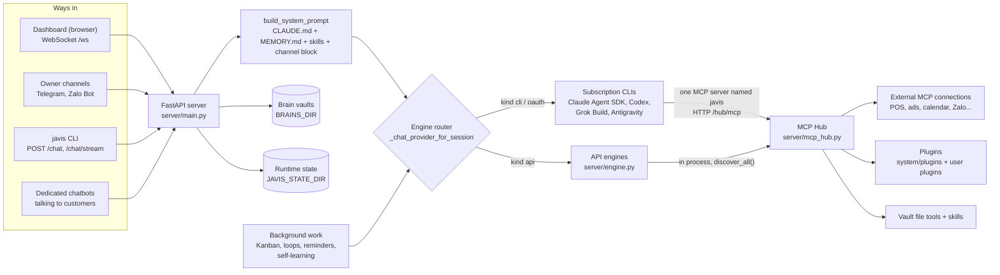

# Thansa OS architecture

This is the entry point for contributors. Read it before touching code. It describes how the
pieces fit together today (version in [VERSION](VERSION)); every claim here was checked against
the code, and file paths are given so you can verify them yourself.

The code base was written in Vietnamese: comments, docstrings and most identifiers are
Vietnamese without diacritics (`bat` = start, `nhac_hen` = reminder, `viec_nen` = background
job). Keep [docs/dev/GLOSSARY.md](docs/dev/GLOSSARY.md) open while reading the code.

## What Thansa is

Thansa is a self-hosted personal AI assistant for "business and life". It runs as one Python
FastAPI server with a plain-JavaScript dashboard, and keeps everything it knows in a folder of
markdown files (the "Second Brain", Obsidian-compatible). The model behind it is swappable: the
user picks a "brain" (a subscription CLI such as Claude Code, or an API provider such as
OpenRouter) and every brain gets the same tools through Thansa's own MCP Hub. Thansa is an
orchestration layer, not an inference layer: when an answer is wrong, look first at the prompt
it built, the tools it allowed and the brain folder it pointed at.

## The big picture



### One chat turn, step by step

1. **Browser.** The user types or speaks. `dashboard/app.js` holds the WebSocket to `/ws`;
   `dashboard/voice.js` and the `voice-*.js` files handle speech.
2. **`/ws` in `server/main.py`** (section "WebSocket - Voice chat"). A turn is a server-side
   job owned by `chat_runtime.ChatRuntime`, so closing or reloading the tab does not cancel it;
   the socket is only a subscriber.
3. **Prompt.** `build_system_prompt()` concatenates the repo-root `CLAUDE.md` (the "prompt
   kernel"), the brain's `memory/MEMORY.md`, project and session blocks, the skill index, the
   channel block (`channel_context.py`) and a language block at the end.
4. **Pick the brain.** `_chat_provider_for_session()` reads `settings.json` (`model.main`, or a
   model pinned on that session) and returns a provider from `PROVIDER_DEFS`.
5. **Run the engine.** Every engine yields the same event stream:
   `{type: text | tool_call | tool_result | final | error}` (contract documented at the top of
   `server/claude_sdk_engine.py`).
6. **Tools** go through the MCP Hub, which merges tools from every connection, enforces
   permissions in code, and writes an audit log.
7. **Stream back** over the socket; `dashboard/chat-render.js` renders markdown.
8. **After the turn.** `_persist_turn()` saves it to SQLite (`sessions.py`, with FTS5 search)
   and `learn.py` may later distil memories from it.

Telegram, the Zalo Bot channel, the CLI and dedicated chatbots all share one shell instead:
`_tg_answer()` / `_tg_answer_engine()` in `main.py`, called with `channel="telegram"`,
`"zalo"`, `"cli"` and so on. A new channel should reuse that shell rather than copy it.

## Engines (the swappable brain)

`PROVIDER_DEFS` in `server/main.py` lists 12 providers. Their `kind` describes capability, not
vendor:

| kind | Providers (`id`) | Where | What it can do |
|------|------------------|-------|----------------|
| `cli` | `anthropic-cli` (Claude Code), `grok-cli`, `antigravity-cli` | `claude_sdk_engine.py` via `claude_cli.claude_engine()`, `grok_cli.py`, `antigravity_cli.py` | Runs the vendor's own agent binary on the user's subscription: native MCP, shell, web fetch, sub-agents |
| `oauth` | `openai-oauth` (ChatGPT via Codex) | `CodexCLI` in `claude_cli.py` (spawns `codex exec`) | Same as `cli` |
| `api` | `openrouter`, `anthropic-api`, `openai`, `gemini`, `groq`, `ollama` (Cloud), `ollama-local`, `openai-compat` | `engine.py` (`*_chat_with_mcp`), driven by `main._api_stream_mcp()` | Tool loop over the hub, vault file tools, at most `JAVIS_MAX_TOOL_ROUNDS` (default 30, max 120) tool rounds per turn |

Things worth knowing:

- Thansa never reads the user's Claude login token; it runs the real `claude` binary through the
  official `claude-agent-sdk` (see `claude_auth.py` for why). Codex, Grok and Antigravity also
  keep their own credentials.
- Gemini CLI was removed (Google cut personal tiers); Antigravity CLI replaced it.
- Background work can use a different, cheaper engine: `aux_engine.py`.
- `compaction.py` summarises long histories for API engines, which resend history every turn.
- `limit_learner.py` and `limit_resume.py` learn rate limits from provider errors and re-run a
  turn when a subscription quota reopens.

User docs: [docs/en/10-models-and-engines.md](docs/en/10-models-and-engines.md).

## The MCP Hub and permissions

`server/mcp_hub.py` is the single tool gateway. CLI engines see it as one MCP server named
`javis` (`POST /hub/mcp`, authenticated by `STATE_DIR/.hub_token`); API engines call
`discover_all()` in process. Either way the same rules apply:

- **Connector vs connection.** `system/mcp-catalog.json` (read by `mcp_catalog.py`) holds
  connector *templates*: URL or command, auth method, which tools read and which write.
  `mcp_store.py` holds *connections*: an account the user actually connected, secrets encrypted.
- **Three levels, enforced in code.** Each connection has a `perm` (`readonly`, `safe`, `full`);
  each run has a `mode` (`suggest` forces readonly, `auto` caps at safe, `full` follows perm).
  The hub applies the stricter of the two in `mcp_catalog.allowed()`, regardless of what the
  prompt says.
- **Transports.** `mcp_client.py` keeps a long-lived session pool over HTTP/SSE, stdio (local
  servers such as `javis-zalo`) and "internal" Python bridges (`botcake_mcp.py`,
  `substack_mcp.py`). `oauth_mcp.py` does MCP OAuth 2.1 so no engine needs a terminal login.
- **Plugins.** `plugins_host.py` loads Python plugin folders (`plugin.yaml` + `plugin.py`) from,
  in order: `system/plugins/` (bundled), installed packs, `STATE_DIR/plugins/` (global user
  plugins) and `<brain>/plugins/`. User plugins run only with `JAVIS_ENABLE_USER_PLUGINS=true`.
  Thansa's own tools (`javis_task`, `javis_schedule`, `javis_ui`, ...) are bundled plugins.
- **Packs.** `packs.py` loads extension packs from `STATE_DIR/packs/` so connectors and plugins
  can ship without a new release; `pack_install.py`, `packs_fetch.py` (HTTPS only, SSRF
  guarded), `packs_store.py` and `pack_vault.py` handle install, download, the store index and
  agents/skills a pack writes into a brain.

## Background work

All of it is started from FastAPI `startup` hooks in `main.py`. A 30-second scheduler loop
(`_scheduler_loop`) ticks loops, self-learning, reminders, budgets, GitHub sync, the
operations index and media cleanup; Kanban has its own dispatcher.

| What | Module | Stored in | Notes |
|------|--------|-----------|-------|
| Kanban tasks | `tasks.py`, `task_store.py` | `STATE_DIR/kanban.sqlite3` (+ JSON snapshot in `<brain>/Javis/kanban.json`) | Dispatcher claims tasks atomically and runs them as asyncio tasks |
| Loops | `self_improve.py` | `<brain>/Javis/loops/<slug>.md`, state in `Javis/loop-state.json` | "Every X minutes find one unit of work"; run one at a time |
| Reminders and cron jobs | `reminders.py`, `cron_util.py` | `<brain>/Javis/reminders.json` | Dependency-free 5-field cron parser |
| Workflows | `execute_workflow()` in `main.py`, `workflow_runtime.py`, `workflow_runs.py` | `<brain>/workflows/<slug>.md`, run history in SQLite | A chain of agent steps with checkpoints |
| Self-learning | `learn.py`, `git_brain.py` | `<brain>/memory/` | The learning fork is read-only; only trusted Python writes, and only when the brain is a git checkout |
| Results inbox | `inbox.py`, `webpush.py` | `STATE_DIR/inbox.json` | Every background result lands here, plus browser push |
| Honesty guards | `background_status.py`, `tien_trinh_nen.py`, `luot_dang_chay.py` | | Catch "I will report back" promises with no job behind them; adopt background shell processes an engine left running |

User docs: [21 - Kanban](docs/en/21-kanban-work.md),
[08 - Recurring jobs](docs/en/08-recurring-jobs.md),
[22 - Self-learning](docs/en/22-self-learning.md).

## Module map (`server/`)

About 160 modules. The top docstring of each file explains why it exists; read it first. One
line each, grouped by area.

**Platform and security**
- `main.py`: the FastAPI app, most HTTP routes, prompt building, wiring (see next section).
- `config.py`: `STATE_DIR`, `settings.json` read/write with secret fields encrypted, admin auth.
- `secrets_store.py`: Fernet encryption at rest (`enc:` prefix), key in `STATE_DIR/.secret_key`.
- `web_security.py`: CSRF and DNS-rebinding protection for the local API.
- `totp.py`: two-factor login codes (pure math, no config access).
- `routes/`: route groups split out of `main.py` (`channels`, `coding`, `conversations`,
  `domain`, `graph`, `packs`, `tools`); each has `register(app, deps)` and never imports `main`.
- `share_store.py`, `share_render.py`: public share links (`/s/<token>/`) rendered server side.
- `updater.py`, `update_state.py`, `deploy_info.py`, `claude_update.py`: self-update with
  rollback, deploy detection, keeping the `claude` binary current.
- `purge.py`, `core_off.py`: delete a connection cleanly; make default capabilities removable.
- `fastyaml.py`, `winproc.py`, `bench_hotpath.py`: C YAML loader, silent Windows subprocesses,
  hot-path benchmarks.

**Engines**
- `claude_sdk_engine.py`: the only Claude engine (official Agent SDK); defines the event contract.
- `claude_cli.py`: engine factory, `CodexCLI`, Claude auth helpers, cancel-by-tag registry.
- `grok_cli.py`, `antigravity_cli.py`: Grok Build and Antigravity CLI engines.
- `engine.py`: all API providers, with and without tools.
- `aux_engine.py`: the engine used for background work.
- `claude_auth.py`, `claude_models.py`, `claude_token_gate.py`, `codex_models.py`,
  `openai_oauth.py`, `ollama_catalog.py`, `ollama_local.py`: auth, live model lists, token
  refresh serialisation.
- `compaction.py`, `limit_learner.py`, `limit_resume.py`, `model_limits.py`,
  `quota_scheduler.py`: long-history compression, rate-limit learning, shared TPM ledger.
- `image_gen.py`, `anh_codex.py`: image generation on the ChatGPT plan; moving Codex images into
  the brain. `image_vision.py`: ChatGPT looks at brain images and describes them, the eyes of
  engines that cannot view images.

**Tools and MCP**
- `mcp_hub.py`, `mcp_client.py`, `mcp_store.py`, `mcp_catalog.py`, `catalog_i18n.py`,
  `oauth_mcp.py`, `cred_exchange.py`, `connect_health.py`: described above.
- `plugins_host.py`, `optional_tools.py`: plugins; optional heavy tools (a browser for UI tests).
- `botcake_mcp.py`, `substack_mcp.py`, `youtube_read.py`, `zalo_cli.py`: built-in bridges.
- `run_command.py`: `javis_run_command`, one fenced shell command for engines without a shell.
- `tool_label.py`: short human labels for tool calls in the progress panel.

**Background work**: `tasks.py`, `task_store.py`, `self_improve.py`, `reminders.py`,
`cron_util.py`, `inbox.py`, `webpush.py`, `background_status.py`, `tien_trinh_nen.py`,
`luot_dang_chay.py`, `workflow_runs.py`, `workflow_chat.py` (chatting with an agent or a
workflow on the Collaborators page), `chat_runtime.py`.

**Memory, brain and learning**
- `learn.py`, `git_brain.py`: self-learning and the git safety net it relies on.
- `sessions.py`, `session_brain.py`, `conversation_state.py`, `memory_index.py`: chat history
  (SQLite + FTS5), session-to-brain map, rebuildable projections.
- `system_sync.py`: installs system skills from `.claude/skills/` into every brain with a hash
  manifest, never overwriting a file the user edited.
- `skill_router.py`, `skill_usage.py`, `lazy_skill_runtime.py`: skill discovery (one source of
  truth for `main.py` and the hub), usage telemetry, lazy loading.
- `meta_tools.py`, `brain_seed_i18n.py`: seed files of a new brain.
- `graph_builder.py`, `md_repair.py`, `media_gc.py`: wikilink graph, repairing damaged notes,
  cleaning `attachments/` and `inbox/`.
- `agent_assets.py`, `agent_avatar.py`, `share_bundle.py`: per-agent documents, avatars,
  zip export/import of agents, skills and workflows.
- `coding_store.py`, `coding_ctx.py`, `terminal.py`: the Code group (folders bound to a session,
  context for engines without file tools, a real PTY terminal for the owner).

**Adaptive Context Runtime** (phased, mostly shadow or canary paths behind settings):
`context_runtime.py` (trace substrate, `runtime.db`), `adaptive_context_runtime.py`,
`capability_registry.py`, `capability_index.py`, `capability_resolver.py`,
`capability_executor.py`, `context_compiler.py`, `evidence_store.py`, `fast_path_runtime.py`,
`readonly_path_runtime.py`, `readonly_orchestrator.py`, `write_path_runtime.py`,
`workflow_graph.py`, `workflow_runtime.py`, `agent_runtime.py`, `model_router.py`. Spec:
[docs/dev/2026-08-adaptive-context-runtime-spec.md](docs/dev/2026-08-adaptive-context-runtime-spec.md).

**Channels and chatbots**
- `telegram_bot.py`, `zalo_bot.py`: the owner's Telegram and official Zalo Bot channels.
- `channel_context.py`: tells the model which channel it is answering on.
- `bot_gateway.py`: turn queue, `/stop`, precheck shared by every messaging channel.
- `channels/` (`telegram.py`, `zalo_bot.py`, `zalo_personal.py`): the channel registry, the only
  place in the core that knows what a channel is.
- `channel_accounts.py`: token-based channel accounts, separate from bot assignments.
- `chatbot_store.py`, `chatbot_runtime.py`, `chatbot_grounding.py`, `chatbot_log.py`,
  `chatbot_tu_dong.py`, `chatbot_cuoc_chat.py`, `chatbot_reply_policy.py`,
  `chatbot_reply_policy_store.py`: dedicated customer-facing bots, each with its own brain,
  grounding, logs and a group-chat "speak or stay silent" judge.
- `conversations.py`: the customer conversation store (account, customer, conversation, message).
- `zalo_personal_channel.py`, `zalo_login.py`: reading a personal Zalo account into the inbox,
  QR login.
- `lenh_he_thong.py`: `/` slash commands shared by web chat and Telegram.

**Language and locale**: `lang_registry.py`, `lang.py`, `localefmt.py`, `lexicon/`,
`brain_seed_i18n.py`, `catalog_i18n.py` (see below).

**Voice**: `voice_brain.py` (fast voice brain that hands heavy work to the main brain),
`voice_call.py` (chooses the call path), `voice_live.py` (live speech providers),
`codex_realtime.py` (ChatGPT Live through `codex app-server`), `voice_ear.py`, `stt.py`
(Whisper via Groq), `nghe_sua.py` (fixes misheard words), `phien_am.py` (reads English words
the Vietnamese way for TTS), `voice_turn_protocol.py`, `voice_privacy.py`, `ui_bridge.py` and
`ui_targets.py` (let a tool drive the dashboard). Spec:
[docs/dev/2026-10-voice-call-spec.md](docs/dev/2026-10-voice-call-spec.md).

**Usage and cost**: `usage_store.py`, `usage_index.py`, `usage_parsers.py`, `usage_saving.py`.

## How `server/main.py` is organised

`main.py` is about 20,000 lines. Do not read it top to bottom. It is split by banner comments
(`# ====...` followed by a title line); search for `# ===` to jump between them. In order:

- **Top (lines 1 to ~1270):** imports, `app = FastAPI(...)`, middleware (CSRF guard, auth
  guard, static caching, gzip, the `javis_lang` cookie), `/static` mount, `CLAUDE_MD_PATH` and the prompt
  kernel cap, memory seeding, `build_system_prompt()`, `BRAINS_DIR`, the `/` route that rewrites
  asset URLs.
- **Auth**, **Providers** (`PROVIDER_DEFS`, `_effective_main`, engine helpers,
  `_api_stream_mcp`), **Settings**.
- **Connector catalog + MCP Hub** (`/hub/mcp`, `/connect/*`), **GitHub sync of brains**.
- **Studio** (agents, skills, workflows), **File manager**, **Dataview lite**.
- **Self-improving loops**, **Self-learning**, **Kanban task queue**, **Reminders**,
  **Background jobs of one chat**, **Thansa index**, **Plugins**.
- **Version and updates**, **Autostart**, **Inbox and push**, **Branding**, **TTS**, **Voice
  V2**.
- **Workflow sessions**, `_persist_turn()`, then **WebSocket `/ws`** (the main chat turn).
- **Terminal**, **Sessions**, **Conversation assets**, **Projects**, **Local Ollama**.
- **Telegram bot** (`_tg_answer`), **bot turns with tools**, **owner Zalo Bot**, **Dedicated
  chatbots**, **CLI channel** (`/chat`), **slash commands**, **group reply judge**.
- **Startup and shutdown hooks** at the very end.

Feature modules (`learn.py`, `tasks.py`, `reminders.py`, `self_improve.py`) and `routes/*`
expose `register(app, deps)`; `main.py` passes what they need through a `deps` object so they
never import `main`. Route registration order matters: Starlette matches in order, and
`tests/python/route_table.json` (checked by `test_route_table.py`) locks the whole table.

## The dashboard (`dashboard/`)

No build step, no bundler: plain scripts served by FastAPI `StaticFiles` at `/static`.

- `index.html` is the shell. It loads `freshness.js` and `i18n/index.js` first, then about 60
  scripts in a fixed order, and Alpine.js (`vendor/alpinejs-3.14.1.min.js`) last with `defer`.
- `app.js` is the chat "cockpit": WebSocket, streaming, parallel sessions, attachments.
- `console.js` is the console layer around it: the navigation rail (`RAIL_ITEMS`,
  `RAIL_GROUPS`) and the page router (`renderPage()`). Adding a page means one entry in
  `RAIL_ITEMS` and one case in `renderPage()`.
- Alpine is used lightly: one global store, `Alpine.store("nav")`, created on `alpine:init` in
  `console.js`, holds the active page (`go()`, `active`, `settingsTab`). Pages render with
  ordinary DOM code.
- Page modules: `studio.js`, `workspace.js`, `chatbots.js`, `conversations.js`, `packs.js`,
  `coding.js`, `code-term.js`, `usage.js`, `sessions-ui.js`, `brains-ui.js`, `graph.js` and
  more. Chat helpers are `chat-*.js`; voice is `voice*.js`, `call-bar.js`.
- Vendored libraries live in `dashboard/vendor/` (Alpine, force-graph, Lucide icons, xterm).
  Icons are generated: add a name to `icons.manifest.json` and run `python tools/gen_icons.py`.

**Cache busting.** `index.html` carries hand-written `?v=N` query strings, but the server does
not trust them: `GET /` rewrites every `/static/....js|css?v=...` to `?v=<crc32 of that file>`
(falling back to the app version), and a middleware serves `?v=` assets as immutable for one
year. So only files that really changed get new URLs. `freshness.js` (loaded without `?v=`)
polls `/app-version` and warns when the browser runs stale code.

## Data on disk

There are three separate places. Mixing them up is a classic mistake.

| Place | Default | Holds | Owner |
|-------|---------|-------|-------|
| Code tree | the repo | `server/`, `dashboard/`, `system/`, `.claude/skills/`, `CLAUDE.md` | The repo. Not writable by the app inside Docker |
| `JAVIS_STATE_DIR` | `server/` locally, `/data/state` in Docker | Runtime state, gitignored | Thansa |
| `BRAINS_DIR` | `<repo>/brains`, `/brains` in Docker | One folder per brain | The user (can be pushed to a private GitHub repo) |

**`JAVIS_STATE_DIR`** contains, among others: `settings.json` (secret fields stored `enc:`),
`.secret_key`, `.sessions.json` (login sessions), `.hub_token`, `conversations.db` (chat
history), `kanban.sqlite3`, `customer_conversations.sqlite3`, `mcp_servers.json`,
`mcp_audit.jsonl`, `.oauth_mcp.json`, `chatbots.json`, `channel_accounts.json`, `inbox.json`,
`usage*.json*`, `runtime.db`, `plugins/`, `plugins.json`, `packs/`, `branding/`, `javis.log`.
Anything Thansa writes at runtime goes here, never into the code tree.

**A brain** (default `BRAINS_DIR/Brain Default`, scaffolded by `_ensure_brain_scaffold()` from
`STANDARD_STRUCTURE`):

```
<brain>/
  CLAUDE.md, AGENTS.md     vault schema seeded once by meta_tools.py (NOT the repo CLAUDE.md)
  memory/MEMORY.md         memory index, preloaded into every prompt
  memory/facts/            one file per memory
  memory/conversations/    raw daily chat logs, input for learning
  sources/                 raw notes (source of truth); "06 - Sources" also accepted
  wiki/                    distilled knowledge with [[wikilinks]]; "07 - Wiki" also accepted
  agents/<slug>.md         agents (flat; Javis/agents is a legacy read fallback only)
  workflows/<slug>.md      workflows (flat)
  skills/<slug>/SKILL.md   skills, mirrored into .claude/skills for Claude Code
  attachments/, inbox/     media cache, cleaned by media_gc.py
  00 - Dashboard/ ... 04 - Future Log/   bullet-journal notes with dataview blocks
  Javis/                   operations layer: README.md, index.md (auto-built), loops/,
                           loop-state.json, reminders.json, kanban.json, skill-usage.json
  .javis/system-manifest.json   hashes of installed system files (system_sync.py)
```

**Repo-root `CLAUDE.md`** is the system prompt kernel every engine receives, whatever the
vendor. It is capped at `PROMPT_KERNEL_MAX_CHARS` in `main.py`, mirrored by
`KERNEL_MAX_CHARS` in `tests/python/test_prompt_budget.py`; that cap is deliberately frozen.
Developer conventions therefore live in `docs/quy-uoc-dev.md`, not in `CLAUDE.md`.

## Language and i18n

"Multilingual" means four separate things, and the code keeps them apart:

1. **Reply language** is decided by the model. The prompt tells it to answer in the language the
   user just wrote, unless a language is pinned. `lang.py` builds the `# === NGÔN NGỮ ===`
   block (`resolve()`, `khoi_ngon_ngu()`); its `detect()` only feeds safety gates and voice.
2. **Screen text** is bilingual (Vietnamese and English).
   - Dashboard: `dashboard/i18n/vi.json` and `en.json` (same keys, ASCII hierarchical keys like
     `nav.group.bo_nao`), loaded by `dashboard/i18n/index.js`, used via `t("key")`. Fallback is
     chosen language, then `en`, then `vi`, then the key. The choice is per device
     (`localStorage` key `javis.ui_lang`) and is copied into the `javis_lang` cookie.
   - Server: `localefmt.chu("Vietnamese", "English")` returns the right string for the device
     making the request (a middleware reads `javis_lang` into a context variable); without a
     request it uses the machine's `ui_lang` setting.
   - Connector catalog: `system/mcp-catalog.json` is the Vietnamese source;
     `system/mcp-catalog.<code>.json` overlays display text by connector id
     (`catalog_i18n.py`).
   - New-brain seed files: `HAT_GIONG` in `server/brain_seed_i18n.py`.
3. **Logic gates** (fast paths, "claimed but did not do it" detectors, ...) read per-language
   word lists in `server/lexicon/` (`vi.py`, `en.py`). A language without a lexicon makes Thansa
   more expensive, never less safe; a half-written lexicon is dangerous.
4. **Locale** (time zone, currency, number format) is independent of language and lives in
   `localefmt.py`. `lang_registry.py` is the single registry that knows everything about a
   language (`LANGS`, `chuan_hoa()`, `chon_ban_dich()`); nothing else may branch on
   `lang == "..."`.

**Prompts stay Vietnamese.** Do not translate `CLAUDE.md`, prompt section markers
(`# === SKILL KHẢ DỤNG`, ...), tool descriptions sent to models, regexes that match what users
type, logs, or content written into a user's brain. The markers are measured by
`context_runtime`, and one prompt per language would drift.

Handbook for adding a language: [docs/dev/them-mot-ngon-ngu.md](docs/dev/them-mot-ngon-ngu.md)
(Vietnamese); full design: [docs/dev/2026-08-da-ngon-ngu-spec.md](docs/dev/2026-08-da-ngon-ngu-spec.md).

## Running it locally

Requirements: Python 3.10+ (CI and Docker use 3.12), Node.js for the JS tests and for stdio MCP
servers, and at least one brain: the `claude` CLI signed in, or an API key you paste on the
Models page.

```bash
python3 -m venv .venv && . .venv/bin/activate
pip install -r requirements.txt
cd server && python main.py        # http://127.0.0.1:7777
```

`JAVIS_HOST` and `JAVIS_PORT` change the bind address. `install.sh`, `setup.bat` and the
Docker files do the same with more care; see [QUICKSTART.en.md](QUICKSTART.en.md),
[DEPLOY.en.md](DEPLOY.en.md) and every variable in
[docs/en/16-env-configuration.md](docs/en/16-env-configuration.md). Auth (`_auth_guard` in
`main.py`) switches on once an admin password exists; on a public bind with no password yet,
the server forces you to create the account first.

## Tests and CI

```bash
python tests/run.py            # everything (Python + JS), finds .venv by itself
python tests/run.py --py       # Python only
python tests/run.py --js       # JS only (needs node)
python tests/run.py zalo -v    # files whose name contains "zalo", print failing output
```

- `tests/python/test_*.py` and `tests/js/test_*.js|mjs` are **plain scripts**: each one runs
  its checks at import time and exits non-zero on failure. Most call `sys.exit()` at module
  level, so do not point pytest at the whole folder. A minority (the Adaptive Runtime group) is
  written pytest-style and says so; CI installs pytest for them.
- `tests/python/_paths.py` puts `server/` on `sys.path`, so tests run from any directory.
- CI is [.github/workflows/ci.yml](.github/workflows/ci.yml): byte-compile `server/` and
  `system/plugins/`, really `import main` (catches import cycles), run every JS and Python test
  file, and build the Docker image to report its size.
  [.github/workflows/docker-publish.yml](.github/workflows/docker-publish.yml) publishes the
  image to GHCR on every push to `main`.

## Conventions you must know

- **No em dash (U+2014)**, and no en dash either, anywhere: code, comments, docs, prompts. It
  makes text-to-speech stumble. Several tests check specific files for it
  (`test_tai_lieu_song_ngu.py` covers the bilingual docs). Use a hyphen.
- **Screen text is never bare Vietnamese or bare English.** Dashboard: add the key to both JSON
  dictionaries; `tests/js/test_i18n.mjs` fails on Vietnamese literals in runnable JS outside
  its `NGOAI_LE_DU_LIEU` exception list. Server: `localefmt.chu(vi, en)`.
- **Comments explain why**, not what. Many files open with a "why this file exists" story; keep
  that style.
- **Every merged PR bumps [VERSION](VERSION) and adds a [CHANGELOG.md](CHANGELOG.md) entry.**
  The changelog is read on a phone: 3 or 4 bullets, what the user sees differently, no function
  names.
- **`main.py` is the assembly root.** New feature code goes into its own module with
  `register(app, deps)`; never `import main` from another module.
- **No new heavy dependencies without a reason**; several modules (cron, TOTP, Web Push) are
  hand-written precisely to keep `pip install` working everywhere.
- The maintainer's full dev conventions (branching, reserving a version number before coding,
  merging) are in [docs/quy-uoc-dev.md](docs/quy-uoc-dev.md) (Vietnamese). External
  contributors follow [CONTRIBUTING.en.md](CONTRIBUTING.en.md): fork, branch, run the tests,
  open a PR against `main`.

## Where to start

Good first areas, roughly from smallest to largest:

1. **Translations.** Fix or add strings in `dashboard/i18n/en.json`, translate connector text in
   `system/mcp-catalog.en.json`, or translate a page of `docs/en/`. A new language starts with
   `dashboard/i18n/<code>.json` (a partial file is fine); see the Translations section of
   [CONTRIBUTING.en.md](CONTRIBUTING.en.md).
2. **A connector.** Add an entry to `system/mcp-catalog.json` (transport, auth fields, which
   tools read or write) and the matching overlay in `system/mcp-catalog.en.json`;
   `test_catalog_ban_dich.py` checks they stay in step. Connectors can also ship as a pack
   without a release: [docs/dev/pack-store-index.md](docs/dev/pack-store-index.md).
3. **A plugin.** Copy a small bundled one such as `system/plugins/datetime-vn/`
   (`plugin.yaml` with `name_en`/`description_en`, `min_mode`, and `plugin.py` with
   `register(ctx)`). User guide: [docs/en/20-plugins.md](docs/en/20-plugins.md).
4. **A skill.** System skills live in `.claude/skills/<slug>/SKILL.md` and are synced into every
   brain by `system_sync.py`; keep `description` under 150 characters (the router truncates).
   User guide: [docs/en/06-skills.md](docs/en/06-skills.md).

## Further reading

- User documentation in English: [docs/en/README.md](docs/en/README.md).
- Developer notes and specs (Vietnamese): [docs/dev/README.md](docs/dev/README.md). The older
  architecture note [docs/dev/01-kien-truc.md](docs/dev/01-kien-truc.md) is still useful for
  the "why", but some of its facts are dated: it predates Grok, Antigravity, Groq and Ollama,
  its `main.py` line numbers are stale, and the pages 02 to 06 it links to were never written.
- Background on two big decisions:
  [moving Claude to the Agent SDK](docs/dev/2026-07-ke-hoach-agent-sdk.md) and
  [why the MCP Hub exists](docs/dev/2026-07-ke-hoach-ket-noi-hub.md).
- Extension packs: [docs/dev/2026-09-tang-goi-mo-rong-spec.md](docs/dev/2026-09-tang-goi-mo-rong-spec.md).
- Vocabulary for reading the code: [docs/dev/GLOSSARY.md](docs/dev/GLOSSARY.md).
