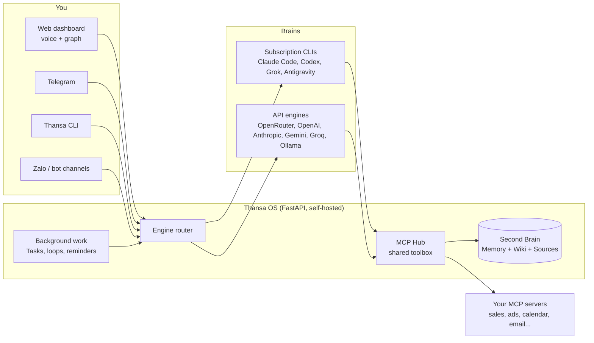

<div align="center">


# Thansa OS

### Your self-hosted AI agent with a swappable brain, and a Second Brain that gets smarter every day.

Run it on your laptop or a small VPS. Talk to it by voice. Plug in Claude, ChatGPT, Grok, Gemini or any of 12 providers, keep every tool when you switch, and let it work in the background while you sleep.

[](https://github.com/xahoapro/thansa-os/stargazers)
[](LICENSE)
[](https://github.com/xahoapro/thansa-os/commits/main)
[](requirements.txt)
[](https://github.com/xahoapro/thansa-os/pkgs/container/javis-os)
[](https://modelcontextprotocol.io)

<!-- flags:start -->
<p align="center">
<b>🌐 Available in 12 languages</b><br><br>

<a href="docs/i18n/vi/README.md"></a>
<a href="docs/i18n/zh/README.md"></a>
<a href="docs/i18n/es/README.md"></a>
<a href="docs/i18n/ja/README.md"></a>
<a href="docs/i18n/hi/README.md"></a>
<a href="docs/i18n/pt-BR/README.md"></a>
<a href="docs/i18n/ko/README.md"></a>
<a href="docs/i18n/ru/README.md"></a>
<a href="docs/i18n/de/README.md"></a>
<a href="docs/i18n/fr/README.md"></a>
<a href="docs/i18n/id/README.md"></a>
</p>
<!-- flags:end -->

🇬🇧 **English** · [🇻🇳 Tiếng Việt](docs/i18n/vi/README.md) · [🇨🇳 简体中文](docs/i18n/zh/README.md) · [🇪🇸 Español](docs/i18n/es/README.md) · [🇯🇵 日本語](docs/i18n/ja/README.md) · [🇮🇳 हिन्दी](docs/i18n/hi/README.md) · [🇧🇷 Português](docs/i18n/pt-BR/README.md) · [🇰🇷 한국어](docs/i18n/ko/README.md) · [🇷🇺 Русский](docs/i18n/ru/README.md) · [🇩🇪 Deutsch](docs/i18n/de/README.md) · [🇫🇷 Français](docs/i18n/fr/README.md) · [🇮🇩 Bahasa Indonesia](docs/i18n/id/README.md) · [🌍 Help translate](CONTRIBUTING.md#translations)

[Quick start](#-quick-start) · [Why Thansa](#-why-thansa) · [Brains](#-12-brains-one-toolkit) · [Features](#-features) · [Install](#-installation) · [Docs](docs/en/README.md) · [Support](#-support-thansa-os)

<br>


</div>

---

## ⚡ Quick start

**The easy way: let your own AI install it.** Give this repo link to Claude Code or Codex on your machine and say *"install Thansa OS for me"*. It only needs to run one command:

| Machine | One command installs everything |
|---|---|
| **Linux / macOS** | `git clone https://github.com/xahoapro/thansa-os.git javis && cd javis && chmod +x install.sh && ./install.sh` |
| **Windows** | `git clone https://github.com/xahoapro/thansa-os.git javis; cd javis; powershell -ExecutionPolicy Bypass -File install.ps1` |
| **Docker** | `curl -fsSLO https://raw.githubusercontent.com/xahoapro/thansa-os/main/docker-compose.yml && docker compose up -d` |

Then open **http://localhost:7777**. The installer sets up Python, the four subscription CLI brains (`claude`, `codex`, `agy`, `grok`) and a `.env`, then starts the server. You sign in to each brain **on the Models page of the dashboard**, no more typing commands.

> [!NOTE]
> Installed an extra CLI **after** Thansa was already running? **Restart Thansa.** A running process keeps the PATH it started with, so it cannot see a CLI installed later.

<p align="center">

</p>

---

## 🤔 Why Thansa?

Thansa OS is **not** a chatbot. It is a **self-hosted agentic AI** that runs on your own machine or VPS: it reads and writes files, calls tools over MCP, runs skills, queues background work and schedules itself. All of that sits behind a **voice-controlled dashboard** with a **Second Brain** (memory + wiki) that accumulates knowledge over time.

### The lock-in nobody warns you about

Pick one AI app and use it every day for a year. Then look at what has piled up inside it:

- **Hundreds of conversations**, holding the decisions and context you worked out along the way.
- **Memory** of who you are, how you work and what your business sells.
- **Custom instructions, assistants and projects**: know-how you spent hours tuning.
- **Automations and agents** that only run on that one platform.

All of it sits on the vendor's servers, in the vendor's format. Then a better model ships somewhere else. You can try it, but you cannot bring your work along: the new app knows nothing about you, your instructions do not carry over, and your history stays behind. Exports, where they exist, are usually a dump of chat logs, not memory another tool can use.

So you stay. Not because the old model is still the best, but because leaving means starting from zero. And when the vendor raises prices, tightens limits, retires a model or locks your account, there is no plan B.

### Thansa turns it around: rent the model, own the brain

In Thansa the model is a part you can swap. Everything you build up lives with you, as files you can open:

| What you build up | Where it lives | Format |
|---|---|---|
| **Conversations** | `conversations.db` on your own machine or VPS, one store whichever brain answered | SQLite, full-text searchable |
| **Memory about you** | `memory/` in your brain: `MEMORY.md` plus one file per fact | Markdown |
| **Knowledge** | the Wiki and Sources folders of your brain | Markdown, Obsidian-compatible |
| **Skills** | `skills/<name>/SKILL.md` | Markdown |
| **Agents and workflows** | `agents/*.md`, `workflows/*.md` | Markdown with front matter |
| **Loops and reminders** | `Javis/loops/*.md`, `Javis/reminders.json` | Markdown, JSON |

What that buys you:

- **A new model comes out? Switch on the Models page and keep going.** It reads the same memory, runs the same skills, agents and workflows, and calls the same connections through the MCP Hub. Nothing to migrate, nothing to rebuild.
- **Use several brains at once.** A strong model for the conversation, a cheaper one for background work, a local Ollama model for private notes, all working on the same brain.
- **Readable without Thansa.** Your brain is a folder of markdown. Open it in Obsidian or any editor. If Thansa disappeared tomorrow, your knowledge would still be there, in plain text.
- **Versioned and portable.** Every learning pass is a git commit you can undo in one tap, and the whole brain can sync to your own private GitHub repo, shared between your laptop and your VPS.
- **Your data stays on your hardware.** There is no Thansa cloud in between. A request goes only to the model provider you picked for it, and with a local Ollama model it never leaves your machine.

### Thansa next to an ordinary chatbot

| | An ordinary chatbot | **Thansa OS** |
|---|---|---|
| **Brain** | Locked to one model, one stateless API call per message | **Swappable**: 12 providers, each with the full set of tools, MCP, skills and sessions, including models running on your own machine through Ollama |
| **Memory** | Forgets after every session | **A living Second Brain** that remembers you and thickens with every conversation |
| **Data** | Made up, or absent | **Real numbers** from the connections you wire in (sales, ads, calendar, email, messaging) |
| **Work** | Answers, then waits | **Background loops, reminders and an AI-run task queue** that report back to you |
| **Interface** | A chat box | Dashboard + knowledge graph + **hands-free voice** + Telegram + a CLI |
| **Your work** | Stays on the vendor's servers, in the vendor's format | **Plain files on your machine**: history, memory, skills, agents and workflows carry over to any new model |
| **Deployment** | Someone else's cloud | **Self-hosted**: one-click Hostinger, Docker, or any VPS |

> 💡 **The philosophy: capability lives in Thansa, not in the model.** Every brain gets the same toolbox through one shared connection hub (the MCP Hub). Switching from Claude to Gemini costs you nothing except shell access, which only the CLI engines have.

<p align="center">

</p>

---

## 🧠 12 brains, one toolkit

Pick the brain on the **Models** page and change it whenever you like. Thansa supports **12 providers** today.

<p align="center">

</p>

| Brain | How you pay | Shell, web, sub-agents |
|---|---|---|
| **Claude Code** | Your Claude plan, or an Anthropic API key | ✅ |
| **ChatGPT** (via Codex) | Your ChatGPT plan | ✅ |
| **Grok Build** | Your SuperGrok or X Premium+ plan | ✅ |
| **Antigravity CLI** | Your Google plan (same lineup as the Antigravity IDE, Claude included) | Shell ✅ |
| **OpenRouter** | API key (hundreds of models behind one key) | via Thansa tools |
| **OpenAI API** · **Anthropic API** · **Google Gemini** · **Groq** | API key | via Thansa tools |
| **Ollama Cloud** · **Ollama on this machine** | API key, or free on your own hardware | via Thansa tools |
| **Any OpenAI-compatible endpoint** | Whatever that endpoint needs | via Thansa tools |

Every brain can call your connected MCP servers, read and write the brain, run skills, queue Kanban work, and create agents, workflows, loops and reminders. The CLI engines additionally run **shell commands**, **fetch and search the web**, and **spawn parallel sub-agents**.

> [!WARNING]
> **Read this before letting a subscription run background work.** Anthropic scopes Claude Pro/Max to **ordinary personal use** of Claude Code. Continuous background execution (loops, reminders, Kanban jobs, chatbots), running on a VPS, or several people sharing one account all fall outside that scope, and accounts **have been suspended** over it. Thansa never reads your login token: it runs the real `claude` binary, but that does not make round-the-clock background use legitimate. To be safe, set Claude Code to run on an **API key** on the Models page, or point the **background-work model** at another provider. The same caution applies to the xAI plan. See `server/claude_auth.py`.

---

## ✨ Features

<p align="center">

</p>

<table>
<tr>
<td width="50%" valign="top">

### 🗣️ Talk to it
- **Hands-free voice**: speak, Thansa listens and answers out loud (Edge TTS free by default, or OpenAI and ElevenLabs).
- **Chat sessions** you can save, reopen and full-text search. Long sessions are compacted into summaries instead of being cut off.
- **Telegram, a CLI and a web dashboard**, all talking to the same Thansa.
- **Any language**: Thansa replies in the language you write in. The interface ships in English and Vietnamese.

### 🧠 Remember everything
- **Second Brain**: a markdown vault (Obsidian-compatible) with long-term memory, a Wiki and raw Sources.
- **Knowledge graph** of your notes joined by `[[wikilink]]`, on a light canvas that works offline.
- **Self-learning**: after each conversation Thansa distils memories, wiki knowledge and skills. Every learning pass is a git commit, so it is **one-tap undoable**.
- **Back up to GitHub**: two-way sync of every brain to a private repo, shared between your laptop and your VPS.

</td>
<td width="50%" valign="top">

### ⚙️ Work while you sleep
- **Tasks (Kanban)**: hand over a goal in plain words. The AI writes the spec, picks a worker, runs it in the background and only calls you on exceptions.
- **Loops and reminders**: background jobs on an interval, a clock time or a cron expression, each checking its own work.
- **Agents and workflows**: specialist assistants with their own memory, chained into multi-step workflows with verification.
- **Chatbots**: put an agent in front of your customers on its own Telegram or Zalo bot, with a shared inbox you can take over.

### 🔌 Connect anything
- **MCP connection store** with several accounts per service and three permission levels that Thansa **hard-enforces**.
- **Skills and plugins**: drop in a folder to add know-how (skill) or a native Python tool (plugin) for every engine.
- **Image generation** on the ChatGPT plan you are already signed in to.
- **Usage tracking**: tokens and cost per day, per provider, split between what you typed and what ran on its own.

</td>
</tr>
</table>

<p align="center">

</p>

<div align="center">


</div>

---

## 🏗️ How it works



- **Backend:** Python FastAPI in `server/`: engines (`claude_sdk_engine.py`, `claude_cli.py`, `antigravity_cli.py`, `engine.py`, `aux_engine.py`), tools (`mcp_hub.py`, `mcp_store.py`, `plugins_host.py`), background work (`tasks.py`, `self_improve.py`, `reminders.py`, `learn.py`), language and locale (`lang.py`, `lang_registry.py`, `localefmt.py`).
- **Frontend:** plain HTML/CSS/JS in `dashboard/`. No framework and no build step, so it stays light on a small VPS. Interface strings live in `dashboard/i18n/`.
- **Second Brain:** a markdown vault in `brains/<brain name>/`.

---

## 🚀 Installation

> [!IMPORTANT]
> Thansa runs an AI brain with **full rights** on the machine. When it runs publicly (Docker, VPS, Hostinger), Thansa **forces login by itself**: opening the app shows a create-account or sign-in screen, and nobody can drive it without a password.

<details open>
<summary><b>Option 1: Hostinger Docker Manager (domain + HTTPS, one click)</b></summary>

Hostinger VPS → **Docker Manager → Compose → URL** → paste the Hostinger file and press **Deploy**:

```
https://raw.githubusercontent.com/xahoapro/thansa-os/main/docker-compose.hostinger.yml
```

The **Environment** box needs only three fields: `DOMAIN_NAME`, `JAVIS_ADMIN_USER`, `JAVIS_ADMIN_PASSWORD`, plus an optional `JAVIS_AUTO_UPDATE` (set it to `true` and Thansa updates itself daily).

Set `DOMAIN_NAME` so Hostinger's Traefik issues HTTPS:
- **Free link** (no domain purchase): `DOMAIN_NAME=javis.<vps-hostname>.hstgr.cloud` (hostname under hPanel → VPS, e.g. `javis.srv1562015.hstgr.cloud`).
- **Your own domain:** `DOMAIN_NAME=example.com` and point an A record at the VPS IP.

Wait 1-3 minutes for the certificate, then open `https://<DOMAIN_NAME>`.

**Three one-time steps:**
1. **Make the GHCR image Public:** GitHub → repo → **Packages** → `javis-os` → *Package settings* → Visibility = **Public**.
2. **Create the admin account:** fill in `JAVIS_ADMIN_USER` + `JAVIS_ADMIN_PASSWORD` (recommended), or open the app right after deploying and set one yourself. While no admin exists, whoever opens the link first can create it. Then **turn on 2FA** ([Security and accounts](docs/en/14-security-and-accounts.md)).
3. **Sign in to a brain** on the **Models** page.

Details and troubleshooting: [DEPLOY.en.md](DEPLOY.en.md).

</details>

<details>
<summary><b>Option 2: Docker on any VPS (no clone needed)</b></summary>

```bash
# Docker required (don't have it?  curl -fsSL https://get.docker.com | sh)
mkdir javis && cd javis
curl -fsSLO https://raw.githubusercontent.com/xahoapro/thansa-os/main/docker-compose.yml

docker compose run --rm javis claude auth login --claudeai   # sign in to Claude once (optional)
docker compose up -d                                          # pull the image and run
```

Open `http://<vps-ip>:7777` and set the admin username and password right away (at least 8 characters), or preset `JAVIS_ADMIN_USER` + `JAVIS_ADMIN_PASSWORD` in the environment. Then turn on 2FA.

Remote access without a domain: `docker compose --profile tunnel up -d`, then `docker compose logs tunnel | grep trycloudflare` prints an HTTPS link.

</details>

<details>
<summary><b>Option 3: Linux or macOS, no Docker</b></summary>

```bash
git clone https://github.com/xahoapro/thansa-os.git javis && cd javis
chmod +x install.sh && ./install.sh
```

The script installs Python, Node and the CLI brains, creates a venv, registers a service that starts at boot, and prints the address.

🍎 **macOS, open it like an app:** double-click `JAVIS OS.app` (or `Start JAVIS OS.command`). Start at login: `./bin/javis-autostart.sh install`. Details: [bin/README.md](bin/README.md).

</details>

<details>
<summary><b>Option 4: Windows (personal machine)</b></summary>

```powershell
git clone https://github.com/xahoapro/thansa-os.git javis; cd javis
powershell -ExecutionPolicy Bypass -File install.ps1
```

`install.ps1` does it all in one pass: Python, venv and libraries, the four subscription CLI brains (`claude`, `codex`, `agy`, `grok`), the `.env`, freeing port 7777 and starting the server. It ends with a table of which brains are ready. Without `winget`, install Python 3.12 (tick "Add python.exe to PATH") and Node.js LTS by hand first, then run it again.

```
Run with a visible window (live log):  setup.bat
Run silently from then on:             start-javis.vbs   (log at server\javis.log)
Stop:                                  stop-javis.bat
Dashboard:                             http://localhost:7777
```

🪟 **Open it like an app:** after the first run, double-click **`JAVIS OS.bat`**. The server starts in the background and the dashboard opens in **its own window** with its own taskbar entry. Start at login: `javis-autostart.bat install` (remove: `uninstall`).

</details>

<details>
<summary><b>Several Thansa instances on one VPS</b></summary>

Brains, settings and accounts stay fully separate per instance. Only three values differ between them: `JAVIS_NAME`, `JAVIS_HOST_PORT`, `DOMAIN_NAME`.

- **Hostinger:** deploy `docker-compose.hostinger.yml` again as a second stack and fill in those three fields.
- **Self-managed VPS:** run the shared proxy `docker-compose.proxy.yml` once for the whole machine, then give each instance its own folder with `docker-compose.multi.yml`. The proxy discovers new instances and requests SSL by itself.
- **Native:** `JAVIS_NAME=javis-shop JAVIS_PORT=7778 ./install.sh`.

Step by step: [DEPLOY.en.md](DEPLOY.en.md).

</details>

### 🎬 First run

Open Thansa and the setup wizard walks you through it, in your browser's language:

1. **Admin account**: required when running publicly, to keep strangers out.
2. **Pick a brain**: sign in once with a subscription, or paste an API key. The Claude Code card has a **"Runs on"** switch between your signed-in plan and an Anthropic API key.
3. **Pick a model**: switching providers later loses no features (except shell commands, which only the CLI engines have).
4. **Wire up connections** (optional): open **Connections**, pick a service and paste a key or scan a QR code. Thansa then reports on real numbers from it.

---

## 📖 Using Thansa

The left rail groups the pages into **6 groups**. Every page has a guide in [docs/en/](docs/en/README.md).

| Group | Pages | Guides |
|---|---|---|
| **Brain** | Graph, Chat, Files, Self-learning | [Chat and voice](docs/en/02-chat-and-voice.md) · [Knowledge graph](docs/en/03-knowledge-graph.md) · [Sessions](docs/en/04-sessions.md) · [File manager](docs/en/05-file-manager.md) · [Self-learning](docs/en/22-self-learning.md) |
| **Code** | Terminal, Coding | [Code terminal](docs/en/27-code-terminal.md) |
| **Capabilities** | Partners (agents and workflows), Chatbot, Skills, Plugins | [Agents and workflows](docs/en/07-agents-and-workflows.md) · [Chatbots](docs/en/25-chatbots.md) · [Customer conversations](docs/en/28-customer-conversations.md) · [Skills](docs/en/06-skills.md) · [Plugins](docs/en/20-plugins.md) |
| **Work** | Tasks, Scheduled | [Tasks (Kanban)](docs/en/21-kanban-work.md) · [Recurring jobs and reminders](docs/en/08-recurring-jobs.md) |
| **Connections** | Connections, Thansa Store, Channels, Models | [Connections and business data](docs/en/09-connections-and-business-data.md) · [Telegram](docs/en/11-telegram.md) · [Zalo](docs/en/12-zalo-agent-mcp.md) · [Models and engines](docs/en/10-models-and-engines.md) |
| **System** | Settings, Share links, Account | [Getting started](docs/en/01-getting-started.md) · [Security and accounts](docs/en/14-security-and-accounts.md) · [Usage and cost](docs/en/23-usage-and-cost.md) · [Thansa CLI](docs/en/24-cli.md) |

More: [Second Brain: memory, Wiki and INGEST](docs/en/13-second-brain.md) · [GitHub backup](docs/en/18-github-backup.md) · [Tasks and Dataview in notes](docs/en/19-tasks-and-dataview.md) · [Branding and custom domains](docs/en/15-branding-and-domains.md) · [Troubleshooting](docs/en/17-troubleshooting.md)

### A few things to try

- **Ask for numbers:** *"How is revenue today compared with yesterday?"* Thansa calls the right connection and answers with real figures plus suggestions.
- **Digest knowledge:** drop in a file or a note. Thansa summarises it, extracts insight, writes it into the Wiki and proposes tasks.
- **Hand over background work:** **Tasks** → **+ Assign goal** → *"summarise this week's sales, find slow-moving stock, draft three captions to push it"*. The AI specs it, runs it and reports back.
- **Schedule something:** *"remind me every weekday at 8:30 to check the ads budget"*, in chat or on the **Scheduled** page.
- **Use your voice:** press the mic (or turn on hands-free), speak, and Thansa answers out loud.

<div align="center">

<br><sub>Works on your phone too: add it to the home screen and it opens like an app.</sub>
</div>

---

## ⚙️ Configuration (`.env`)

Every line can stay empty and Thansa still runs. Copy `env.example` → `.env` and add what you need. The full list with an explanation per variable is in [docs/en/16-env-configuration.md](docs/en/16-env-configuration.md).

| Variable | Meaning | Default |
|---|---|---|
| `JAVIS_HOST` | Listen address. `127.0.0.1` = this machine only, `0.0.0.0` = public | `127.0.0.1` |
| `JAVIS_PORT` | Port | `7777` |
| `JAVIS_REQUIRE_LOGIN` | `1`/`0` to force login on or off (default: on when bound publicly) | *(auto)* |
| `JAVIS_ADMIN_USER` / `JAVIS_ADMIN_PASSWORD` | Create the admin at deploy time | - |
| `JAVIS_ALLOWED_HOSTS` | Extra hostnames on the allow-list (CSRF and DNS-rebinding protection) | localhost + your domain |
| `JAVIS_STATE_DIR` | Where settings, sessions and the encryption key live | `server/` (Docker: `/data/state`) |
| `BRAINS_DIR` | Parent folder holding every brain | `brains/` (Docker: `/brains`) |
| `JAVIS_ENABLE_USER_PLUGINS` | `true` lets your own plugins run (real Python inside the server) | *(off)* |
| `TTS_VOICE` / `TTS_RATE` | Voice and speed for Edge TTS | `en-US-EmmaMultilingualNeural` / `+5%` |

---

## 🔐 Security

- **Login is required** on a public server before any feature works, because the brain runs with full rights on the machine.
- **2FA (TOTP)**, login rate limiting, passwords of at least 8 characters, `Secure` cookies under HTTPS, sessions that expire after 30 days.
- **CSRF and DNS-rebinding protection**: any write request from an unknown origin is rejected.
- **Secrets are encrypted** in `settings.json` (API keys, OAuth tokens, bot tokens) with a per-machine key.
- **Your own plugins are blocked by default** until you set `JAVIS_ENABLE_USER_PLUGINS=true`.
- **Connection permissions are enforced** by the hub, not by the model: a read-only account cannot be used to send, pay or publish.

Found a vulnerability? Please follow [SECURITY.md](SECURITY.md) instead of opening a public issue.

---

## 🔄 Updating

In the app: **Settings → Updates → Update now**, with a progress bar and a rollback button if the new build breaks. On a VPS: `cd javis && ./update.sh` (pulls the new image and restarts; your data in the volumes is kept).

---

## 🩺 Troubleshooting

| Symptom | What to do |
|---|---|
| The Models page says a CLI is not installed, but it is | **Restart Thansa**: the running process keeps the PATH from when it started. |
| Port 7777 is taken and the new build will not start | Stop the old process first (`stop-javis.bat`, or kill the PID), then start again. |
| Hostinger cannot pull the image | Set the GHCR package to **Public** and wait for the GitHub Action build to finish. |
| A brain says it is not signed in | **Models** → that provider's card → sign in. |

More in [docs/en/17-troubleshooting.md](docs/en/17-troubleshooting.md).

---

## 📂 Repository layout

```
javis-os/
├── server/          # FastAPI backend: engines, connections, background work, channels, memory
├── dashboard/       # Frontend (plain JS, no build step)
│   └── i18n/        # Interface strings, one JSON file per language
├── brains/          # Every Second Brain (default: brains/Brain Default)
├── system/          # Ships with the app: bundled plugins, system skills, connection catalogue
├── docs/            # User guides (docs/en/ in English) and translations (docs/i18n/)
├── tests/           # Python + JS test suite (python tests/run.py)
├── install.sh · install.ps1 · update.sh
├── Dockerfile · docker-compose*.yml
└── CLAUDE.md        # The system prompt Thansa runs on
```

---

## 🌍 Languages

| What | Languages today |
|---|---|
| **Thansa's replies** | Any language: it answers in the language you write in, or one you pin in Settings |
| **Dashboard and server messages** | 🇬🇧 English · 🇻🇳 Tiếng Việt, per device: each browser gets its own language until you pick one |
| **Connection store, plugins, a new brain's starter files** | 🇬🇧 English · 🇻🇳 Tiếng Việt |
| **README and quick start** | 🇬🇧 English · 🇻🇳 Tiếng Việt · 🇨🇳 简体中文 · 🇪🇸 Español · 🇯🇵 日本語 · 🇮🇳 हिन्दी · 🇧🇷 Português · 🇰🇷 한국어 · 🇷🇺 Русский · 🇩🇪 Deutsch · 🇫🇷 Français · 🇮🇩 Bahasa Indonesia |
| **Full documentation** | 🇬🇧 English · 🇻🇳 Tiếng Việt |

Adding a language is a data change, not a code change: one entry in `server/lang_registry.py` plus one `dashboard/i18n/<code>.json`, and optionally `system/mcp-catalog.<code>.json`. Anything not translated yet shows in English. See [CONTRIBUTING.md](CONTRIBUTING.md#translations) if you would like to help.

---

## 🤝 Contributing

Bug reports, ideas, translations and pull requests are all welcome, in English or Vietnamese.

| Start here | What it gives you |
|---|---|
| [CONTRIBUTING.md](CONTRIBUTING.md) | Setting up, running the tests (`python tests/run.py`), the code conventions |
| [ARCHITECTURE.md](ARCHITECTURE.md) | How the pieces fit together, and a map of the server modules |
| [docs/dev/GLOSSARY.md](docs/dev/GLOSSARY.md) | The code base was written in Vietnamese: this decodes names like `nhac_hen` (reminder) |
| [docs/dev/adding-a-language.md](docs/dev/adding-a-language.md) | Translating Thansa into your language, step by step |
| [Issue templates](https://github.com/xahoapro/thansa-os/issues/new/choose) | Bug report, feature request, translation offer |

Please follow the [Code of Conduct](CODE_OF_CONDUCT.md), and report security problems privately as described in [SECURITY.md](SECURITY.md).

If Thansa is useful to you, a ⭐ on the repo helps other people find it.

[](https://star-history.com/#xahoapro/thansa-os&Date)

---

## 🙏 Credits

- **Brains:** [Claude Code](https://claude.com/claude-code) and the [Claude Agent SDK](https://docs.claude.com/en/api/agent-sdk/overview) (Anthropic), [Codex CLI](https://developers.openai.com/codex/cli) (OpenAI), [Grok Build](https://x.ai) (xAI), [Antigravity](https://antigravity.google) (Google), plus the APIs of [OpenRouter](https://openrouter.ai), OpenAI, [Google Gemini](https://ai.google.dev), Anthropic, [Groq](https://groq.com) and [Ollama](https://ollama.com).
- **Tool standard:** [Model Context Protocol](https://modelcontextprotocol.io). The whole Thansa connection store runs on it.
- The Second Brain and digital Bullet Journal patterns.

## 📄 License

Open source under the **MIT License**: use, modify and distribute freely, just keep the copyright notice. See [LICENSE](LICENSE).

---

## ☕ Support Thansa OS

Thansa OS is free and open source, and it is still one person writing the code and paying for the test servers. If Thansa helps your work or your life, a small donation buys more time for bug fixes and new features.

- 🌍 **PayPal**: [paypal.me/quy01](https://paypal.me/quy01)
- 🏦 **MB Bank** (Vietnam): `6636966369`
- 📱 **MoMo wallet** (Vietnam): `0372752740`

Can't donate? Using Thansa, sending feedback or opening a pull request counts as support too.

<div align="center">
<br>
Made with ☕ in Vietnam by <b><a href="https://tradingauto.org">Duy Quang</a></b>
</div>
