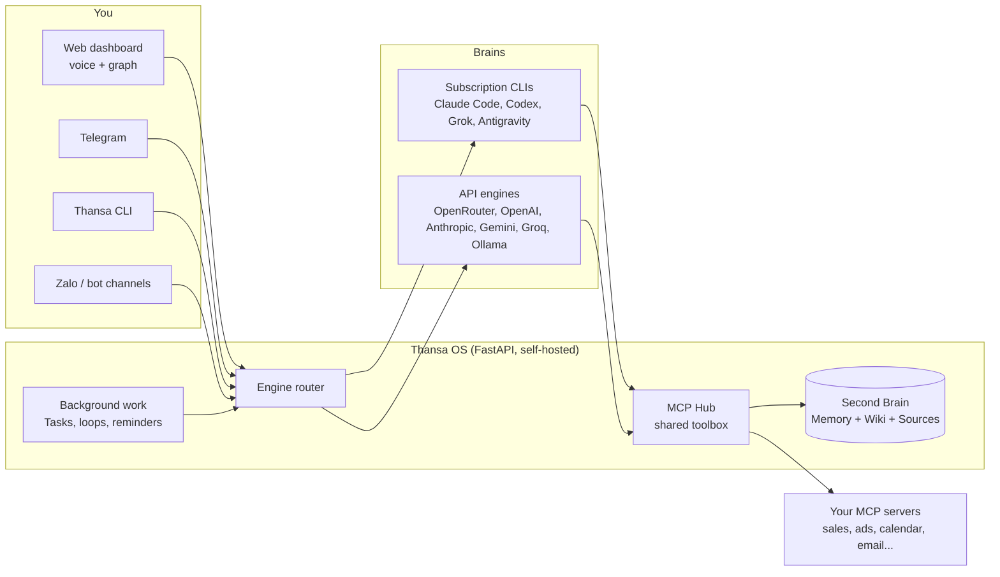

<!-- translated-from: README.md sha256:2e10ad3d2a86 -->
<div align="center">


# Thansa OS

### Dein selbst gehosteter KI-Agent mit austauschbarem Gehirn und einem Second Brain, das jeden Tag schlauer wird.

Lass ihn auf deinem Laptop oder einem kleinen VPS laufen. Sprich mit ihm per Stimme. Schließ Claude, ChatGPT, Grok, Gemini oder einen von 12 Anbietern an, behalte beim Wechsel jedes Tool und lass ihn im Hintergrund arbeiten, während du schläfst.

[](https://github.com/xahoapro/thansa-os/stargazers)
[](../../../LICENSE)
[](https://github.com/xahoapro/thansa-os/commits/main)
[](../../../requirements.txt)
[](https://github.com/xahoapro/thansa-os/pkgs/container/javis-os)
[](https://modelcontextprotocol.io)

<!-- flags:start -->
<p align="center">
<b>🌐 In 12 Sprachen verfügbar</b><br><br>
<a href="../../../README.md"></a>
<a href="../vi/README.md"></a>
<a href="../zh/README.md"></a>
<a href="../es/README.md"></a>
<a href="../ja/README.md"></a>
<a href="../hi/README.md"></a>
<a href="../pt-BR/README.md"></a>
<a href="../ko/README.md"></a>
<a href="../ru/README.md"></a>

<a href="../fr/README.md"></a>
<a href="../id/README.md"></a>
</p>
<!-- flags:end -->

[🇬🇧 English](../../../README.md) · [🇻🇳 Tiếng Việt](../vi/README.md) · [🇨🇳 简体中文](../zh/README.md) · [🇪🇸 Español](../es/README.md) · [🇯🇵 日本語](../ja/README.md) · [🇮🇳 हिन्दी](../hi/README.md) · [🇧🇷 Português](../pt-BR/README.md) · [🇰🇷 한국어](../ko/README.md) · [🇷🇺 Русский](../ru/README.md) · 🇩🇪 **Deutsch** · [🇫🇷 Français](../fr/README.md) · [🇮🇩 Bahasa Indonesia](../id/README.md) · [🌍 Beim Übersetzen helfen](../../../CONTRIBUTING.md#translations)

[Schnellstart](#-schnellstart) · [Warum Thansa](#-warum-thansa) · [Gehirne](#-12-gehirne-ein-werkzeugkasten) · [Funktionen](#-funktionen) · [Installation](#-installation) · [Dokumentation](../../../docs/en/README.md) · [Unterstützen](#-unterstütze-thansa-os)

<br>


</div>

> 🌍 Dies ist eine automatische Übersetzung der englischen README. Thansa antwortet in der Sprache, in der du schreibst; die Oberfläche gibt es derzeit auf Englisch und Vietnamesisch. Die vollständige Dokumentation ist auf Englisch ([docs/en](../../../docs/en/README.md)). Korrekturen sind willkommen ([CONTRIBUTING](../../../CONTRIBUTING.md#translations)).

---

## ⚡ Schnellstart

**Der einfache Weg: Lass deine eigene KI die Installation erledigen.** Gib Claude Code oder Codex auf deinem Rechner den Link zu diesem Repo und sag *„installiere mir Thansa OS“*. Es muss nur einen einzigen Befehl ausführen:

| Rechner | Ein Befehl installiert alles |
|---|---|
| **Linux / macOS** | `git clone https://github.com/xahoapro/thansa-os.git javis && cd javis && chmod +x install.sh && ./install.sh` |
| **Windows** | `git clone https://github.com/xahoapro/thansa-os.git javis; cd javis; powershell -ExecutionPolicy Bypass -File install.ps1` |
| **Docker** | `curl -fsSLO https://raw.githubusercontent.com/xahoapro/thansa-os/main/docker-compose.yml && docker compose up -d` |

Öffne danach **http://localhost:7777**. Der Installer richtet Python, die vier Abo-CLI-Gehirne (`claude`, `codex`, `agy`, `grok`) und eine `.env` ein und startet dann den Server. Bei jedem Gehirn meldest du dich **auf der Seite Models im Dashboard** an, ganz ohne weitere Befehle.

> [!NOTE]
> Du hast eine weitere CLI installiert, **nachdem** Thansa schon lief? **Starte Thansa neu.** Ein laufender Prozess behält den PATH, mit dem er gestartet wurde, und sieht daher keine später installierte CLI.

<p align="center">

</p>

---

## 🤔 Warum Thansa?

Thansa OS ist **kein** Chatbot. Es ist eine **selbst gehostete agentische KI**, die auf deinem eigenen Rechner oder VPS läuft: Sie liest und schreibt Dateien, ruft Tools über MCP auf, führt Skills aus, stellt Hintergrundarbeit in eine Warteschlange und plant sich selbst ein. All das steckt hinter einem **sprachgesteuerten Dashboard** mit einem **Second Brain** (Gedächtnis + Wiki), das mit der Zeit Wissen ansammelt.

### Der Lock-in, vor dem dich niemand warnt

Such dir eine KI-App aus und nutze sie ein Jahr lang jeden Tag. Dann schau dir an, was sich darin angesammelt hat:

- **Hunderte Gespräche** mit den Entscheidungen und dem Kontext, die du dir unterwegs erarbeitet hast.
- **Ein Gedächtnis** darüber, wer du bist, wie du arbeitest und was dein Unternehmen verkauft.
- **Eigene Anweisungen, Assistenten und Projekte**: Know-how, an dem du stundenlang gefeilt hast.
- **Automatisierungen und Agents**, die nur auf dieser einen Plattform laufen.

All das liegt auf den Servern des Anbieters, im Format des Anbieters. Dann erscheint anderswo ein besseres Modell. Du kannst es ausprobieren, aber deine Arbeit kannst du nicht mitnehmen: Die neue App weiß nichts über dich, deine Anweisungen lassen sich nicht übertragen, und dein Verlauf bleibt zurück. Exporte, sofern es sie überhaupt gibt, sind meist ein Haufen Chatprotokolle, kein Gedächtnis, mit dem ein anderes Tool etwas anfangen kann.

Also bleibst du. Nicht weil das alte Modell noch das beste wäre, sondern weil ein Wechsel heißt, bei null anzufangen. Und wenn der Anbieter die Preise erhöht, die Limits verschärft, ein Modell einstellt oder dein Konto sperrt, gibt es keinen Plan B.

### Thansa dreht den Spieß um: Miete das Modell, besitze das Brain

In Thansa ist das Modell ein Bauteil, das du austauschen kannst. Alles, was du aufbaust, bleibt bei dir, als Dateien, die du öffnen kannst:

| Was du aufbaust | Wo es liegt | Format |
|---|---|---|
| **Gespräche** | `conversations.db` auf deinem eigenen Rechner oder VPS, ein einziger Speicher, egal welches Gehirn geantwortet hat | SQLite, mit Volltextsuche |
| **Gedächtnis über dich** | `memory/` in deinem Brain: `MEMORY.md` plus eine Datei pro Fakt | Markdown |
| **Wissen** | die Ordner Wiki und Sources deines Brains | Markdown, Obsidian-kompatibel |
| **Skills** | `skills/<name>/SKILL.md` | Markdown |
| **Agents und Workflows** | `agents/*.md`, `workflows/*.md` | Markdown mit Front Matter |
| **Loops und Erinnerungen** | `Javis/loops/*.md`, `Javis/reminders.json` | Markdown, JSON |

Was dir das bringt:

- **Ein neues Modell ist erschienen? Wechsle auf der Seite Models und mach einfach weiter.** Es liest dasselbe Gedächtnis, führt dieselben Skills, Agents und Workflows aus und ruft über den MCP Hub dieselben Verbindungen auf. Nichts zu migrieren, nichts neu aufzubauen.
- **Nutze mehrere Gehirne gleichzeitig.** Ein starkes Modell für das Gespräch, ein günstigeres für die Hintergrundarbeit, ein lokales Ollama-Modell für private Notizen, und alle arbeiten am selben Brain.
- **Lesbar auch ohne Thansa.** Dein Brain ist ein Ordner voller Markdown-Dateien. Öffne ihn in Obsidian oder einem beliebigen Editor. Wäre Thansa morgen verschwunden, wäre dein Wissen immer noch da, als reiner Text.
- **Versioniert und portabel.** Jeder Lerndurchgang ist ein Git-Commit, den du mit einem Tippen rückgängig machen kannst, und das ganze Brain lässt sich mit deinem eigenen privaten GitHub-Repo synchronisieren, gemeinsam genutzt von deinem Laptop und deinem VPS.
- **Deine Daten bleiben auf deiner Hardware.** Es gibt keine Javis-Cloud dazwischen. Eine Anfrage geht nur an den Modellanbieter, den du dafür gewählt hast, und mit einem lokalen Ollama-Modell verlässt sie deinen Rechner nie.

### Thansa neben einem gewöhnlichen Chatbot

| | Ein gewöhnlicher Chatbot | **Thansa OS** |
|---|---|---|
| **Gehirn** | An ein Modell gebunden, ein zustandsloser API-Aufruf pro Nachricht | **Austauschbar**: 12 Anbieter, jeder mit allen Tools, MCP, Skills und Sitzungen, einschließlich Modellen, die über Ollama auf deinem eigenen Rechner laufen |
| **Gedächtnis** | Vergisst nach jeder Sitzung alles | **Ein lebendiges Second Brain**, das sich an dich erinnert und mit jedem Gespräch wächst |
| **Daten** | Erfunden oder gar nicht vorhanden | **Echte Zahlen** aus den Verbindungen, die du einrichtest (Verkauf, Werbung, Kalender, E-Mail, Messaging) |
| **Arbeit** | Antwortet und wartet dann | **Hintergrund-Loops, Erinnerungen und eine von der KI gesteuerte Aufgabenwarteschlange**, die dir Bericht erstatten |
| **Oberfläche** | Ein Chatfenster | Dashboard + Wissensgraph + **freihändige Sprachsteuerung** + Telegram, Slack, WhatsApp, Zalo + eine CLI |
| **Deine Arbeit** | Bleibt auf den Servern des Anbieters, im Format des Anbieters | **Einfache Dateien auf deinem Rechner**: Verlauf, Gedächtnis, Skills, Agents und Workflows lassen sich zu jedem neuen Modell mitnehmen |
| **Bereitstellung** | Die Cloud von jemand anderem | **Selbst gehostet**: Hostinger mit einem Klick, Docker oder ein beliebiger VPS |

> 💡 **Die Philosophie: Die Fähigkeiten stecken in Thansa, nicht im Modell.** Jedes Gehirn bekommt denselben Werkzeugkasten über einen gemeinsamen Verbindungs-Hub (den MCP Hub). Der Wechsel von Claude zu Gemini kostet dich nichts außer dem Shell-Zugriff, den nur die CLI-Engines haben.

<p align="center">

</p>

---

## 🧠 12 Gehirne, ein Werkzeugkasten

Wähle das Gehirn auf der Seite **Models** und wechsle es, wann immer du willst. Thansa unterstützt heute **12 Anbieter**.

<p align="center">

</p>

| Gehirn | Wie du bezahlst | Shell, Web, Sub-Agents |
|---|---|---|
| **Claude Code** | Dein Claude-Abo oder ein Anthropic API-Schlüssel | ✅ |
| **ChatGPT** (über Codex) | Dein ChatGPT-Abo | ✅ |
| **Grok Build** | Dein SuperGrok- oder X Premium+-Abo | ✅ |
| **Antigravity CLI** | Dein Google-Abo (dieselbe Modellauswahl wie die Antigravity IDE, Claude inklusive) | Shell ✅ |
| **OpenRouter** | API-Schlüssel (Hunderte Modelle hinter einem Schlüssel) | über Javis-Tools |
| **OpenAI API** · **Anthropic API** · **Google Gemini** · **Groq** | API-Schlüssel | über Javis-Tools |
| **Ollama Cloud** · **Ollama auf diesem Rechner** | API-Schlüssel oder kostenlos auf deiner eigenen Hardware | über Javis-Tools |
| **Jeder OpenAI-kompatible Endpunkt** | Was dieser Endpunkt eben verlangt | über Javis-Tools |

Jedes Gehirn kann deine verbundenen MCP-Server aufrufen, das Brain lesen und schreiben, Skills ausführen, Kanban-Arbeit einreihen und Agents, Workflows, Loops und Erinnerungen anlegen. Die CLI-Engines können zusätzlich **Shell-Befehle ausführen**, **das Web abrufen und durchsuchen** und **parallele Sub-Agents starten**.

> [!WARNING]
> **Lies das, bevor du ein Abo Hintergrundarbeit erledigen lässt.** Anthropic beschränkt Claude Pro/Max auf die **gewöhnliche persönliche Nutzung** von Claude Code. Dauerhafte Ausführung im Hintergrund (Loops, Erinnerungen, Kanban-Jobs, Chatbots), der Betrieb auf einem VPS oder mehrere Personen, die sich ein Konto teilen, fallen alle nicht darunter, und Konten **wurden deswegen bereits gesperrt**. Thansa liest nie dein Login-Token: Es führt das echte `claude`-Binary aus, aber das macht eine Hintergrundnutzung rund um die Uhr nicht zulässig. Stell Claude Code sicherheitshalber auf der Seite Models auf einen **API-Schlüssel** um oder richte das **Modell für Hintergrundarbeit** auf einen anderen Anbieter. Dieselbe Vorsicht gilt für das xAI-Abo. Siehe `server/claude_auth.py`.

---

## ✨ Funktionen

<p align="center">

</p>

<table>
<tr>
<td width="50%" valign="top">

### 🗣️ Mit ihm sprechen
- **Freihändige Sprachsteuerung**: Du sprichst, Thansa hört zu und antwortet laut (standardmäßig kostenlos mit Edge TTS, oder mit OpenAI und ElevenLabs).
- **Chatsitzungen**, die du speichern, wieder öffnen und im Volltext durchsuchen kannst. Lange Sitzungen werden zu Zusammenfassungen verdichtet, statt abgeschnitten zu werden.
- **Telegram, Slack, WhatsApp, Zalo, eine CLI und ein Web-Dashboard**, die alle mit demselben Thansa sprechen ([Einrichtung von Slack und WhatsApp](../../../docs/en/29-slack-whatsapp.md)).
- **Jede Sprache**: Thansa antwortet in der Sprache, in der du schreibst. Die Oberfläche gibt es auf Englisch und Vietnamesisch.

### 🧠 Sich an alles erinnern
- **Second Brain**: ein Markdown-Vault (Obsidian-kompatibel) mit Langzeitgedächtnis, einem Wiki und Rohquellen (Sources).
- **Wissensgraph** deiner Notizen, verbunden über `[[wikilink]]`, auf einer hellen Leinwand, die auch offline funktioniert.
- **Selbstlernen**: Nach jedem Gespräch destilliert Thansa Erinnerungen, Wiki-Wissen und Skills. Jeder Lerndurchgang ist ein Git-Commit und lässt sich daher **mit einem Tippen rückgängig machen**.
- **Sicherung auf GitHub**: Zwei-Wege-Synchronisation jedes Brains mit einem privaten Repo, gemeinsam genutzt von deinem Laptop und deinem VPS.

</td>
<td width="50%" valign="top">

### ⚙️ Arbeiten, während du schläfst
- **Aufgaben (Kanban)**: Übergib ein Ziel in einfachen Worten. Die KI schreibt die Spezifikation, wählt einen Worker, führt ihn im Hintergrund aus und meldet sich nur bei Ausnahmen.
- **Loops und Erinnerungen**: Hintergrundjobs in einem Intervall, zu einer Uhrzeit oder per Cron-Ausdruck, die jeweils ihre eigene Arbeit überprüfen.
- **Agents und Workflows**: spezialisierte Assistenten mit eigenem Gedächtnis, verkettet zu mehrstufigen Workflows mit Verifikation.
- **Chatbots**: Stell einen Agent mit einem eigenen Telegram-, Slack-, WhatsApp- oder Zalo-Bot vor deine Kunden, mit einem gemeinsamen Posteingang, den du jederzeit übernehmen kannst.

### 🔌 Alles anbinden
- **MCP-Verbindungsstore** mit mehreren Konten pro Dienst und drei Berechtigungsstufen, die Thansa **strikt durchsetzt**.
- **Skills und Plugins**: Leg einen Ordner ab, um Know-how (Skill) oder ein natives Python-Tool (Plugin) für jede Engine hinzuzufügen.
- **Bilderzeugung** über das ChatGPT-Abo, bei dem du bereits angemeldet bist.
- **Nutzungserfassung**: Tokens und Kosten pro Tag und pro Anbieter, getrennt nach dem, was du eingegeben hast, und dem, was von selbst lief.

</td>
</tr>
</table>

<p align="center">

</p>

<div align="center">


</div>

---

## 🏗️ So funktioniert es



- **Backend:** Python FastAPI in `server/`: Engines (`claude_sdk_engine.py`, `claude_cli.py`, `antigravity_cli.py`, `engine.py`, `aux_engine.py`), Tools (`mcp_hub.py`, `mcp_store.py`, `plugins_host.py`), Hintergrundarbeit (`tasks.py`, `self_improve.py`, `reminders.py`, `learn.py`), Sprache und Locale (`lang.py`, `lang_registry.py`, `localefmt.py`).
- **Frontend:** reines HTML/CSS/JS in `dashboard/`. Kein Framework und kein Build-Schritt, damit es auf einem kleinen VPS leichtgewichtig bleibt. Die Oberflächentexte liegen in `dashboard/i18n/`.
- **Second Brain:** ein Markdown-Vault in `brains/<brain name>/`.

---

## 🚀 Installation

> [!IMPORTANT]
> Thansa betreibt ein KI-Gehirn mit **vollen Rechten** auf dem Rechner. Läuft es öffentlich (Docker, VPS, Hostinger), **erzwingt Thansa die Anmeldung von selbst**: Beim Öffnen der App erscheint ein Bildschirm zum Anlegen eines Kontos oder zum Anmelden, und ohne Passwort kann niemand es steuern.

<details open>
<summary><b>Option 1: Hostinger Docker Manager (Domain + HTTPS, ein Klick)</b></summary>

Hostinger VPS → **Docker Manager → Compose → URL** → füge die Hostinger-Datei ein und klicke auf **Deploy**:

```
https://raw.githubusercontent.com/xahoapro/thansa-os/main/docker-compose.hostinger.yml
```

Das Feld **Environment** braucht nur drei Einträge: `DOMAIN_NAME`, `JAVIS_ADMIN_USER`, `JAVIS_ADMIN_PASSWORD`, dazu optional `JAVIS_AUTO_UPDATE` (auf `true` gesetzt, aktualisiert sich Thansa täglich selbst).

Setze `DOMAIN_NAME`, damit Traefik bei Hostinger HTTPS ausstellt:
- **Kostenloser Link** (ohne Domainkauf): `DOMAIN_NAME=javis.<vps-hostname>.hstgr.cloud` (Hostname unter hPanel → VPS, z. B. `javis.srv1562015.hstgr.cloud`).
- **Eigene Domain:** `DOMAIN_NAME=example.com` und einen A-Record auf die IP des VPS zeigen lassen.

Warte 1-3 Minuten auf das Zertifikat und öffne dann `https://<DOMAIN_NAME>`.

**Drei einmalige Schritte:**
1. **Das GHCR-Image öffentlich machen:** GitHub → Repo → **Packages** → `javis-os` → *Package settings* → Visibility = **Public**.
2. **Das Admin-Konto anlegen:** Fülle `JAVIS_ADMIN_USER` + `JAVIS_ADMIN_PASSWORD` aus (empfohlen) oder öffne die App direkt nach dem Deployment und lege es selbst an. Solange kein Admin existiert, kann es derjenige anlegen, der den Link zuerst öffnet. Danach **2FA aktivieren** ([Sicherheit und Konten](../../../docs/en/14-security-and-accounts.md)).
3. **Bei einem Gehirn anmelden** auf der Seite **Models**.

Details und Fehlerbehebung: [DEPLOY.en.md](../../../DEPLOY.en.md).

</details>

<details>
<summary><b>Option 2: Docker auf einem beliebigen VPS (ohne Klonen)</b></summary>

```bash
# Docker required (don't have it?  curl -fsSL https://get.docker.com | sh)
mkdir javis && cd javis
curl -fsSLO https://raw.githubusercontent.com/xahoapro/thansa-os/main/docker-compose.yml

docker compose run --rm javis claude auth login --claudeai   # sign in to Claude once (optional)
docker compose up -d                                          # pull the image and run
```

Öffne `http://<vps-ip>:7777` und lege sofort Benutzername und Passwort für den Admin fest (mindestens 8 Zeichen), oder setze `JAVIS_ADMIN_USER` + `JAVIS_ADMIN_PASSWORD` vorab in der Umgebung. Aktiviere danach 2FA.

Fernzugriff ohne Domain: `docker compose --profile tunnel up -d`, dann gibt `docker compose logs tunnel | grep trycloudflare` einen HTTPS-Link aus.

</details>

<details>
<summary><b>Option 3: Linux oder macOS, ohne Docker</b></summary>

```bash
git clone https://github.com/xahoapro/thansa-os.git javis && cd javis
chmod +x install.sh && ./install.sh
```

Das Skript installiert Python, Node und die CLI-Gehirne, legt ein venv an, registriert einen Dienst, der beim Booten startet, und gibt die Adresse aus.

🍎 **macOS, wie eine App öffnen:** Doppelklick auf `JAVIS OS.app` (oder `Start JAVIS OS.command`). Start bei der Anmeldung: `./bin/javis-autostart.sh install`. Details: [bin/README.md](../../../bin/README.md).

</details>

<details>
<summary><b>Option 4: Windows (persönlicher Rechner)</b></summary>

```powershell
git clone https://github.com/xahoapro/thansa-os.git javis; cd javis
powershell -ExecutionPolicy Bypass -File install.ps1
```

`install.ps1` erledigt alles in einem Durchgang: Python, venv und Bibliotheken, die vier Abo-CLI-Gehirne (`claude`, `codex`, `agy`, `grok`), die `.env`, das Freigeben von Port 7777 und den Start des Servers. Am Ende zeigt es eine Tabelle, welche Gehirne bereit sind. Ohne `winget` installierst du zuerst Python 3.12 (Häkchen bei "Add python.exe to PATH") und Node.js LTS von Hand und führst es dann erneut aus.

```
Run with a visible window (live log):  setup.bat
Run silently from then on:             start-javis.vbs   (log at server\javis.log)
Stop:                                  stop-javis.bat
Dashboard:                             http://localhost:7777
```

🪟 **Wie eine App öffnen:** Nach dem ersten Start doppelklickst du auf **`JAVIS OS.bat`**. Der Server startet im Hintergrund und das Dashboard öffnet sich in **einem eigenen Fenster** mit eigenem Eintrag in der Taskleiste. Start bei der Anmeldung: `javis-autostart.bat install` (entfernen: `uninstall`).

</details>

<details>
<summary><b>Mehrere Javis-Instanzen auf einem VPS</b></summary>

Brains, Einstellungen und Konten bleiben pro Instanz vollständig getrennt. Nur drei Werte unterscheiden sich: `JAVIS_NAME`, `JAVIS_HOST_PORT`, `DOMAIN_NAME`.

- **Hostinger:** Stelle `docker-compose.hostinger.yml` erneut als zweiten Stack bereit und fülle diese drei Felder aus.
- **Selbst verwalteter VPS:** Starte den gemeinsamen Proxy `docker-compose.proxy.yml` einmal für den ganzen Rechner und gib dann jeder Instanz mit `docker-compose.multi.yml` einen eigenen Ordner. Der Proxy erkennt neue Instanzen und fordert SSL von selbst an.
- **Nativ:** `JAVIS_NAME=javis-shop JAVIS_PORT=7778 ./install.sh`.

Schritt für Schritt: [DEPLOY.en.md](../../../DEPLOY.en.md).

</details>

### 🎬 Erster Start

Öffne Thansa, und der Einrichtungsassistent führt dich in der Sprache deines Browsers durch alles:

1. **Admin-Konto**: Pflicht im öffentlichen Betrieb, damit Fremde draußen bleiben.
2. **Ein Gehirn wählen**: Melde dich einmal mit einem Abo an oder füge einen API-Schlüssel ein. Die Karte von Claude Code hat einen Schalter **"Runs on"**, um zwischen deinem angemeldeten Abo und einem Anthropic API-Schlüssel zu wechseln.
3. **Ein Modell wählen**: Ein späterer Anbieterwechsel kostet keine Funktionen (außer Shell-Befehlen, die nur die CLI-Engines haben).
4. **Verbindungen einrichten** (optional): Öffne **Connections**, wähle einen Dienst und füge einen Schlüssel ein oder scanne einen QR-Code. Thansa berichtet dann mit echten Zahlen daraus.

---

## 📖 Thansa benutzen

Die linke Leiste fasst die Seiten in **6 Gruppen** zusammen. Für jede Seite gibt es eine Anleitung in [docs/en/](../../../docs/en/README.md).

| Gruppe | Seiten | Anleitungen |
|---|---|---|
| **Brain** | Graph, Chat, Files, Self-learning | [Chat und Sprache](../../../docs/en/02-chat-and-voice.md) · [Wissensgraph](../../../docs/en/03-knowledge-graph.md) · [Sitzungen](../../../docs/en/04-sessions.md) · [Dateimanager](../../../docs/en/05-file-manager.md) · [Selbstlernen](../../../docs/en/22-self-learning.md) |
| **Code** | Terminal, Coding | [Code-Terminal](../../../docs/en/27-code-terminal.md) |
| **Capabilities** | Partners (Agents und Workflows), Chatbot, Skills, Plugins | [Agents und Workflows](../../../docs/en/07-agents-and-workflows.md) · [Chatbots](../../../docs/en/25-chatbots.md) · [Kundengespräche](../../../docs/en/28-customer-conversations.md) · [Skills](../../../docs/en/06-skills.md) · [Plugins](../../../docs/en/20-plugins.md) |
| **Work** | Tasks, Scheduled | [Aufgaben (Kanban)](../../../docs/en/21-kanban-work.md) · [Wiederkehrende Jobs und Erinnerungen](../../../docs/en/08-recurring-jobs.md) |
| **Connections** | Connections, Thansa Store, Channels, Models | [Verbindungen und Geschäftsdaten](../../../docs/en/09-connections-and-business-data.md) · [Telegram](../../../docs/en/11-telegram.md) · [Zalo](../../../docs/en/12-zalo-agent-mcp.md) · [Modelle und Engines](../../../docs/en/10-models-and-engines.md) |
| **System** | Settings, Share links, Account | [Erste Schritte](../../../docs/en/01-getting-started.md) · [Sicherheit und Konten](../../../docs/en/14-security-and-accounts.md) · [Nutzung und Kosten](../../../docs/en/23-usage-and-cost.md) · [Thansa CLI](../../../docs/en/24-cli.md) |

Mehr: [Second Brain: Gedächtnis, Wiki und INGEST](../../../docs/en/13-second-brain.md) · [GitHub-Sicherung](../../../docs/en/18-github-backup.md) · [Aufgaben und Dataview in Notizen](../../../docs/en/19-tasks-and-dataview.md) · [Branding und eigene Domains](../../../docs/en/15-branding-and-domains.md) · [Fehlerbehebung](../../../docs/en/17-troubleshooting.md)

### Ein paar Dinge zum Ausprobieren

- **Nach Zahlen fragen:** *„Wie ist der Umsatz heute im Vergleich zu gestern?“* Thansa ruft die passende Verbindung auf und antwortet mit echten Zahlen plus Vorschlägen.
- **Wissen verarbeiten:** Leg eine Datei oder eine Notiz ab. Thansa fasst sie zusammen, zieht Erkenntnisse heraus, schreibt sie ins Wiki und schlägt Aufgaben vor.
- **Hintergrundarbeit übergeben:** **Tasks** → **+ Assign goal** → *„fasse die Verkäufe dieser Woche zusammen, finde Ladenhüter und entwirf drei Captions, um sie anzukurbeln“*. Die KI spezifiziert die Aufgabe, führt sie aus und erstattet Bericht.
- **Etwas planen:** *„erinnere mich jeden Werktag um 8:30, das Werbebudget zu prüfen“*, im Chat oder auf der Seite **Scheduled**.
- **Deine Stimme nutzen:** Drück auf das Mikrofon (oder schalte den Freisprechmodus ein), sprich, und Thansa antwortet laut.

<div align="center">

<br><sub>Funktioniert auch auf dem Smartphone: Füge es zum Startbildschirm hinzu, dann öffnet es sich wie eine App.</sub>
</div>

---

## ⚙️ Konfiguration (`.env`)

Jede Zeile darf leer bleiben, und Thansa läuft trotzdem. Kopiere `env.example` → `.env` und ergänze, was du brauchst. Die vollständige Liste mit einer Erklärung zu jeder Variablen steht in [docs/en/16-env-configuration.md](../../../docs/en/16-env-configuration.md).

| Variable | Bedeutung | Standard |
|---|---|---|
| `JAVIS_HOST` | Adresse, auf der gelauscht wird. `127.0.0.1` = nur dieser Rechner, `0.0.0.0` = öffentlich | `127.0.0.1` |
| `JAVIS_PORT` | Port | `7777` |
| `JAVIS_REQUIRE_LOGIN` | `1`/`0`, um die Anmeldepflicht ein- oder auszuschalten (Standard: an, wenn öffentlich gebunden) | *(automatisch)* |
| `JAVIS_ADMIN_USER` / `JAVIS_ADMIN_PASSWORD` | Legt den Admin beim Deployment an | - |
| `JAVIS_ALLOWED_HOSTS` | Zusätzliche Hostnamen auf der Allow-List (Schutz vor CSRF und DNS-Rebinding) | localhost + deine Domain |
| `JAVIS_STATE_DIR` | Wo Einstellungen, Sitzungen und der Verschlüsselungsschlüssel liegen | `server/` (Docker: `/data/state`) |
| `BRAINS_DIR` | Übergeordneter Ordner mit allen Brains | `brains/` (Docker: `/brains`) |
| `JAVIS_ENABLE_USER_PLUGINS` | `true` erlaubt das Ausführen eigener Plugins (echtes Python im Server) | *(aus)* |
| `TTS_VOICE` / `TTS_RATE` | Stimme und Geschwindigkeit für Edge TTS | `en-US-EmmaMultilingualNeural` / `+5%` |

---

## 🔐 Sicherheit

- **Anmeldung ist Pflicht** auf einem öffentlichen Server, bevor irgendeine Funktion läuft, denn das Gehirn hat volle Rechte auf dem Rechner.
- **2FA (TOTP)**, Begrenzung der Anmeldeversuche, Passwörter mit mindestens 8 Zeichen, `Secure`-Cookies unter HTTPS, Sitzungen, die nach 30 Tagen ablaufen.
- **Schutz vor CSRF und DNS-Rebinding**: Jede schreibende Anfrage von einem unbekannten Ursprung wird abgelehnt.
- **Geheimnisse werden verschlüsselt** in `settings.json` (API-Schlüssel, OAuth-Tokens, Bot-Tokens), mit einem Schlüssel pro Rechner.
- **Eigene Plugins sind standardmäßig blockiert**, bis du `JAVIS_ENABLE_USER_PLUGINS=true` setzt.
- **Verbindungsberechtigungen werden durchgesetzt** vom Hub, nicht vom Modell: Mit einem Nur-Lese-Konto kann nichts gesendet, bezahlt oder veröffentlicht werden.

Eine Sicherheitslücke gefunden? Bitte folge [SECURITY.md](../../../SECURITY.md), statt ein öffentliches Issue zu eröffnen.

---

## 🔄 Aktualisieren

In der App: **Settings → Updates → Update now**, mit Fortschrittsbalken und einem Rollback-Button, falls der neue Build etwas kaputt macht. Auf einem VPS: `cd javis && ./update.sh` (zieht das neue Image und startet neu; deine Daten in den Volumes bleiben erhalten).

---

## 🩺 Fehlerbehebung

| Symptom | Was zu tun ist |
|---|---|
| Die Seite Models meldet, eine CLI sei nicht installiert, obwohl sie es ist | **Starte Thansa neu**: Der laufende Prozess behält den PATH vom Zeitpunkt seines Starts. |
| Port 7777 ist belegt und der neue Build startet nicht | Beende zuerst den alten Prozess (`stop-javis.bat` oder die PID beenden) und starte dann erneut. |
| Hostinger kann das Image nicht ziehen | Stell das GHCR-Paket auf **Public** und warte, bis der Build der GitHub Action fertig ist. |
| Ein Gehirn meldet, es sei nicht angemeldet | **Models** → Karte des Anbieters → anmelden. |

Mehr in [docs/en/17-troubleshooting.md](../../../docs/en/17-troubleshooting.md).

---

## 📂 Aufbau des Repositorys

```
javis-os/
├── server/          # FastAPI backend: engines, connections, background work, channels, memory
├── dashboard/       # Frontend (plain JS, no build step)
│   └── i18n/        # Interface strings, one JSON file per language
├── brains/          # Every Second Brain (default: brains/Brain Default)
├── system/          # Ships with the app: bundled plugins, system skills, connection catalogue
├── docs/            # User guides (docs/en/ in English) and translations (docs/i18n/)
├── tests/           # Python + JS test suite (python tests/run.py)
├── install.sh · install.ps1 · update.sh
├── Dockerfile · docker-compose*.yml
└── CLAUDE.md        # The system prompt Thansa runs on
```

---

## 🌍 Sprachen

| Was | Heute verfügbare Sprachen |
|---|---|
| **Antworten von Thansa** | Jede Sprache: Thansa antwortet in der Sprache, in der du schreibst, oder in einer, die du in Settings festlegst |
| **Dashboard und Servermeldungen** | 🇬🇧 English · 🇻🇳 Tiếng Việt, pro Gerät: Jeder Browser bekommt seine eigene Sprache, bis du eine auswählst |
| **Verbindungsstore, Plugins, Startdateien eines neuen Brains** | 🇬🇧 English · 🇻🇳 Tiếng Việt |
| **README und Schnellstart** | 🇬🇧 English · 🇻🇳 Tiếng Việt · 🇨🇳 简体中文 · 🇪🇸 Español · 🇯🇵 日本語 · 🇮🇳 हिन्दी · 🇧🇷 Português · 🇰🇷 한국어 · 🇷🇺 Русский · 🇩🇪 Deutsch · 🇫🇷 Français · 🇮🇩 Bahasa Indonesia |
| **Vollständige Dokumentation** | 🇬🇧 English · 🇻🇳 Tiếng Việt |

Eine Sprache hinzuzufügen ist eine Datenänderung, keine Codeänderung: ein Eintrag in `server/lang_registry.py` plus eine `dashboard/i18n/<code>.json`, optional `system/mcp-catalog.<code>.json`. Alles, was noch nicht übersetzt ist, erscheint auf Englisch. Wenn du helfen möchtest, sieh dir [CONTRIBUTING.md](../../../CONTRIBUTING.md#translations) an.

---

## 🤝 Mitwirken

Fehlerberichte, Ideen, Übersetzungen und Pull Requests sind willkommen, auf Englisch oder Vietnamesisch.

| Hier anfangen | Was du dort findest |
|---|---|
| [CONTRIBUTING.md](../../../CONTRIBUTING.md) | Einrichtung, Ausführen der Tests (`python tests/run.py`), die Code-Konventionen |
| [ARCHITECTURE.md](../../../ARCHITECTURE.md) | Wie die Teile zusammenspielen, und eine Übersicht der Server-Module |
| [docs/dev/GLOSSARY.md](../../../docs/dev/GLOSSARY.md) | Die Codebasis wurde auf Vietnamesisch geschrieben: Hier werden Namen wie `nhac_hen` (Erinnerung) entschlüsselt |
| [docs/dev/adding-a-language.md](../../../docs/dev/adding-a-language.md) | Thansa Schritt für Schritt in deine Sprache übersetzen |
| [Issue-Vorlagen](https://github.com/xahoapro/thansa-os/issues/new/choose) | Fehlerbericht, Feature-Wunsch, Übersetzungsangebot |

Bitte halte dich an den [Code of Conduct](../../../CODE_OF_CONDUCT.md) und melde Sicherheitsprobleme vertraulich, wie in [SECURITY.md](../../../SECURITY.md) beschrieben.

Wenn Thansa dir nützt, hilft ein ⭐ für das Repo anderen, es zu finden.

[](https://star-history.com/#xahoapro/thansa-os&Date)

---

## 🙏 Danksagungen

- **Gehirne:** [Claude Code](https://claude.com/claude-code) und das [Claude Agent SDK](https://docs.claude.com/en/api/agent-sdk/overview) (Anthropic), [Codex CLI](https://developers.openai.com/codex/cli) (OpenAI), [Grok Build](https://x.ai) (xAI), [Antigravity](https://antigravity.google) (Google), dazu die APIs von [OpenRouter](https://openrouter.ai), OpenAI, [Google Gemini](https://ai.google.dev), Anthropic, [Groq](https://groq.com) und [Ollama](https://ollama.com).
- **Tool-Standard:** [Model Context Protocol](https://modelcontextprotocol.io). Der gesamte Verbindungsstore von Thansa basiert darauf.
- Die Muster von Second Brain und digitalem Bullet Journal.

## 📄 Lizenz

Open Source unter der **MIT License**: frei nutzen, ändern und weitergeben, nur der Copyright-Hinweis muss erhalten bleiben. Siehe [LICENSE](../../../LICENSE).

---

## ☕ Unterstütze Thansa OS

Thansa OS ist kostenlos und Open Source, und noch immer schreibt eine einzige Person den Code und bezahlt die Testserver. Wenn Thansa dir bei der Arbeit oder im Leben hilft, verschafft eine kleine Spende mehr Zeit für Fehlerbehebungen und neue Funktionen.

- 🌍 **PayPal**: [paypal.me/quy01](https://paypal.me/quy01)
- 🏦 **MB Bank** (Vietnam): `6636966369`
- 📱 **MoMo-Wallet** (Vietnam): `0372752740`

Du kannst nicht spenden? Thansa zu nutzen, Feedback zu schicken oder einen Pull Request zu eröffnen zählt auch als Unterstützung.

<div align="center">
<br>
Mit ☕ in Vietnam gemacht von <b><a href="https://tradingauto.org">Duy Quang</a></b>
</div>
