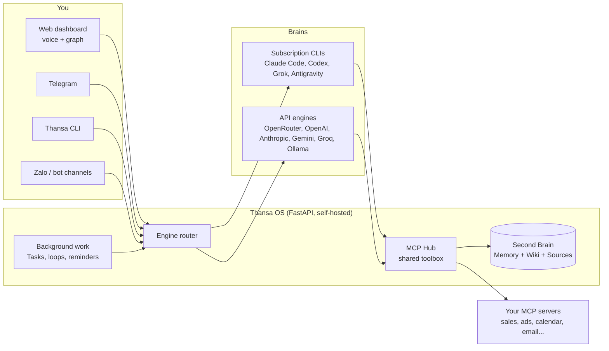

<!-- translated-from: README.md sha256:a93defe7ef8b -->
<div align="center">


# Thansa OS

### Tu agente de IA autoalojado con un cerebro intercambiable y un Second Brain que se vuelve más listo cada día.

Ejecútalo en tu portátil o en un VPS pequeño. Háblale con la voz. Conecta Claude, ChatGPT, Grok, Gemini o cualquiera de 12 proveedores, conserva todas las herramientas cuando cambies de uno a otro y deja que trabaje en segundo plano mientras duermes.

[](https://github.com/xahoapro/thansa-os/stargazers)
[](../../../LICENSE)
[](https://github.com/xahoapro/thansa-os/commits/main)
[](../../../requirements.txt)
[](https://github.com/xahoapro/thansa-os/pkgs/container/javis-os)
[](https://modelcontextprotocol.io)

<!-- flags:start -->
<p align="center">
<b>🌐 Disponible en 12 idiomas</b><br><br>
<a href="../../../README.md"></a>
<a href="../vi/README.md"></a>
<a href="../zh/README.md"></a>

<a href="../ja/README.md"></a>
<a href="../hi/README.md"></a>
<a href="../pt-BR/README.md"></a>
<a href="../ko/README.md"></a>
<a href="../ru/README.md"></a>
<a href="../de/README.md"></a>
<a href="../fr/README.md"></a>
<a href="../id/README.md"></a>
</p>
<!-- flags:end -->

[🇬🇧 English](../../../README.md) · [🇻🇳 Tiếng Việt](../vi/README.md) · [🇨🇳 简体中文](../zh/README.md) · 🇪🇸 **Español** · [🇯🇵 日本語](../ja/README.md) · [🇮🇳 हिन्दी](../hi/README.md) · [🇧🇷 Português](../pt-BR/README.md) · [🇰🇷 한국어](../ko/README.md) · [🇷🇺 Русский](../ru/README.md) · [🇩🇪 Deutsch](../de/README.md) · [🇫🇷 Français](../fr/README.md) · [🇮🇩 Bahasa Indonesia](../id/README.md) · [🌍 Ayuda a traducir](../../../CONTRIBUTING.md#translations)

[Inicio rápido](#-inicio-rápido) · [Por qué Thansa](#-por-qué-thansa) · [Cerebros](#-12-cerebros-un-solo-kit-de-herramientas) · [Funciones](#-funciones) · [Instalación](#-instalación) · [Documentación](../../../docs/en/README.md) · [Apoyo](#-apoya-a-thansa-os)

<br>


</div>

> 🌍 Esta es una traducción automática del README en inglés. Thansa responde en el idioma en el que le escribas; la interfaz, por ahora, está disponible en inglés y vietnamita. La documentación completa está en inglés ([docs/en](../../../docs/en/README.md)). Las correcciones son bienvenidas ([CONTRIBUTING](../../../CONTRIBUTING.md#translations)).

---

## ⚡ Inicio rápido

**La forma fácil: deja que tu propia IA lo instale.** Pásale el enlace de este repositorio a Claude Code o Codex en tu máquina y dile *"instálame Thansa OS"*. Solo necesita ejecutar un comando:

| Máquina | Un solo comando lo instala todo |
|---|---|
| **Linux / macOS** | `git clone https://github.com/xahoapro/thansa-os.git javis && cd javis && chmod +x install.sh && ./install.sh` |
| **Windows** | `git clone https://github.com/xahoapro/thansa-os.git javis; cd javis; powershell -ExecutionPolicy Bypass -File install.ps1` |
| **Docker** | `curl -fsSLO https://raw.githubusercontent.com/xahoapro/thansa-os/main/docker-compose.yml && docker compose up -d` |

Después abre **http://localhost:7777**. El instalador configura Python, los cuatro cerebros CLI de suscripción (`claude`, `codex`, `agy`, `grok`) y un `.env`, y luego arranca el servidor. Inicias sesión en cada cerebro **desde la página Models del panel**, sin tener que escribir más comandos.

> [!NOTE]
> ¿Instalaste otra CLI **después** de que Thansa ya estuviera en marcha? **Reinicia Thansa.** Un proceso en ejecución conserva el PATH con el que arrancó, así que no puede ver una CLI instalada más tarde.

<p align="center">

</p>

---

## 🤔 ¿Por qué Thansa?

Thansa OS **no** es un chatbot. Es una **IA agéntica autoalojada** que se ejecuta en tu propia máquina o VPS: lee y escribe archivos, llama a herramientas mediante MCP, ejecuta skills, encola trabajo en segundo plano y se programa a sí misma. Todo eso está detrás de un **panel controlado por voz** con un **Second Brain** (memoria + wiki) que acumula conocimiento con el tiempo.

### El encierro del que nadie te avisa

Elige una app de IA y úsala a diario durante un año. Luego mira todo lo que se ha ido acumulando dentro:

- **Cientos de conversaciones**, con las decisiones y el contexto que fuiste resolviendo por el camino.
- **Memoria** sobre quién eres, cómo trabajas y qué vende tu negocio.
- **Instrucciones personalizadas, asistentes y proyectos**: know-how que te costó horas afinar.
- **Automatizaciones y agentes** que solo funcionan en esa plataforma.

Todo eso está en los servidores del proveedor, en el formato del proveedor. Y un día sale un modelo mejor en otra parte. Puedes probarlo, pero no puedes llevarte tu trabajo: la app nueva no sabe nada de ti, tus instrucciones no se trasladan y tu historial se queda atrás. Las exportaciones, cuando existen, suelen ser un volcado de registros de chat, no una memoria que otra herramienta pueda aprovechar.

Así que te quedas. No porque el modelo de siempre siga siendo el mejor, sino porque irte significa empezar de cero. Y cuando el proveedor sube los precios, endurece los límites, retira un modelo o bloquea tu cuenta, no hay plan B.

### Thansa le da la vuelta: alquila el modelo, sé dueño del Brain

En Thansa el modelo es una pieza que puedes cambiar. Todo lo que construyes se queda contigo, en archivos que puedes abrir:

| Lo que construyes | Dónde vive | Formato |
|---|---|---|
| **Conversaciones** | `conversations.db` en tu propia máquina o VPS, un único almacén sin importar qué cerebro respondió | SQLite, con búsqueda de texto completo |
| **Memoria sobre ti** | `memory/` en tu Brain: `MEMORY.md` más un archivo por cada dato | Markdown |
| **Conocimiento** | las carpetas Wiki y Sources de tu Brain | Markdown, compatible con Obsidian |
| **Skills** | `skills/<name>/SKILL.md` | Markdown |
| **Agents y workflows** | `agents/*.md`, `workflows/*.md` | Markdown con front matter |
| **Loops y recordatorios** | `Javis/loops/*.md`, `Javis/reminders.json` | Markdown, JSON |

Lo que ganas con eso:

- **¿Sale un modelo nuevo? Cámbialo en la página Models y sigue trabajando.** Lee la misma memoria, ejecuta las mismas skills, agents y workflows, y llama a las mismas conexiones a través del MCP Hub. Nada que migrar, nada que reconstruir.
- **Usa varios cerebros a la vez.** Un modelo potente para la conversación, otro más barato para el trabajo en segundo plano, un modelo local de Ollama para las notas privadas, todos trabajando sobre el mismo Brain.
- **Legible sin Thansa.** Tu Brain es una carpeta de markdown. Ábrela en Obsidian o en cualquier editor. Si Thansa desapareciera mañana, tu conocimiento seguiría ahí, en texto plano.
- **Versionado y portátil.** Cada pasada de aprendizaje es un commit de git que deshaces con un toque, y todo el Brain puede sincronizarse con tu propio repositorio privado de GitHub, compartido entre tu portátil y tu VPS.
- **Tus datos se quedan en tu hardware.** No hay ninguna nube de Thansa de por medio. Cada petición va solo al proveedor de modelos que elegiste para ella, y con un modelo local de Ollama nunca sale de tu máquina.

### Thansa frente a un chatbot corriente

| | Un chatbot corriente | **Thansa OS** |
|---|---|---|
| **Cerebro** | Atado a un solo modelo, una llamada a la API sin estado por mensaje | **Intercambiable**: 12 proveedores, cada uno con el conjunto completo de herramientas, MCP, skills y sesiones, incluidos modelos que se ejecutan en tu propia máquina con Ollama |
| **Memoria** | Lo olvida todo tras cada sesión | **Un Second Brain vivo** que te recuerda y se enriquece con cada conversación |
| **Datos** | Inventados o inexistentes | **Cifras reales** de las conexiones que configures (ventas, anuncios, calendario, correo, mensajería) |
| **Trabajo** | Responde y se queda esperando | **Loops en segundo plano, recordatorios y una cola de tareas gestionada por la IA** que te informan de los resultados |
| **Interfaz** | Un cuadro de chat | Panel + grafo de conocimiento + **voz manos libres** + Telegram + una CLI |
| **Tu trabajo** | Se queda en los servidores del proveedor, en el formato del proveedor | **Archivos planos en tu máquina**: historial, memoria, skills, agents y workflows pasan tal cual a cualquier modelo nuevo |
| **Despliegue** | La nube de otra persona | **Autoalojado**: Hostinger en un clic, Docker o cualquier VPS |

> 💡 **La filosofía: la capacidad vive en Thansa, no en el modelo.** Todos los cerebros reciben la misma caja de herramientas a través de un único hub de conexiones compartido (el MCP Hub). Cambiar de Claude a Gemini no te cuesta nada salvo el acceso a la shell, que solo tienen los motores CLI.

<p align="center">

</p>

---

## 🧠 12 cerebros, un solo kit de herramientas

Elige el cerebro en la página **Models** (Modelos) y cámbialo cuando quieras. Thansa admite hoy **12 proveedores**.

<p align="center">

</p>

| Cerebro | Cómo pagas | Shell, web, subagentes |
|---|---|---|
| **Claude Code** | Tu plan de Claude o una API key de Anthropic | ✅ |
| **ChatGPT** (mediante Codex) | Tu plan de ChatGPT | ✅ |
| **Grok Build** | Tu plan SuperGrok o X Premium+ | ✅ |
| **Antigravity CLI** | Tu plan de Google (la misma oferta de modelos que el IDE Antigravity, Claude incluido) | Shell ✅ |
| **OpenRouter** | API key (cientos de modelos con una sola clave) | con las herramientas de Thansa |
| **OpenAI API** · **Anthropic API** · **Google Gemini** · **Groq** | API key | con las herramientas de Thansa |
| **Ollama Cloud** · **Ollama en esta máquina** | API key, o gratis en tu propio hardware | con las herramientas de Thansa |
| **Cualquier endpoint compatible con OpenAI** | Lo que pida ese endpoint | con las herramientas de Thansa |

Todos los cerebros pueden llamar a tus servidores MCP conectados, leer y escribir en el Brain, ejecutar skills, encolar trabajo en Kanban y crear agents, workflows, loops y recordatorios. Los motores CLI, además, ejecutan **comandos de shell**, **consultan y buscan en la web** y **lanzan subagentes en paralelo**.

> [!WARNING]
> **Lee esto antes de dejar que una suscripción ejecute trabajo en segundo plano.** Anthropic limita Claude Pro/Max al **uso personal ordinario** de Claude Code. La ejecución continua en segundo plano (loops, recordatorios, trabajos de Kanban, chatbots), ejecutarlo en un VPS o que varias personas compartan una misma cuenta quedan fuera de ese ámbito, y **ya se han suspendido cuentas** por ello. Thansa nunca lee tu token de inicio de sesión: ejecuta el binario real de `claude`, pero eso no hace legítimo un uso en segundo plano las 24 horas. Para ir sobre seguro, configura Claude Code para que funcione con una **API key** en la página Models, o apunta el **modelo de trabajo en segundo plano** a otro proveedor. La misma precaución se aplica al plan de xAI. Consulta `server/claude_auth.py`.

---

## ✨ Funciones

<p align="center">

</p>

<table>
<tr>
<td width="50%" valign="top">

### 🗣️ Háblale
- **Voz manos libres**: hablas, Thansa escucha y responde en voz alta (Edge TTS gratis por defecto, u OpenAI y ElevenLabs).
- **Sesiones de chat** que puedes guardar, reabrir y buscar a texto completo. Las sesiones largas se compactan en resúmenes en lugar de cortarse.
- **Telegram, una CLI y un panel web**, todos hablando con el mismo Thansa.
- **Cualquier idioma**: Thansa responde en el idioma en el que escribes. La interfaz viene en inglés y vietnamita.

### 🧠 Recuérdalo todo
- **Second Brain**: un vault de markdown (compatible con Obsidian) con memoria a largo plazo, una Wiki y las Sources en bruto.
- **Grafo de conocimiento** de tus notas unidas por `[[wikilink]]`, sobre un lienzo claro que funciona sin conexión.
- **Autoaprendizaje**: después de cada conversación Thansa destila recuerdos, conocimiento para la wiki y skills. Cada pasada de aprendizaje es un commit de git, así que **se deshace con un toque**.
- **Copia de seguridad en GitHub**: sincronización bidireccional de cada Brain con un repositorio privado, compartido entre tu portátil y tu VPS.

</td>
<td width="50%" valign="top">

### ⚙️ Trabaja mientras duermes
- **Tareas (Kanban)**: entrega un objetivo en lenguaje natural. La IA redacta la especificación, elige un trabajador, lo ejecuta en segundo plano y solo te avisa cuando hay excepciones.
- **Loops y recordatorios**: trabajos en segundo plano por intervalo, a una hora fija o con una expresión cron, cada uno verificando su propio trabajo.
- **Agents y workflows**: asistentes especializados con memoria propia, encadenados en workflows de varios pasos con verificación.
- **Chatbots**: pon un agent delante de tus clientes en su propio bot de Telegram o Zalo, con una bandeja de entrada compartida en la que puedes tomar el control.

### 🔌 Conecta lo que quieras
- **Tienda de conexiones MCP** con varias cuentas por servicio y tres niveles de permisos que Thansa **aplica de forma estricta**.
- **Skills y plugins**: suelta una carpeta para añadir conocimiento práctico (skill) o una herramienta nativa de Python (plugin) para todos los motores.
- **Generación de imágenes** con el plan de ChatGPT en el que ya tienes la sesión iniciada.
- **Seguimiento del uso**: tokens y coste por día y por proveedor, separando lo que escribiste tú de lo que se ejecutó por su cuenta.

</td>
</tr>
</table>

<p align="center">

</p>

<div align="center">


</div>

---

## 🏗️ Cómo funciona



- **Backend:** Python FastAPI en `server/`: motores (`claude_sdk_engine.py`, `claude_cli.py`, `antigravity_cli.py`, `engine.py`, `aux_engine.py`), herramientas (`mcp_hub.py`, `mcp_store.py`, `plugins_host.py`), trabajo en segundo plano (`tasks.py`, `self_improve.py`, `reminders.py`, `learn.py`), idioma y configuración regional (`lang.py`, `lang_registry.py`, `localefmt.py`).
- **Frontend:** HTML/CSS/JS sin más en `dashboard/`. Sin framework y sin paso de compilación, así que sigue siendo ligero en un VPS pequeño. Los textos de la interfaz están en `dashboard/i18n/`.
- **Second Brain:** un vault de markdown en `brains/<brain name>/`.

---

## 🚀 Instalación

> [!IMPORTANT]
> Thansa ejecuta un cerebro de IA con **permisos completos** en la máquina. Cuando se ejecuta de forma pública (Docker, VPS, Hostinger), Thansa **obliga a iniciar sesión por sí solo**: al abrir la app aparece una pantalla para crear una cuenta o iniciar sesión, y nadie puede manejarlo sin contraseña.

<details open>
<summary><b>Opción 1: Hostinger Docker Manager (dominio + HTTPS, en un clic)</b></summary>

VPS de Hostinger → **Docker Manager → Compose → URL** → pega el archivo de Hostinger y pulsa **Deploy**:

```
https://raw.githubusercontent.com/xahoapro/thansa-os/main/docker-compose.hostinger.yml
```

El cuadro **Environment** solo necesita tres campos: `DOMAIN_NAME`, `JAVIS_ADMIN_USER`, `JAVIS_ADMIN_PASSWORD`, más un `JAVIS_AUTO_UPDATE` opcional (ponlo en `true` y Thansa se actualiza solo cada día).

Configura `DOMAIN_NAME` para que el Traefik de Hostinger emita el certificado HTTPS:
- **Enlace gratuito** (sin comprar dominio): `DOMAIN_NAME=javis.<vps-hostname>.hstgr.cloud` (el hostname está en hPanel → VPS, p. ej. `javis.srv1562015.hstgr.cloud`).
- **Tu propio dominio:** `DOMAIN_NAME=example.com` y apunta un registro A a la IP del VPS.

Espera de 1-3 minutos a que llegue el certificado y luego abre `https://<DOMAIN_NAME>`.

**Tres pasos que se hacen una sola vez:**
1. **Haz pública la imagen de GHCR:** GitHub → repositorio → **Packages** → `javis-os` → *Package settings* → Visibility = **Public**.
2. **Crea la cuenta de administrador:** rellena `JAVIS_ADMIN_USER` + `JAVIS_ADMIN_PASSWORD` (recomendado), o abre la app justo después del despliegue y crea una tú mismo. Mientras no exista un administrador, quien abra primero el enlace puede crearlo. Después **activa la 2FA** ([Seguridad y cuentas](../../../docs/en/14-security-and-accounts.md)).
3. **Inicia sesión en un cerebro** en la página **Models**.

Detalles y solución de problemas: [DEPLOY.en.md](../../../DEPLOY.en.md).

</details>

<details>
<summary><b>Opción 2: Docker en cualquier VPS (sin clonar)</b></summary>

```bash
# Docker required (don't have it?  curl -fsSL https://get.docker.com | sh)
mkdir javis && cd javis
curl -fsSLO https://raw.githubusercontent.com/xahoapro/thansa-os/main/docker-compose.yml

docker compose run --rm javis claude auth login --claudeai   # sign in to Claude once (optional)
docker compose up -d                                          # pull the image and run
```

Abre `http://<vps-ip>:7777` y define enseguida el usuario y la contraseña de administrador (al menos 8 caracteres), o predefine `JAVIS_ADMIN_USER` + `JAVIS_ADMIN_PASSWORD` en el entorno. Después activa la 2FA.

Acceso remoto sin dominio: `docker compose --profile tunnel up -d`, y luego `docker compose logs tunnel | grep trycloudflare` muestra un enlace HTTPS.

</details>

<details>
<summary><b>Opción 3: Linux o macOS, sin Docker</b></summary>

```bash
git clone https://github.com/xahoapro/thansa-os.git javis && cd javis
chmod +x install.sh && ./install.sh
```

El script instala Python, Node y los cerebros CLI, crea un venv, registra un servicio que arranca con el sistema y muestra la dirección.

🍎 **macOS, ábrelo como una app:** haz doble clic en `JAVIS OS.app` (o en `Start JAVIS OS.command`). Para arrancar al iniciar sesión: `./bin/javis-autostart.sh install`. Detalles: [bin/README.md](../../../bin/README.md).

</details>

<details>
<summary><b>Opción 4: Windows (equipo personal)</b></summary>

```powershell
git clone https://github.com/xahoapro/thansa-os.git javis; cd javis
powershell -ExecutionPolicy Bypass -File install.ps1
```

`install.ps1` lo hace todo de una pasada: Python, venv y bibliotecas, los cuatro cerebros CLI de suscripción (`claude`, `codex`, `agy`, `grok`), el `.env`, libera el puerto 7777 y arranca el servidor. Termina con una tabla que indica qué cerebros están listos. Sin `winget`, instala primero a mano Python 3.12 (marca "Add python.exe to PATH") y Node.js LTS, y vuelve a ejecutarlo.

```
Run with a visible window (live log):  setup.bat
Run silently from then on:             start-javis.vbs   (log at server\javis.log)
Stop:                                  stop-javis.bat
Dashboard:                             http://localhost:7777
```

🪟 **Ábrelo como una app:** después de la primera ejecución, haz doble clic en **`JAVIS OS.bat`**. El servidor arranca en segundo plano y el panel se abre en **su propia ventana**, con su propia entrada en la barra de tareas. Para arrancar al iniciar sesión: `javis-autostart.bat install` (para quitarlo: `uninstall`).

</details>

<details>
<summary><b>Varias instancias de Thansa en un mismo VPS</b></summary>

Los Brains, los ajustes y las cuentas se mantienen totalmente separados por instancia. Solo cambian tres valores entre ellas: `JAVIS_NAME`, `JAVIS_HOST_PORT`, `DOMAIN_NAME`.

- **Hostinger:** vuelve a desplegar `docker-compose.hostinger.yml` como un segundo stack y rellena esos tres campos.
- **VPS gestionado por ti:** ejecuta una sola vez el proxy compartido `docker-compose.proxy.yml` para toda la máquina y luego dale a cada instancia su propia carpeta con `docker-compose.multi.yml`. El proxy descubre las instancias nuevas y solicita el SSL por sí solo.
- **Nativo:** `JAVIS_NAME=javis-shop JAVIS_PORT=7778 ./install.sh`.

Paso a paso: [DEPLOY.en.md](../../../DEPLOY.en.md).

</details>

### 🎬 Primer arranque

Abre Thansa y el asistente de configuración te guía, en el idioma de tu navegador:

1. **Cuenta de administrador**: obligatoria cuando se ejecuta de forma pública, para mantener fuera a los desconocidos.
2. **Elige un cerebro**: inicia sesión una vez con una suscripción o pega una API key. La tarjeta de Claude Code tiene un interruptor **"Runs on"** para elegir entre tu plan con sesión iniciada y una API key de Anthropic.
3. **Elige un modelo**: cambiar de proveedor más adelante no te hace perder funciones (salvo los comandos de shell, que solo tienen los motores CLI).
4. **Configura las conexiones** (opcional): abre **Connections** (Conexiones), elige un servicio y pega una clave o escanea un código QR. A partir de ahí Thansa informa con cifras reales de ese servicio.

---

## 📖 Usar Thansa

La barra lateral izquierda agrupa las páginas en **6 grupos**. Cada página tiene una guía en [docs/en/](../../../docs/en/README.md).

| Grupo | Páginas | Guías |
|---|---|---|
| **Brain** | Graph, Chat, Files, Self-learning | [Chat y voz](../../../docs/en/02-chat-and-voice.md) · [Grafo de conocimiento](../../../docs/en/03-knowledge-graph.md) · [Sesiones](../../../docs/en/04-sessions.md) · [Gestor de archivos](../../../docs/en/05-file-manager.md) · [Autoaprendizaje](../../../docs/en/22-self-learning.md) |
| **Code** | Terminal, Coding | [Terminal de código](../../../docs/en/27-code-terminal.md) |
| **Capabilities** | Partners (agents y workflows), Chatbot, Skills, Plugins | [Agents y workflows](../../../docs/en/07-agents-and-workflows.md) · [Chatbots](../../../docs/en/25-chatbots.md) · [Conversaciones con clientes](../../../docs/en/28-customer-conversations.md) · [Skills](../../../docs/en/06-skills.md) · [Plugins](../../../docs/en/20-plugins.md) |
| **Work** | Tasks, Scheduled | [Tareas (Kanban)](../../../docs/en/21-kanban-work.md) · [Trabajos periódicos y recordatorios](../../../docs/en/08-recurring-jobs.md) |
| **Connections** | Connections, Thansa Store, Channels, Models | [Conexiones y datos del negocio](../../../docs/en/09-connections-and-business-data.md) · [Telegram](../../../docs/en/11-telegram.md) · [Zalo](../../../docs/en/12-zalo-agent-mcp.md) · [Modelos y motores](../../../docs/en/10-models-and-engines.md) |
| **System** | Settings, Share links, Account | [Primeros pasos](../../../docs/en/01-getting-started.md) · [Seguridad y cuentas](../../../docs/en/14-security-and-accounts.md) · [Uso y coste](../../../docs/en/23-usage-and-cost.md) · [Thansa CLI](../../../docs/en/24-cli.md) |

Más: [Second Brain: memoria, Wiki e INGEST](../../../docs/en/13-second-brain.md) · [Copia de seguridad en GitHub](../../../docs/en/18-github-backup.md) · [Tareas y Dataview en las notas](../../../docs/en/19-tasks-and-dataview.md) · [Marca y dominios propios](../../../docs/en/15-branding-and-domains.md) · [Solución de problemas](../../../docs/en/17-troubleshooting.md)

### Algunas cosas para probar

- **Pide cifras:** *"¿Cómo van las ventas hoy comparadas con ayer?"* Thansa llama a la conexión adecuada y responde con cifras reales y sugerencias.
- **Digiere conocimiento:** suelta un archivo o una nota. Thansa lo resume, extrae ideas clave, lo escribe en la Wiki y propone tareas.
- **Delega trabajo en segundo plano:** **Tasks** → **+ Assign goal** → *"resume las ventas de esta semana, encuentra el stock que rota poco y redacta tres textos para impulsarlo"*. La IA lo especifica, lo ejecuta y te informa del resultado.
- **Programa algo:** *"recuérdame cada día laborable a las 8:30 que revise el presupuesto de anuncios"*, en el chat o en la página **Scheduled** (Programados).
- **Usa la voz:** pulsa el micrófono (o activa el modo manos libres), habla y Thansa responde en voz alta.

<div align="center">

<br><sub>También funciona en tu teléfono: añádelo a la pantalla de inicio y se abre como una app.</sub>
</div>

---

## ⚙️ Configuración (`.env`)

Todas las líneas pueden quedarse vacías y Thansa sigue funcionando. Copia `env.example` → `.env` y añade lo que necesites. La lista completa, con una explicación de cada variable, está en [docs/en/16-env-configuration.md](../../../docs/en/16-env-configuration.md).

| Variable | Significado | Valor por defecto |
|---|---|---|
| `JAVIS_HOST` | Dirección de escucha. `127.0.0.1` = solo esta máquina, `0.0.0.0` = pública | `127.0.0.1` |
| `JAVIS_PORT` | Puerto | `7777` |
| `JAVIS_REQUIRE_LOGIN` | `1`/`0` para forzar el inicio de sesión o desactivarlo (por defecto: activado cuando escucha de forma pública) | *(auto)* |
| `JAVIS_ADMIN_USER` / `JAVIS_ADMIN_PASSWORD` | Crea el administrador durante el despliegue | - |
| `JAVIS_ALLOWED_HOSTS` | Hostnames adicionales en la lista de permitidos (protección contra CSRF y DNS rebinding) | localhost + tu dominio |
| `JAVIS_STATE_DIR` | Dónde se guardan los ajustes, las sesiones y la clave de cifrado | `server/` (Docker: `/data/state`) |
| `BRAINS_DIR` | Carpeta principal que contiene todos los Brains | `brains/` (Docker: `/brains`) |
| `JAVIS_ENABLE_USER_PLUGINS` | `true` permite que se ejecuten tus propios plugins (Python real dentro del servidor) | *(desactivado)* |
| `TTS_VOICE` / `TTS_RATE` | Voz y velocidad de Edge TTS | `en-US-EmmaMultilingualNeural` / `+5%` |

---

## 🔐 Seguridad

- **El inicio de sesión es obligatorio** en un servidor público antes de que funcione cualquier función, porque el cerebro se ejecuta con permisos completos en la máquina.
- **2FA (TOTP)**, límite de intentos de inicio de sesión, contraseñas de al menos 8 caracteres, cookies `Secure` bajo HTTPS y sesiones que caducan a los 30 días.
- **Protección contra CSRF y DNS rebinding**: se rechaza cualquier petición de escritura procedente de un origen desconocido.
- **Los secretos se cifran** en `settings.json` (API keys, tokens OAuth, tokens de bots) con una clave propia de cada máquina.
- **Tus propios plugins están bloqueados por defecto** hasta que definas `JAVIS_ENABLE_USER_PLUGINS=true`.
- **Los permisos de las conexiones los aplica** el hub, no el modelo: una cuenta de solo lectura no puede usarse para enviar, pagar ni publicar.

¿Has encontrado una vulnerabilidad? Sigue [SECURITY.md](../../../SECURITY.md) en lugar de abrir un issue público.

---

## 🔄 Actualización

En la app: **Settings → Updates → Update now**, con una barra de progreso y un botón para revertir si la nueva versión falla. En un VPS: `cd javis && ./update.sh` (descarga la nueva imagen y reinicia; tus datos en los volúmenes se conservan).

---

## 🩺 Solución de problemas

| Síntoma | Qué hacer |
|---|---|
| La página Models dice que una CLI no está instalada, pero sí lo está | **Reinicia Thansa**: el proceso en ejecución conserva el PATH del momento en que arrancó. |
| El puerto 7777 está ocupado y la nueva versión no arranca | Detén primero el proceso antiguo (`stop-javis.bat`, o mata el PID) y vuelve a arrancar. |
| Hostinger no puede descargar la imagen | Pon el paquete de GHCR en **Public** y espera a que termine la compilación de GitHub Actions. |
| Un cerebro dice que no tiene la sesión iniciada | **Models** → la tarjeta de ese proveedor → iniciar sesión. |

Más en [docs/en/17-troubleshooting.md](../../../docs/en/17-troubleshooting.md).

---

## 📂 Estructura del repositorio

```
javis-os/
├── server/          # FastAPI backend: engines, connections, background work, channels, memory
├── dashboard/       # Frontend (plain JS, no build step)
│   └── i18n/        # Interface strings, one JSON file per language
├── brains/          # Every Second Brain (default: brains/Brain Default)
├── system/          # Ships with the app: bundled plugins, system skills, connection catalogue
├── docs/            # User guides (docs/en/ in English) and translations (docs/i18n/)
├── tests/           # Python + JS test suite (python tests/run.py)
├── install.sh · install.ps1 · update.sh
├── Dockerfile · docker-compose*.yml
└── CLAUDE.md        # The system prompt Thansa runs on
```

---

## 🌍 Idiomas

| Qué | Idiomas disponibles hoy |
|---|---|
| **Respuestas de Thansa** | Cualquier idioma: responde en el idioma en el que escribes, o en el que fijes en Settings |
| **Panel y mensajes del servidor** | 🇬🇧 English · 🇻🇳 Tiếng Việt, por dispositivo: cada navegador tiene su propio idioma hasta que eliges uno |
| **Tienda de conexiones, plugins, archivos iniciales de un Brain nuevo** | 🇬🇧 English · 🇻🇳 Tiếng Việt |
| **README y guía de inicio rápido** | 🇬🇧 English · 🇻🇳 Tiếng Việt · 🇨🇳 简体中文 · 🇪🇸 Español · 🇯🇵 日本語 · 🇮🇳 हिन्दी · 🇧🇷 Português · 🇰🇷 한국어 · 🇷🇺 Русский · 🇩🇪 Deutsch · 🇫🇷 Français · 🇮🇩 Bahasa Indonesia |
| **Documentación completa** | 🇬🇧 English · 🇻🇳 Tiếng Việt |

Añadir un idioma es un cambio de datos, no de código: una entrada en `server/lang_registry.py` más un `dashboard/i18n/<code>.json` y, opcionalmente, `system/mcp-catalog.<code>.json`. Todo lo que aún no está traducido se muestra en inglés. Consulta [CONTRIBUTING.md](../../../CONTRIBUTING.md#translations) si quieres ayudar.

---

## 🤝 Contribuir

Los informes de errores, las ideas, las traducciones y los pull requests son bienvenidos, en inglés o en vietnamita.

| Empieza aquí | Qué te aporta |
|---|---|
| [CONTRIBUTING.md](../../../CONTRIBUTING.md) | Preparar el entorno, ejecutar los tests (`python tests/run.py`) y las convenciones de código |
| [ARCHITECTURE.md](../../../ARCHITECTURE.md) | Cómo encajan las piezas y un mapa de los módulos del servidor |
| [docs/dev/GLOSSARY.md](../../../docs/dev/GLOSSARY.md) | El código se escribió en vietnamita: aquí se descifran nombres como `nhac_hen` (recordatorio) |
| [docs/dev/adding-a-language.md](../../../docs/dev/adding-a-language.md) | Traducir Thansa a tu idioma, paso a paso |
| [Plantillas de issues](https://github.com/xahoapro/thansa-os/issues/new/choose) | Informe de error, petición de función, oferta de traducción |

Sigue el [Código de conducta](../../../CODE_OF_CONDUCT.md) e informa de los problemas de seguridad en privado, como se describe en [SECURITY.md](../../../SECURITY.md).

Si Thansa te resulta útil, una ⭐ en el repositorio ayuda a que otras personas lo encuentren.

[](https://star-history.com/#xahoapro/thansa-os&Date)

---

## 🙏 Créditos

- **Cerebros:** [Claude Code](https://claude.com/claude-code) y el [Claude Agent SDK](https://docs.claude.com/en/api/agent-sdk/overview) (Anthropic), [Codex CLI](https://developers.openai.com/codex/cli) (OpenAI), [Grok Build](https://x.ai) (xAI), [Antigravity](https://antigravity.google) (Google), además de las API de [OpenRouter](https://openrouter.ai), OpenAI, [Google Gemini](https://ai.google.dev), Anthropic, [Groq](https://groq.com) y [Ollama](https://ollama.com).
- **Estándar de herramientas:** [Model Context Protocol](https://modelcontextprotocol.io). Toda la tienda de conexiones de Thansa funciona sobre él.
- Los patrones del Second Brain y del Bullet Journal digital.

## 📄 Licencia

Código abierto bajo la **licencia MIT**: úsalo, modifícalo y distribúyelo libremente, solo conserva el aviso de copyright. Consulta [LICENSE](../../../LICENSE).

---

## ☕ Apoya a Thansa OS

Thansa OS es gratuito y de código abierto, y sigue siendo una sola persona la que escribe el código y paga los servidores de pruebas. Si Thansa te ayuda en el trabajo o en la vida, una pequeña donación compra más tiempo para corregir errores y añadir funciones nuevas.

- 🌍 **PayPal**: [paypal.me/quy01](https://paypal.me/quy01)
- 🏦 **MB Bank** (Vietnam): `6636966369`
- 📱 **Monedero MoMo** (Vietnam): `0372752740`

¿No puedes donar? Usar Thansa, enviar comentarios o abrir un pull request también cuenta como apoyo.

<div align="center">
<br>
Hecho con ☕ en Vietnam por <b><a href="https://tradingauto.org">Duy Quang</a></b>
</div>
