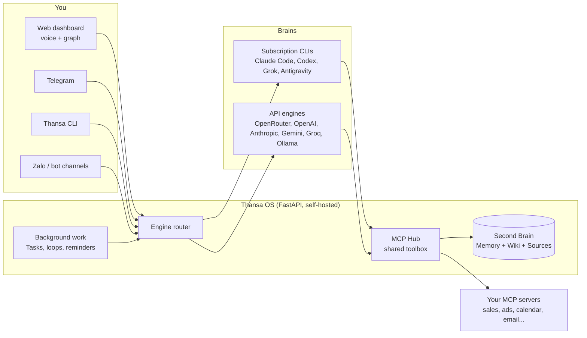

<!-- translated-from: README.md sha256:2e10ad3d2a86 -->
<div align="center">


# Thansa OS

### Votre agent IA auto-hébergé, avec un cerveau interchangeable et un Second Brain qui devient plus intelligent chaque jour.

Lancez-le sur votre ordinateur portable ou sur un petit VPS. Parlez-lui à voix haute. Branchez Claude, ChatGPT, Grok, Gemini ou n'importe lequel de 12 fournisseurs, gardez tous vos outils quand vous en changez, et laissez-le travailler en arrière-plan pendant que vous dormez.

[](https://github.com/xahoapro/thansa-os/stargazers)
[](../../../LICENSE)
[](https://github.com/xahoapro/thansa-os/commits/main)
[](../../../requirements.txt)
[](https://github.com/xahoapro/thansa-os/pkgs/container/javis-os)
[](https://modelcontextprotocol.io)

<!-- flags:start -->
<p align="center">
<b>🌐 Disponible en 12 langues</b><br><br>
<a href="../../../README.md"></a>
<a href="../vi/README.md"></a>
<a href="../zh/README.md"></a>
<a href="../es/README.md"></a>
<a href="../ja/README.md"></a>
<a href="../hi/README.md"></a>
<a href="../pt-BR/README.md"></a>
<a href="../ko/README.md"></a>
<a href="../ru/README.md"></a>
<a href="../de/README.md"></a>

<a href="../id/README.md"></a>
</p>
<!-- flags:end -->

[🇬🇧 English](../../../README.md) · [🇻🇳 Tiếng Việt](../vi/README.md) · [🇨🇳 简体中文](../zh/README.md) · [🇪🇸 Español](../es/README.md) · [🇯🇵 日本語](../ja/README.md) · [🇮🇳 हिन्दी](../hi/README.md) · [🇧🇷 Português](../pt-BR/README.md) · [🇰🇷 한국어](../ko/README.md) · [🇷🇺 Русский](../ru/README.md) · [🇩🇪 Deutsch](../de/README.md) · 🇫🇷 **Français** · [🇮🇩 Bahasa Indonesia](../id/README.md) · [🌍 Aider à traduire](../../../CONTRIBUTING.md#translations)

[Démarrage rapide](#-démarrage-rapide) · [Pourquoi Thansa](#-pourquoi-thansa-) · [Cerveaux](#-12-cerveaux-une-seule-boîte-à-outils) · [Fonctionnalités](#-fonctionnalités) · [Installation](#-installation) · [Documentation](../../../docs/en/README.md) · [Soutien](#-soutenir-thansa-os)

<br>


</div>

> 🌍 Ceci est une traduction automatique du README anglais. Thansa vous répond dans la langue dans laquelle vous lui écrivez ; l'interface est pour l'instant disponible en anglais et en vietnamien. La documentation complète est en anglais ([docs/en](../../../docs/en/README.md)). Les corrections sont les bienvenues ([CONTRIBUTING](../../../CONTRIBUTING.md#translations)).

---

## ⚡ Démarrage rapide

**La méthode simple : laissez votre propre IA l'installer.** Donnez le lien de ce dépôt à Claude Code ou à Codex sur votre machine et dites *"installe-moi Thansa OS"*. Il lui suffit d'exécuter une seule commande :

| Machine | Une seule commande installe tout |
|---|---|
| **Linux / macOS** | `git clone https://github.com/xahoapro/thansa-os.git && cd thansa-os && chmod +x install.sh && ./install.sh` |
| **Windows** | `git clone https://github.com/xahoapro/thansa-os.git; cd thansa-os; powershell -ExecutionPolicy Bypass -File install.ps1` |
| **Docker** | `curl -fsSLO https://raw.githubusercontent.com/xahoapro/thansa-os/main/docker-compose.yml && docker compose up -d` |

Ouvrez ensuite **http://localhost:7777**. L'installateur met en place Python, les quatre cerveaux CLI par abonnement (`claude`, `codex`, `agy`, `grok`) et un `.env`, puis démarre le serveur. Vous vous connectez à chaque cerveau **depuis la page Models du tableau de bord**, sans plus taper de commandes.

> [!NOTE]
> Vous avez installé une CLI supplémentaire **après** le démarrage de Thansa ? **Redémarrez Thansa.** Un processus en cours d'exécution garde le PATH avec lequel il a démarré, il ne peut donc pas voir une CLI installée plus tard.

<p align="center">

</p>

---

## 🤔 Pourquoi Thansa ?

Thansa OS **n'est pas** un chatbot. C'est une **IA agentique auto-hébergée** qui tourne sur votre propre machine ou votre VPS : elle lit et écrit des fichiers, appelle des outils via MCP, exécute des skills, met du travail en file d'attente en arrière-plan et se programme elle-même. Tout cela se trouve derrière un **tableau de bord pilotable à la voix**, avec un **Second Brain** (mémoire + wiki) qui accumule des connaissances au fil du temps.

### Le verrouillage dont personne ne vous parle

Choisissez une application d'IA et utilisez-la tous les jours pendant un an. Puis regardez ce qui s'y est accumulé :

- **Des centaines de conversations**, avec les décisions et le contexte que vous avez construits en chemin.
- **Une mémoire** de qui vous êtes, de votre façon de travailler et de ce que vend votre entreprise.
- **Des instructions personnalisées, des assistants et des projets** : un savoir-faire que vous avez mis des heures à peaufiner.
- **Des automatisations et des agents** qui ne tournent que sur cette seule plateforme.

Tout cela se trouve sur les serveurs du fournisseur, dans le format du fournisseur. Puis un meilleur modèle sort ailleurs. Vous pouvez l'essayer, mais pas emporter votre travail avec vous : la nouvelle application ne sait rien de vous, vos instructions ne suivent pas et votre historique reste derrière. Les exports, quand ils existent, ne sont le plus souvent qu'un vidage de journaux de chat, pas une mémoire qu'un autre outil saurait exploiter.

Alors vous restez. Non pas parce que l'ancien modèle est toujours le meilleur, mais parce que partir signifie repartir de zéro. Et le jour où le fournisseur augmente ses prix, resserre ses limites, retire un modèle ou bloque votre compte, il n'y a pas de plan B.

### Thansa renverse la logique : louez le modèle, possédez le Brain

Dans Thansa, le modèle est une pièce que vous pouvez remplacer. Tout ce que vous construisez reste chez vous, sous forme de fichiers que vous pouvez ouvrir :

| Ce que vous construisez | Où ça se trouve | Format |
|---|---|---|
| **Conversations** | `conversations.db` sur votre propre machine ou votre VPS, un seul stockage quel que soit le cerveau qui a répondu | SQLite, avec recherche plein texte |
| **Mémoire à votre sujet** | `memory/` dans votre Brain : `MEMORY.md` plus un fichier par fait | Markdown |
| **Connaissances** | les dossiers Wiki et Sources de votre Brain | Markdown, compatible Obsidian |
| **Skills** | `skills/<name>/SKILL.md` | Markdown |
| **Agents et workflows** | `agents/*.md`, `workflows/*.md` | Markdown avec front matter |
| **Loops et rappels** | `Javis/loops/*.md`, `Javis/reminders.json` | Markdown, JSON |

Ce que cela vous apporte :

- **Un nouveau modèle sort ? Changez-en sur la page Models et continuez.** Il lit la même mémoire, exécute les mêmes skills, agents et workflows, et appelle les mêmes connexions via le MCP Hub. Rien à migrer, rien à reconstruire.
- **Utilisez plusieurs cerveaux à la fois.** Un modèle puissant pour la conversation, un moins cher pour le travail en arrière-plan, un modèle Ollama local pour les notes privées, tous au travail sur le même Brain.
- **Lisible sans Thansa.** Votre Brain est un dossier de fichiers markdown. Ouvrez-le dans Obsidian ou dans n'importe quel éditeur. Si Thansa disparaissait demain, vos connaissances seraient toujours là, en texte brut.
- **Versionné et portable.** Chaque passe d'apprentissage est un commit git que vous pouvez annuler d'un geste, et tout le Brain peut se synchroniser avec votre propre dépôt GitHub privé, partagé entre votre ordinateur portable et votre VPS.
- **Vos données restent sur votre matériel.** Aucun cloud Thansa ne s'intercale. Une requête ne part que vers le fournisseur de modèle que vous avez choisi pour elle, et avec un modèle Ollama local, elle ne quitte jamais votre machine.

### Thansa face à un chatbot ordinaire

| | Un chatbot ordinaire | **Thansa OS** |
|---|---|---|
| **Cerveau** | Lié à un seul modèle, un appel d'API sans état par message | **Interchangeable** : 12 fournisseurs, chacun avec l'ensemble complet des outils, MCP, skills et sessions, y compris des modèles qui tournent sur votre propre machine via Ollama |
| **Mémoire** | Oublie tout après chaque session | **Un Second Brain vivant** qui se souvient de vous et s'enrichit à chaque conversation |
| **Données** | Inventées, ou absentes | **De vrais chiffres** issus des connexions que vous branchez (ventes, publicité, agenda, e-mail, messagerie) |
| **Travail** | Répond, puis attend | **Loops en arrière-plan, rappels et une file de tâches pilotée par l'IA** qui vous rendent compte |
| **Interface** | Une zone de chat | Tableau de bord + graphe de connaissances + **voix mains libres** + Telegram, Slack, WhatsApp, Zalo + une CLI |
| **Votre travail** | Reste sur les serveurs du fournisseur, dans le format du fournisseur | **De simples fichiers sur votre machine** : historique, mémoire, skills, agents et workflows vous suivent vers n'importe quel nouveau modèle |
| **Déploiement** | Le cloud de quelqu'un d'autre | **Auto-hébergé** : Hostinger en un clic, Docker, ou n'importe quel VPS |

> 💡 **La philosophie : les capacités vivent dans Thansa, pas dans le modèle.** Chaque cerveau reçoit la même boîte à outils via un hub de connexions partagé unique (le MCP Hub). Passer de Claude à Gemini ne vous coûte rien, sauf l'accès au shell, que seuls les moteurs CLI possèdent.

<p align="center">

</p>

---

## 🧠 12 cerveaux, une seule boîte à outils

Choisissez le cerveau sur la page **Models** et changez-en quand vous voulez. Thansa prend en charge **12 fournisseurs** aujourd'hui.

<p align="center">

</p>

| Cerveau | Comment vous payez | Shell, web, sous-agents |
|---|---|---|
| **Claude Code** | Votre abonnement Claude, ou une clé d'API Anthropic | ✅ |
| **ChatGPT** (via Codex) | Votre abonnement ChatGPT | ✅ |
| **Grok Build** | Votre abonnement SuperGrok ou X Premium+ | ✅ |
| **Antigravity CLI** | Votre abonnement Google (même gamme de modèles que l'IDE Antigravity, Claude compris) | Shell ✅ |
| **OpenRouter** | Clé d'API (des centaines de modèles derrière une seule clé) | via les outils de Thansa |
| **OpenAI API** · **Anthropic API** · **Google Gemini** · **Groq** | Clé d'API | via les outils de Thansa |
| **Ollama Cloud** · **Ollama sur cette machine** | Clé d'API, ou gratuit sur votre propre matériel | via les outils de Thansa |
| **Tout endpoint compatible OpenAI** | Ce que cet endpoint exige | via les outils de Thansa |

Chaque cerveau peut appeler vos serveurs MCP connectés, lire et écrire dans le Brain, exécuter des skills, mettre du travail en file dans le Kanban, et créer des agents, des workflows, des loops et des rappels. Les moteurs CLI peuvent en plus exécuter des **commandes shell**, **récupérer des pages et chercher sur le web**, et **lancer des sous-agents en parallèle**.

> [!WARNING]
> **Lisez ceci avant de laisser un abonnement exécuter du travail en arrière-plan.** Anthropic limite Claude Pro/Max à un **usage personnel ordinaire** de Claude Code. L'exécution continue en arrière-plan (loops, rappels, tâches Kanban, chatbots), l'exécution sur un VPS ou le partage d'un même compte entre plusieurs personnes sortent de ce cadre, et des comptes **ont déjà été suspendus** pour cette raison. Thansa ne lit jamais votre jeton de connexion : il exécute le vrai binaire `claude`, mais cela ne rend pas légitime un usage en arrière-plan 24 h sur 24. Par précaution, configurez Claude Code pour qu'il tourne avec une **clé d'API** sur la page Models, ou dirigez le **modèle de travail en arrière-plan** vers un autre fournisseur. La même prudence s'applique à l'abonnement xAI. Voir `server/claude_auth.py`.

---

## ✨ Fonctionnalités

<p align="center">

</p>

<table>
<tr>
<td width="50%" valign="top">

### 🗣️ Parlez-lui
- **Voix mains libres** : vous parlez, Thansa écoute et répond à voix haute (Edge TTS gratuit par défaut, ou OpenAI et ElevenLabs).
- **Sessions de chat** que vous pouvez enregistrer, rouvrir et parcourir en recherche plein texte. Les longues sessions sont condensées en résumés au lieu d'être coupées.
- **Telegram, Slack, WhatsApp, Zalo, une CLI et un tableau de bord web**, qui parlent tous au même Thansa ([configuration de Slack et WhatsApp](../../../docs/en/29-slack-whatsapp.md)).
- **N'importe quelle langue** : Thansa répond dans la langue dans laquelle vous écrivez. L'interface est livrée en anglais et en vietnamien.

### 🧠 Retenez tout
- **Second Brain** : un coffre markdown (compatible Obsidian) avec une mémoire à long terme, un Wiki et des Sources brutes.
- **Graphe de connaissances** de vos notes reliées par `[[wikilink]]`, sur un canevas clair qui fonctionne hors ligne.
- **Auto-apprentissage** : après chaque conversation, Thansa distille des souvenirs, des connaissances de wiki et des skills. Chaque passe d'apprentissage est un commit git, donc **annulable d'un geste**.
- **Sauvegarde sur GitHub** : synchronisation bidirectionnelle de chaque Brain vers un dépôt privé, partagé entre votre ordinateur portable et votre VPS.

</td>
<td width="50%" valign="top">

### ⚙️ Travaillez pendant votre sommeil
- **Tâches (Kanban)** : confiez un objectif en langage courant. L'IA rédige la spécification, choisit un exécutant, le lance en arrière-plan et ne vous sollicite qu'en cas d'exception.
- **Loops et rappels** : des tâches de fond à intervalle régulier, à heure fixe ou selon une expression cron, chacune vérifiant son propre travail.
- **Agents et workflows** : des assistants spécialisés avec leur propre mémoire, enchaînés en workflows à plusieurs étapes avec vérification.
- **Chatbots** : placez un agent face à vos clients sur son propre bot Telegram, Slack, WhatsApp ou Zalo, avec une boîte de réception partagée dont vous pouvez reprendre la main.

### 🔌 Connectez tout
- **Boutique de connexions MCP** avec plusieurs comptes par service et trois niveaux de permission que Thansa **applique strictement**.
- **Skills et plugins** : déposez un dossier pour ajouter un savoir-faire (skill) ou un outil Python natif (plugin) pour tous les moteurs.
- **Génération d'images** sur l'abonnement ChatGPT auquel vous êtes déjà connecté.
- **Suivi de la consommation** : tokens et coût par jour, par fournisseur, en distinguant ce que vous avez tapé de ce qui a tourné tout seul.

</td>
</tr>
</table>

<p align="center">

</p>

<div align="center">


</div>

---

## 🏗️ Comment ça marche



- **Backend :** Python FastAPI dans `server/` : moteurs (`claude_sdk_engine.py`, `claude_cli.py`, `antigravity_cli.py`, `engine.py`, `aux_engine.py`), outils (`mcp_hub.py`, `mcp_store.py`, `plugins_host.py`), travail en arrière-plan (`tasks.py`, `self_improve.py`, `reminders.py`, `learn.py`), langue et paramètres régionaux (`lang.py`, `lang_registry.py`, `localefmt.py`).
- **Frontend :** du HTML/CSS/JS simple dans `dashboard/`. Aucun framework ni étape de build, pour rester léger sur un petit VPS. Les textes de l'interface se trouvent dans `dashboard/i18n/`.
- **Second Brain :** un coffre markdown dans `brains/<brain name>/`.

---

## 🚀 Installation

> [!IMPORTANT]
> Thansa fait tourner un cerveau d'IA avec **tous les droits** sur la machine. Lorsqu'il est exposé publiquement (Docker, VPS, Hostinger), Thansa **impose la connexion de lui-même** : à l'ouverture de l'application, un écran de création de compte ou de connexion s'affiche, et personne ne peut le piloter sans mot de passe.

<details open>
<summary><b>Option 1 : Hostinger Docker Manager (domaine + HTTPS, en un clic)</b></summary>

VPS Hostinger → **Docker Manager → Compose → URL** → collez le fichier Hostinger et cliquez sur **Deploy** :

```
https://raw.githubusercontent.com/xahoapro/thansa-os/main/docker-compose.hostinger.yml
```

Le champ **Environment** n'a besoin que de trois valeurs : `DOMAIN_NAME`, `JAVIS_ADMIN_USER`, `JAVIS_ADMIN_PASSWORD`, plus un `JAVIS_AUTO_UPDATE` facultatif (mettez-le à `true` et Thansa se met à jour tout seul chaque jour).

Renseignez `DOMAIN_NAME` pour que le Traefik de Hostinger délivre le HTTPS :
- **Lien gratuit** (sans acheter de domaine) : `DOMAIN_NAME=javis.<vps-hostname>.hstgr.cloud` (le hostname se trouve dans hPanel → VPS, par ex. `javis.srv1562015.hstgr.cloud`).
- **Votre propre domaine :** `DOMAIN_NAME=example.com` et faites pointer un enregistrement A vers l'IP du VPS.

Attendez 1-3 minutes pour le certificat, puis ouvrez `https://<DOMAIN_NAME>`.

**Trois étapes à faire une seule fois :**
1. **Rendre l'image GHCR publique :** GitHub → dépôt → **Packages** → `javis-os` → *Package settings* → Visibility = **Public**.
2. **Créer le compte administrateur :** renseignez `JAVIS_ADMIN_USER` + `JAVIS_ADMIN_PASSWORD` (recommandé), ou ouvrez l'application juste après le déploiement et créez-en un vous-même. Tant qu'aucun administrateur n'existe, la première personne qui ouvre le lien peut le créer. Ensuite, **activez la 2FA** ([Sécurité et comptes](../../../docs/en/14-security-and-accounts.md)).
3. **Se connecter à un cerveau** sur la page **Models**.

Détails et dépannage : [DEPLOY.en.md](../../../DEPLOY.en.md).

</details>

<details>
<summary><b>Option 2 : Docker sur n'importe quel VPS (sans cloner)</b></summary>

```bash
# Docker required (don't have it?  curl -fsSL https://get.docker.com | sh)
mkdir thansa && cd thansa
curl -fsSLO https://raw.githubusercontent.com/xahoapro/thansa-os/main/docker-compose.yml

docker compose run --rm javis claude auth login --claudeai   # sign in to Claude once (optional)
docker compose up -d                                          # pull the image and run
```

Ouvrez `http://<vps-ip>:7777` et définissez tout de suite le nom d'utilisateur et le mot de passe administrateur (au moins 8 caractères), ou prédéfinissez `JAVIS_ADMIN_USER` + `JAVIS_ADMIN_PASSWORD` dans l'environnement. Activez ensuite la 2FA.

Accès à distance sans domaine : `docker compose --profile tunnel up -d`, puis `docker compose logs tunnel | grep trycloudflare` affiche un lien HTTPS.

</details>

<details>
<summary><b>Option 3 : Linux ou macOS, sans Docker</b></summary>

```bash
git clone https://github.com/xahoapro/thansa-os.git && cd thansa-os
chmod +x install.sh && ./install.sh
```

Le script installe Python, Node et les cerveaux CLI, crée un venv, enregistre un service qui démarre au boot et affiche l'adresse.

🍎 **macOS, l'ouvrir comme une application :** double-cliquez sur `Thansa OS.app` (ou `Start Thansa OS.command`). Démarrage à l'ouverture de session : `./bin/thansa-autostart.sh install`. Détails : [bin/README.md](../../../bin/README.md).

</details>

<details>
<summary><b>Option 4 : Windows (machine personnelle)</b></summary>

```powershell
git clone https://github.com/xahoapro/thansa-os.git; cd thansa-os
powershell -ExecutionPolicy Bypass -File install.ps1
```

`install.ps1` fait tout en une seule passe : Python, venv et bibliothèques, les quatre cerveaux CLI par abonnement (`claude`, `codex`, `agy`, `grok`), le `.env`, la libération du port 7777 et le démarrage du serveur. Il se termine par un tableau indiquant quels cerveaux sont prêts. Sans `winget`, installez d'abord à la main Python 3.12 (cochez "Add python.exe to PATH") et Node.js LTS, puis relancez-le.

```
Run with a visible window (live log):  setup.bat
Run silently from then on:             start-thansa.vbs   (log at server\thansa.log)
Stop:                                  stop-thansa.bat
Dashboard:                             http://localhost:7777
```

🪟 **L'ouvrir comme une application :** après le premier lancement, double-cliquez sur **`Thansa OS.bat`**. Le serveur démarre en arrière-plan et le tableau de bord s'ouvre dans **sa propre fenêtre**, avec sa propre entrée dans la barre des tâches. Démarrage à l'ouverture de session : `thansa-autostart.bat install` (pour le retirer : `uninstall`).

</details>

<details>
<summary><b>Plusieurs instances de Thansa sur un même VPS</b></summary>

Les Brains, les réglages et les comptes restent entièrement séparés d'une instance à l'autre. Seules trois valeurs diffèrent entre elles : `JAVIS_NAME`, `JAVIS_HOST_PORT`, `DOMAIN_NAME`.

- **Hostinger :** déployez de nouveau `docker-compose.hostinger.yml` comme deuxième stack et renseignez ces trois champs.
- **VPS géré par vous-même :** lancez une fois pour toute la machine le proxy partagé `docker-compose.proxy.yml`, puis donnez à chaque instance son propre dossier avec `docker-compose.multi.yml`. Le proxy détecte les nouvelles instances et demande les certificats SSL tout seul.
- **Natif :** `JAVIS_NAME=thansa-shop JAVIS_PORT=7778 ./install.sh`.

Pas à pas : [DEPLOY.en.md](../../../DEPLOY.en.md).

</details>

### 🎬 Premier lancement

Ouvrez Thansa et l'assistant de configuration vous guide, dans la langue de votre navigateur :

1. **Compte administrateur** : obligatoire en cas d'exposition publique, pour tenir les inconnus à l'écart.
2. **Choisir un cerveau** : connectez-vous une fois avec un abonnement, ou collez une clé d'API. La carte Claude Code dispose d'un sélecteur **"Runs on"** pour basculer entre votre abonnement connecté et une clé d'API Anthropic.
3. **Choisir un modèle** : changer de fournisseur plus tard ne fait perdre aucune fonctionnalité (sauf les commandes shell, que seuls les moteurs CLI possèdent).
4. **Brancher des connexions** (facultatif) : ouvrez **Connections** (Connexions), choisissez un service et collez une clé ou scannez un QR code. Thansa s'appuie ensuite sur ses vrais chiffres pour ses rapports.

---

## 📖 Utiliser Thansa

Le rail de gauche regroupe les pages en **6 groupes**. Chaque page dispose d'un guide dans [docs/en/](../../../docs/en/README.md).

| Groupe | Pages | Guides |
|---|---|---|
| **Brain** | Graph, Chat, Files, Self-learning | [Chat et voix](../../../docs/en/02-chat-and-voice.md) · [Graphe de connaissances](../../../docs/en/03-knowledge-graph.md) · [Sessions](../../../docs/en/04-sessions.md) · [Gestionnaire de fichiers](../../../docs/en/05-file-manager.md) · [Auto-apprentissage](../../../docs/en/22-self-learning.md) |
| **Code** | Terminal, Coding | [Terminal de code](../../../docs/en/27-code-terminal.md) |
| **Capabilities** | Partners (agents et workflows), Chatbot, Skills, Plugins | [Agents et workflows](../../../docs/en/07-agents-and-workflows.md) · [Chatbots](../../../docs/en/25-chatbots.md) · [Conversations clients](../../../docs/en/28-customer-conversations.md) · [Skills](../../../docs/en/06-skills.md) · [Plugins](../../../docs/en/20-plugins.md) |
| **Work** | Tasks, Scheduled | [Tâches (Kanban)](../../../docs/en/21-kanban-work.md) · [Tâches récurrentes et rappels](../../../docs/en/08-recurring-jobs.md) |
| **Connections** | Connections, Thansa Store, Channels, Models | [Connexions et données métier](../../../docs/en/09-connections-and-business-data.md) · [Telegram](../../../docs/en/11-telegram.md) · [Zalo](../../../docs/en/12-zalo-agent-mcp.md) · [Modèles et moteurs](../../../docs/en/10-models-and-engines.md) |
| **System** | Settings, Share links, Account | [Prise en main](../../../docs/en/01-getting-started.md) · [Sécurité et comptes](../../../docs/en/14-security-and-accounts.md) · [Consommation et coût](../../../docs/en/23-usage-and-cost.md) · [Thansa CLI](../../../docs/en/24-cli.md) |

Et aussi : [Second Brain : mémoire, Wiki et INGEST](../../../docs/en/13-second-brain.md) · [Sauvegarde GitHub](../../../docs/en/18-github-backup.md) · [Tâches et Dataview dans les notes](../../../docs/en/19-tasks-and-dataview.md) · [Personnalisation et domaines personnalisés](../../../docs/en/15-branding-and-domains.md) · [Dépannage](../../../docs/en/17-troubleshooting.md)

### Quelques idées à essayer

- **Demander des chiffres :** *"Comment est le chiffre d'affaires aujourd'hui par rapport à hier ?"* Thansa appelle la bonne connexion et répond avec de vrais chiffres, accompagnés de suggestions.
- **Digérer des connaissances :** déposez un fichier ou une note. Thansa le résume, en extrait les idées clés, les écrit dans le Wiki et propose des tâches.
- **Confier du travail en arrière-plan :** **Tasks** → **+ Assign goal** → *"résume les ventes de la semaine, repère les stocks qui tournent lentement, rédige trois légendes pour les écouler"*. L'IA en fait la spécification, l'exécute et vous rend compte.
- **Planifier quelque chose :** *"rappelle-moi chaque jour de semaine à 8 h 30 de vérifier le budget publicitaire"*, dans le chat ou sur la page **Scheduled**.
- **Utiliser votre voix :** appuyez sur le micro (ou activez le mode mains libres), parlez, et Thansa répond à voix haute.

<div align="center">

<br><sub>Fonctionne aussi sur votre téléphone : ajoutez-le à l'écran d'accueil et il s'ouvre comme une application.</sub>
</div>

---

## ⚙️ Configuration (`.env`)

Chaque ligne peut rester vide, Thansa fonctionne quand même. Copiez `env.example` → `.env` et ajoutez ce dont vous avez besoin. La liste complète, avec une explication pour chaque variable, se trouve dans [docs/en/16-env-configuration.md](../../../docs/en/16-env-configuration.md).

| Variable | Signification | Valeur par défaut |
|---|---|---|
| `JAVIS_HOST` | Adresse d'écoute. `127.0.0.1` = cette machine uniquement, `0.0.0.0` = public | `127.0.0.1` |
| `JAVIS_PORT` | Port | `7777` |
| `JAVIS_REQUIRE_LOGIN` | `1`/`0` pour forcer l'activation ou la désactivation de la connexion (par défaut : activée en cas d'écoute publique) | *(auto)* |
| `JAVIS_ADMIN_USER` / `JAVIS_ADMIN_PASSWORD` | Crée l'administrateur au moment du déploiement | - |
| `JAVIS_ALLOWED_HOSTS` | Noms d'hôte supplémentaires dans la liste autorisée (protection CSRF et contre le DNS rebinding) | localhost + votre domaine |
| `JAVIS_STATE_DIR` | Emplacement des réglages, des sessions et de la clé de chiffrement | `server/` (Docker : `/data/state`) |
| `BRAINS_DIR` | Dossier parent contenant tous les Brains | `brains/` (Docker : `/brains`) |
| `JAVIS_ENABLE_USER_PLUGINS` | `true` autorise l'exécution de vos propres plugins (du vrai Python dans le serveur) | *(désactivé)* |
| `TTS_VOICE` / `TTS_RATE` | Voix et vitesse pour Edge TTS | `en-US-EmmaMultilingualNeural` / `+5%` |

---

## 🔐 Sécurité

- **La connexion est obligatoire** sur un serveur public avant que la moindre fonctionnalité ne marche, car le cerveau tourne avec tous les droits sur la machine.
- **2FA (TOTP)**, limitation du nombre de tentatives de connexion, mots de passe d'au moins 8 caractères, cookies `Secure` sous HTTPS, sessions qui expirent au bout de 30 jours.
- **Protection CSRF et contre le DNS rebinding** : toute requête d'écriture provenant d'une origine inconnue est rejetée.
- **Les secrets sont chiffrés** dans `settings.json` (clés d'API, jetons OAuth, jetons de bot) avec une clé propre à chaque machine.
- **Vos propres plugins sont bloqués par défaut** tant que vous n'avez pas défini `JAVIS_ENABLE_USER_PLUGINS=true`.
- **Les permissions des connexions sont appliquées** par le hub, pas par le modèle : un compte en lecture seule ne peut pas servir à envoyer, payer ou publier.

Vous avez trouvé une vulnérabilité ? Merci de suivre [SECURITY.md](../../../SECURITY.md) plutôt que d'ouvrir une issue publique.

---

## 🔄 Mise à jour

Dans l'application : **Settings → Updates → Update now**, avec une barre de progression et un bouton de retour arrière si la nouvelle version pose problème. Sur un VPS : `cd thansa-os && ./update.sh` (récupère la nouvelle image et redémarre ; vos données dans les volumes sont conservées).

---

## 🩺 Dépannage

| Symptôme | Que faire |
|---|---|
| La page Models indique qu'une CLI n'est pas installée, alors qu'elle l'est | **Redémarrez Thansa** : le processus en cours garde le PATH de son démarrage. |
| Le port 7777 est occupé et la nouvelle version ne démarre pas | Arrêtez d'abord l'ancien processus (`stop-thansa.bat`, ou tuez le PID), puis relancez. |
| Hostinger n'arrive pas à récupérer l'image | Passez le paquet GHCR en **Public** et attendez la fin du build de la GitHub Action. |
| Un cerveau indique qu'il n'est pas connecté | **Models** → la carte de ce fournisseur → connectez-vous. |

Plus d'informations dans [docs/en/17-troubleshooting.md](../../../docs/en/17-troubleshooting.md).

---

## 📂 Structure du dépôt

```
javis-os/
├── server/          # FastAPI backend: engines, connections, background work, channels, memory
├── dashboard/       # Frontend (plain JS, no build step)
│   └── i18n/        # Interface strings, one JSON file per language
├── brains/          # Every Second Brain (default: brains/Brain Default)
├── system/          # Ships with the app: bundled plugins, system skills, connection catalogue
├── docs/            # User guides (docs/en/ in English) and translations (docs/i18n/)
├── tests/           # Python + JS test suite (python tests/run.py)
├── install.sh · install.ps1 · update.sh
├── Dockerfile · docker-compose*.yml
└── CLAUDE.md        # The system prompt Thansa runs on
```

---

## 🌍 Langues

| Quoi | Langues disponibles aujourd'hui |
|---|---|
| **Réponses de Thansa** | N'importe quelle langue : il répond dans la langue dans laquelle vous écrivez, ou dans celle que vous fixez dans Settings |
| **Tableau de bord et messages du serveur** | 🇬🇧 English · 🇻🇳 Tiếng Việt, par appareil : chaque navigateur a sa propre langue jusqu'à ce que vous en choisissiez une |
| **Boutique de connexions, plugins, fichiers de départ d'un nouveau Brain** | 🇬🇧 English · 🇻🇳 Tiếng Việt |
| **README et guide de démarrage rapide** | 🇬🇧 English · 🇻🇳 Tiếng Việt · 🇨🇳 简体中文 · 🇪🇸 Español · 🇯🇵 日本語 · 🇮🇳 हिन्दी · 🇧🇷 Português · 🇰🇷 한국어 · 🇷🇺 Русский · 🇩🇪 Deutsch · 🇫🇷 Français · 🇮🇩 Bahasa Indonesia |
| **Documentation complète** | 🇬🇧 English · 🇻🇳 Tiếng Việt |

Ajouter une langue est une modification de données, pas de code : une entrée dans `server/lang_registry.py` plus un fichier `dashboard/i18n/<code>.json`, et éventuellement `system/mcp-catalog.<code>.json`. Tout ce qui n'est pas encore traduit s'affiche en anglais. Consultez [CONTRIBUTING.md](../../../CONTRIBUTING.md#translations) si vous souhaitez aider.

---

## 🤝 Contribuer

Rapports de bugs, idées, traductions et pull requests sont tous les bienvenus, en anglais ou en vietnamien.

| Commencez ici | Ce que vous y trouverez |
|---|---|
| [CONTRIBUTING.md](../../../CONTRIBUTING.md) | L'installation de l'environnement, l'exécution des tests (`python tests/run.py`), les conventions de code |
| [ARCHITECTURE.md](../../../ARCHITECTURE.md) | Comment les éléments s'articulent, et une carte des modules du serveur |
| [docs/dev/GLOSSARY.md](../../../docs/dev/GLOSSARY.md) | La base de code a été écrite en vietnamien : ce glossaire décode des noms comme `nhac_hen` (rappel) |
| [docs/dev/adding-a-language.md](../../../docs/dev/adding-a-language.md) | Traduire Thansa dans votre langue, étape par étape |
| [Modèles d'issues](https://github.com/xahoapro/thansa-os/issues/new/choose) | Rapport de bug, demande de fonctionnalité, proposition de traduction |

Merci de respecter le [Code de conduite](../../../CODE_OF_CONDUCT.md) et de signaler les problèmes de sécurité en privé, comme décrit dans [SECURITY.md](../../../SECURITY.md).

Si Thansa vous est utile, une ⭐ sur le dépôt aide d'autres personnes à le découvrir.

[](https://star-history.com/#xahoapro/thansa-os&Date)

---

## 🙏 Remerciements

- **Cerveaux :** [Claude Code](https://claude.com/claude-code) et le [Claude Agent SDK](https://docs.claude.com/en/api/agent-sdk/overview) (Anthropic), [Codex CLI](https://developers.openai.com/codex/cli) (OpenAI), [Grok Build](https://x.ai) (xAI), [Antigravity](https://antigravity.google) (Google), ainsi que les API de [OpenRouter](https://openrouter.ai), OpenAI, [Google Gemini](https://ai.google.dev), Anthropic, [Groq](https://groq.com) et [Ollama](https://ollama.com).
- **Standard d'outils :** [Model Context Protocol](https://modelcontextprotocol.io). Toute la boutique de connexions de Thansa repose dessus.
- Les principes du Second Brain et du Bullet Journal numérique.

## 📄 Licence

Open source sous **licence MIT** : utilisez, modifiez et distribuez librement, en conservant simplement la mention de copyright. Voir [LICENSE](../../../LICENSE).

---

## ☕ Soutenir Thansa OS

Thansa OS est gratuit et open source, et c'est toujours une seule personne qui écrit le code et paie les serveurs de test. Si Thansa vous aide dans votre travail ou dans votre vie, un petit don permet de consacrer plus de temps aux corrections de bugs et aux nouvelles fonctionnalités.

- 🌍 **PayPal** : [paypal.me/quy01](https://paypal.me/quy01)
- 🏦 **MB Bank** (Vietnam) : `6636966369`
- 📱 **Portefeuille MoMo** (Vietnam) : `0372752740`

Vous ne pouvez pas faire de don ? Utiliser Thansa, envoyer vos retours ou ouvrir une pull request, c'est aussi une forme de soutien.

<div align="center">
<br>
Fait avec ☕ au Vietnam par <b><a href="https://tradingauto.org">Duy Quang</a></b>
</div>
