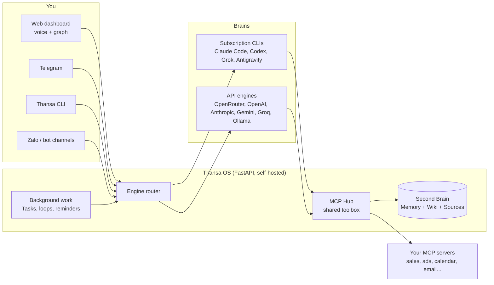

<!-- translated-from: README.md sha256:2e10ad3d2a86 -->
<div align="center">


# Thansa OS

### आपका self-hosted AI agent, जिसका ब्रेन बदला जा सकता है, और एक Second Brain जो हर दिन ज़्यादा समझदार होता जाता है।

इसे अपने laptop या किसी छोटे VPS पर चलाइए। इससे आवाज़ में बात कीजिए। Claude, ChatGPT, Grok, Gemini या 12 providers में से किसी को भी जोड़िए, provider बदलने पर भी हर tool वैसा ही बना रहता है, और जब आप सो रहे हों तब इसे background में काम करने दीजिए।

[](https://github.com/xahoapro/thansa-os/stargazers)
[](../../../LICENSE)
[](https://github.com/xahoapro/thansa-os/commits/main)
[](../../../requirements.txt)
[](https://github.com/xahoapro/thansa-os/pkgs/container/javis-os)
[](https://modelcontextprotocol.io)

<!-- flags:start -->
<p align="center">
<b>🌐 12 भाषाओं में उपलब्ध</b><br><br>
<a href="../../../README.md"></a>
<a href="../vi/README.md"></a>
<a href="../zh/README.md"></a>
<a href="../es/README.md"></a>
<a href="../ja/README.md"></a>

<a href="../pt-BR/README.md"></a>
<a href="../ko/README.md"></a>
<a href="../ru/README.md"></a>
<a href="../de/README.md"></a>
<a href="../fr/README.md"></a>
<a href="../id/README.md"></a>
</p>
<!-- flags:end -->

[🇬🇧 English](../../../README.md) · [🇻🇳 Tiếng Việt](../vi/README.md) · [🇨🇳 简体中文](../zh/README.md) · [🇪🇸 Español](../es/README.md) · [🇯🇵 日本語](../ja/README.md) · 🇮🇳 **हिन्दी** · [🇧🇷 Português](../pt-BR/README.md) · [🇰🇷 한국어](../ko/README.md) · [🇷🇺 Русский](../ru/README.md) · [🇩🇪 Deutsch](../de/README.md) · [🇫🇷 Français](../fr/README.md) · [🇮🇩 Bahasa Indonesia](../id/README.md) · [🌍 अनुवाद में मदद करें](../../../CONTRIBUTING.md#translations)

[क्विक स्टार्ट](#-क्विक-स्टार्ट) · [Thansa क्यों](#-thansa-क्यों) · [ब्रेन](#-12-ब्रेन-एक-toolkit) · [फ़ीचर्स](#-फ़ीचर्स) · [इंस्टॉल](#-इंस्टॉलेशन) · [Docs](../../../docs/en/README.md) · [सपोर्ट](#-thansa-os-को-सपोर्ट-करें)

<br>


</div>

> 🌍 यह अंग्रेज़ी README का स्वचालित (automatic) अनुवाद है। आप जिस भाषा में लिखते हैं, Thansa उसी भाषा में जवाब देता है; इंटरफ़ेस फ़िलहाल अंग्रेज़ी और वियतनामी में उपलब्ध है। पूरा documentation अंग्रेज़ी में है ([docs/en](../../../docs/en/README.md))। सुधार का स्वागत है ([CONTRIBUTING](../../../CONTRIBUTING.md#translations))।

---

## ⚡ क्विक स्टार्ट

**सबसे आसान तरीका: अपने ही AI से इंस्टॉल करवाइए।** अपनी मशीन पर Claude Code या Codex को इस repo का link दीजिए और कहिए *"मेरे लिए Thansa OS इंस्टॉल कर दो"*। उसे बस एक command चलानी होती है:

| मशीन | एक ही command सब कुछ इंस्टॉल कर देती है |
|---|---|
| **Linux / macOS** | `git clone https://github.com/xahoapro/thansa-os.git javis && cd javis && chmod +x install.sh && ./install.sh` |
| **Windows** | `git clone https://github.com/xahoapro/thansa-os.git javis; cd javis; powershell -ExecutionPolicy Bypass -File install.ps1` |
| **Docker** | `curl -fsSLO https://raw.githubusercontent.com/xahoapro/thansa-os/main/docker-compose.yml && docker compose up -d` |

फिर **http://localhost:7777** खोलिए। Installer Python, चारों subscription CLI ब्रेन (`claude`, `codex`, `agy`, `grok`) और एक `.env` सेट करता है, फिर server शुरू कर देता है। हर ब्रेन में sign in आप **dashboard के Models page पर** करते हैं, अब commands टाइप करने की ज़रूरत नहीं।

> [!NOTE]
> Thansa पहले से चल रहा था और उसके **बाद** आपने कोई और CLI इंस्टॉल की? **Thansa को restart कीजिए।** चलता हुआ process वही PATH रखता है जिसके साथ वह शुरू हुआ था, इसलिए बाद में इंस्टॉल की गई CLI उसे दिखाई नहीं देती।

<p align="center">

</p>

---

## 🤔 Thansa क्यों?

Thansa OS कोई chatbot **नहीं** है। यह एक **self-hosted agentic AI** है जो आपकी अपनी मशीन या VPS पर चलता है: यह files पढ़ता और लिखता है, MCP के ज़रिए tools call करता है, skills चलाता है, background काम queue करता है और खुद को schedule करता है। यह सब एक **आवाज़ से चलने वाले dashboard** के पीछे है, जिसके साथ एक **Second Brain** (memory + wiki) है जो समय के साथ ज्ञान जमा करता जाता है।

### वह lock-in जिसके बारे में कोई पहले नहीं बताता

कोई एक AI app चुनिए और साल भर रोज़ उसका इस्तेमाल कीजिए। फिर देखिए कि उसके अंदर क्या-क्या जमा हो गया है:

- **सैकड़ों बातचीतें**, जिनमें वे फ़ैसले और वह context है जो आपने रास्ते में तय किए।
- **Memory** कि आप कौन हैं, कैसे काम करते हैं और आपका business क्या बेचता है।
- **Custom instructions, assistants और projects**: वह know-how जिसे tune करने में आपने घंटों लगाए।
- **Automations और agents** जो सिर्फ़ उसी एक platform पर चलते हैं।

यह सब vendor के servers पर है, vendor के format में। फिर कहीं और एक बेहतर model आ जाता है। आप उसे आज़मा सकते हैं, पर अपना काम साथ नहीं ले जा सकते: नया app आपके बारे में कुछ नहीं जानता, आपके instructions साथ नहीं आते, और आपकी history पीछे छूट जाती है। Export, जहाँ होता भी है, आम तौर पर chat logs का एक ढेर होता है, ऐसी memory नहीं जिसे कोई दूसरा tool इस्तेमाल कर सके।

तो आप वहीं रुक जाते हैं। इसलिए नहीं कि पुराना model अब भी सबसे अच्छा है, बल्कि इसलिए कि छोड़ने का मतलब है शून्य से शुरू करना। और जब vendor दाम बढ़ाता है, limits कड़ी करता है, कोई model बंद करता है या आपका account lock कर देता है, तो कोई plan B नहीं होता।

### Thansa इसे उलट देता है: model किराए पर लीजिए, Brain अपना रखिए

Thansa में model एक ऐसा पुर्ज़ा है जिसे आप बदल सकते हैं। आप जो कुछ भी बनाते हैं, वह आपके पास रहता है, ऐसी files के रूप में जिन्हें आप खोल सकते हैं:

| आप क्या बनाते हैं | यह कहाँ रहता है | Format |
|---|---|---|
| **बातचीतें** | आपकी अपनी मशीन या VPS पर `conversations.db`, एक ही store, चाहे जवाब किसी भी ब्रेन ने दिया हो | SQLite, full-text search के साथ |
| **आपके बारे में memory** | आपके Brain में `memory/`: `MEMORY.md` और हर fact के लिए एक file | Markdown |
| **ज्ञान** | आपके Brain के Wiki और Sources folders | Markdown, Obsidian-compatible |
| **Skills** | `skills/<name>/SKILL.md` | Markdown |
| **Agents और workflows** | `agents/*.md`, `workflows/*.md` | Front matter वाला Markdown |
| **Loops और reminders** | `Javis/loops/*.md`, `Javis/reminders.json` | Markdown, JSON |

इससे आपको क्या मिलता है:

- **नया model आया? Models page पर switch कीजिए और काम जारी रखिए।** वह वही memory पढ़ता है, वही skills, agents और workflows चलाता है, और MCP Hub के ज़रिए वही connections call करता है। न कुछ migrate करना, न कुछ दोबारा बनाना।
- **एक साथ कई ब्रेन इस्तेमाल कीजिए।** बातचीत के लिए एक दमदार model, background काम के लिए एक सस्ता model, private notes के लिए एक local Ollama model, और सब एक ही Brain पर काम करते हुए।
- **Thansa के बिना भी पढ़ा जा सकता है।** आपका Brain markdown का एक folder है। इसे Obsidian या किसी भी editor में खोलिए। अगर Thansa कल गायब हो जाए, तब भी आपका ज्ञान plain text में वहीं मौजूद रहेगा।
- **Versioned और portable।** हर learning pass एक git commit है जिसे आप एक tap में undo कर सकते हैं, और पूरा Brain आपकी अपनी private GitHub repo से sync हो सकता है, जो आपके laptop और VPS के बीच शेयर होती है।
- **आपका data आपके hardware पर रहता है।** बीच में कोई Thansa cloud नहीं है। Request सिर्फ़ उसी model provider के पास जाती है जिसे आपने उसके लिए चुना है, और local Ollama model के साथ वह आपकी मशीन से बाहर ही नहीं जाती।

### Thansa बनाम एक आम chatbot

| | एक आम chatbot | **Thansa OS** |
|---|---|---|
| **ब्रेन** | एक ही model से बंधा, हर message पर एक stateless API call | **बदला जा सकता है**: 12 providers, हर एक के साथ tools, MCP, skills और sessions का पूरा सेट, Ollama के ज़रिए आपकी अपनी मशीन पर चलने वाले models भी |
| **मेमोरी** | हर session के बाद सब भूल जाता है | **एक जीवंत Second Brain** जो आपको याद रखता है और हर बातचीत के साथ और समृद्ध होता है |
| **डेटा** | मनगढ़ंत, या होता ही नहीं | आपके जोड़े गए connections (sales, ads, calendar, email, messaging) से **असली आंकड़े** |
| **काम** | जवाब देता है, फिर इंतज़ार करता है | **Background loops, reminders और AI से चलने वाली task queue** जो आपको नतीजे वापस भेजती हैं |
| **इंटरफ़ेस** | एक chat box | Dashboard + knowledge graph + **hands-free आवाज़** + Telegram, Slack, WhatsApp, Zalo + एक CLI |
| **आपका काम** | Vendor के servers पर, vendor के format में ही रह जाता है | **आपकी मशीन पर plain files**: history, memory, skills, agents और workflows किसी भी नए model के साथ चलते हैं |
| **Deployment** | किसी और का cloud | **Self-hosted**: one-click Hostinger, Docker, या कोई भी VPS |

> 💡 **फ़लसफ़ा: क्षमता Thansa में रहती है, model में नहीं।** हर ब्रेन को एक ही साझा connection hub (MCP Hub) के ज़रिए एक जैसा toolbox मिलता है। Claude से Gemini पर जाने में आपका कुछ नहीं जाता, सिवाय shell access के, जो सिर्फ़ CLI engines के पास होता है।

<p align="center">

</p>

---

## 🧠 12 ब्रेन, एक toolkit

**Models** page पर ब्रेन चुनिए और जब चाहें बदल दीजिए। Thansa आज **12 providers** को सपोर्ट करता है।

<p align="center">

</p>

| ब्रेन | भुगतान कैसे होता है | Shell, web, sub-agents |
|---|---|---|
| **Claude Code** | आपका Claude plan, या एक Anthropic API key | ✅ |
| **ChatGPT** (Codex के ज़रिए) | आपका ChatGPT plan | ✅ |
| **Grok Build** | आपका SuperGrok या X Premium+ plan | ✅ |
| **Antigravity CLI** | आपका Google plan (Antigravity IDE वाली ही model lineup, Claude समेत) | Shell ✅ |
| **OpenRouter** | API key (एक key के पीछे सैकड़ों models) | Thansa tools के ज़रिए |
| **OpenAI API** · **Anthropic API** · **Google Gemini** · **Groq** | API key | Thansa tools के ज़रिए |
| **Ollama Cloud** · **इसी मशीन पर Ollama** | API key, या अपने hardware पर मुफ़्त | Thansa tools के ज़रिए |
| **कोई भी OpenAI-compatible endpoint** | जो भी वह endpoint माँगे | Thansa tools के ज़रिए |

हर ब्रेन आपके जुड़े हुए MCP servers को call कर सकता है, Brain को पढ़ और लिख सकता है, skills चला सकता है, Kanban में काम queue कर सकता है, और agents, workflows, loops और reminders बना सकता है। CLI engines इसके अलावा **shell commands** चलाते हैं, **web से fetch और search** करते हैं, और **parallel sub-agents** शुरू करते हैं।

> [!WARNING]
> **किसी subscription से background काम करवाने से पहले यह पढ़िए।** Anthropic, Claude Pro/Max को Claude Code के **सामान्य निजी इस्तेमाल** तक सीमित रखता है। लगातार background execution (loops, reminders, Kanban jobs, chatbots), VPS पर चलाना, या कई लोगों का एक ही account शेयर करना, ये सब उस दायरे से बाहर हैं, और इसकी वजह से accounts **suspend हो चुके हैं**। Thansa आपका login token कभी नहीं पढ़ता: यह असली `claude` binary चलाता है, लेकिन इससे चौबीसों घंटे का background इस्तेमाल जायज़ नहीं हो जाता। सुरक्षित रहने के लिए Models page पर Claude Code को **API key** पर चलाइए, या **background-work model** को किसी दूसरे provider पर सेट कीजिए। यही सावधानी xAI plan पर भी लागू होती है। देखें `server/claude_auth.py`।

---

## ✨ फ़ीचर्स

<p align="center">

</p>

<table>
<tr>
<td width="50%" valign="top">

### 🗣️ इससे बात कीजिए
- **Hands-free आवाज़**: आप बोलिए, Thansa सुनता है और बोलकर जवाब देता है (default रूप से मुफ़्त Edge TTS, या OpenAI और ElevenLabs)।
- **Chat sessions** जिन्हें आप save कर सकते हैं, दोबारा खोल सकते हैं और full-text search कर सकते हैं। लंबे sessions काटे नहीं जाते, बल्कि summaries में compact हो जाते हैं।
- **Telegram, Slack, WhatsApp, Zalo, एक CLI और एक web dashboard**, सब एक ही Thansa से बात करते हैं ([Slack और WhatsApp का setup](../../../docs/en/29-slack-whatsapp.md))।
- **कोई भी भाषा**: आप जिस भाषा में लिखते हैं, Thansa उसी में जवाब देता है। इंटरफ़ेस अंग्रेज़ी और वियतनामी में आता है।

### 🧠 सब कुछ याद रखिए
- **Second Brain**: एक markdown vault (Obsidian-compatible), जिसमें long-term memory, एक Wiki और कच्चे Sources हैं।
- `[[wikilink]]` से जुड़े आपके notes का **knowledge graph**, एक हल्के canvas पर जो offline भी चलता है।
- **Self-learning**: हर बातचीत के बाद Thansa memories, wiki ज्ञान और skills निकालता है। हर learning pass एक git commit होता है, इसलिए उसे **एक tap में undo** किया जा सकता है।
- **GitHub पर backup**: हर Brain की एक private repo के साथ two-way sync, जो आपके laptop और VPS के बीच शेयर होती है।

</td>
<td width="50%" valign="top">

### ⚙️ आप सोते रहें, यह काम करता रहे
- **Tasks (Kanban)**: सीधे शब्दों में एक लक्ष्य सौंपिए। AI spec लिखता है, एक worker चुनता है, उसे background में चलाता है और सिर्फ़ exceptions पर आपको बुलाता है।
- **Loops और reminders**: interval, घड़ी के किसी समय या cron expression पर चलने वाले background jobs, जिनमें से हर एक अपना काम खुद जाँचता है।
- **Agents और workflows**: अपनी memory वाले specialist assistants, जिन्हें verification के साथ multi-step workflows में जोड़ा जाता है।
- **Chatbots**: किसी agent को उसके अपने Telegram, Slack, WhatsApp या Zalo bot पर अपने customers के सामने रखिए, एक shared inbox के साथ जिसे आप कभी भी अपने हाथ में ले सकते हैं।

### 🔌 कुछ भी जोड़िए
- **MCP connection store**, हर service के लिए कई accounts और तीन permission levels के साथ, जिन्हें Thansa **सख़्ती से लागू** करता है।
- **Skills और plugins**: एक folder डालिए और हर engine के लिए know-how (skill) या एक native Python tool (plugin) जोड़िए।
- आप जिस ChatGPT plan में पहले से signed in हैं, उसी पर **image generation**।
- **Usage tracking**: हर दिन, हर provider के हिसाब से tokens और खर्च, इस बँटवारे के साथ कि क्या आपने टाइप किया और क्या अपने आप चला।

</td>
</tr>
</table>

<p align="center">

</p>

<div align="center">


</div>

---

## 🏗️ यह कैसे काम करता है



- **Backend:** `server/` में Python FastAPI: engines (`claude_sdk_engine.py`, `claude_cli.py`, `antigravity_cli.py`, `engine.py`, `aux_engine.py`), tools (`mcp_hub.py`, `mcp_store.py`, `plugins_host.py`), background काम (`tasks.py`, `self_improve.py`, `reminders.py`, `learn.py`), भाषा और locale (`lang.py`, `lang_registry.py`, `localefmt.py`)।
- **Frontend:** `dashboard/` में सादा HTML/CSS/JS। न कोई framework, न कोई build step, इसलिए यह छोटे VPS पर भी हल्का रहता है। इंटरफ़ेस के strings `dashboard/i18n/` में रहते हैं।
- **Second Brain:** `brains/<brain name>/` में एक markdown vault।

---

## 🚀 इंस्टॉलेशन

> [!IMPORTANT]
> Thansa मशीन पर **पूरे अधिकारों** के साथ एक AI ब्रेन चलाता है। जब यह public रूप से चलता है (Docker, VPS, Hostinger), तो Thansa **खुद ही login ज़रूरी कर देता है**: app खोलते ही account बनाने या sign in करने की screen आती है, और password के बिना कोई इसे चला नहीं सकता।

<details open>
<summary><b>विकल्प 1: Hostinger Docker Manager (domain + HTTPS, एक click में)</b></summary>

Hostinger VPS → **Docker Manager → Compose → URL** → Hostinger वाली file paste कीजिए और **Deploy** दबाइए:

```
https://raw.githubusercontent.com/xahoapro/thansa-os/main/docker-compose.hostinger.yml
```

**Environment** box में सिर्फ़ तीन fields चाहिए: `DOMAIN_NAME`, `JAVIS_ADMIN_USER`, `JAVIS_ADMIN_PASSWORD`, साथ में एक वैकल्पिक `JAVIS_AUTO_UPDATE` (इसे `true` करने पर Thansa हर दिन खुद को update करता है)।

`DOMAIN_NAME` सेट कीजिए ताकि Hostinger का Traefik HTTPS जारी करे:
- **मुफ़्त link** (domain खरीदने की ज़रूरत नहीं): `DOMAIN_NAME=javis.<vps-hostname>.hstgr.cloud` (hostname hPanel → VPS में मिलेगा, जैसे `javis.srv1562015.hstgr.cloud`)।
- **आपका अपना domain:** `DOMAIN_NAME=example.com` और एक A record को VPS के IP पर point कीजिए।

Certificate के लिए 1-3 मिनट इंतज़ार कीजिए, फिर `https://<DOMAIN_NAME>` खोलिए।

**तीन एक-बार वाले कदम:**
1. **GHCR image को Public कीजिए:** GitHub → repo → **Packages** → `javis-os` → *Package settings* → Visibility = **Public**।
2. **Admin account बनाइए:** `JAVIS_ADMIN_USER` + `JAVIS_ADMIN_PASSWORD` भरिए (सुझाया गया तरीका), या deploy करते ही app खोलकर खुद एक बना लीजिए। जब तक कोई admin नहीं है, जो भी सबसे पहले link खोलेगा वह admin बना सकता है। उसके बाद **2FA चालू कीजिए** ([Security and accounts](../../../docs/en/14-security-and-accounts.md))।
3. **Models** page पर **किसी ब्रेन में sign in कीजिए**।

विवरण और troubleshooting: [DEPLOY.en.md](../../../DEPLOY.en.md)।

</details>

<details>
<summary><b>विकल्प 2: किसी भी VPS पर Docker (clone की ज़रूरत नहीं)</b></summary>

```bash
# Docker required (don't have it?  curl -fsSL https://get.docker.com | sh)
mkdir javis && cd javis
curl -fsSLO https://raw.githubusercontent.com/xahoapro/thansa-os/main/docker-compose.yml

docker compose run --rm javis claude auth login --claudeai   # sign in to Claude once (optional)
docker compose up -d                                          # pull the image and run
```

`http://<vps-ip>:7777` खोलिए और तुरंत admin username और password सेट कीजिए (कम से कम 8 अक्षर), या environment में पहले से `JAVIS_ADMIN_USER` + `JAVIS_ADMIN_PASSWORD` सेट कर दीजिए। फिर 2FA चालू कीजिए।

बिना domain के remote access: `docker compose --profile tunnel up -d`, फिर `docker compose logs tunnel | grep trycloudflare` एक HTTPS link दिखाता है।

</details>

<details>
<summary><b>विकल्प 3: Linux या macOS, बिना Docker</b></summary>

```bash
git clone https://github.com/xahoapro/thansa-os.git javis && cd javis
chmod +x install.sh && ./install.sh
```

Script Python, Node और CLI ब्रेन इंस्टॉल करती है, एक venv बनाती है, boot पर शुरू होने वाली एक service register करती है, और address दिखाती है।

🍎 **macOS पर इसे app की तरह खोलिए:** `JAVIS OS.app` (या `Start JAVIS OS.command`) पर double-click कीजिए। Login पर शुरू करने के लिए: `./bin/javis-autostart.sh install`। विवरण: [bin/README.md](../../../bin/README.md)।

</details>

<details>
<summary><b>विकल्प 4: Windows (निजी मशीन)</b></summary>

```powershell
git clone https://github.com/xahoapro/thansa-os.git javis; cd javis
powershell -ExecutionPolicy Bypass -File install.ps1
```

`install.ps1` एक ही बार में सब कर देता है: Python, venv और libraries, चारों subscription CLI ब्रेन (`claude`, `codex`, `agy`, `grok`), `.env`, port 7777 खाली करना और server शुरू करना। आख़िर में यह एक table दिखाता है कि कौन-से ब्रेन तैयार हैं। अगर `winget` नहीं है, तो पहले Python 3.12 ("Add python.exe to PATH" पर tick करके) और Node.js LTS हाथ से इंस्टॉल कीजिए, फिर इसे दोबारा चलाइए।

```
Run with a visible window (live log):  setup.bat
Run silently from then on:             start-javis.vbs   (log at server\javis.log)
Stop:                                  stop-javis.bat
Dashboard:                             http://localhost:7777
```

🪟 **इसे app की तरह खोलिए:** पहली बार चलाने के बाद **`JAVIS OS.bat`** पर double-click कीजिए। Server background में शुरू होता है और dashboard **अपनी अलग window** में खुलता है, जिसकी taskbar में अपनी entry होती है। Login पर शुरू करने के लिए: `javis-autostart.bat install` (हटाने के लिए: `uninstall`)।

</details>

<details>
<summary><b>एक VPS पर कई Thansa instances</b></summary>

हर instance के ब्रेन, settings और accounts पूरी तरह अलग रहते हैं। उनके बीच सिर्फ़ तीन values अलग होती हैं: `JAVIS_NAME`, `JAVIS_HOST_PORT`, `DOMAIN_NAME`।

- **Hostinger:** `docker-compose.hostinger.yml` को दूसरे stack के रूप में फिर से deploy कीजिए और ये तीन fields भरिए।
- **खुद manage किया गया VPS:** पूरी मशीन के लिए shared proxy `docker-compose.proxy.yml` एक बार चलाइए, फिर हर instance को `docker-compose.multi.yml` के साथ उसका अपना folder दीजिए। Proxy नए instances खुद ढूँढता है और SSL खुद माँगता है।
- **Native:** `JAVIS_NAME=javis-shop JAVIS_PORT=7778 ./install.sh`।

कदम-दर-कदम: [DEPLOY.en.md](../../../DEPLOY.en.md)।

</details>

### 🎬 पहली बार चलाना

Thansa खोलिए और setup wizard आपको आपके browser की भाषा में पूरी प्रक्रिया से गुज़ारता है:

1. **Admin account**: public रूप से चलाते समय ज़रूरी है, ताकि अजनबी अंदर न आ सकें।
2. **एक ब्रेन चुनिए**: किसी subscription से एक बार sign in कीजिए, या एक API key paste कीजिए। Claude Code card पर एक **"Runs on"** switch है, जो आपके signed-in plan और एक Anthropic API key के बीच चुनता है।
3. **एक model चुनिए**: बाद में provider बदलने पर कोई फ़ीचर नहीं खोता (shell commands को छोड़कर, जो सिर्फ़ CLI engines के पास हैं)।
4. **Connections जोड़िए** (वैकल्पिक): **Connections** खोलिए, कोई service चुनिए और एक key paste कीजिए या QR code scan कीजिए। उसके बाद Thansa उसके असली आंकड़ों पर report करता है।

---

## 📖 Thansa का इस्तेमाल

बाईं rail pages को **6 groups** में बाँटती है। हर page की guide [docs/en/](../../../docs/en/README.md) में है।

| Group | Pages | Guides |
|---|---|---|
| **Brain** | Graph, Chat, Files, Self-learning | [Chat and voice](../../../docs/en/02-chat-and-voice.md) · [Knowledge graph](../../../docs/en/03-knowledge-graph.md) · [Sessions](../../../docs/en/04-sessions.md) · [File manager](../../../docs/en/05-file-manager.md) · [Self-learning](../../../docs/en/22-self-learning.md) |
| **Code** | Terminal, Coding | [Code terminal](../../../docs/en/27-code-terminal.md) |
| **Capabilities** | Partners (agents और workflows), Chatbot, Skills, Plugins | [Agents and workflows](../../../docs/en/07-agents-and-workflows.md) · [Chatbots](../../../docs/en/25-chatbots.md) · [Customer conversations](../../../docs/en/28-customer-conversations.md) · [Skills](../../../docs/en/06-skills.md) · [Plugins](../../../docs/en/20-plugins.md) |
| **Work** | Tasks, Scheduled | [Tasks (Kanban)](../../../docs/en/21-kanban-work.md) · [Recurring jobs and reminders](../../../docs/en/08-recurring-jobs.md) |
| **Connections** | Connections, Thansa Store, Channels, Models | [Connections and business data](../../../docs/en/09-connections-and-business-data.md) · [Telegram](../../../docs/en/11-telegram.md) · [Zalo](../../../docs/en/12-zalo-agent-mcp.md) · [Models and engines](../../../docs/en/10-models-and-engines.md) |
| **System** | Settings, Share links, Account | [Getting started](../../../docs/en/01-getting-started.md) · [Security and accounts](../../../docs/en/14-security-and-accounts.md) · [Usage and cost](../../../docs/en/23-usage-and-cost.md) · [Thansa CLI](../../../docs/en/24-cli.md) |

और भी: [Second Brain: memory, Wiki and INGEST](../../../docs/en/13-second-brain.md) · [GitHub backup](../../../docs/en/18-github-backup.md) · [Tasks and Dataview in notes](../../../docs/en/19-tasks-and-dataview.md) · [Branding and custom domains](../../../docs/en/15-branding-and-domains.md) · [Troubleshooting](../../../docs/en/17-troubleshooting.md)

### कुछ चीज़ें आज़माइए

- **आंकड़े पूछिए:** *"आज का revenue कल की तुलना में कैसा है?"* Thansa सही connection को call करता है और असली आंकड़ों के साथ सुझाव भी देता है।
- **ज्ञान पचाइए:** कोई file या note डाल दीजिए। Thansa उसका सार निकालता है, insight निकालता है, उसे Wiki में लिखता है और tasks सुझाता है।
- **Background काम सौंपिए:** **Tasks** → **+ Assign goal** → *"इस हफ़्ते की sales का सार निकालो, धीमे बिकने वाला stock ढूँढो, उसे आगे बढ़ाने के लिए तीन captions का draft बनाओ"*। AI उसका spec बनाता है, उसे चलाता है और नतीजे वापस भेजता है।
- **कुछ schedule कीजिए:** *"हर कार्यदिवस सुबह 8:30 बजे मुझे ads budget चेक करने की याद दिलाना"*, chat में या **Scheduled** page पर।
- **अपनी आवाज़ का इस्तेमाल कीजिए:** mic दबाइए (या hands-free चालू कीजिए), बोलिए, और Thansa बोलकर जवाब देता है।

<div align="center">

<br><sub>आपके फ़ोन पर भी चलता है: इसे home screen पर जोड़िए और यह एक app की तरह खुलता है।</sub>
</div>

---

## ⚙️ Configuration (`.env`)

हर लाइन ख़ाली रह सकती है और Thansa फिर भी चलता है। `env.example` → `.env` copy कीजिए और जो चाहिए वह जोड़िए। हर variable की व्याख्या के साथ पूरी सूची [docs/en/16-env-configuration.md](../../../docs/en/16-env-configuration.md) में है।

| Variable | मतलब | Default |
|---|---|---|
| `JAVIS_HOST` | Listen address। `127.0.0.1` = सिर्फ़ यही मशीन, `0.0.0.0` = public | `127.0.0.1` |
| `JAVIS_PORT` | Port | `7777` |
| `JAVIS_REQUIRE_LOGIN` | Login को ज़बरदस्ती चालू या बंद करने के लिए `1`/`0` (default: public रूप से bind होने पर चालू) | *(auto)* |
| `JAVIS_ADMIN_USER` / `JAVIS_ADMIN_PASSWORD` | Deploy के समय admin बनाइए | - |
| `JAVIS_ALLOWED_HOSTS` | Allow-list में अतिरिक्त hostnames (CSRF और DNS-rebinding से सुरक्षा) | localhost + आपका domain |
| `JAVIS_STATE_DIR` | Settings, sessions और encryption key कहाँ रहते हैं | `server/` (Docker: `/data/state`) |
| `BRAINS_DIR` | वह parent folder जिसमें हर Brain रहता है | `brains/` (Docker: `/brains`) |
| `JAVIS_ENABLE_USER_PLUGINS` | `true` करने पर आपके अपने plugins चल सकते हैं (server के अंदर असली Python) | *(बंद)* |
| `TTS_VOICE` / `TTS_RATE` | Edge TTS की आवाज़ और गति | `en-US-EmmaMultilingualNeural` / `+5%` |

---

## 🔐 सुरक्षा

- Public server पर कोई भी फ़ीचर काम करने से पहले **login ज़रूरी है**, क्योंकि ब्रेन मशीन पर पूरे अधिकारों के साथ चलता है।
- **2FA (TOTP)**, login rate limiting, कम से कम 8 अक्षरों वाले passwords, HTTPS के तहत `Secure` cookies, 30 दिन बाद expire होने वाले sessions।
- **CSRF और DNS-rebinding से सुरक्षा**: किसी अनजान origin से आई हर write request reject कर दी जाती है।
- **Secrets encrypted रहते हैं** `settings.json` में (API keys, OAuth tokens, bot tokens), हर मशीन की अपनी key से।
- **आपके अपने plugins default रूप से blocked रहते हैं**, जब तक आप `JAVIS_ENABLE_USER_PLUGINS=true` सेट नहीं करते।
- **Connection permissions hub लागू करता है**, model नहीं: read-only account से send, payment या publish नहीं किया जा सकता।

कोई vulnerability मिली? कृपया public issue खोलने के बजाय [SECURITY.md](../../../SECURITY.md) का पालन कीजिए।

---

## 🔄 अपडेट करना

App में: **Settings → Updates → Update now**, progress bar के साथ, और अगर नया build टूट जाए तो rollback button भी है। VPS पर: `cd javis && ./update.sh` (नई image pull करके restart करता है; volumes में आपका डेटा सुरक्षित रहता है)।

---

## 🩺 Troubleshooting

| समस्या | क्या करें |
|---|---|
| Models page कहता है कि कोई CLI इंस्टॉल नहीं है, जबकि वह है | **Thansa को restart कीजिए**: चलता हुआ process वही PATH रखता है जो उसके शुरू होने के समय था। |
| Port 7777 पहले से इस्तेमाल में है और नया build शुरू नहीं होता | पहले पुराना process रोकिए (`stop-javis.bat`, या PID को kill कीजिए), फिर दोबारा शुरू कीजिए। |
| Hostinger image pull नहीं कर पाता | GHCR package को **Public** कीजिए और GitHub Action build पूरा होने का इंतज़ार कीजिए। |
| कोई ब्रेन कहता है कि वह signed in नहीं है | **Models** → उस provider का card → sign in। |

और जानकारी [docs/en/17-troubleshooting.md](../../../docs/en/17-troubleshooting.md) में।

---

## 📂 Repository का ढाँचा

```
javis-os/
├── server/          # FastAPI backend: engines, connections, background work, channels, memory
├── dashboard/       # Frontend (plain JS, no build step)
│   └── i18n/        # Interface strings, one JSON file per language
├── brains/          # Every Second Brain (default: brains/Brain Default)
├── system/          # Ships with the app: bundled plugins, system skills, connection catalogue
├── docs/            # User guides (docs/en/ in English) and translations (docs/i18n/)
├── tests/           # Python + JS test suite (python tests/run.py)
├── install.sh · install.ps1 · update.sh
├── Dockerfile · docker-compose*.yml
└── CLAUDE.md        # The system prompt Thansa runs on
```

---

## 🌍 भाषाएँ

| क्या | आज की भाषाएँ |
|---|---|
| **Thansa के जवाब** | कोई भी भाषा: आप जिस भाषा में लिखते हैं उसी में जवाब देता है, या उस भाषा में जिसे आप Settings में pin करें |
| **Dashboard और server messages** | 🇬🇧 English · 🇻🇳 Tiếng Việt, हर device के हिसाब से: जब तक आप कोई भाषा न चुनें, हर browser की अपनी भाषा होती है |
| **Connection store, plugins, नए ब्रेन की starter files** | 🇬🇧 English · 🇻🇳 Tiếng Việt |
| **README और quick start** | 🇬🇧 English · 🇻🇳 Tiếng Việt · 🇨🇳 简体中文 · 🇪🇸 Español · 🇯🇵 日本語 · 🇮🇳 हिन्दी · 🇧🇷 Português · 🇰🇷 한국어 · 🇷🇺 Русский · 🇩🇪 Deutsch · 🇫🇷 Français · 🇮🇩 Bahasa Indonesia |
| **पूरा documentation** | 🇬🇧 English · 🇻🇳 Tiếng Việt |

नई भाषा जोड़ना data का बदलाव है, code का नहीं: `server/lang_registry.py` में एक entry और एक `dashboard/i18n/<code>.json`, और चाहें तो `system/mcp-catalog.<code>.json`। जो कुछ अभी अनुवादित नहीं है, वह अंग्रेज़ी में दिखता है। अगर आप मदद करना चाहें तो [CONTRIBUTING.md](../../../CONTRIBUTING.md#translations) देखिए।

---

## 🤝 योगदान

Bug reports, ideas, अनुवाद और pull requests, सबका स्वागत है, अंग्रेज़ी या वियतनामी में।

| यहाँ से शुरू कीजिए | इससे आपको क्या मिलता है |
|---|---|
| [CONTRIBUTING.md](../../../CONTRIBUTING.md) | Setup, tests चलाना (`python tests/run.py`), code conventions |
| [ARCHITECTURE.md](../../../ARCHITECTURE.md) | सारे हिस्से आपस में कैसे जुड़ते हैं, और server modules का नक्शा |
| [docs/dev/GLOSSARY.md](../../../docs/dev/GLOSSARY.md) | Code base वियतनामी में लिखा गया था: यह `nhac_hen` (reminder) जैसे नामों का मतलब समझाता है |
| [docs/dev/adding-a-language.md](../../../docs/dev/adding-a-language.md) | Thansa को अपनी भाषा में अनुवाद करना, कदम-दर-कदम |
| [Issue templates](https://github.com/xahoapro/thansa-os/issues/new/choose) | Bug report, feature request, अनुवाद की पेशकश |

कृपया [Code of Conduct](../../../CODE_OF_CONDUCT.md) का पालन कीजिए, और security समस्याओं की रिपोर्ट [SECURITY.md](../../../SECURITY.md) में बताए तरीके से निजी रूप से कीजिए।

अगर Thansa आपके काम आता है, तो repo पर एक ⭐ दूसरे लोगों को इसे ढूँढने में मदद करता है।

[](https://star-history.com/#xahoapro/thansa-os&Date)

---

## 🙏 आभार

- **ब्रेन:** [Claude Code](https://claude.com/claude-code) और [Claude Agent SDK](https://docs.claude.com/en/api/agent-sdk/overview) (Anthropic), [Codex CLI](https://developers.openai.com/codex/cli) (OpenAI), [Grok Build](https://x.ai) (xAI), [Antigravity](https://antigravity.google) (Google), साथ ही [OpenRouter](https://openrouter.ai), OpenAI, [Google Gemini](https://ai.google.dev), Anthropic, [Groq](https://groq.com) और [Ollama](https://ollama.com) की APIs।
- **Tool standard:** [Model Context Protocol](https://modelcontextprotocol.io)। Thansa का पूरा connection store इसी पर चलता है।
- Second Brain और digital Bullet Journal के patterns।

## 📄 License

**MIT License** के तहत open source: बिना रोक-टोक इस्तेमाल, बदलाव और वितरण कीजिए, बस copyright notice बनाए रखिए। देखें [LICENSE](../../../LICENSE)।

---

## ☕ Thansa OS को सपोर्ट करें

Thansa OS मुफ़्त और open source है, और इसका code अब भी एक ही व्यक्ति लिखता है और test servers का खर्च भी वही उठाता है। अगर Thansa आपके काम या ज़िंदगी में मदद करता है, तो एक छोटा-सा दान bug fixes और नए फ़ीचर्स के लिए और समय देता है।

- 🌍 **PayPal**: [paypal.me/quy01](https://paypal.me/quy01)
- 🏦 **MB Bank** (वियतनाम): `6636966369`
- 📱 **MoMo wallet** (वियतनाम): `0372752740`

दान नहीं कर सकते? Thansa का इस्तेमाल करना, feedback भेजना या pull request खोलना भी सपोर्ट ही है।

<div align="center">
<br>
<b><a href="https://tradingauto.org">Duy Quang</a></b> ने वियतनाम में ☕ के साथ बनाया
</div>
