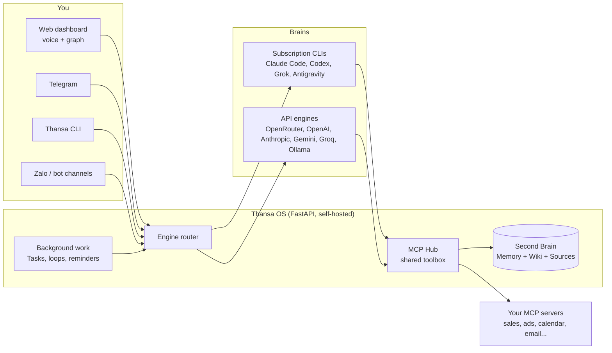

<!-- translated-from: README.md sha256:2e10ad3d2a86 -->
<div align="center">


# Thansa OS

### Agen AI self-hosted Anda dengan otak yang bisa diganti, dan Second Brain yang makin pintar setiap hari.

Jalankan di laptop atau VPS kecil. Ajak bicara dengan suara. Pasang Claude, ChatGPT, Grok, Gemini atau salah satu dari 12 provider, semua tool tetap ada saat Anda berganti, dan biarkan ia bekerja di background selagi Anda tidur.

[](https://github.com/xahoapro/thansa-os/stargazers)
[](../../../LICENSE)
[](https://github.com/xahoapro/thansa-os/commits/main)
[](../../../requirements.txt)
[](https://github.com/xahoapro/thansa-os/pkgs/container/javis-os)
[](https://modelcontextprotocol.io)

<!-- flags:start -->
<p align="center">
<b>🌐 Tersedia dalam 12 bahasa</b><br><br>
<a href="../../../README.md"></a>
<a href="../vi/README.md"></a>
<a href="../zh/README.md"></a>
<a href="../es/README.md"></a>
<a href="../ja/README.md"></a>
<a href="../hi/README.md"></a>
<a href="../pt-BR/README.md"></a>
<a href="../ko/README.md"></a>
<a href="../ru/README.md"></a>
<a href="../de/README.md"></a>
<a href="../fr/README.md"></a>

</p>
<!-- flags:end -->

[🇬🇧 English](../../../README.md) · [🇻🇳 Tiếng Việt](../vi/README.md) · [🇨🇳 简体中文](../zh/README.md) · [🇪🇸 Español](../es/README.md) · [🇯🇵 日本語](../ja/README.md) · [🇮🇳 हिन्दी](../hi/README.md) · [🇧🇷 Português](../pt-BR/README.md) · [🇰🇷 한국어](../ko/README.md) · [🇷🇺 Русский](../ru/README.md) · [🇩🇪 Deutsch](../de/README.md) · [🇫🇷 Français](../fr/README.md) · 🇮🇩 **Bahasa Indonesia** · [🌍 Bantu menerjemahkan](../../../CONTRIBUTING.md#translations)

[Mulai cepat](#-mulai-cepat) · [Mengapa Thansa](#-mengapa-thansa) · [Otak](#-12-otak-satu-toolkit) · [Fitur](#-fitur) · [Instalasi](#-instalasi) · [Dokumentasi](../../../docs/en/README.md) · [Dukungan](#-dukung-thansa-os)

<br>


</div>

> 🌍 Ini adalah terjemahan otomatis dari README berbahasa Inggris. Thansa membalas dalam bahasa apa pun yang Anda gunakan saat menulis; antarmukanya untuk saat ini tersedia dalam bahasa Inggris dan Vietnam. Dokumentasi lengkap tersedia dalam bahasa Inggris ([docs/en](../../../docs/en/README.md)). Koreksi sangat kami sambut ([CONTRIBUTING](../../../CONTRIBUTING.md#translations)).

---

## ⚡ Mulai cepat

**Cara mudahnya: biarkan AI Anda sendiri yang menginstalnya.** Berikan link repo ini ke Claude Code atau Codex di mesin Anda lalu katakan *"instalkan Thansa OS untuk saya"*. Ia cukup menjalankan satu perintah:

| Mesin | Satu perintah menginstal semuanya |
|---|---|
| **Linux / macOS** | `git clone https://github.com/xahoapro/thansa-os.git && cd thansa-os && chmod +x install.sh && ./install.sh` |
| **Windows** | `git clone https://github.com/xahoapro/thansa-os.git; cd thansa-os; powershell -ExecutionPolicy Bypass -File install.ps1` |
| **Docker** | `curl -fsSLO https://raw.githubusercontent.com/xahoapro/thansa-os/main/docker-compose.yml && docker compose up -d` |

Lalu buka **http://localhost:7777**. Installer akan menyiapkan Python, empat otak CLI berlangganan (`claude`, `codex`, `agy`, `grok`) dan sebuah `.env`, lalu menjalankan server. Anda login ke setiap otak **di halaman Models pada dashboard**, tanpa perlu mengetik perintah lagi.

> [!NOTE]
> Menginstal CLI tambahan **setelah** Thansa sudah berjalan? **Restart Thansa.** Proses yang sedang berjalan tetap memakai PATH saat ia pertama dijalankan, sehingga tidak bisa melihat CLI yang diinstal belakangan.

<p align="center">

</p>

---

## 🤔 Mengapa Thansa?

Thansa OS **bukan** chatbot. Ini adalah **AI agentik self-hosted** yang berjalan di mesin atau VPS Anda sendiri: ia membaca dan menulis file, memanggil tool lewat MCP, menjalankan skill, mengantrekan pekerjaan background, dan menjadwalkan dirinya sendiri. Semua itu ada di balik **dashboard yang bisa dikendalikan dengan suara** dan sebuah **Second Brain** (memori + wiki) yang mengumpulkan pengetahuan dari waktu ke waktu.

### Jebakan lock-in yang tidak pernah diperingatkan siapa pun

Pilih satu aplikasi AI dan pakai setiap hari selama setahun. Lalu lihat apa saja yang sudah menumpuk di dalamnya:

- **Ratusan percakapan**, berisi keputusan dan konteks yang Anda susun sepanjang jalan.
- **Memori** tentang siapa Anda, cara Anda bekerja, dan apa yang dijual bisnis Anda.
- **Instruksi khusus, asisten, dan proyek**: know-how yang Anda setel berjam-jam.
- **Otomasi dan agent** yang hanya berjalan di platform itu saja.

Semuanya tersimpan di server vendor, dalam format vendor. Lalu model yang lebih baik muncul di tempat lain. Anda bisa mencobanya, tetapi pekerjaan Anda tidak bisa ikut dibawa: aplikasi baru itu tidak tahu apa pun tentang Anda, instruksi Anda tidak terbawa, dan riwayat Anda tertinggal. Fitur ekspor, kalaupun ada, biasanya hanya tumpukan log chat, bukan memori yang bisa dipakai tool lain.

Jadi Anda bertahan. Bukan karena model lama masih yang terbaik, tetapi karena pindah berarti mulai dari nol. Dan ketika vendor menaikkan harga, memperketat batas, mempensiunkan sebuah model, atau mengunci akun Anda, tidak ada rencana B.

### Thansa membaliknya: sewa modelnya, miliki Brain Anda sendiri

Di Thansa, model adalah komponen yang bisa Anda tukar. Semua yang Anda bangun tetap bersama Anda, sebagai file yang bisa Anda buka:

| Yang Anda bangun | Tempat tinggalnya | Format |
|---|---|---|
| **Percakapan** | `conversations.db` di mesin atau VPS Anda sendiri, satu tempat penyimpanan, otak mana pun yang menjawab | SQLite, bisa dicari full-text |
| **Memori tentang Anda** | `memory/` di Brain Anda: `MEMORY.md` ditambah satu file per fakta | Markdown |
| **Pengetahuan** | folder Wiki dan Sources di Brain Anda | Markdown, kompatibel dengan Obsidian |
| **Skills** | `skills/<name>/SKILL.md` | Markdown |
| **Agent dan workflow** | `agents/*.md`, `workflows/*.md` | Markdown dengan front matter |
| **Loop dan pengingat** | `Javis/loops/*.md`, `Javis/reminders.json` | Markdown, JSON |

Apa yang Anda dapatkan dari situ:

- **Ada model baru? Ganti di halaman Models dan lanjutkan saja.** Ia membaca memori yang sama, menjalankan skill, agent, dan workflow yang sama, serta memanggil koneksi yang sama lewat MCP Hub. Tidak ada yang perlu dimigrasi, tidak ada yang perlu dibangun ulang.
- **Pakai beberapa otak sekaligus.** Model yang kuat untuk percakapan, yang lebih murah untuk pekerjaan background, model Ollama lokal untuk catatan pribadi, semuanya bekerja di Brain yang sama.
- **Bisa dibaca tanpa Thansa.** Brain Anda adalah folder berisi markdown. Buka di Obsidian atau editor apa pun. Kalau Thansa hilang besok, pengetahuan Anda tetap ada, dalam teks biasa.
- **Berversi dan portabel.** Setiap proses belajar adalah satu git commit yang bisa Anda batalkan dengan satu ketukan, dan seluruh Brain bisa disinkronkan ke repo GitHub privat milik Anda sendiri, dipakai bersama antara laptop dan VPS Anda.
- **Data Anda tetap di perangkat keras Anda.** Tidak ada cloud Thansa di tengah. Sebuah request hanya dikirim ke penyedia model yang Anda pilih untuknya, dan dengan model Ollama lokal, request itu tidak pernah keluar dari mesin Anda.

### Thansa dibandingkan chatbot biasa

| | Chatbot biasa | **Thansa OS** |
|---|---|---|
| **Otak** | Terkunci di satu model, satu panggilan API stateless per pesan | **Bisa diganti**: 12 provider, masing-masing dengan set lengkap tool, MCP, skill dan sesi, termasuk model yang berjalan di mesin Anda sendiri lewat Ollama |
| **Memori** | Lupa setiap kali sesi selesai | **Second Brain yang hidup**, yang mengingat Anda dan makin tebal di setiap percakapan |
| **Data** | Mengarang, atau tidak ada | **Angka nyata** dari koneksi yang Anda pasang (penjualan, iklan, kalender, email, pesan) |
| **Pekerjaan** | Menjawab, lalu menunggu | **Loop background, pengingat, dan antrean tugas yang dijalankan AI** yang melapor kembali ke Anda |
| **Antarmuka** | Kotak chat | Dashboard + knowledge graph + **suara hands-free** + Telegram, Slack, WhatsApp, Zalo + CLI |
| **Hasil kerja Anda** | Tertinggal di server vendor, dalam format vendor | **File biasa di mesin Anda**: riwayat, memori, skill, agent, dan workflow ikut pindah ke model baru mana pun |
| **Deployment** | Cloud milik orang lain | **Self-hosted**: Hostinger sekali klik, Docker, atau VPS apa pun |

> 💡 **Filosofinya: kemampuan ada di Thansa, bukan di model.** Setiap otak mendapat kotak peralatan yang sama lewat satu hub koneksi bersama (MCP Hub). Beralih dari Claude ke Gemini tidak membuat Anda kehilangan apa pun kecuali akses shell, yang hanya dimiliki engine CLI.

<p align="center">

</p>

---

## 🧠 12 otak, satu toolkit

Pilih otak di halaman **Models** dan ganti kapan pun Anda mau. Saat ini Thansa mendukung **12 provider**.

<p align="center">

</p>

| Otak | Cara bayar | Shell, web, sub-agent |
|---|---|---|
| **Claude Code** | Paket Claude Anda, atau API key Anthropic | ✅ |
| **ChatGPT** (via Codex) | Paket ChatGPT Anda | ✅ |
| **Grok Build** | Paket SuperGrok atau X Premium+ Anda | ✅ |
| **Antigravity CLI** | Paket Google Anda (deretan model yang sama dengan Antigravity IDE, termasuk Claude) | Shell ✅ |
| **OpenRouter** | API key (ratusan model di balik satu key) | via tool Thansa |
| **OpenAI API** · **Anthropic API** · **Google Gemini** · **Groq** | API key | via tool Thansa |
| **Ollama Cloud** · **Ollama di mesin ini** | API key, atau gratis di hardware Anda sendiri | via tool Thansa |
| **Endpoint apa pun yang kompatibel dengan OpenAI** | Apa pun yang dibutuhkan endpoint tersebut | via tool Thansa |

Setiap otak bisa memanggil server MCP yang Anda hubungkan, membaca dan menulis Brain, menjalankan skill, mengantrekan pekerjaan Kanban, serta membuat agent, workflow, loop dan pengingat. Engine CLI juga bisa menjalankan **perintah shell**, **mengambil dan mencari di web**, serta **menjalankan sub-agent secara paralel**.

> [!WARNING]
> **Baca ini sebelum membiarkan langganan menjalankan pekerjaan background.** Anthropic membatasi Claude Pro/Max untuk **penggunaan pribadi biasa** Claude Code. Eksekusi background terus-menerus (loop, pengingat, job Kanban, chatbot), menjalankannya di VPS, atau beberapa orang berbagi satu akun, semuanya berada di luar cakupan itu, dan sudah ada akun yang **ditangguhkan** karenanya. Thansa tidak pernah membaca token login Anda: ia menjalankan binary `claude` yang asli, tetapi itu tidak membuat penggunaan background nonstop menjadi sah. Agar aman, atur Claude Code agar berjalan dengan **API key** di halaman Models, atau arahkan **model untuk pekerjaan background** ke provider lain. Kehati-hatian yang sama berlaku untuk paket xAI. Lihat `server/claude_auth.py`.

---

## ✨ Fitur

<p align="center">

</p>

<table>
<tr>
<td width="50%" valign="top">

### 🗣️ Ajak bicara
- **Suara hands-free**: Anda bicara, Thansa mendengarkan dan menjawab dengan suara (Edge TTS gratis secara default, atau OpenAI dan ElevenLabs).
- **Sesi chat** yang bisa disimpan, dibuka lagi, dan dicari dengan full-text search. Sesi panjang dipadatkan menjadi ringkasan, bukan dipotong.
- **Telegram, Slack, WhatsApp, Zalo, CLI, dan dashboard web**, semuanya terhubung ke Thansa yang sama ([pengaturan Slack dan WhatsApp](../../../docs/en/29-slack-whatsapp.md)).
- **Bahasa apa pun**: Thansa membalas dalam bahasa yang Anda gunakan. Antarmukanya tersedia dalam bahasa Inggris dan Vietnam.

### 🧠 Ingat semuanya
- **Second Brain**: vault markdown (kompatibel dengan Obsidian) dengan memori jangka panjang, Wiki, dan Sources mentah.
- **Knowledge graph** dari catatan Anda yang terhubung lewat `[[wikilink]]`, di kanvas terang yang bisa dipakai offline.
- **Belajar mandiri**: setelah setiap percakapan, Thansa menyaring memori, pengetahuan wiki, dan skill. Setiap proses belajar adalah satu git commit, jadi **bisa dibatalkan dengan satu ketukan**.
- **Backup ke GitHub**: sinkronisasi dua arah setiap Brain ke repo privat, dipakai bersama antara laptop dan VPS Anda.

</td>
<td width="50%" valign="top">

### ⚙️ Bekerja selagi Anda tidur
- **Tasks (Kanban)**: serahkan sebuah tujuan dengan kata-kata biasa. AI menulis spesifikasinya, memilih worker, menjalankannya di background, dan hanya menghubungi Anda saat ada pengecualian.
- **Loop dan pengingat**: job background berdasarkan interval, jam tertentu, atau ekspresi cron, masing-masing memeriksa hasil kerjanya sendiri.
- **Agent dan workflow**: asisten spesialis dengan memorinya sendiri, dirangkai menjadi workflow multi-langkah dengan verifikasi.
- **Chatbot**: tempatkan agent di depan pelanggan Anda lewat bot Telegram, Slack, WhatsApp, atau Zalo-nya sendiri, dengan inbox bersama yang bisa Anda ambil alih.

### 🔌 Hubungkan apa saja
- **Toko koneksi MCP** dengan beberapa akun per layanan dan tiga level izin yang **ditegakkan secara ketat** oleh Thansa.
- **Skill dan plugin**: taruh sebuah folder untuk menambahkan pengetahuan (skill) atau tool Python native (plugin) untuk setiap engine.
- **Pembuatan gambar** memakai paket ChatGPT yang sudah Anda login-kan.
- **Pelacakan penggunaan**: token dan biaya per hari, per provider, dipisahkan antara yang Anda ketik dan yang berjalan sendiri.

</td>
</tr>
</table>

<p align="center">

</p>

<div align="center">


</div>

---

## 🏗️ Cara kerjanya



- **Backend:** Python FastAPI di `server/`: engine (`claude_sdk_engine.py`, `claude_cli.py`, `antigravity_cli.py`, `engine.py`, `aux_engine.py`), tool (`mcp_hub.py`, `mcp_store.py`, `plugins_host.py`), pekerjaan background (`tasks.py`, `self_improve.py`, `reminders.py`, `learn.py`), bahasa dan locale (`lang.py`, `lang_registry.py`, `localefmt.py`).
- **Frontend:** HTML/CSS/JS biasa di `dashboard/`. Tanpa framework dan tanpa build step, sehingga tetap ringan di VPS kecil. String antarmuka ada di `dashboard/i18n/`.
- **Second Brain:** vault markdown di `brains/<brain name>/`.

---

## 🚀 Instalasi

> [!IMPORTANT]
> Thansa menjalankan otak AI dengan **hak penuh** di mesin. Saat berjalan secara publik (Docker, VPS, Hostinger), Thansa **mewajibkan login dengan sendirinya**: membuka aplikasi akan menampilkan layar buat akun atau login, dan tidak ada yang bisa mengendalikannya tanpa password.

<details open>
<summary><b>Opsi 1: Hostinger Docker Manager (domain + HTTPS, sekali klik)</b></summary>

VPS Hostinger → **Docker Manager → Compose → URL** → tempel file Hostinger lalu tekan **Deploy**:

```
https://raw.githubusercontent.com/xahoapro/thansa-os/main/docker-compose.hostinger.yml
```

Kotak **Environment** hanya butuh tiga field: `DOMAIN_NAME`, `JAVIS_ADMIN_USER`, `JAVIS_ADMIN_PASSWORD`, ditambah `JAVIS_AUTO_UPDATE` yang opsional (isi `true` dan Thansa akan memperbarui dirinya setiap hari).

Isi `DOMAIN_NAME` agar Traefik milik Hostinger menerbitkan HTTPS:
- **Link gratis** (tanpa beli domain): `DOMAIN_NAME=javis.<vps-hostname>.hstgr.cloud` (hostname ada di hPanel → VPS, contoh `javis.srv1562015.hstgr.cloud`).
- **Domain Anda sendiri:** `DOMAIN_NAME=example.com` lalu arahkan A record ke IP VPS.

Tunggu 1-3 menit sampai sertifikat terbit, lalu buka `https://<DOMAIN_NAME>`.

**Tiga langkah yang cukup dilakukan sekali:**
1. **Jadikan image GHCR Public:** GitHub → repo → **Packages** → `javis-os` → *Package settings* → Visibility = **Public**.
2. **Buat akun admin:** isi `JAVIS_ADMIN_USER` + `JAVIS_ADMIN_PASSWORD` (disarankan), atau buka aplikasi tepat setelah deploy lalu buat sendiri. Selama belum ada admin, siapa pun yang pertama membuka link bisa membuatnya. Setelah itu **aktifkan 2FA** ([Keamanan dan akun](../../../docs/en/14-security-and-accounts.md)).
3. **Login ke sebuah otak** di halaman **Models**.

Detail dan pemecahan masalah: [DEPLOY.en.md](../../../DEPLOY.en.md).

</details>

<details>
<summary><b>Opsi 2: Docker di VPS apa pun (tanpa clone)</b></summary>

```bash
# Docker required (don't have it?  curl -fsSL https://get.docker.com | sh)
mkdir thansa && cd thansa
curl -fsSLO https://raw.githubusercontent.com/xahoapro/thansa-os/main/docker-compose.yml

docker compose run --rm javis claude auth login --claudeai   # sign in to Claude once (optional)
docker compose up -d                                          # pull the image and run
```

Buka `http://<vps-ip>:7777` dan segera atur username dan password admin (minimal 8 karakter), atau isi lebih dulu `JAVIS_ADMIN_USER` + `JAVIS_ADMIN_PASSWORD` di environment. Lalu aktifkan 2FA.

Akses jarak jauh tanpa domain: `docker compose --profile tunnel up -d`, lalu `docker compose logs tunnel | grep trycloudflare` akan menampilkan link HTTPS.

</details>

<details>
<summary><b>Opsi 3: Linux atau macOS, tanpa Docker</b></summary>

```bash
git clone https://github.com/xahoapro/thansa-os.git && cd thansa-os
chmod +x install.sh && ./install.sh
```

Script ini menginstal Python, Node, dan otak CLI, membuat venv, mendaftarkan service yang berjalan saat boot, lalu menampilkan alamatnya.

🍎 **macOS, buka seperti aplikasi:** klik dua kali `Thansa OS.app` (atau `Start Thansa OS.command`). Jalankan saat login: `./bin/thansa-autostart.sh install`. Detail: [bin/README.md](../../../bin/README.md).

</details>

<details>
<summary><b>Opsi 4: Windows (komputer pribadi)</b></summary>

```powershell
git clone https://github.com/xahoapro/thansa-os.git; cd thansa-os
powershell -ExecutionPolicy Bypass -File install.ps1
```

`install.ps1` mengerjakan semuanya sekaligus: Python, venv dan library, empat otak CLI berlangganan (`claude`, `codex`, `agy`, `grok`), `.env`, mengosongkan port 7777, dan menjalankan server. Di akhir ia menampilkan tabel otak mana saja yang sudah siap. Tanpa `winget`, instal dulu Python 3.12 (centang "Add python.exe to PATH") dan Node.js LTS secara manual, lalu jalankan lagi.

```
Run with a visible window (live log):  setup.bat
Run silently from then on:             start-thansa.vbs   (log at server\thansa.log)
Stop:                                  stop-thansa.bat
Dashboard:                             http://localhost:7777
```

🪟 **Buka seperti aplikasi:** setelah dijalankan pertama kali, klik dua kali **`Thansa OS.bat`**. Server berjalan di background dan dashboard terbuka di **jendelanya sendiri** dengan entri taskbar sendiri. Jalankan saat login: `thansa-autostart.bat install` (hapus: `uninstall`).

</details>

<details>
<summary><b>Beberapa instance Thansa di satu VPS</b></summary>

Brain, pengaturan, dan akun tetap terpisah sepenuhnya per instance. Hanya tiga nilai yang berbeda di antara mereka: `JAVIS_NAME`, `JAVIS_HOST_PORT`, `DOMAIN_NAME`.

- **Hostinger:** deploy `docker-compose.hostinger.yml` lagi sebagai stack kedua dan isi ketiga field tersebut.
- **VPS yang Anda kelola sendiri:** jalankan proxy bersama `docker-compose.proxy.yml` sekali untuk seluruh mesin, lalu beri setiap instance foldernya sendiri dengan `docker-compose.multi.yml`. Proxy akan menemukan instance baru dan meminta SSL dengan sendirinya.
- **Native:** `JAVIS_NAME=thansa-shop JAVIS_PORT=7778 ./install.sh`.

Langkah demi langkah: [DEPLOY.en.md](../../../DEPLOY.en.md).

</details>

### 🎬 Menjalankan pertama kali

Buka Thansa dan setup wizard akan memandu Anda, dalam bahasa browser Anda:

1. **Akun admin**: wajib saat berjalan secara publik, agar orang asing tidak bisa masuk.
2. **Pilih otak**: login sekali dengan langganan, atau tempel API key. Kartu Claude Code punya switch **"Runs on"** untuk memilih antara paket yang Anda login-kan dan API key Anthropic.
3. **Pilih model**: berganti provider nanti tidak menghilangkan fitur apa pun (kecuali perintah shell, yang hanya dimiliki engine CLI).
4. **Pasang koneksi** (opsional): buka **Connections**, pilih layanan, lalu tempel key atau scan kode QR. Setelah itu Thansa melapor berdasarkan angka nyata dari sana.

---

## 📖 Menggunakan Thansa

Rail kiri mengelompokkan halaman menjadi **6 grup**. Setiap halaman punya panduan di [docs/en/](../../../docs/en/README.md).

| Grup | Halaman | Panduan |
|---|---|---|
| **Brain** | Graph, Chat, Files, Self-learning | [Chat dan suara](../../../docs/en/02-chat-and-voice.md) · [Knowledge graph](../../../docs/en/03-knowledge-graph.md) · [Sesi](../../../docs/en/04-sessions.md) · [Pengelola file](../../../docs/en/05-file-manager.md) · [Belajar mandiri](../../../docs/en/22-self-learning.md) |
| **Code** | Terminal, Coding | [Terminal kode](../../../docs/en/27-code-terminal.md) |
| **Capabilities** | Partners (agent dan workflow), Chatbot, Skills, Plugins | [Agent dan workflow](../../../docs/en/07-agents-and-workflows.md) · [Chatbot](../../../docs/en/25-chatbots.md) · [Percakapan pelanggan](../../../docs/en/28-customer-conversations.md) · [Skill](../../../docs/en/06-skills.md) · [Plugin](../../../docs/en/20-plugins.md) |
| **Work** | Tasks, Scheduled | [Tugas (Kanban)](../../../docs/en/21-kanban-work.md) · [Job berulang dan pengingat](../../../docs/en/08-recurring-jobs.md) |
| **Connections** | Connections, Thansa Store, Channels, Models | [Koneksi dan data bisnis](../../../docs/en/09-connections-and-business-data.md) · [Telegram](../../../docs/en/11-telegram.md) · [Zalo](../../../docs/en/12-zalo-agent-mcp.md) · [Model dan engine](../../../docs/en/10-models-and-engines.md) |
| **System** | Settings, Share links, Account | [Memulai](../../../docs/en/01-getting-started.md) · [Keamanan dan akun](../../../docs/en/14-security-and-accounts.md) · [Penggunaan dan biaya](../../../docs/en/23-usage-and-cost.md) · [Thansa CLI](../../../docs/en/24-cli.md) |

Selengkapnya: [Second Brain: memori, Wiki, dan INGEST](../../../docs/en/13-second-brain.md) · [Backup GitHub](../../../docs/en/18-github-backup.md) · [Tasks dan Dataview di catatan](../../../docs/en/19-tasks-and-dataview.md) · [Branding dan domain kustom](../../../docs/en/15-branding-and-domains.md) · [Pemecahan masalah](../../../docs/en/17-troubleshooting.md)

### Beberapa hal untuk dicoba

- **Minta angka:** *"Bagaimana omzet hari ini dibandingkan kemarin?"* Thansa memanggil koneksi yang tepat dan menjawab dengan angka nyata beserta saran.
- **Cerna pengetahuan:** taruh sebuah file atau catatan. Thansa meringkasnya, mengambil insight, menuliskannya ke Wiki, dan mengusulkan tugas.
- **Serahkan pekerjaan background:** **Tasks** → **+ Assign goal** → *"rangkum penjualan minggu ini, cari stok yang lambat laku, buat draf tiga caption untuk mendorongnya"*. AI menyusun spesifikasinya, menjalankannya, dan melapor kembali.
- **Jadwalkan sesuatu:** *"ingatkan saya setiap hari kerja jam 8:30 untuk mengecek budget iklan"*, lewat chat atau di halaman **Scheduled**.
- **Gunakan suara Anda:** tekan mikrofon (atau aktifkan hands-free), bicara, dan Thansa menjawab dengan suara.

<div align="center">

<br><sub>Bisa juga di ponsel: tambahkan ke layar utama dan ia terbuka seperti aplikasi.</sub>
</div>

---

## ⚙️ Konfigurasi (`.env`)

Setiap baris boleh dibiarkan kosong dan Thansa tetap berjalan. Salin `env.example` → `.env` lalu tambahkan yang Anda perlukan. Daftar lengkap beserta penjelasan tiap variabel ada di [docs/en/16-env-configuration.md](../../../docs/en/16-env-configuration.md).

| Variabel | Arti | Default |
|---|---|---|
| `JAVIS_HOST` | Alamat listen. `127.0.0.1` = hanya mesin ini, `0.0.0.0` = publik | `127.0.0.1` |
| `JAVIS_PORT` | Port | `7777` |
| `JAVIS_REQUIRE_LOGIN` | `1`/`0` untuk memaksa login aktif atau nonaktif (default: aktif saat di-bind secara publik) | *(otomatis)* |
| `JAVIS_ADMIN_USER` / `JAVIS_ADMIN_PASSWORD` | Membuat admin saat deploy | - |
| `JAVIS_ALLOWED_HOSTS` | Hostname tambahan di allow-list (perlindungan CSRF dan DNS rebinding) | localhost + domain Anda |
| `JAVIS_STATE_DIR` | Tempat pengaturan, sesi, dan kunci enkripsi disimpan | `server/` (Docker: `/data/state`) |
| `BRAINS_DIR` | Folder induk yang menampung setiap Brain | `brains/` (Docker: `/brains`) |
| `JAVIS_ENABLE_USER_PLUGINS` | `true` mengizinkan plugin buatan Anda sendiri berjalan (Python sungguhan di dalam server) | *(nonaktif)* |
| `TTS_VOICE` / `TTS_RATE` | Suara dan kecepatan untuk Edge TTS | `en-US-EmmaMultilingualNeural` / `+5%` |

---

## 🔐 Keamanan

- **Login wajib** di server publik sebelum fitur apa pun bisa dipakai, karena otak berjalan dengan hak penuh di mesin.
- **2FA (TOTP)**, pembatasan percobaan login, password minimal 8 karakter, cookie `Secure` di bawah HTTPS, sesi yang kedaluwarsa setelah 30 hari.
- **Perlindungan CSRF dan DNS rebinding**: setiap request tulis dari origin yang tidak dikenal akan ditolak.
- **Secret dienkripsi** di `settings.json` (API key, token OAuth, token bot) dengan kunci per mesin.
- **Plugin buatan Anda sendiri diblokir secara default** sampai Anda mengatur `JAVIS_ENABLE_USER_PLUGINS=true`.
- **Izin koneksi ditegakkan** oleh hub, bukan oleh model: akun read-only tidak bisa dipakai untuk mengirim, membayar, atau memublikasikan.

Menemukan celah keamanan? Silakan ikuti [SECURITY.md](../../../SECURITY.md), jangan membuka issue publik.

---

## 🔄 Pembaruan

Di aplikasi: **Settings → Updates → Update now**, dengan progress bar dan tombol rollback jika build baru bermasalah. Di VPS: `cd thansa-os && ./update.sh` (menarik image baru dan restart; data Anda di volume tetap aman).

---

## 🩺 Pemecahan masalah

| Gejala | Yang harus dilakukan |
|---|---|
| Halaman Models bilang sebuah CLI belum terinstal, padahal sudah | **Restart Thansa**: proses yang berjalan tetap memakai PATH saat ia dijalankan. |
| Port 7777 terpakai dan build baru tidak mau jalan | Hentikan dulu proses lama (`stop-thansa.bat`, atau kill PID-nya), lalu jalankan lagi. |
| Hostinger tidak bisa menarik image | Atur package GHCR menjadi **Public** dan tunggu build GitHub Action selesai. |
| Sebuah otak bilang belum login | **Models** → kartu provider tersebut → login. |

Selengkapnya di [docs/en/17-troubleshooting.md](../../../docs/en/17-troubleshooting.md).

---

## 📂 Struktur repositori

```
javis-os/
├── server/          # FastAPI backend: engines, connections, background work, channels, memory
├── dashboard/       # Frontend (plain JS, no build step)
│   └── i18n/        # Interface strings, one JSON file per language
├── brains/          # Every Second Brain (default: brains/Brain Default)
├── system/          # Ships with the app: bundled plugins, system skills, connection catalogue
├── docs/            # User guides (docs/en/ in English) and translations (docs/i18n/)
├── tests/           # Python + JS test suite (python tests/run.py)
├── install.sh · install.ps1 · update.sh
├── Dockerfile · docker-compose*.yml
└── CLAUDE.md        # The system prompt Thansa runs on
```

---

## 🌍 Bahasa

| Apa | Bahasa saat ini |
|---|---|
| **Balasan Thansa** | Bahasa apa pun: ia menjawab dalam bahasa yang Anda gunakan, atau bahasa yang Anda kunci di Settings |
| **Dashboard dan pesan server** | 🇬🇧 English · 🇻🇳 Tiếng Việt, per perangkat: setiap browser mendapat bahasanya sendiri sampai Anda memilih |
| **Toko koneksi, plugin, file awal Brain baru** | 🇬🇧 English · 🇻🇳 Tiếng Việt |
| **README dan panduan mulai cepat** | 🇬🇧 English · 🇻🇳 Tiếng Việt · 🇨🇳 简体中文 · 🇪🇸 Español · 🇯🇵 日本語 · 🇮🇳 हिन्दी · 🇧🇷 Português · 🇰🇷 한국어 · 🇷🇺 Русский · 🇩🇪 Deutsch · 🇫🇷 Français · 🇮🇩 Bahasa Indonesia |
| **Dokumentasi lengkap** | 🇬🇧 English · 🇻🇳 Tiếng Việt |

Menambahkan bahasa adalah perubahan data, bukan perubahan kode: satu entri di `server/lang_registry.py` ditambah satu `dashboard/i18n/<code>.json`, dan opsional `system/mcp-catalog.<code>.json`. Apa pun yang belum diterjemahkan akan tampil dalam bahasa Inggris. Lihat [CONTRIBUTING.md](../../../CONTRIBUTING.md#translations) jika Anda ingin membantu.

---

## 🤝 Berkontribusi

Laporan bug, ide, terjemahan, dan pull request semuanya disambut, dalam bahasa Inggris atau Vietnam.

| Mulai dari sini | Yang Anda dapatkan |
|---|---|
| [CONTRIBUTING.md](../../../CONTRIBUTING.md) | Setup, menjalankan test (`python tests/run.py`), konvensi kode |
| [ARCHITECTURE.md](../../../ARCHITECTURE.md) | Bagaimana bagian-bagiannya saling terhubung, dan peta modul server |
| [docs/dev/GLOSSARY.md](../../../docs/dev/GLOSSARY.md) | Codebase-nya ditulis dalam bahasa Vietnam: file ini menerjemahkan nama seperti `nhac_hen` (pengingat) |
| [docs/dev/adding-a-language.md](../../../docs/dev/adding-a-language.md) | Menerjemahkan Thansa ke bahasa Anda, langkah demi langkah |
| [Template issue](https://github.com/xahoapro/thansa-os/issues/new/choose) | Laporan bug, permintaan fitur, tawaran terjemahan |

Mohon ikuti [Code of Conduct](../../../CODE_OF_CONDUCT.md), dan laporkan masalah keamanan secara privat seperti dijelaskan di [SECURITY.md](../../../SECURITY.md).

Jika Thansa bermanfaat bagi Anda, satu ⭐ di repo ini membantu orang lain menemukannya.

[](https://star-history.com/#xahoapro/thansa-os&Date)

---

## 🙏 Kredit

- **Otak:** [Claude Code](https://claude.com/claude-code) dan [Claude Agent SDK](https://docs.claude.com/en/api/agent-sdk/overview) (Anthropic), [Codex CLI](https://developers.openai.com/codex/cli) (OpenAI), [Grok Build](https://x.ai) (xAI), [Antigravity](https://antigravity.google) (Google), ditambah API dari [OpenRouter](https://openrouter.ai), OpenAI, [Google Gemini](https://ai.google.dev), Anthropic, [Groq](https://groq.com) dan [Ollama](https://ollama.com).
- **Standar tool:** [Model Context Protocol](https://modelcontextprotocol.io). Seluruh toko koneksi Thansa berjalan di atasnya.
- Pola Second Brain dan Bullet Journal digital.

## 📄 Lisensi

Open source di bawah **MIT License**: bebas digunakan, dimodifikasi, dan didistribusikan, cukup pertahankan pemberitahuan hak cipta. Lihat [LICENSE](../../../LICENSE).

---

## ☕ Dukung Thansa OS

Thansa OS gratis dan open source, dan masih satu orang yang menulis kodenya sekaligus membayar server uji coba. Jika Thansa membantu pekerjaan atau hidup Anda, donasi kecil memberi lebih banyak waktu untuk perbaikan bug dan fitur baru.

- 🌍 **PayPal**: [paypal.me/quy01](https://paypal.me/quy01)
- 🏦 **MB Bank** (Vietnam): `6636966369`
- 📱 **Dompet MoMo** (Vietnam): `0372752740`

Tidak bisa berdonasi? Menggunakan Thansa, mengirim masukan, atau membuka pull request juga termasuk dukungan.

<div align="center">
<br>
Dibuat dengan ☕ di Vietnam oleh <b><a href="https://tradingauto.org">Duy Quang</a></b>
</div>
