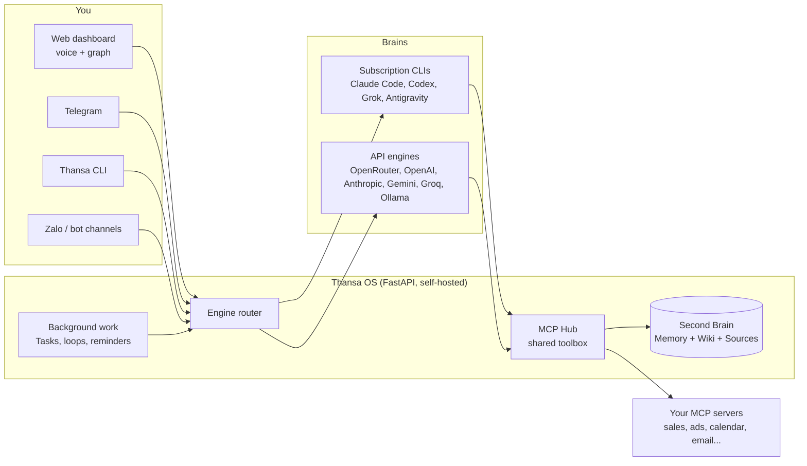

<!-- translated-from: README.md sha256:a93defe7ef8b -->
<div align="center">


# Thansa OS

### 교체 가능한 브레인을 갖춘 셀프 호스팅 AI 에이전트, 그리고 날마다 더 똑똑해지는 Second Brain.

노트북이나 작은 VPS에서 실행합니다. 음성으로 대화합니다. Claude, ChatGPT, Grok, Gemini 등 12개 제공자 중 무엇이든 연결하고, 바꿔도 모든 도구는 그대로 유지되며, 잠자는 동안에도 백그라운드에서 일하게 할 수 있습니다.

[](https://github.com/xahoapro/thansa-os/stargazers)
[](../../../LICENSE)
[](https://github.com/xahoapro/thansa-os/commits/main)
[](../../../requirements.txt)
[](https://github.com/xahoapro/thansa-os/pkgs/container/javis-os)
[](https://modelcontextprotocol.io)

<!-- flags:start -->
<p align="center">
<b>🌐 12개 언어로 제공</b><br><br>
<a href="../../../README.md"></a>
<a href="../vi/README.md"></a>
<a href="../zh/README.md"></a>
<a href="../es/README.md"></a>
<a href="../ja/README.md"></a>
<a href="../hi/README.md"></a>
<a href="../pt-BR/README.md"></a>

<a href="../ru/README.md"></a>
<a href="../de/README.md"></a>
<a href="../fr/README.md"></a>
<a href="../id/README.md"></a>
</p>
<!-- flags:end -->

[🇬🇧 English](../../../README.md) · [🇻🇳 Tiếng Việt](../vi/README.md) · [🇨🇳 简体中文](../zh/README.md) · [🇪🇸 Español](../es/README.md) · [🇯🇵 日本語](../ja/README.md) · [🇮🇳 हिन्दी](../hi/README.md) · [🇧🇷 Português](../pt-BR/README.md) · 🇰🇷 **한국어** · [🇷🇺 Русский](../ru/README.md) · [🇩🇪 Deutsch](../de/README.md) · [🇫🇷 Français](../fr/README.md) · [🇮🇩 Bahasa Indonesia](../id/README.md) · [🌍 번역 돕기](../../../CONTRIBUTING.md#translations)

[빠른 시작](#-빠른-시작) · [왜 Thansa인가](#-왜-thansa인가요) · [브레인](#-12개의-브레인-하나의-툴킷) · [기능](#-기능) · [설치](#-설치) · [문서](../../../docs/en/README.md) · [후원](#-thansa-os-후원하기)

<br>


</div>

> 🌍 이 문서는 영어 README를 자동 번역한 것입니다. Thansa는 사용자가 쓰는 언어로 답합니다. 인터페이스는 현재 영어와 베트남어로 제공됩니다. 전체 문서는 영어로 제공됩니다([docs/en](../../../docs/en/README.md)). 번역 수정은 언제든 환영합니다([CONTRIBUTING](../../../CONTRIBUTING.md#translations)).

---

## ⚡ 빠른 시작

**가장 쉬운 방법: 사용 중인 AI에게 설치를 맡기세요.** 컴퓨터에 있는 Claude Code나 Codex에 이 저장소 링크를 주고 *"Thansa OS 설치해 줘"* 라고 말하면 됩니다. 실행할 명령은 하나뿐입니다.

| 환경 | 명령 하나로 전부 설치 |
|---|---|
| **Linux / macOS** | `git clone https://github.com/xahoapro/thansa-os.git javis && cd javis && chmod +x install.sh && ./install.sh` |
| **Windows** | `git clone https://github.com/xahoapro/thansa-os.git javis; cd javis; powershell -ExecutionPolicy Bypass -File install.ps1` |
| **Docker** | `curl -fsSLO https://raw.githubusercontent.com/xahoapro/thansa-os/main/docker-compose.yml && docker compose up -d` |

그런 다음 **http://localhost:7777** 을 엽니다. 설치 프로그램이 Python, 구독형 CLI 브레인 네 가지(`claude`, `codex`, `agy`, `grok`), `.env` 를 준비한 뒤 서버를 시작합니다. 각 브레인 로그인은 **대시보드의 Models 페이지에서** 하므로 더 이상 명령을 입력할 필요가 없습니다.

> [!NOTE]
> Thansa가 이미 실행 중인 **상태에서** CLI를 추가로 설치했나요? **Thansa를 재시작하세요.** 실행 중인 프로세스는 시작할 때의 PATH를 그대로 유지하므로 나중에 설치한 CLI를 인식하지 못합니다.

<p align="center">

</p>

---

## 🤔 왜 Thansa인가요?

Thansa OS는 챗봇이 **아닙니다**. 사용자의 컴퓨터나 VPS에서 실행되는 **셀프 호스팅 에이전틱 AI** 입니다. 파일을 읽고 쓰고, MCP로 도구를 호출하고, Skill을 실행하고, 백그라운드 작업을 대기열에 넣고, 스스로 일정을 잡습니다. 이 모든 것이 **음성으로 조작하는 대시보드** 와 시간이 지날수록 지식이 쌓이는 **Second Brain**(메모리 + 위키) 위에서 동작합니다.

### 아무도 경고해 주지 않는 종속

AI 앱 하나를 골라 1년 동안 매일 써 보세요. 그런 다음 그 안에 무엇이 쌓였는지 살펴보세요.

- **수백 개의 대화**: 그동안 고민해 정한 결정과 맥락이 담겨 있습니다.
- 내가 누구인지, 어떻게 일하는지, 내 사업이 무엇을 파는지에 대한 **메모리**.
- **사용자 지정 지침, 어시스턴트, 프로젝트**: 몇 시간씩 공들여 다듬은 노하우입니다.
- 그 플랫폼 하나에서만 돌아가는 **자동화와 에이전트**.

이 모든 것이 업체의 서버에, 업체의 형식으로 저장되어 있습니다. 그러다 더 나은 모델이 다른 곳에서 출시됩니다. 써 볼 수는 있지만 지금까지의 작업을 가져갈 수는 없습니다. 새 앱은 나에 대해 아무것도 모르고, 지침은 옮겨지지 않으며, 기록은 그대로 남겨집니다. 내보내기 기능이 있더라도 대개 채팅 기록을 통째로 쏟아 낸 것일 뿐, 다른 도구가 쓸 수 있는 메모리가 아닙니다.

그래서 떠나지 못합니다. 기존 모델이 여전히 최고라서가 아니라, 떠나는 순간 처음부터 다시 시작해야 하기 때문입니다. 그리고 업체가 가격을 올리거나, 한도를 조이거나, 모델을 종료하거나, 계정을 잠그면 플랜 B가 없습니다.

### Thansa는 이를 뒤집습니다: 모델은 빌리고, Brain은 소유하세요

Thansa에서 모델은 교체할 수 있는 부품입니다. 쌓아 온 모든 것은 직접 열어 볼 수 있는 파일로 사용자 곁에 남습니다.

| 쌓아 가는 것 | 저장 위치 | 형식 |
|---|---|---|
| **대화** | 내 컴퓨터나 VPS의 `conversations.db`. 어떤 브레인이 답했든 저장소는 하나 | SQLite, 전문 검색 가능 |
| **나에 대한 메모리** | Brain의 `memory/`: `MEMORY.md` 와 사실 하나당 파일 하나 | 마크다운 |
| **지식** | Brain의 Wiki 폴더와 Sources 폴더 | 마크다운, Obsidian 호환 |
| **Skill** | `skills/<name>/SKILL.md` | 마크다운 |
| **Agent와 Workflow** | `agents/*.md`, `workflows/*.md` | 프런트매터가 있는 마크다운 |
| **Loop와 리마인더** | `Javis/loops/*.md`, `Javis/reminders.json` | 마크다운, JSON |

이것이 가져다주는 것:

- **새 모델이 나왔나요? Models 페이지에서 바꾸고 그대로 이어 가세요.** 같은 메모리를 읽고, 같은 Skill, Agent, Workflow를 실행하고, MCP Hub를 통해 같은 연결을 호출합니다. 옮길 것도, 다시 만들 것도 없습니다.
- **여러 브레인을 동시에 쓰세요.** 대화에는 강력한 모델, 백그라운드 작업에는 더 저렴한 모델, 개인 노트에는 로컬 Ollama 모델을 쓰면서 모두 같은 Brain 위에서 일하게 할 수 있습니다.
- **Thansa 없이도 읽을 수 있습니다.** Brain은 마크다운 폴더입니다. Obsidian이나 어떤 편집기로든 열어 보세요. 내일 Thansa가 사라지더라도 지식은 일반 텍스트로 그대로 남아 있습니다.
- **버전 관리와 이식성.** 학습 한 번이 git 커밋 하나이므로 한 번의 탭으로 되돌릴 수 있고, Brain 전체를 내 비공개 GitHub 저장소와 동기화해 노트북과 VPS가 함께 쓸 수 있습니다.
- **데이터는 내 하드웨어에 머뭅니다.** 중간에 Thansa 클라우드는 없습니다. 요청은 그 작업에 고른 모델 제공자에게만 전달되고, 로컬 Ollama 모델을 쓰면 아예 컴퓨터 밖으로 나가지 않습니다.

### 일반 챗봇과 나란히 놓고 본 Thansa

| | 일반 챗봇 | **Thansa OS** |
|---|---|---|
| **브레인** | 하나의 모델에 묶여 있고, 메시지마다 상태 없는 API 호출 한 번 | **교체 가능**: 12개 제공자, 각각 도구, MCP, Skill, 세션을 모두 사용 가능. Ollama로 내 컴퓨터에서 실행하는 모델도 포함 |
| **메모리** | 세션이 끝나면 모두 잊음 | 사용자를 기억하고 대화할수록 두터워지는 **살아 있는 Second Brain** |
| **데이터** | 지어내거나 아예 없음 | 연결한 서비스(매출, 광고, 캘린더, 이메일, 메신저)에서 가져온 **실제 수치** |
| **작업** | 답하고 나서 기다림 | 결과를 보고해 주는 **백그라운드 Loop, 리마인더, AI가 운영하는 작업 대기열** |
| **인터페이스** | 채팅창 하나 | 대시보드 + 지식 그래프 + **핸즈프리 음성** + Telegram + CLI |
| **내 작업** | 업체의 서버에, 업체의 형식으로 남음 | **내 컴퓨터에 있는 일반 파일**: 기록, 메모리, Skill, Agent, Workflow가 어떤 새 모델로든 그대로 넘어감 |
| **배포** | 남의 클라우드 | **셀프 호스팅**: 원클릭 Hostinger, Docker, 또는 어떤 VPS든 |

> 💡 **철학: 능력은 모델이 아니라 Thansa에 있습니다.** 모든 브레인은 하나의 공유 연결 허브(MCP Hub)를 통해 같은 도구 상자를 받습니다. Claude에서 Gemini로 바꿔도 잃는 것은 셸 접근뿐이며, 이는 CLI 엔진에만 있는 기능입니다.

<p align="center">

</p>

---

## 🧠 12개의 브레인, 하나의 툴킷

**Models** 페이지에서 브레인을 고르고 언제든 바꿀 수 있습니다. Thansa는 현재 **12개 제공자** 를 지원합니다.

<p align="center">

</p>

| 브레인 | 결제 방식 | 셸, 웹, 서브 에이전트 |
|---|---|---|
| **Claude Code** | Claude 요금제 또는 Anthropic API 키 | ✅ |
| **ChatGPT** (Codex 경유) | ChatGPT 요금제 | ✅ |
| **Grok Build** | SuperGrok 또는 X Premium+ 요금제 | ✅ |
| **Antigravity CLI** | Google 요금제(Antigravity IDE와 같은 모델 라인업, Claude 포함) | 셸 ✅ |
| **OpenRouter** | API 키(키 하나로 수백 개 모델) | Thansa 도구로 |
| **OpenAI API** · **Anthropic API** · **Google Gemini** · **Groq** | API 키 | Thansa 도구로 |
| **Ollama Cloud** · **이 컴퓨터의 Ollama** | API 키, 또는 내 하드웨어에서 무료 | Thansa 도구로 |
| **OpenAI 호환 엔드포인트 전부** | 해당 엔드포인트가 요구하는 것 | Thansa 도구로 |

모든 브레인은 연결된 MCP 서버를 호출하고, Brain을 읽고 쓰고, Skill을 실행하고, Kanban 작업을 대기열에 넣고, Agent, Workflow, Loop, 리마인더를 만들 수 있습니다. CLI 엔진은 여기에 더해 **셸 명령 실행**, **웹 가져오기와 검색**, **병렬 서브 에이전트 생성** 도 할 수 있습니다.

> [!WARNING]
> **구독 요금제로 백그라운드 작업을 돌리기 전에 꼭 읽어 주세요.** Anthropic은 Claude Pro/Max를 Claude Code의 **일반적인 개인 사용** 으로 한정합니다. 지속적인 백그라운드 실행(Loop, 리마인더, Kanban 작업, 챗봇), VPS에서의 실행, 여러 사람이 한 계정을 함께 쓰는 경우는 모두 이 범위를 벗어나며, 실제로 이 때문에 **계정이 정지된 사례가 있습니다**. Thansa는 로그인 토큰을 절대 읽지 않고 실제 `claude` 바이너리를 실행하지만, 그렇다고 24시간 백그라운드 사용이 정당해지는 것은 아닙니다. 안전하게 쓰려면 Models 페이지에서 Claude Code를 **API 키** 로 실행하도록 설정하거나, **백그라운드 작업용 모델** 을 다른 제공자로 지정하세요. xAI 요금제에도 같은 주의가 적용됩니다. `server/claude_auth.py` 를 참고하세요.

---

## ✨ 기능

<p align="center">

</p>

<table>
<tr>
<td width="50%" valign="top">

### 🗣️ 말로 대화하기
- **핸즈프리 음성**: 말하면 Thansa가 듣고 소리 내어 답합니다(기본은 무료 Edge TTS, 또는 OpenAI와 ElevenLabs).
- **채팅 세션** 을 저장하고 다시 열고 전문 검색할 수 있습니다. 긴 세션은 잘라 내지 않고 요약으로 압축합니다.
- **Telegram, CLI, 웹 대시보드** 가 모두 같은 Thansa와 대화합니다.
- **모든 언어**: Thansa는 사용자가 쓰는 언어로 답합니다. 인터페이스는 영어와 베트남어로 제공됩니다.

### 🧠 모든 것을 기억하기
- **Second Brain**: 장기 메모리, Wiki, 원본 Sources를 담은 마크다운 볼트(Obsidian 호환)입니다.
- `[[wikilink]]` 로 연결된 노트의 **지식 그래프** 를 오프라인에서도 동작하는 밝은 캔버스에 보여 줍니다.
- **자기 학습**: 대화가 끝날 때마다 Thansa가 메모리, 위키 지식, Skill을 정제합니다. 학습 한 번이 git 커밋 하나이므로 **한 번의 탭으로 되돌릴 수 있습니다**.
- **GitHub 백업**: 모든 Brain을 비공개 저장소와 양방향 동기화하여 노트북과 VPS가 함께 씁니다.

</td>
<td width="50%" valign="top">

### ⚙️ 잠자는 동안 일하기
- **Tasks (Kanban)**: 목표를 평범한 말로 맡기세요. AI가 명세를 쓰고, 담당 워커를 고르고, 백그라운드에서 실행하며, 예외 상황에서만 사용자를 부릅니다.
- **Loop와 리마인더**: 일정 간격, 지정 시각, cron 표현식으로 도는 백그라운드 작업이며, 각 작업이 스스로 결과를 검증합니다.
- **Agent와 Workflow**: 자체 메모리를 가진 전문 어시스턴트를 검증 단계가 있는 다단계 Workflow로 엮습니다.
- **챗봇**: 전용 Telegram 또는 Zalo 봇으로 Agent를 고객 앞에 세우고, 공유 받은편지함에서 언제든 대화를 넘겨받을 수 있습니다.

### 🔌 무엇이든 연결하기
- 서비스마다 여러 계정을 둘 수 있고 Thansa가 **강제로 적용하는** 세 가지 권한 수준을 갖춘 **MCP 연결 스토어**.
- **Skill과 Plugin**: 폴더 하나를 넣기만 하면 모든 엔진에 노하우(Skill)나 네이티브 Python 도구(Plugin)가 추가됩니다.
- 이미 로그인해 둔 ChatGPT 요금제로 **이미지 생성**.
- **사용량 추적**: 일별, 제공자별 토큰과 비용을 직접 입력한 것과 자동으로 실행된 것으로 나누어 보여 줍니다.

</td>
</tr>
</table>

<p align="center">

</p>

<div align="center">


</div>

---

## 🏗️ 동작 방식



- **백엔드:** `server/` 의 Python FastAPI입니다. 엔진(`claude_sdk_engine.py`, `claude_cli.py`, `antigravity_cli.py`, `engine.py`, `aux_engine.py`), 도구(`mcp_hub.py`, `mcp_store.py`, `plugins_host.py`), 백그라운드 작업(`tasks.py`, `self_improve.py`, `reminders.py`, `learn.py`), 언어와 로캘(`lang.py`, `lang_registry.py`, `localefmt.py`)로 구성됩니다.
- **프런트엔드:** `dashboard/` 의 순수 HTML/CSS/JS입니다. 프레임워크도 빌드 단계도 없어서 작은 VPS에서도 가볍게 돌아갑니다. 인터페이스 문자열은 `dashboard/i18n/` 에 있습니다.
- **Second Brain:** `brains/<brain name>/` 에 있는 마크다운 볼트입니다.

---

## 🚀 설치

> [!IMPORTANT]
> Thansa는 컴퓨터에 대한 **모든 권한** 을 가진 AI 브레인을 실행합니다. 공개 환경(Docker, VPS, Hostinger)에서 실행하면 Thansa가 **스스로 로그인을 강제합니다**. 앱을 열면 계정 생성 또는 로그인 화면이 나타나며, 비밀번호 없이는 누구도 조작할 수 없습니다.

<details open>
<summary><b>방법 1: Hostinger Docker Manager (도메인 + HTTPS, 원클릭)</b></summary>

Hostinger VPS → **Docker Manager → Compose → URL** → Hostinger용 파일을 붙여 넣고 **Deploy** 를 누릅니다.

```
https://raw.githubusercontent.com/xahoapro/thansa-os/main/docker-compose.hostinger.yml
```

**Environment** 상자에는 세 가지 항목만 있으면 됩니다: `DOMAIN_NAME`, `JAVIS_ADMIN_USER`, `JAVIS_ADMIN_PASSWORD`. 선택 항목으로 `JAVIS_AUTO_UPDATE` 가 있습니다(`true` 로 설정하면 Thansa가 매일 스스로 업데이트합니다).

Hostinger의 Traefik이 HTTPS 인증서를 발급하도록 `DOMAIN_NAME` 을 설정합니다.
- **무료 링크**(도메인 구매 불필요): `DOMAIN_NAME=javis.<vps-hostname>.hstgr.cloud` (호스트 이름은 hPanel → VPS에서 확인, 예: `javis.srv1562015.hstgr.cloud`).
- **보유한 도메인:** `DOMAIN_NAME=example.com` 으로 설정하고 A 레코드를 VPS IP로 지정합니다.

인증서 발급까지 1-3분 기다린 다음 `https://<DOMAIN_NAME>` 을 엽니다.

**한 번만 하면 되는 세 단계:**
1. **GHCR 이미지를 Public으로 설정:** GitHub → 저장소 → **Packages** → `javis-os` → *Package settings* → Visibility = **Public**.
2. **관리자 계정 생성:** `JAVIS_ADMIN_USER` + `JAVIS_ADMIN_PASSWORD` 를 채우거나(권장), 배포 직후 앱을 열어 직접 만듭니다. 관리자가 없는 동안에는 링크를 먼저 연 사람이 관리자를 만들 수 있습니다. 그다음 **2FA를 켜세요**([보안과 계정](../../../docs/en/14-security-and-accounts.md)).
3. **Models** 페이지에서 **브레인에 로그인** 합니다.

자세한 내용과 문제 해결: [DEPLOY.en.md](../../../DEPLOY.en.md).

</details>

<details>
<summary><b>방법 2: 아무 VPS에서 Docker로 (clone 불필요)</b></summary>

```bash
# Docker required (don't have it?  curl -fsSL https://get.docker.com | sh)
mkdir javis && cd javis
curl -fsSLO https://raw.githubusercontent.com/xahoapro/thansa-os/main/docker-compose.yml

docker compose run --rm javis claude auth login --claudeai   # sign in to Claude once (optional)
docker compose up -d                                          # pull the image and run
```

`http://<vps-ip>:7777` 을 열고 곧바로 관리자 사용자 이름과 비밀번호(8자 이상)를 설정하거나, 환경 변수에 `JAVIS_ADMIN_USER` + `JAVIS_ADMIN_PASSWORD` 를 미리 지정해 둡니다. 그다음 2FA를 켜세요.

도메인 없이 원격 접속하려면: `docker compose --profile tunnel up -d` 를 실행한 뒤 `docker compose logs tunnel | grep trycloudflare` 를 실행하면 HTTPS 링크가 출력됩니다.

</details>

<details>
<summary><b>방법 3: Docker 없이 Linux 또는 macOS</b></summary>

```bash
git clone https://github.com/xahoapro/thansa-os.git javis && cd javis
chmod +x install.sh && ./install.sh
```

스크립트가 Python, Node, CLI 브레인을 설치하고, venv를 만들고, 부팅 시 시작되는 서비스를 등록한 뒤 접속 주소를 출력합니다.

🍎 **macOS에서 앱처럼 열기:** `JAVIS OS.app`(또는 `Start JAVIS OS.command`)을 더블클릭합니다. 로그인 시 자동 시작: `./bin/javis-autostart.sh install`. 자세한 내용: [bin/README.md](../../../bin/README.md).

</details>

<details>
<summary><b>방법 4: Windows (개인 컴퓨터)</b></summary>

```powershell
git clone https://github.com/xahoapro/thansa-os.git javis; cd javis
powershell -ExecutionPolicy Bypass -File install.ps1
```

`install.ps1` 이 한 번에 모두 처리합니다: Python, venv와 라이브러리, 구독형 CLI 브레인 네 가지(`claude`, `codex`, `agy`, `grok`), `.env`, 7777 포트 확보, 서버 시작까지. 마지막에는 어떤 브레인이 준비되었는지 표로 보여 줍니다. `winget` 이 없다면 Python 3.12("Add python.exe to PATH" 체크)와 Node.js LTS를 먼저 직접 설치한 뒤 다시 실행하세요.

```
Run with a visible window (live log):  setup.bat
Run silently from then on:             start-javis.vbs   (log at server\javis.log)
Stop:                                  stop-javis.bat
Dashboard:                             http://localhost:7777
```

🪟 **앱처럼 열기:** 처음 실행한 뒤에는 **`JAVIS OS.bat`** 을 더블클릭합니다. 서버가 백그라운드에서 시작되고 대시보드가 작업 표시줄 항목을 가진 **별도 창** 으로 열립니다. 로그인 시 자동 시작: `javis-autostart.bat install`(제거: `uninstall`).

</details>

<details>
<summary><b>VPS 하나에 Thansa 여러 개 실행하기</b></summary>

Brain, 설정, 계정은 인스턴스마다 완전히 분리됩니다. 인스턴스끼리 다른 값은 `JAVIS_NAME`, `JAVIS_HOST_PORT`, `DOMAIN_NAME` 세 가지뿐입니다.

- **Hostinger:** `docker-compose.hostinger.yml` 을 두 번째 스택으로 다시 배포하고 이 세 항목을 채웁니다.
- **직접 관리하는 VPS:** 공유 프록시 `docker-compose.proxy.yml` 을 컴퓨터 전체에서 한 번만 실행한 뒤, 인스턴스마다 `docker-compose.multi.yml` 로 별도 폴더를 만듭니다. 프록시가 새 인스턴스를 찾아 SSL을 스스로 요청합니다.
- **네이티브:** `JAVIS_NAME=javis-shop JAVIS_PORT=7778 ./install.sh`.

단계별 안내: [DEPLOY.en.md](../../../DEPLOY.en.md).

</details>

### 🎬 첫 실행

Thansa를 열면 설정 마법사가 브라우저 언어로 차근차근 안내합니다.

1. **관리자 계정**: 공개 환경에서 실행할 때 필수이며, 낯선 사람의 접근을 막습니다.
2. **브레인 선택**: 구독 요금제로 한 번 로그인하거나 API 키를 붙여 넣습니다. Claude Code 카드에는 로그인한 요금제와 Anthropic API 키 사이를 전환하는 **"Runs on"** 스위치가 있습니다.
3. **모델 선택**: 나중에 제공자를 바꿔도 기능을 잃지 않습니다(CLI 엔진에만 있는 셸 명령은 예외).
4. **연결 설정**(선택): **Connections** 를 열고 서비스를 골라 키를 붙여 넣거나 QR 코드를 스캔합니다. 그러면 Thansa가 그 서비스의 실제 수치로 보고합니다.

---

## 📖 Thansa 사용하기

왼쪽 레일은 페이지를 **6개 그룹** 으로 묶습니다. 모든 페이지에는 [docs/en/](../../../docs/en/README.md) 에 안내서가 있습니다.

| 그룹 | 페이지 | 안내서 |
|---|---|---|
| **Brain** | Graph, Chat, Files, Self-learning | [채팅과 음성](../../../docs/en/02-chat-and-voice.md) · [지식 그래프](../../../docs/en/03-knowledge-graph.md) · [세션](../../../docs/en/04-sessions.md) · [파일 관리자](../../../docs/en/05-file-manager.md) · [자기 학습](../../../docs/en/22-self-learning.md) |
| **Code** | Terminal, Coding | [코드 터미널](../../../docs/en/27-code-terminal.md) |
| **Capabilities** | Partners (Agent와 Workflow), Chatbot, Skills, Plugins | [Agent와 Workflow](../../../docs/en/07-agents-and-workflows.md) · [챗봇](../../../docs/en/25-chatbots.md) · [고객 대화](../../../docs/en/28-customer-conversations.md) · [Skill](../../../docs/en/06-skills.md) · [Plugin](../../../docs/en/20-plugins.md) |
| **Work** | Tasks, Scheduled | [Tasks (Kanban)](../../../docs/en/21-kanban-work.md) · [반복 작업과 리마인더](../../../docs/en/08-recurring-jobs.md) |
| **Connections** | Connections, Thansa Store, Channels, Models | [연결과 비즈니스 데이터](../../../docs/en/09-connections-and-business-data.md) · [Telegram](../../../docs/en/11-telegram.md) · [Zalo](../../../docs/en/12-zalo-agent-mcp.md) · [모델과 엔진](../../../docs/en/10-models-and-engines.md) |
| **System** | Settings, Share links, Account | [시작하기](../../../docs/en/01-getting-started.md) · [보안과 계정](../../../docs/en/14-security-and-accounts.md) · [사용량과 비용](../../../docs/en/23-usage-and-cost.md) · [Thansa CLI](../../../docs/en/24-cli.md) |

더 보기: [Second Brain: 메모리, Wiki, INGEST](../../../docs/en/13-second-brain.md) · [GitHub 백업](../../../docs/en/18-github-backup.md) · [노트 속 Tasks와 Dataview](../../../docs/en/19-tasks-and-dataview.md) · [브랜딩과 사용자 지정 도메인](../../../docs/en/15-branding-and-domains.md) · [문제 해결](../../../docs/en/17-troubleshooting.md)

### 이런 것을 해 보세요

- **수치 물어보기:** *"오늘 매출이 어제와 비교해서 어때?"* Thansa가 알맞은 연결을 호출해 실제 수치와 제안을 함께 답합니다.
- **지식 소화하기:** 파일이나 노트를 넣어 보세요. Thansa가 요약하고, 인사이트를 뽑아내고, Wiki에 기록하고, 할 일을 제안합니다.
- **백그라운드 작업 맡기기:** **Tasks** → **+ Assign goal** → *"이번 주 매출을 요약하고, 잘 안 팔리는 재고를 찾아서, 그걸 밀어줄 캡션 세 개를 초안으로 써 줘"*. AI가 명세를 만들고 실행한 뒤 결과를 보고합니다.
- **일정 잡기:** 채팅이나 **Scheduled** 페이지에서 *"평일마다 오전 8시 30분에 광고 예산 확인하라고 알려 줘"*.
- **음성 사용하기:** 마이크를 누르거나(또는 핸즈프리를 켜고) 말하면 Thansa가 소리 내어 답합니다.

<div align="center">

<br><sub>휴대폰에서도 동작합니다. 홈 화면에 추가하면 앱처럼 열립니다.</sub>
</div>

---

## ⚙️ 설정 (`.env`)

모든 줄을 비워 두어도 Thansa는 실행됩니다. `env.example` → `.env` 로 복사하고 필요한 것만 추가하세요. 변수별 설명이 담긴 전체 목록은 [docs/en/16-env-configuration.md](../../../docs/en/16-env-configuration.md) 에 있습니다.

| 변수 | 의미 | 기본값 |
|---|---|---|
| `JAVIS_HOST` | 수신 주소. `127.0.0.1` = 이 컴퓨터만, `0.0.0.0` = 공개 | `127.0.0.1` |
| `JAVIS_PORT` | 포트 | `7777` |
| `JAVIS_REQUIRE_LOGIN` | `1`/`0` 으로 로그인 강제를 켜거나 끔(기본: 공개 주소에 바인딩하면 켜짐) | *(자동)* |
| `JAVIS_ADMIN_USER` / `JAVIS_ADMIN_PASSWORD` | 배포 시 관리자 생성 | - |
| `JAVIS_ALLOWED_HOSTS` | 허용 목록에 추가할 호스트 이름(CSRF 및 DNS 리바인딩 방어) | localhost + 내 도메인 |
| `JAVIS_STATE_DIR` | 설정, 세션, 암호화 키가 저장되는 위치 | `server/` (Docker: `/data/state`) |
| `BRAINS_DIR` | 모든 Brain을 담는 상위 폴더 | `brains/` (Docker: `/brains`) |
| `JAVIS_ENABLE_USER_PLUGINS` | `true` 면 직접 만든 Plugin 실행 허용(서버 안에서 실제 Python이 실행됨) | *(꺼짐)* |
| `TTS_VOICE` / `TTS_RATE` | Edge TTS의 음성과 속도 | `en-US-EmmaMultilingualNeural` / `+5%` |

---

## 🔐 보안

- 브레인이 컴퓨터에 대한 모든 권한으로 실행되므로, 공개 서버에서는 어떤 기능이든 쓰기 전에 **로그인이 필요합니다**.
- **2FA (TOTP)**, 로그인 시도 횟수 제한, 8자 이상 비밀번호, HTTPS에서 `Secure` 쿠키, 30일 후 만료되는 세션.
- **CSRF 및 DNS 리바인딩 방어**: 알 수 없는 출처에서 온 쓰기 요청은 모두 거부됩니다.
- **비밀 정보는 암호화** 되어 `settings.json` 에 저장됩니다(API 키, OAuth 토큰, 봇 토큰). 암호화 키는 컴퓨터마다 다릅니다.
- **직접 만든 Plugin은 기본적으로 차단** 되며, `JAVIS_ENABLE_USER_PLUGINS=true` 를 설정해야 실행됩니다.
- **연결 권한은 모델이 아니라 허브가 강제합니다**: 읽기 전용 계정으로는 전송, 결제, 게시를 할 수 없습니다.

취약점을 발견하셨나요? 공개 이슈를 열지 말고 [SECURITY.md](../../../SECURITY.md) 의 절차를 따라 주세요.

---

## 🔄 업데이트

앱에서: **Settings → Updates → Update now**. 진행률 표시줄이 있고, 새 빌드에 문제가 있으면 롤백 버튼으로 되돌릴 수 있습니다. VPS에서: `cd javis && ./update.sh` (새 이미지를 받아 재시작하며, 볼륨에 있는 데이터는 유지됩니다).

---

## 🩺 문제 해결

| 증상 | 해결 방법 |
|---|---|
| CLI를 설치했는데 Models 페이지에 설치되지 않았다고 나옴 | **Thansa를 재시작하세요**: 실행 중인 프로세스는 시작할 때의 PATH를 유지합니다. |
| 7777 포트가 사용 중이라 새 빌드가 시작되지 않음 | 먼저 이전 프로세스를 멈추고(`stop-javis.bat`, 또는 PID 종료) 다시 시작하세요. |
| Hostinger가 이미지를 가져오지 못함 | GHCR 패키지를 **Public** 으로 설정하고 GitHub Action 빌드가 끝날 때까지 기다리세요. |
| 브레인이 로그인되지 않았다고 함 | **Models** → 해당 제공자 카드 → 로그인. |

더 많은 내용은 [docs/en/17-troubleshooting.md](../../../docs/en/17-troubleshooting.md) 에 있습니다.

---

## 📂 저장소 구조

```
javis-os/
├── server/          # FastAPI backend: engines, connections, background work, channels, memory
├── dashboard/       # Frontend (plain JS, no build step)
│   └── i18n/        # Interface strings, one JSON file per language
├── brains/          # Every Second Brain (default: brains/Brain Default)
├── system/          # Ships with the app: bundled plugins, system skills, connection catalogue
├── docs/            # User guides (docs/en/ in English) and translations (docs/i18n/)
├── tests/           # Python + JS test suite (python tests/run.py)
├── install.sh · install.ps1 · update.sh
├── Dockerfile · docker-compose*.yml
└── CLAUDE.md        # The system prompt Thansa runs on
```

---

## 🌍 언어

| 항목 | 현재 지원 언어 |
|---|---|
| **Thansa의 답변** | 모든 언어: 사용자가 쓰는 언어로, 또는 Settings에서 고정한 언어로 답합니다 |
| **대시보드와 서버 메시지** | 🇬🇧 English · 🇻🇳 Tiếng Việt, 기기별 설정: 직접 고르기 전까지 브라우저마다 각자의 언어를 씁니다 |
| **연결 스토어, Plugin, 새 Brain의 시작 파일** | 🇬🇧 English · 🇻🇳 Tiếng Việt |
| **README와 빠른 시작** | 🇬🇧 English · 🇻🇳 Tiếng Việt · 🇨🇳 简体中文 · 🇪🇸 Español · 🇯🇵 日本語 · 🇮🇳 हिन्दी · 🇧🇷 Português · 🇰🇷 한국어 · 🇷🇺 Русский · 🇩🇪 Deutsch · 🇫🇷 Français · 🇮🇩 Bahasa Indonesia |
| **전체 문서** | 🇬🇧 English · 🇻🇳 Tiếng Việt |

언어 추가는 코드 변경이 아니라 데이터 변경입니다. `server/lang_registry.py` 에 항목 하나와 `dashboard/i18n/<code>.json` 하나를 추가하고, 필요하면 `system/mcp-catalog.<code>.json` 도 추가하면 됩니다. 아직 번역되지 않은 부분은 영어로 표시됩니다. 도와주실 분은 [CONTRIBUTING.md](../../../CONTRIBUTING.md#translations) 를 참고하세요.

---

## 🤝 기여하기

버그 보고, 아이디어, 번역, 풀 리퀘스트 모두 영어나 베트남어로 환영합니다.

| 시작하기 | 얻을 수 있는 것 |
|---|---|
| [CONTRIBUTING.md](../../../CONTRIBUTING.md) | 개발 환경 설정, 테스트 실행(`python tests/run.py`), 코드 규칙 |
| [ARCHITECTURE.md](../../../ARCHITECTURE.md) | 구성 요소가 맞물리는 방식과 서버 모듈 지도 |
| [docs/dev/GLOSSARY.md](../../../docs/dev/GLOSSARY.md) | 코드베이스가 베트남어로 작성되어 있어서, `nhac_hen`(리마인더) 같은 이름을 풀어 줍니다 |
| [docs/dev/adding-a-language.md](../../../docs/dev/adding-a-language.md) | Thansa를 내 언어로 번역하는 단계별 안내 |
| [이슈 템플릿](https://github.com/xahoapro/thansa-os/issues/new/choose) | 버그 보고, 기능 요청, 번역 제안 |

[행동 강령](../../../CODE_OF_CONDUCT.md) 을 지켜 주시고, 보안 문제는 [SECURITY.md](../../../SECURITY.md) 에 설명된 대로 비공개로 알려 주세요.

Thansa가 유용하다면 저장소에 ⭐ 를 눌러 주세요. 다른 사람들이 찾는 데 도움이 됩니다.

[](https://star-history.com/#xahoapro/thansa-os&Date)

---

## 🙏 크레딧

- **브레인:** [Claude Code](https://claude.com/claude-code) 와 [Claude Agent SDK](https://docs.claude.com/en/api/agent-sdk/overview)(Anthropic), [Codex CLI](https://developers.openai.com/codex/cli)(OpenAI), [Grok Build](https://x.ai)(xAI), [Antigravity](https://antigravity.google)(Google), 그리고 [OpenRouter](https://openrouter.ai), OpenAI, [Google Gemini](https://ai.google.dev), Anthropic, [Groq](https://groq.com), [Ollama](https://ollama.com) 의 API.
- **도구 표준:** [Model Context Protocol](https://modelcontextprotocol.io). Thansa 연결 스토어 전체가 이 표준 위에서 동작합니다.
- Second Brain과 디지털 Bullet Journal 패턴.

## 📄 라이선스

**MIT License** 로 공개된 오픈 소스입니다. 저작권 표시만 유지하면 자유롭게 사용, 수정, 배포할 수 있습니다. [LICENSE](../../../LICENSE) 를 참고하세요.

---

## ☕ Thansa OS 후원하기

Thansa OS는 무료 오픈 소스이며, 아직 한 사람이 코드를 쓰고 테스트 서버 비용을 내고 있습니다. Thansa가 일이나 생활에 도움이 된다면, 작은 후원이 버그 수정과 새 기능에 쓸 시간을 더 만들어 줍니다.

- 🌍 **PayPal**: [paypal.me/quy01](https://paypal.me/quy01)
- 🏦 **MB Bank** (베트남): `6636966369`
- 📱 **MoMo 지갑** (베트남): `0372752740`

후원이 어렵다면 Thansa를 쓰고, 피드백을 보내고, 풀 리퀘스트를 여는 것도 모두 큰 후원입니다.

<div align="center">
<br>
베트남에서 ☕ 와 함께 <b><a href="https://tradingauto.org">Duy Quang</a></b> 가 만들었습니다
</div>
