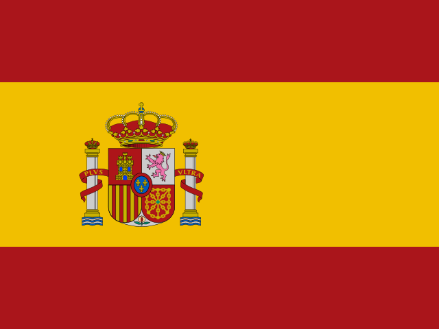
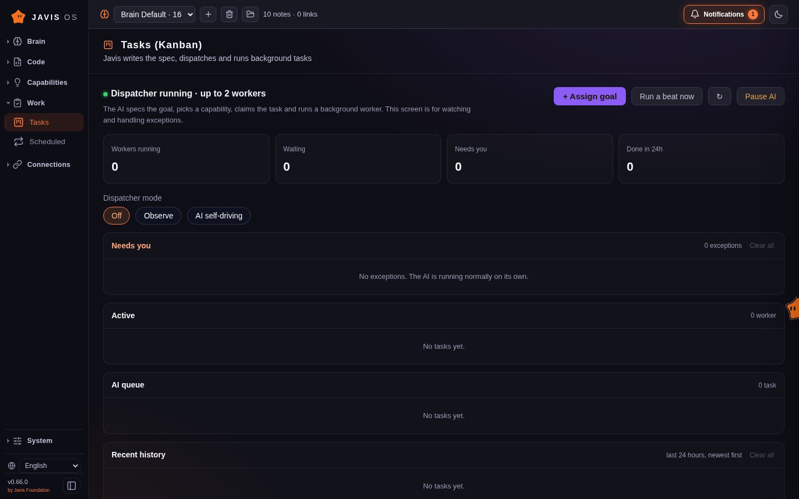
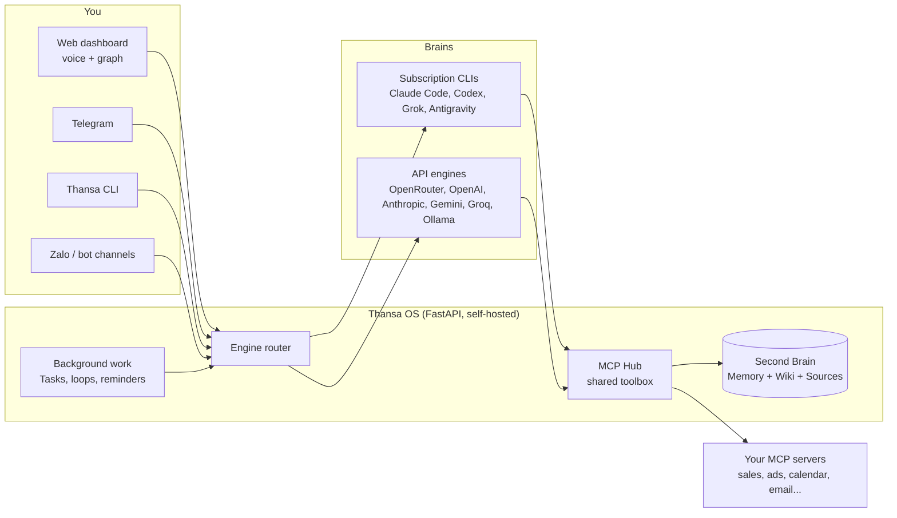
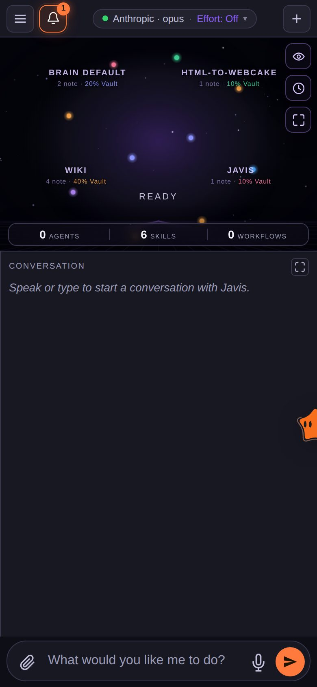

<!-- translated-from: README.md sha256:2e10ad3d2a86 -->
<div align="center">


# Thansa OS

### Seu agente de IA self-hosted com um cérebro intercambiável e um Second Brain que fica mais inteligente a cada dia.

Rode no seu notebook ou em uma VPS pequena. Converse com ele por voz. Conecte Claude, ChatGPT, Grok, Gemini ou qualquer um dos 12 provedores, mantenha todas as ferramentas quando trocar de um para outro e deixe ele trabalhar em segundo plano enquanto você dorme.

[](https://github.com/xahoapro/thansa-os/stargazers)
[](../../../LICENSE)
[](https://github.com/xahoapro/thansa-os/commits/main)
[](../../../requirements.txt)
[](https://github.com/xahoapro/thansa-os/pkgs/container/javis-os)
[](https://modelcontextprotocol.io)

<!-- flags:start -->
<p align="center">
<b>🌐 Disponível em 12 idiomas</b><br><br>
<a href="../../../README.md"></a>
<a href="../vi/README.md"></a>
<a href="../zh/README.md"></a>
<a href="../es/README.md"></a>
<a href="../ja/README.md"></a>
<a href="../hi/README.md"></a>

<a href="../ko/README.md"></a>
<a href="../ru/README.md"></a>
<a href="../de/README.md"></a>
<a href="../fr/README.md"></a>
<a href="../id/README.md"></a>
</p>
<!-- flags:end -->

[🇬🇧 English](../../../README.md) · [🇻🇳 Tiếng Việt](../vi/README.md) · [🇨🇳 简体中文](../zh/README.md) · [🇪🇸 Español](../es/README.md) · [🇯🇵 日本語](../ja/README.md) · [🇮🇳 हिन्दी](../hi/README.md) · 🇧🇷 **Português** · [🇰🇷 한국어](../ko/README.md) · [🇷🇺 Русский](../ru/README.md) · [🇩🇪 Deutsch](../de/README.md) · [🇫🇷 Français](../fr/README.md) · [🇮🇩 Bahasa Indonesia](../id/README.md) · [🌍 Ajude a traduzir](../../../CONTRIBUTING.md#translations)

[Início rápido](#-início-rápido) · [Por que o Thansa](#-por-que-o-thansa) · [Cérebros](#-12-cérebros-um-só-kit-de-ferramentas) · [Recursos](#-recursos) · [Instalação](#-instalação) · [Documentação](../../../docs/en/README.md) · [Apoio](#-apoie-o-thansa-os)

<br>


</div>

> 🌍 Esta é uma tradução automática do README em inglês. O Thansa responde no idioma em que você escrever; por enquanto, a interface está disponível em inglês e vietnamita. A documentação completa está em inglês ([docs/en](../../../docs/en/README.md)). Correções são muito bem-vindas ([CONTRIBUTING](../../../CONTRIBUTING.md#translations)).

---

## ⚡ Início rápido

**O jeito fácil: deixe a sua própria IA instalar.** Passe o link deste repositório para o Claude Code ou o Codex na sua máquina e diga *"instale o Thansa OS para mim"*. Ele só precisa rodar um comando:

| Máquina | Um comando instala tudo |
|---|---|
| **Linux / macOS** | `git clone https://github.com/xahoapro/thansa-os.git javis && cd javis && chmod +x install.sh && ./install.sh` |
| **Windows** | `git clone https://github.com/xahoapro/thansa-os.git javis; cd javis; powershell -ExecutionPolicy Bypass -File install.ps1` |
| **Docker** | `curl -fsSLO https://raw.githubusercontent.com/xahoapro/thansa-os/main/docker-compose.yml && docker compose up -d` |

Depois abra **http://localhost:7777**. O instalador configura o Python, os quatro cérebros CLI por assinatura (`claude`, `codex`, `agy`, `grok`) e um `.env`, e então inicia o servidor. Você faz login em cada cérebro **na página Models (Modelos) do dashboard**, sem precisar digitar mais nenhum comando.

> [!NOTE]
> Instalou uma CLI extra **depois** que o Thansa já estava rodando? **Reinicie o Thansa.** Um processo em execução mantém o PATH com que foi iniciado, então ele não enxerga uma CLI instalada depois.

<p align="center">

</p>

---

## 🤔 Por que o Thansa?

O Thansa OS **não** é um chatbot. É uma **IA agêntica self-hosted** que roda na sua própria máquina ou VPS: lê e escreve arquivos, chama ferramentas via MCP, executa skills, coloca trabalho em fila para rodar em segundo plano e agenda a si mesma. Tudo isso fica por trás de um **dashboard controlado por voz** com um **Second Brain** (memória + wiki) que acumula conhecimento com o tempo.

### A prisão que ninguém te conta

Escolha um app de IA e use todo dia durante um ano. Depois olhe o que foi se acumulando lá dentro:

- **Centenas de conversas**, com as decisões e o contexto que você foi construindo pelo caminho.
- **Memória** sobre quem você é, como você trabalha e o que o seu negócio vende.
- **Instruções personalizadas, assistentes e projetos**: know-how que levou horas para ajustar.
- **Automações e agentes** que só rodam naquela plataforma.

Tudo isso fica nos servidores do fornecedor, no formato do fornecedor. Aí sai um modelo melhor em outro lugar. Você até pode testar, mas não consegue levar o seu trabalho junto: o app novo não sabe nada sobre você, as suas instruções não vão junto e o seu histórico fica para trás. As exportações, quando existem, costumam ser um despejo de logs de chat, não uma memória que outra ferramenta consiga usar.

Então você fica. Não porque o modelo antigo ainda é o melhor, mas porque sair significa começar do zero. E quando o fornecedor aumenta os preços, aperta os limites, aposenta um modelo ou bloqueia a sua conta, não existe plano B.

### O Thansa inverte o jogo: alugue o modelo, seja dono do Brain

No Thansa o modelo é uma peça que você troca. Tudo o que você constrói fica com você, em arquivos que você pode abrir:

| O que você constrói | Onde fica | Formato |
|---|---|---|
| **Conversas** | `conversations.db` na sua própria máquina ou VPS, um único armazenamento, não importa qual cérebro respondeu | SQLite, com busca de texto completo |
| **Memória sobre você** | `memory/` no seu Brain: `MEMORY.md` mais um arquivo para cada fato | Markdown |
| **Conhecimento** | as pastas Wiki e Sources do seu Brain | Markdown, compatível com Obsidian |
| **Skills** | `skills/<name>/SKILL.md` | Markdown |
| **Agents e workflows** | `agents/*.md`, `workflows/*.md` | Markdown com front matter |
| **Loops e lembretes** | `Javis/loops/*.md`, `Javis/reminders.json` | Markdown, JSON |

O que você ganha com isso:

- **Saiu um modelo novo? Troque na página Models e siga em frente.** Ele lê a mesma memória, executa as mesmas skills, agents e workflows e chama as mesmas conexões pelo MCP Hub. Nada para migrar, nada para reconstruir.
- **Use vários cérebros ao mesmo tempo.** Um modelo forte para a conversa, um mais barato para o trabalho em segundo plano, um modelo local do Ollama para as notas privadas, todos trabalhando no mesmo Brain.
- **Legível sem o Thansa.** O seu Brain é uma pasta de markdown. Abra no Obsidian ou em qualquer editor. Se o Thansa sumisse amanhã, o seu conhecimento continuaria lá, em texto puro.
- **Versionado e portátil.** Cada rodada de aprendizado é um commit de git que você desfaz com um toque, e o Brain inteiro pode sincronizar com o seu próprio repositório privado no GitHub, compartilhado entre o seu notebook e a sua VPS.
- **Os seus dados ficam no seu hardware.** Não existe nenhuma nuvem do Thansa no meio. Cada requisição vai só para o provedor de modelo que você escolheu para ela, e com um modelo local do Ollama ela nunca sai da sua máquina.

### O Thansa lado a lado com um chatbot comum

| | Um chatbot comum | **Thansa OS** |
|---|---|---|
| **Cérebro** | Preso a um único modelo, uma chamada de API sem estado por mensagem | **Intercambiável**: 12 provedores, cada um com o conjunto completo de ferramentas, MCP, skills e sessões, incluindo modelos rodando na sua própria máquina via Ollama |
| **Memória** | Esquece tudo a cada sessão | **Um Second Brain vivo** que lembra de você e fica mais rico a cada conversa |
| **Dados** | Inventados, ou inexistentes | **Números reais** das conexões que você configurar (vendas, anúncios, agenda, e-mail, mensagens) |
| **Trabalho** | Responde e fica esperando | **Loops em segundo plano, lembretes e uma fila de tarefas gerenciada pela IA** que te reportam os resultados |
| **Interface** | Uma caixa de chat | Dashboard + grafo de conhecimento + **voz sem usar as mãos** + Telegram, Slack, WhatsApp, Zalo + uma CLI |
| **Seu trabalho** | Fica nos servidores do fornecedor, no formato do fornecedor | **Arquivos simples na sua máquina**: histórico, memória, skills, agents e workflows passam para qualquer modelo novo |
| **Deploy** | A nuvem de outra pessoa | **Self-hosted**: Hostinger em um clique, Docker ou qualquer VPS |

> 💡 **A filosofia: a capacidade mora no Thansa, não no modelo.** Todo cérebro recebe a mesma caixa de ferramentas por meio de um único hub de conexões compartilhado (o MCP Hub). Trocar do Claude para o Gemini não te custa nada além do acesso ao shell, que só os motores CLI têm.

<p align="center">

</p>

---

## 🧠 12 cérebros, um só kit de ferramentas

Escolha o cérebro na página **Models** e troque quando quiser. Hoje o Thansa suporta **12 provedores**.

<p align="center">

</p>

| Cérebro | Como você paga | Shell, web, subagentes |
|---|---|---|
| **Claude Code** | Seu plano do Claude, ou uma API key da Anthropic | ✅ |
| **ChatGPT** (via Codex) | Seu plano do ChatGPT | ✅ |
| **Grok Build** | Seu plano SuperGrok ou X Premium+ | ✅ |
| **Antigravity CLI** | Seu plano do Google (a mesma linha de modelos do Antigravity IDE, Claude incluído) | Shell ✅ |
| **OpenRouter** | API key (centenas de modelos com uma única chave) | via ferramentas do Thansa |
| **OpenAI API** · **Anthropic API** · **Google Gemini** · **Groq** | API key | via ferramentas do Thansa |
| **Ollama Cloud** · **Ollama nesta máquina** | API key, ou grátis no seu próprio hardware | via ferramentas do Thansa |
| **Qualquer endpoint compatível com OpenAI** | O que esse endpoint exigir | via ferramentas do Thansa |

Todo cérebro pode chamar os seus servidores MCP conectados, ler e escrever no Brain, executar skills, colocar trabalho no Kanban e criar agents, workflows, loops e lembretes. Os motores CLI, além disso, rodam **comandos de shell**, **buscam e pesquisam na web** e **disparam subagentes em paralelo**.

> [!WARNING]
> **Leia isto antes de deixar uma assinatura rodar trabalho em segundo plano.** A Anthropic limita o Claude Pro/Max ao **uso pessoal comum** do Claude Code. Execução contínua em segundo plano (loops, lembretes, jobs do Kanban, chatbots), rodar em uma VPS ou várias pessoas compartilhando uma mesma conta ficam fora desse escopo, e **contas já foram suspensas** por isso. O Thansa nunca lê o seu token de login: ele roda o binário real do `claude`, mas isso não torna legítimo o uso em segundo plano 24 horas por dia. Por segurança, configure o Claude Code para rodar com uma **API key** na página Models, ou aponte o **modelo de trabalho em segundo plano** para outro provedor. A mesma cautela vale para o plano da xAI. Veja `server/claude_auth.py`.

---

## ✨ Recursos

<p align="center">

</p>

<table>
<tr>
<td width="50%" valign="top">

### 🗣️ Converse com ele
- **Voz sem usar as mãos**: você fala, o Thansa escuta e responde em voz alta (Edge TTS grátis por padrão, ou OpenAI e ElevenLabs).
- **Sessões de chat** que você pode salvar, reabrir e pesquisar em texto completo. Sessões longas são compactadas em resumos em vez de serem cortadas.
- **Telegram, Slack, WhatsApp, Zalo, uma CLI e um dashboard web**, todos falando com o mesmo Thansa ([configuração do Slack e do WhatsApp](../../../docs/en/29-slack-whatsapp.md)).
- **Qualquer idioma**: o Thansa responde no idioma em que você escreve. A interface vem em inglês e vietnamita.

### 🧠 Lembre de tudo
- **Second Brain**: um vault em markdown (compatível com o Obsidian) com memória de longo prazo, uma Wiki e as Sources brutas.
- **Grafo de conhecimento** das suas notas ligadas por `[[wikilink]]`, em um canvas claro que funciona offline.
- **Autoaprendizado**: depois de cada conversa, o Thansa destila memórias, conhecimento para a wiki e skills. Cada rodada de aprendizado é um commit do git, então dá para **desfazer com um toque**.
- **Backup no GitHub**: sincronização bidirecional de cada Brain com um repositório privado, compartilhado entre o seu notebook e a sua VPS.

</td>
<td width="50%" valign="top">

### ⚙️ Trabalha enquanto você dorme
- **Tarefas (Kanban)**: passe um objetivo com suas próprias palavras. A IA escreve a especificação, escolhe um worker, roda em segundo plano e só te chama quando aparece alguma exceção.
- **Loops e lembretes**: jobs em segundo plano por intervalo, em um horário fixo ou com uma expressão cron, cada um conferindo o próprio trabalho.
- **Agents e workflows**: assistentes especialistas com memória própria, encadeados em workflows de várias etapas com verificação.
- **Chatbots**: coloque um agent para atender os seus clientes no próprio bot de Telegram, Slack, WhatsApp ou Zalo dele, com uma caixa de entrada compartilhada em que você pode assumir a conversa.

### 🔌 Conecte qualquer coisa
- **Loja de conexões MCP** com várias contas por serviço e três níveis de permissão que o Thansa **aplica de forma rígida**.
- **Skills e plugins**: solte uma pasta para adicionar know-how (skill) ou uma ferramenta nativa em Python (plugin) para todos os motores.
- **Geração de imagens** no plano do ChatGPT em que você já está logado.
- **Acompanhamento de uso**: tokens e custo por dia, por provedor, separando o que você digitou do que rodou sozinho.

</td>
</tr>
</table>

<p align="center">

</p>

<div align="center">


</div>

---

## 🏗️ Como funciona



- **Backend:** Python FastAPI em `server/`: motores (`claude_sdk_engine.py`, `claude_cli.py`, `antigravity_cli.py`, `engine.py`, `aux_engine.py`), ferramentas (`mcp_hub.py`, `mcp_store.py`, `plugins_host.py`), trabalho em segundo plano (`tasks.py`, `self_improve.py`, `reminders.py`, `learn.py`), idioma e localização (`lang.py`, `lang_registry.py`, `localefmt.py`).
- **Frontend:** HTML/CSS/JS puro em `dashboard/`. Sem framework e sem etapa de build, então continua leve em uma VPS pequena. Os textos da interface ficam em `dashboard/i18n/`.
- **Second Brain:** um vault em markdown em `brains/<brain name>/`.

---

## 🚀 Instalação

> [!IMPORTANT]
> O Thansa roda um cérebro de IA com **permissões totais** na máquina. Quando ele roda publicamente (Docker, VPS, Hostinger), o Thansa **exige login por conta própria**: ao abrir o app aparece uma tela para criar conta ou entrar, e ninguém consegue usá-lo sem senha.

<details open>
<summary><b>Opção 1: Hostinger Docker Manager (domínio + HTTPS, em um clique)</b></summary>

VPS da Hostinger → **Docker Manager → Compose → URL** → cole o arquivo da Hostinger e clique em **Deploy**:

```
https://raw.githubusercontent.com/xahoapro/thansa-os/main/docker-compose.hostinger.yml
```

A caixa **Environment** só precisa de três campos: `DOMAIN_NAME`, `JAVIS_ADMIN_USER`, `JAVIS_ADMIN_PASSWORD`, mais um `JAVIS_AUTO_UPDATE` opcional (defina como `true` e o Thansa se atualiza sozinho todo dia).

Defina `DOMAIN_NAME` para que o Traefik da Hostinger emita o HTTPS:
- **Link grátis** (sem comprar domínio): `DOMAIN_NAME=javis.<vps-hostname>.hstgr.cloud` (o hostname fica em hPanel → VPS, ex.: `javis.srv1562015.hstgr.cloud`).
- **Seu próprio domínio:** `DOMAIN_NAME=example.com` e aponte um registro A para o IP da VPS.

Espere 1-3 minutos pelo certificado e depois abra `https://<DOMAIN_NAME>`.

**Três passos que você faz uma única vez:**
1. **Deixe a imagem do GHCR pública:** GitHub → repo → **Packages** → `javis-os` → *Package settings* → Visibility = **Public**.
2. **Crie a conta de admin:** preencha `JAVIS_ADMIN_USER` + `JAVIS_ADMIN_PASSWORD` (recomendado), ou abra o app logo depois do deploy e defina uma você mesmo. Enquanto não existir um admin, quem abrir o link primeiro pode criá-lo. Depois, **ative o 2FA** ([Segurança e contas](../../../docs/en/14-security-and-accounts.md)).
3. **Faça login em um cérebro** na página **Models**.

Detalhes e solução de problemas: [DEPLOY.en.md](../../../DEPLOY.en.md).

</details>

<details>
<summary><b>Opção 2: Docker em qualquer VPS (sem precisar clonar)</b></summary>

```bash
# Docker required (don't have it?  curl -fsSL https://get.docker.com | sh)
mkdir javis && cd javis
curl -fsSLO https://raw.githubusercontent.com/xahoapro/thansa-os/main/docker-compose.yml

docker compose run --rm javis claude auth login --claudeai   # sign in to Claude once (optional)
docker compose up -d                                          # pull the image and run
```

Abra `http://<vps-ip>:7777` e defina na hora o usuário e a senha do admin (pelo menos 8 caracteres), ou deixe `JAVIS_ADMIN_USER` + `JAVIS_ADMIN_PASSWORD` já definidos no ambiente. Depois ative o 2FA.

Acesso remoto sem domínio: `docker compose --profile tunnel up -d`, e então `docker compose logs tunnel | grep trycloudflare` mostra um link HTTPS.

</details>

<details>
<summary><b>Opção 3: Linux ou macOS, sem Docker</b></summary>

```bash
git clone https://github.com/xahoapro/thansa-os.git javis && cd javis
chmod +x install.sh && ./install.sh
```

O script instala Python, Node e os cérebros CLI, cria um venv, registra um serviço que inicia junto com o sistema e mostra o endereço.

🍎 **macOS, abra como um app:** dê dois cliques em `JAVIS OS.app` (ou `Start JAVIS OS.command`). Para iniciar no login: `./bin/javis-autostart.sh install`. Detalhes: [bin/README.md](../../../bin/README.md).

</details>

<details>
<summary><b>Opção 4: Windows (máquina pessoal)</b></summary>

```powershell
git clone https://github.com/xahoapro/thansa-os.git javis; cd javis
powershell -ExecutionPolicy Bypass -File install.ps1
```

O `install.ps1` faz tudo de uma vez: Python, venv e bibliotecas, os quatro cérebros CLI por assinatura (`claude`, `codex`, `agy`, `grok`), o `.env`, libera a porta 7777 e inicia o servidor. No final, mostra uma tabela com os cérebros que estão prontos. Sem o `winget`, instale antes o Python 3.12 (marque "Add python.exe to PATH") e o Node.js LTS manualmente e rode de novo.

```
Run with a visible window (live log):  setup.bat
Run silently from then on:             start-javis.vbs   (log at server\javis.log)
Stop:                                  stop-javis.bat
Dashboard:                             http://localhost:7777
```

🪟 **Abra como um app:** depois da primeira execução, dê dois cliques em **`JAVIS OS.bat`**. O servidor inicia em segundo plano e o dashboard abre em **uma janela própria**, com seu próprio ícone na barra de tarefas. Para iniciar no login: `javis-autostart.bat install` (para remover: `uninstall`).

</details>

<details>
<summary><b>Várias instâncias do Thansa em uma mesma VPS</b></summary>

Brains, configurações e contas ficam totalmente separados por instância. Só três valores mudam entre elas: `JAVIS_NAME`, `JAVIS_HOST_PORT`, `DOMAIN_NAME`.

- **Hostinger:** faça o deploy de `docker-compose.hostinger.yml` de novo como uma segunda stack e preencha esses três campos.
- **VPS gerenciada por você:** rode o proxy compartilhado `docker-compose.proxy.yml` uma vez para a máquina inteira e depois dê a cada instância a sua própria pasta com `docker-compose.multi.yml`. O proxy descobre as novas instâncias e solicita o SSL sozinho.
- **Nativo:** `JAVIS_NAME=javis-shop JAVIS_PORT=7778 ./install.sh`.

Passo a passo: [DEPLOY.en.md](../../../DEPLOY.en.md).

</details>

### 🎬 Primeira execução

Abra o Thansa e o assistente de configuração guia você por tudo, no idioma do seu navegador:

1. **Conta de admin**: obrigatória quando roda publicamente, para manter estranhos do lado de fora.
2. **Escolha um cérebro**: faça login uma vez com uma assinatura ou cole uma API key. O card do Claude Code tem uma chave **"Runs on"** para alternar entre o plano em que você está logado e uma API key da Anthropic.
3. **Escolha um modelo**: trocar de provedor depois não faz você perder nenhum recurso (exceto os comandos de shell, que só os motores CLI têm).
4. **Configure as conexões** (opcional): abra **Connections** (Conexões), escolha um serviço e cole uma chave ou escaneie um QR code. A partir daí o Thansa reporta com base em números reais vindos dele.

---

## 📖 Usando o Thansa

A barra lateral esquerda organiza as páginas em **6 grupos**. Cada página tem um guia em [docs/en/](../../../docs/en/README.md).

| Grupo | Páginas | Guias |
|---|---|---|
| **Brain** | Graph, Chat, Files, Self-learning | [Chat e voz](../../../docs/en/02-chat-and-voice.md) · [Grafo de conhecimento](../../../docs/en/03-knowledge-graph.md) · [Sessões](../../../docs/en/04-sessions.md) · [Gerenciador de arquivos](../../../docs/en/05-file-manager.md) · [Autoaprendizado](../../../docs/en/22-self-learning.md) |
| **Code** | Terminal, Coding | [Terminal de código](../../../docs/en/27-code-terminal.md) |
| **Capabilities** | Partners (agents e workflows), Chatbot, Skills, Plugins | [Agents e workflows](../../../docs/en/07-agents-and-workflows.md) · [Chatbots](../../../docs/en/25-chatbots.md) · [Conversas com clientes](../../../docs/en/28-customer-conversations.md) · [Skills](../../../docs/en/06-skills.md) · [Plugins](../../../docs/en/20-plugins.md) |
| **Work** | Tasks, Scheduled | [Tarefas (Kanban)](../../../docs/en/21-kanban-work.md) · [Jobs recorrentes e lembretes](../../../docs/en/08-recurring-jobs.md) |
| **Connections** | Connections, Thansa Store, Channels, Models | [Conexões e dados do negócio](../../../docs/en/09-connections-and-business-data.md) · [Telegram](../../../docs/en/11-telegram.md) · [Zalo](../../../docs/en/12-zalo-agent-mcp.md) · [Modelos e motores](../../../docs/en/10-models-and-engines.md) |
| **System** | Settings, Share links, Account | [Primeiros passos](../../../docs/en/01-getting-started.md) · [Segurança e contas](../../../docs/en/14-security-and-accounts.md) · [Uso e custo](../../../docs/en/23-usage-and-cost.md) · [Thansa CLI](../../../docs/en/24-cli.md) |

Mais: [Second Brain: memória, Wiki e INGEST](../../../docs/en/13-second-brain.md) · [Backup no GitHub](../../../docs/en/18-github-backup.md) · [Tarefas e Dataview nas notas](../../../docs/en/19-tasks-and-dataview.md) · [Marca e domínios personalizados](../../../docs/en/15-branding-and-domains.md) · [Solução de problemas](../../../docs/en/17-troubleshooting.md)

### Algumas coisas para experimentar

- **Peça números:** *"Como está o faturamento de hoje em comparação com ontem?"* O Thansa chama a conexão certa e responde com números reais e sugestões.
- **Digira conhecimento:** solte um arquivo ou uma nota. O Thansa resume, extrai insights, escreve na Wiki e sugere tarefas.
- **Delegue trabalho em segundo plano:** **Tasks** → **+ Assign goal** → *"resuma as vendas desta semana, encontre o estoque parado e escreva três legendas para girá-lo"*. A IA especifica, executa e te reporta o resultado.
- **Agende algo:** *"me lembre todo dia útil às 8:30 de conferir o orçamento de anúncios"*, no chat ou na página **Scheduled** (Agendados).
- **Use a sua voz:** aperte o microfone (ou ative o modo sem usar as mãos), fale, e o Thansa responde em voz alta.

<div align="center">

<br><sub>Funciona no celular também: adicione à tela inicial e ele abre como um app.</sub>
</div>

---

## ⚙️ Configuração (`.env`)

Todas as linhas podem ficar vazias e o Thansa continua rodando. Copie `env.example` → `.env` e adicione o que precisar. A lista completa, com uma explicação para cada variável, está em [docs/en/16-env-configuration.md](../../../docs/en/16-env-configuration.md).

| Variável | Significado | Padrão |
|---|---|---|
| `JAVIS_HOST` | Endereço de escuta. `127.0.0.1` = só esta máquina, `0.0.0.0` = público | `127.0.0.1` |
| `JAVIS_PORT` | Porta | `7777` |
| `JAVIS_REQUIRE_LOGIN` | `1`/`0` para forçar o login ligado ou desligado (padrão: ligado quando exposto publicamente) | *(automático)* |
| `JAVIS_ADMIN_USER` / `JAVIS_ADMIN_PASSWORD` | Cria o admin no momento do deploy | - |
| `JAVIS_ALLOWED_HOSTS` | Hostnames extras na lista de permitidos (proteção contra CSRF e DNS rebinding) | localhost + o seu domínio |
| `JAVIS_STATE_DIR` | Onde ficam as configurações, as sessões e a chave de criptografia | `server/` (Docker: `/data/state`) |
| `BRAINS_DIR` | Pasta pai que contém todos os Brains | `brains/` (Docker: `/brains`) |
| `JAVIS_ENABLE_USER_PLUGINS` | `true` deixa os seus próprios plugins rodarem (Python de verdade dentro do servidor) | *(desligado)* |
| `TTS_VOICE` / `TTS_RATE` | Voz e velocidade do Edge TTS | `en-US-EmmaMultilingualNeural` / `+5%` |

---

## 🔐 Segurança

- **O login é obrigatório** em um servidor público antes que qualquer recurso funcione, porque o cérebro roda com permissões totais na máquina.
- **2FA (TOTP)**, limite de tentativas de login, senhas de pelo menos 8 caracteres, cookies `Secure` sob HTTPS e sessões que expiram depois de 30 dias.
- **Proteção contra CSRF e DNS rebinding**: qualquer requisição de escrita vinda de uma origem desconhecida é rejeitada.
- **Os segredos ficam criptografados** em `settings.json` (API keys, tokens OAuth, tokens de bots) com uma chave própria de cada máquina.
- **Os seus próprios plugins ficam bloqueados por padrão** até você definir `JAVIS_ENABLE_USER_PLUGINS=true`.
- **As permissões das conexões são aplicadas** pelo hub, não pelo modelo: uma conta somente leitura não pode ser usada para enviar, pagar ou publicar.

Encontrou uma vulnerabilidade? Siga o [SECURITY.md](../../../SECURITY.md) em vez de abrir uma issue pública.

---

## 🔄 Atualização

No app: **Settings → Updates → Update now**, com uma barra de progresso e um botão de rollback caso a nova versão quebre algo. Em uma VPS: `cd javis && ./update.sh` (baixa a nova imagem e reinicia; os seus dados nos volumes são mantidos).

---

## 🩺 Solução de problemas

| Sintoma | O que fazer |
|---|---|
| A página Models diz que uma CLI não está instalada, mas ela está | **Reinicie o Thansa**: o processo em execução mantém o PATH de quando foi iniciado. |
| A porta 7777 está ocupada e a nova versão não inicia | Pare o processo antigo primeiro (`stop-javis.bat`, ou mate o PID) e inicie de novo. |
| A Hostinger não consegue baixar a imagem | Deixe o pacote do GHCR como **Public** e espere o build do GitHub Action terminar. |
| Um cérebro diz que não está logado | **Models** → card daquele provedor → faça login. |

Mais em [docs/en/17-troubleshooting.md](../../../docs/en/17-troubleshooting.md).

---

## 📂 Estrutura do repositório

```
javis-os/
├── server/          # FastAPI backend: engines, connections, background work, channels, memory
├── dashboard/       # Frontend (plain JS, no build step)
│   └── i18n/        # Interface strings, one JSON file per language
├── brains/          # Every Second Brain (default: brains/Brain Default)
├── system/          # Ships with the app: bundled plugins, system skills, connection catalogue
├── docs/            # User guides (docs/en/ in English) and translations (docs/i18n/)
├── tests/           # Python + JS test suite (python tests/run.py)
├── install.sh · install.ps1 · update.sh
├── Dockerfile · docker-compose*.yml
└── CLAUDE.md        # The system prompt Thansa runs on
```

---

## 🌍 Idiomas

| O quê | Idiomas hoje |
|---|---|
| **Respostas do Thansa** | Qualquer idioma: ele responde no idioma em que você escreve, ou em um que você fixar em Settings |
| **Dashboard e mensagens do servidor** | 🇬🇧 English · 🇻🇳 Tiếng Việt, por dispositivo: cada navegador fica com o seu próprio idioma até você escolher um |
| **Loja de conexões, plugins, arquivos iniciais de um novo Brain** | 🇬🇧 English · 🇻🇳 Tiếng Việt |
| **README e início rápido** | 🇬🇧 English · 🇻🇳 Tiếng Việt · 🇨🇳 简体中文 · 🇪🇸 Español · 🇯🇵 日本語 · 🇮🇳 हिन्दी · 🇧🇷 Português · 🇰🇷 한국어 · 🇷🇺 Русский · 🇩🇪 Deutsch · 🇫🇷 Français · 🇮🇩 Bahasa Indonesia |
| **Documentação completa** | 🇬🇧 English · 🇻🇳 Tiếng Việt |

Adicionar um idioma é uma mudança de dados, não de código: uma entrada em `server/lang_registry.py` mais um `dashboard/i18n/<code>.json` e, opcionalmente, `system/mcp-catalog.<code>.json`. O que ainda não foi traduzido aparece em inglês. Veja o [CONTRIBUTING.md](../../../CONTRIBUTING.md#translations) se quiser ajudar.

---

## 🤝 Contribuindo

Relatos de bugs, ideias, traduções e pull requests são todos bem-vindos, em inglês ou vietnamita.

| Comece por aqui | O que você encontra |
|---|---|
| [CONTRIBUTING.md](../../../CONTRIBUTING.md) | Configurar o ambiente, rodar os testes (`python tests/run.py`), as convenções de código |
| [ARCHITECTURE.md](../../../ARCHITECTURE.md) | Como as peças se encaixam, e um mapa dos módulos do servidor |
| [docs/dev/GLOSSARY.md](../../../docs/dev/GLOSSARY.md) | O código foi escrito em vietnamita: este glossário decifra nomes como `nhac_hen` (lembrete) |
| [docs/dev/adding-a-language.md](../../../docs/dev/adding-a-language.md) | Como traduzir o Thansa para o seu idioma, passo a passo |
| [Templates de issue](https://github.com/xahoapro/thansa-os/issues/new/choose) | Relato de bug, pedido de recurso, oferta de tradução |

Siga o [Código de Conduta](../../../CODE_OF_CONDUCT.md) e reporte problemas de segurança de forma privada, como descrito no [SECURITY.md](../../../SECURITY.md).

Se o Thansa for útil para você, uma ⭐ no repositório ajuda outras pessoas a encontrá-lo.

[](https://star-history.com/#xahoapro/thansa-os&Date)

---

## 🙏 Créditos

- **Cérebros:** [Claude Code](https://claude.com/claude-code) e o [Claude Agent SDK](https://docs.claude.com/en/api/agent-sdk/overview) (Anthropic), [Codex CLI](https://developers.openai.com/codex/cli) (OpenAI), [Grok Build](https://x.ai) (xAI), [Antigravity](https://antigravity.google) (Google), além das APIs de [OpenRouter](https://openrouter.ai), OpenAI, [Google Gemini](https://ai.google.dev), Anthropic, [Groq](https://groq.com) e [Ollama](https://ollama.com).
- **Padrão de ferramentas:** [Model Context Protocol](https://modelcontextprotocol.io). Toda a loja de conexões do Thansa roda sobre ele.
- Os padrões de Second Brain e de Bullet Journal digital.

## 📄 Licença

Código aberto sob a **MIT License**: use, modifique e distribua à vontade, só mantenha o aviso de copyright. Veja [LICENSE](../../../LICENSE).

---

## ☕ Apoie o Thansa OS

O Thansa OS é gratuito e de código aberto, e ainda é uma única pessoa escrevendo o código e pagando os servidores de teste. Se o Thansa ajuda no seu trabalho ou na sua vida, uma pequena doação compra mais tempo para correções de bugs e novos recursos.

- 🌍 **PayPal**: [paypal.me/quy01](https://paypal.me/quy01)
- 🏦 **MB Bank** (Vietnã): `6636966369`
- 📱 **Carteira MoMo** (Vietnã): `0372752740`

Não pode doar? Usar o Thansa, mandar feedback ou abrir um pull request também conta como apoio.

<div align="center">
<br>
Feito com ☕ no Vietnã por <b><a href="https://tradingauto.org">Duy Quang</a></b>
</div>
