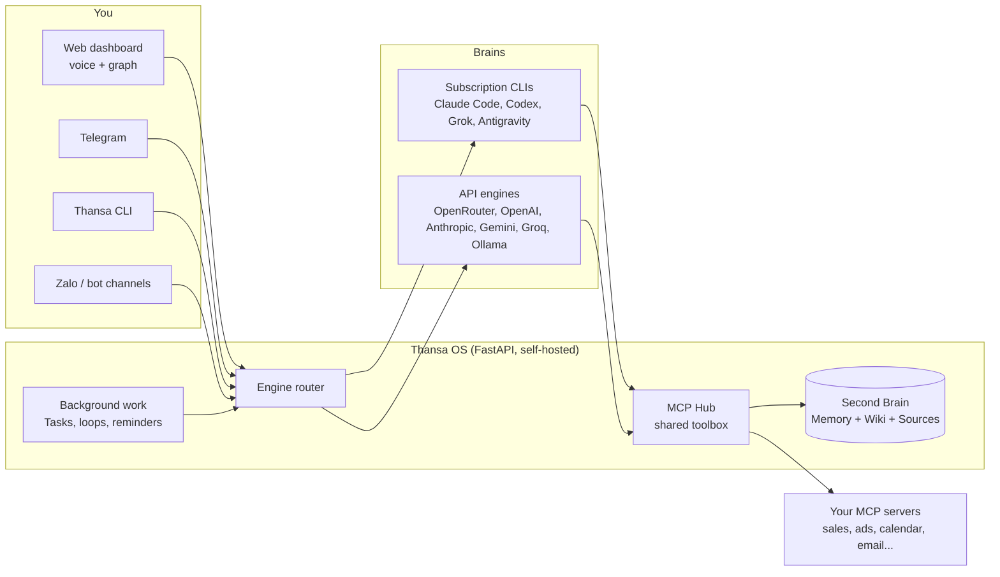

<!-- translated-from: README.md sha256:2e10ad3d2a86 -->
<div align="center">


# Thansa OS

### Ваш самостоятельно размещаемый ИИ-агент со сменным мозгом и Second Brain, который с каждым днём становится умнее.

Запускайте его на ноутбуке или небольшом VPS. Говорите с ним голосом. Подключите Claude, ChatGPT, Grok, Gemini или любого из 12 провайдеров, сохраняйте все инструменты при смене модели и позвольте ему работать в фоне, пока вы спите.

[](https://github.com/xahoapro/thansa-os/stargazers)
[](../../../LICENSE)
[](https://github.com/xahoapro/thansa-os/commits/main)
[](../../../requirements.txt)
[](https://github.com/xahoapro/thansa-os/pkgs/container/javis-os)
[](https://modelcontextprotocol.io)

<!-- flags:start -->
<p align="center">
<b>🌐 Доступно на 12 языках</b><br><br>
<a href="../../../README.md"></a>
<a href="../vi/README.md"></a>
<a href="../zh/README.md"></a>
<a href="../es/README.md"></a>
<a href="../ja/README.md"></a>
<a href="../hi/README.md"></a>
<a href="../pt-BR/README.md"></a>
<a href="../ko/README.md"></a>

<a href="../de/README.md"></a>
<a href="../fr/README.md"></a>
<a href="../id/README.md"></a>
</p>
<!-- flags:end -->

[🇬🇧 English](../../../README.md) · [🇻🇳 Tiếng Việt](../vi/README.md) · [🇨🇳 简体中文](../zh/README.md) · [🇪🇸 Español](../es/README.md) · [🇯🇵 日本語](../ja/README.md) · [🇮🇳 हिन्दी](../hi/README.md) · [🇧🇷 Português](../pt-BR/README.md) · [🇰🇷 한국어](../ko/README.md) · 🇷🇺 **Русский** · [🇩🇪 Deutsch](../de/README.md) · [🇫🇷 Français](../fr/README.md) · [🇮🇩 Bahasa Indonesia](../id/README.md) · [🌍 Помочь с переводом](../../../CONTRIBUTING.md#translations)

[Быстрый старт](#-быстрый-старт) · [Почему Thansa](#-почему-thansa) · [Мозги](#-12-мозгов-один-набор-инструментов) · [Возможности](#-возможности) · [Установка](#-установка) · [Документация](../../../docs/en/README.md) · [Поддержка](#-поддержать-thansa-os)

<br>


</div>

> 🌍 Это автоматический перевод английского README. Thansa отвечает на том языке, на котором вы пишете; интерфейс пока доступен на английском и вьетнамском. Полная документация на английском ([docs/en](../../../docs/en/README.md)). Исправления приветствуются ([CONTRIBUTING](../../../CONTRIBUTING.md#translations)).

---

## ⚡ Быстрый старт

**Самый простой способ: пусть ваш собственный ИИ сам всё установит.** Дайте ссылку на этот репозиторий Claude Code или Codex на своей машине и скажите *«установи мне Thansa OS»*. Ему нужно выполнить всего одну команду:

| Машина | Одна команда ставит всё |
|---|---|
| **Linux / macOS** | `git clone https://github.com/xahoapro/thansa-os.git javis && cd javis && chmod +x install.sh && ./install.sh` |
| **Windows** | `git clone https://github.com/xahoapro/thansa-os.git javis; cd javis; powershell -ExecutionPolicy Bypass -File install.ps1` |
| **Docker** | `curl -fsSLO https://raw.githubusercontent.com/xahoapro/thansa-os/main/docker-compose.yml && docker compose up -d` |

Затем откройте **http://localhost:7777**. Установщик ставит Python, четыре CLI-мозга по подписке (`claude`, `codex`, `agy`, `grok`) и файл `.env`, после чего запускает сервер. Вход в каждый мозг выполняется **на странице Models в панели**, никаких команд вводить больше не нужно.

> [!NOTE]
> Установили ещё один CLI **после** того, как Thansa уже был запущен? **Перезапустите Thansa.** Работающий процесс сохраняет PATH, с которым он стартовал, поэтому не видит CLI, установленный позже.

<p align="center">

</p>

---

## 🤔 Почему Thansa?

Thansa OS **не** чат-бот. Это **самостоятельно размещаемый агентный ИИ**, который работает на вашей машине или VPS: читает и пишет файлы, вызывает инструменты через MCP, запускает skills, ставит работу в фоновую очередь и сам себя планирует. Всё это доступно через **панель с голосовым управлением** и **Second Brain** (память + wiki), который со временем накапливает знания.

### Привязка, о которой никто не предупреждает

Выберите одно ИИ-приложение и пользуйтесь им каждый день в течение года. А потом посмотрите, что в нём накопилось:

- **Сотни разговоров**, в которых остались решения и контекст, выработанные по ходу дела.
- **Память** о том, кто вы, как вы работаете и что продаёт ваш бизнес.
- **Пользовательские инструкции, ассистенты и проекты**: ноу-хау, на настройку которого ушли часы.
- **Автоматизации и агенты**, которые работают только на этой одной платформе.

Всё это лежит на серверах поставщика, в формате поставщика. И вот где-то в другом месте выходит модель получше. Попробовать её можно, но забрать с собой свою работу нельзя: новое приложение ничего о вас не знает, ваши инструкции не переносятся, а история остаётся позади. Экспорт, если он вообще есть, обычно выдаёт свалку логов чата, а не память, которой может воспользоваться другой инструмент.

И вы остаётесь. Не потому, что старая модель всё ещё лучшая, а потому, что уйти значит начать с нуля. А когда поставщик поднимает цены, урезает лимиты, выводит модель из оборота или блокирует ваш аккаунт, плана Б нет.

### Thansa переворачивает это: модель берите в аренду, а Brain держите у себя

В Thansa модель это сменная деталь. Всё, что вы накапливаете, остаётся у вас в виде файлов, которые можно открыть:

| Что вы накапливаете | Где это хранится | Формат |
|---|---|---|
| **Разговоры** | `conversations.db` на вашей машине или VPS, одно хранилище, какой бы мозг ни отвечал | SQLite с полнотекстовым поиском |
| **Память о вас** | `memory/` в вашем Brain: `MEMORY.md` плюс по одному файлу на факт | Markdown |
| **Знания** | папки Wiki и Sources вашего Brain | Markdown, совместимый с Obsidian |
| **Skills** | `skills/<name>/SKILL.md` | Markdown |
| **Агенты (agents) и workflows** | `agents/*.md`, `workflows/*.md` | Markdown с front matter |
| **Loops и напоминания** | `Javis/loops/*.md`, `Javis/reminders.json` | Markdown, JSON |

Что это вам даёт:

- **Вышла новая модель? Переключитесь на странице Models и продолжайте работу.** Она читает ту же память, запускает те же skills, агентов и workflows и вызывает те же подключения через MCP Hub. Ничего не нужно переносить и ничего не нужно собирать заново.
- **Используйте несколько мозгов одновременно.** Сильную модель для разговора, подешевле для фоновой работы, локальную модель Ollama для личных заметок, и все они работают с одним и тем же Brain.
- **Читается и без Thansa.** Ваш Brain это папка с markdown. Откройте её в Obsidian или в любом редакторе. Если завтра Thansa исчезнет, ваши знания останутся на месте, обычным текстом.
- **Версии и переносимость.** Каждый проход обучения это git-коммит, который можно отменить одним нажатием, а весь Brain можно синхронизировать с вашим собственным приватным репозиторием на GitHub, общим для ноутбука и VPS.
- **Ваши данные остаются на вашем железе.** Никакого облака Thansa посередине нет. Запрос уходит только к тому провайдеру модели, которого вы для него выбрали, а с локальной моделью Ollama он вообще не покидает вашу машину.

### Thansa рядом с обычным чат-ботом

| | Обычный чат-бот | **Thansa OS** |
|---|---|---|
| **Мозг** | Привязан к одной модели, один API-вызов без состояния на сообщение | **Сменный**: 12 провайдеров, у каждого полный набор инструментов, MCP, skills и сессий, включая модели, работающие на вашей собственной машине через Ollama |
| **Память** | Забывает всё после каждой сессии | **Живой Second Brain**, который помнит вас и пополняется с каждым разговором |
| **Данные** | Выдуманные или отсутствуют | **Реальные цифры** из подключённых вами источников (продажи, реклама, календарь, почта, мессенджеры) |
| **Работа** | Отвечает и ждёт | **Фоновые циклы (loops), напоминания и очередь задач под управлением ИИ**, которые отчитываются перед вами |
| **Интерфейс** | Окно чата | Панель + граф знаний + **голос без рук** + Telegram, Slack, WhatsApp, Zalo + CLI |
| **Ваша работа** | Остаётся на серверах поставщика, в формате поставщика | **Обычные файлы на вашей машине**: история, память, skills, агенты и workflows переходят к любой новой модели |
| **Развёртывание** | Чужое облако | **Self-hosted**: Hostinger в один клик, Docker или любой VPS |

> 💡 **Философия: возможности живут в Thansa, а не в модели.** Каждый мозг получает один и тот же набор инструментов через общий хаб подключений (MCP Hub). Переход с Claude на Gemini ничего вам не стоит, кроме доступа к shell, который есть только у CLI-движков.

<p align="center">

</p>

---

## 🧠 12 мозгов, один набор инструментов

Выберите мозг на странице **Models** (модели) и меняйте его когда угодно. Сегодня Thansa поддерживает **12 провайдеров**.

<p align="center">

</p>

| Мозг | Как вы платите | Shell, веб, субагенты |
|---|---|---|
| **Claude Code** | Ваш план Claude или API-ключ Anthropic | ✅ |
| **ChatGPT** (через Codex) | Ваш план ChatGPT | ✅ |
| **Grok Build** | Ваш план SuperGrok или X Premium+ | ✅ |
| **Antigravity CLI** | Ваш план Google (тот же набор моделей, что и в Antigravity IDE, включая Claude) | Shell ✅ |
| **OpenRouter** | API-ключ (сотни моделей за одним ключом) | через инструменты Thansa |
| **OpenAI API** · **Anthropic API** · **Google Gemini** · **Groq** | API-ключ | через инструменты Thansa |
| **Ollama Cloud** · **Ollama на этой машине** | API-ключ или бесплатно на вашем собственном железе | через инструменты Thansa |
| **Любой OpenAI-совместимый endpoint** | То, что требует этот endpoint | через инструменты Thansa |

Любой мозг может вызывать подключённые вами MCP-серверы, читать и писать в Brain, запускать skills, ставить работу в Kanban и создавать агентов (agents), workflows, loops и напоминания. CLI-движки дополнительно выполняют **команды shell**, **загружают страницы и ищут в интернете** и **запускают параллельных субагентов**.

> [!WARNING]
> **Прочитайте это, прежде чем доверять подписке фоновую работу.** Anthropic ограничивает Claude Pro/Max **обычным личным использованием** Claude Code. Непрерывное фоновое выполнение (loops, напоминания, задачи Kanban, чат-боты), запуск на VPS или совместное использование одного аккаунта несколькими людьми выходят за эти рамки, и аккаунты **уже блокировали** за это. Thansa никогда не читает ваш токен входа: он запускает настоящий бинарник `claude`, но это не делает круглосуточную фоновую работу допустимой. Для надёжности переключите Claude Code на **API-ключ** на странице Models или направьте **модель для фоновой работы** на другого провайдера. Та же осторожность относится и к плану xAI. См. `server/claude_auth.py`.

---

## ✨ Возможности

<p align="center">

</p>

<table>
<tr>
<td width="50%" valign="top">

### 🗣️ Говорите с ним
- **Голос без рук**: вы говорите, Thansa слушает и отвечает вслух (по умолчанию бесплатный Edge TTS, либо OpenAI и ElevenLabs).
- **Сессии чата**, которые можно сохранять, открывать снова и искать по полному тексту. Длинные сессии сжимаются в краткие сводки, а не обрезаются.
- **Telegram, Slack, WhatsApp, Zalo, CLI и веб-панель**, и все они общаются с одним и тем же Thansa ([настройка Slack и WhatsApp](../../../docs/en/29-slack-whatsapp.md)).
- **Любой язык**: Thansa отвечает на том языке, на котором вы пишете. Интерфейс поставляется на английском и вьетнамском.

### 🧠 Помнит всё
- **Second Brain**: markdown-хранилище (совместимое с Obsidian) с долговременной памятью, Wiki и исходными материалами (Sources).
- **Граф знаний** ваших заметок, связанных через `[[wikilink]]`, на светлом холсте, который работает офлайн.
- **Самообучение**: после каждого разговора Thansa извлекает воспоминания, знания для wiki и skills. Каждый проход обучения это git-коммит, поэтому его **можно отменить одним нажатием**.
- **Резервная копия на GitHub**: двусторонняя синхронизация каждого Brain с приватным репозиторием, общим для вашего ноутбука и VPS.

</td>
<td width="50%" valign="top">

### ⚙️ Работает, пока вы спите
- **Задачи (Kanban)**: поставьте цель обычными словами. ИИ пишет спецификацию, выбирает исполнителя, выполняет её в фоне и зовёт вас только в исключительных случаях.
- **Loops и напоминания**: фоновые задания по интервалу, по времени суток или по cron-выражению, каждое из которых само проверяет свою работу.
- **Агенты и workflows**: специализированные ассистенты с собственной памятью, объединённые в многошаговые workflows с проверкой.
- **Чат-боты**: поставьте агента общаться с вашими клиентами через отдельного бота в Telegram, Slack, WhatsApp или Zalo, с общим почтовым ящиком, где вы можете перехватить разговор.

### 🔌 Подключайте что угодно
- **Магазин MCP-подключений** с несколькими аккаунтами на сервис и тремя уровнями прав, которые Thansa **строго соблюдает**.
- **Skills и plugins**: положите папку, чтобы добавить знания (skill) или нативный Python-инструмент (plugin) для всех движков.
- **Генерация изображений** на плане ChatGPT, в который вы уже вошли.
- **Учёт расходов**: токены и стоимость по дням и по провайдерам, с разделением на то, что ввели вы, и то, что выполнилось само.

</td>
</tr>
</table>

<p align="center">

</p>

<div align="center">


</div>

---

## 🏗️ Как это работает



- **Бэкенд:** Python FastAPI в `server/`: движки (`claude_sdk_engine.py`, `claude_cli.py`, `antigravity_cli.py`, `engine.py`, `aux_engine.py`), инструменты (`mcp_hub.py`, `mcp_store.py`, `plugins_host.py`), фоновая работа (`tasks.py`, `self_improve.py`, `reminders.py`, `learn.py`), язык и локаль (`lang.py`, `lang_registry.py`, `localefmt.py`).
- **Фронтенд:** чистые HTML/CSS/JS в `dashboard/`. Ни фреймворка, ни шага сборки, поэтому всё остаётся лёгким даже на небольшом VPS. Строки интерфейса лежат в `dashboard/i18n/`.
- **Second Brain:** markdown-хранилище в `brains/<brain name>/`.

---

## 🚀 Установка

> [!IMPORTANT]
> Thansa запускает ИИ-мозг с **полными правами** на машине. При публичном запуске (Docker, VPS, Hostinger) Thansa **сам требует входа**: при открытии приложения показывается экран создания аккаунта или входа, и без пароля никто не сможет им управлять.

<details open>
<summary><b>Вариант 1: Hostinger Docker Manager (домен + HTTPS, в один клик)</b></summary>

Hostinger VPS → **Docker Manager → Compose → URL** → вставьте файл для Hostinger и нажмите **Deploy**:

```
https://raw.githubusercontent.com/xahoapro/thansa-os/main/docker-compose.hostinger.yml
```

В поле **Environment** нужны всего три значения: `DOMAIN_NAME`, `JAVIS_ADMIN_USER`, `JAVIS_ADMIN_PASSWORD`, плюс необязательный `JAVIS_AUTO_UPDATE` (поставьте `true`, и Thansa будет обновляться сам раз в день).

Задайте `DOMAIN_NAME`, чтобы Traefik от Hostinger выпустил HTTPS:
- **Бесплатная ссылка** (без покупки домена): `DOMAIN_NAME=javis.<vps-hostname>.hstgr.cloud` (hostname смотрите в hPanel → VPS, например `javis.srv1562015.hstgr.cloud`).
- **Собственный домен:** `DOMAIN_NAME=example.com` и A-запись, указывающая на IP VPS.

Подождите 1-3 минуты, пока выпустится сертификат, затем откройте `https://<DOMAIN_NAME>`.

**Три разовых шага:**
1. **Сделайте образ GHCR публичным:** GitHub → репозиторий → **Packages** → `javis-os` → *Package settings* → Visibility = **Public**.
2. **Создайте аккаунт администратора:** заполните `JAVIS_ADMIN_USER` + `JAVIS_ADMIN_PASSWORD` (рекомендуется) или откройте приложение сразу после развёртывания и задайте его сами. Пока администратора нет, создать его может тот, кто первым откроет ссылку. Затем **включите 2FA** ([Безопасность и аккаунты](../../../docs/en/14-security-and-accounts.md)).
3. **Войдите в мозг** на странице **Models**.

Подробности и решение проблем: [DEPLOY.en.md](../../../DEPLOY.en.md).

</details>

<details>
<summary><b>Вариант 2: Docker на любом VPS (клонировать не нужно)</b></summary>

```bash
# Docker required (don't have it?  curl -fsSL https://get.docker.com | sh)
mkdir javis && cd javis
curl -fsSLO https://raw.githubusercontent.com/xahoapro/thansa-os/main/docker-compose.yml

docker compose run --rm javis claude auth login --claudeai   # sign in to Claude once (optional)
docker compose up -d                                          # pull the image and run
```

Откройте `http://<vps-ip>:7777` и сразу задайте имя и пароль администратора (не менее 8 символов) или заранее пропишите `JAVIS_ADMIN_USER` + `JAVIS_ADMIN_PASSWORD` в окружении. Затем включите 2FA.

Удалённый доступ без домена: `docker compose --profile tunnel up -d`, после чего `docker compose logs tunnel | grep trycloudflare` выведет HTTPS-ссылку.

</details>

<details>
<summary><b>Вариант 3: Linux или macOS без Docker</b></summary>

```bash
git clone https://github.com/xahoapro/thansa-os.git javis && cd javis
chmod +x install.sh && ./install.sh
```

Скрипт ставит Python, Node и CLI-мозги, создаёт venv, регистрирует службу, которая стартует при загрузке системы, и выводит адрес.

🍎 **macOS, запуск как приложения:** дважды щёлкните `JAVIS OS.app` (или `Start JAVIS OS.command`). Запуск при входе в систему: `./bin/javis-autostart.sh install`. Подробности: [bin/README.md](../../../bin/README.md).

</details>

<details>
<summary><b>Вариант 4: Windows (личный компьютер)</b></summary>

```powershell
git clone https://github.com/xahoapro/thansa-os.git javis; cd javis
powershell -ExecutionPolicy Bypass -File install.ps1
```

`install.ps1` делает всё за один проход: Python, venv и библиотеки, четыре CLI-мозга по подписке (`claude`, `codex`, `agy`, `grok`), `.env`, освобождение порта 7777 и запуск сервера. В конце он выводит таблицу с тем, какие мозги готовы. Если `winget` нет, сначала вручную установите Python 3.12 (отметьте «Add python.exe to PATH») и Node.js LTS, затем запустите его снова.

```
Run with a visible window (live log):  setup.bat
Run silently from then on:             start-javis.vbs   (log at server\javis.log)
Stop:                                  stop-javis.bat
Dashboard:                             http://localhost:7777
```

🪟 **Запуск как приложения:** после первого запуска дважды щёлкните **`JAVIS OS.bat`**. Сервер стартует в фоне, а панель открывается в **отдельном окне** со своим значком на панели задач. Запуск при входе в систему: `javis-autostart.bat install` (удалить: `uninstall`).

</details>

<details>
<summary><b>Несколько экземпляров Thansa на одном VPS</b></summary>

Мозги, настройки и аккаунты у каждого экземпляра полностью раздельные. Отличаются только три значения: `JAVIS_NAME`, `JAVIS_HOST_PORT`, `DOMAIN_NAME`.

- **Hostinger:** разверните `docker-compose.hostinger.yml` ещё раз как второй стек и заполните эти три поля.
- **Собственный VPS:** один раз на всю машину запустите общий прокси `docker-compose.proxy.yml`, затем дайте каждому экземпляру свою папку с `docker-compose.multi.yml`. Прокси сам находит новые экземпляры и запрашивает SSL.
- **Без Docker:** `JAVIS_NAME=javis-shop JAVIS_PORT=7778 ./install.sh`.

Пошагово: [DEPLOY.en.md](../../../DEPLOY.en.md).

</details>

### 🎬 Первый запуск

Откройте Thansa, и мастер настройки проведёт вас по шагам на языке вашего браузера:

1. **Аккаунт администратора**: обязателен при публичном запуске, чтобы посторонние не получили доступ.
2. **Выберите мозг**: один раз войдите по подписке или вставьте API-ключ. На карточке Claude Code есть переключатель **«Runs on»** между вашим планом, в который выполнен вход, и API-ключом Anthropic.
3. **Выберите модель**: при последующей смене провайдера вы не теряете никаких функций (кроме команд shell, которые есть только у CLI-движков).
4. **Настройте подключения** (необязательно): откройте **Connections**, выберите сервис и вставьте ключ или отсканируйте QR-код. После этого Thansa будет отчитываться по реальным цифрам из него.

---

## 📖 Как пользоваться Thansa

Левая панель объединяет страницы в **6 групп**. У каждой страницы есть руководство в [docs/en/](../../../docs/en/README.md).

| Группа | Страницы | Руководства |
|---|---|---|
| **Brain** | Graph, Chat, Files, Self-learning | [Чат и голос](../../../docs/en/02-chat-and-voice.md) · [Граф знаний](../../../docs/en/03-knowledge-graph.md) · [Сессии](../../../docs/en/04-sessions.md) · [Файловый менеджер](../../../docs/en/05-file-manager.md) · [Самообучение](../../../docs/en/22-self-learning.md) |
| **Code** | Terminal, Coding | [Терминал для кода](../../../docs/en/27-code-terminal.md) |
| **Capabilities** | Partners (агенты и workflows), Chatbot, Skills, Plugins | [Агенты и workflows](../../../docs/en/07-agents-and-workflows.md) · [Чат-боты](../../../docs/en/25-chatbots.md) · [Разговоры с клиентами](../../../docs/en/28-customer-conversations.md) · [Skills](../../../docs/en/06-skills.md) · [Plugins](../../../docs/en/20-plugins.md) |
| **Work** | Tasks, Scheduled | [Задачи (Kanban)](../../../docs/en/21-kanban-work.md) · [Повторяющиеся задания и напоминания](../../../docs/en/08-recurring-jobs.md) |
| **Connections** | Connections, Thansa Store, Channels, Models | [Подключения и бизнес-данные](../../../docs/en/09-connections-and-business-data.md) · [Telegram](../../../docs/en/11-telegram.md) · [Zalo](../../../docs/en/12-zalo-agent-mcp.md) · [Модели и движки](../../../docs/en/10-models-and-engines.md) |
| **System** | Settings, Share links, Account | [Начало работы](../../../docs/en/01-getting-started.md) · [Безопасность и аккаунты](../../../docs/en/14-security-and-accounts.md) · [Использование и расходы](../../../docs/en/23-usage-and-cost.md) · [Thansa CLI](../../../docs/en/24-cli.md) |

Ещё: [Second Brain: память, Wiki и INGEST](../../../docs/en/13-second-brain.md) · [Резервное копирование на GitHub](../../../docs/en/18-github-backup.md) · [Задачи и Dataview в заметках](../../../docs/en/19-tasks-and-dataview.md) · [Брендинг и собственные домены](../../../docs/en/15-branding-and-domains.md) · [Решение проблем](../../../docs/en/17-troubleshooting.md)

### Что стоит попробовать

- **Спросите цифры:** *«Какая выручка сегодня по сравнению со вчера?»* Thansa обращается к нужному подключению и отвечает реальными цифрами с рекомендациями.
- **Переварите знания:** добавьте файл или заметку. Thansa кратко пересказывает их, извлекает выводы, записывает в Wiki и предлагает задачи.
- **Поручите фоновую работу:** **Tasks** → **+ Assign goal** → *«подведи итоги продаж за эту неделю, найди залежавшийся товар, набросай три подписи для его продвижения»*. ИИ составляет спецификацию, выполняет её и отчитывается.
- **Запланируйте что-нибудь:** *«напоминай мне по будням в 8:30 проверить рекламный бюджет»*, в чате или на странице **Scheduled**.
- **Используйте голос:** нажмите на микрофон (или включите режим без рук), скажите, и Thansa ответит вслух.

<div align="center">

<br><sub>Работает и на телефоне: добавьте его на главный экран, и он будет открываться как приложение.</sub>
</div>

---

## ⚙️ Настройка (`.env`)

Любую строку можно оставить пустой, и Thansa всё равно запустится. Скопируйте `env.example` → `.env` и добавьте нужное. Полный список с пояснением к каждой переменной: [docs/en/16-env-configuration.md](../../../docs/en/16-env-configuration.md).

| Переменная | Назначение | По умолчанию |
|---|---|---|
| `JAVIS_HOST` | Адрес прослушивания. `127.0.0.1` = только эта машина, `0.0.0.0` = публично | `127.0.0.1` |
| `JAVIS_PORT` | Порт | `7777` |
| `JAVIS_REQUIRE_LOGIN` | `1`/`0`, чтобы принудительно включить или выключить вход (по умолчанию включён при публичном адресе) | *(авто)* |
| `JAVIS_ADMIN_USER` / `JAVIS_ADMIN_PASSWORD` | Создать администратора при развёртывании | - |
| `JAVIS_ALLOWED_HOSTS` | Дополнительные имена хостов в списке разрешённых (защита от CSRF и DNS rebinding) | localhost + ваш домен |
| `JAVIS_STATE_DIR` | Где хранятся настройки, сессии и ключ шифрования | `server/` (Docker: `/data/state`) |
| `BRAINS_DIR` | Родительская папка со всеми Brain | `brains/` (Docker: `/brains`) |
| `JAVIS_ENABLE_USER_PLUGINS` | `true` разрешает запуск ваших собственных плагинов (настоящий Python внутри сервера) | *(выкл.)* |
| `TTS_VOICE` / `TTS_RATE` | Голос и скорость для Edge TTS | `en-US-EmmaMultilingualNeural` / `+5%` |

---

## 🔐 Безопасность

- **Вход обязателен** на публичном сервере до того, как заработает любая функция, ведь мозг работает с полными правами на машине.
- **2FA (TOTP)**, ограничение частоты попыток входа, пароли не короче 8 символов, cookie с флагом `Secure` под HTTPS, сессии истекают через 30 дней.
- **Защита от CSRF и DNS rebinding**: любой запрос на запись с неизвестного источника отклоняется.
- **Секреты зашифрованы** в `settings.json` (API-ключи, OAuth-токены, токены ботов) ключом, уникальным для каждой машины.
- **Ваши собственные плагины по умолчанию заблокированы**, пока вы не зададите `JAVIS_ENABLE_USER_PLUGINS=true`.
- **Права подключений обеспечивает** хаб, а не модель: аккаунт только для чтения нельзя использовать для отправки, оплаты или публикации.

Нашли уязвимость? Пожалуйста, следуйте [SECURITY.md](../../../SECURITY.md), а не открывайте публичный issue.

---

## 🔄 Обновление

В приложении: **Settings → Updates → Update now**, с индикатором прогресса и кнопкой отката, если новая сборка что-то сломает. На VPS: `cd javis && ./update.sh` (скачивает новый образ и перезапускает; ваши данные в томах сохраняются).

---

## 🩺 Решение проблем

| Симптом | Что делать |
|---|---|
| Страница Models пишет, что CLI не установлен, хотя он установлен | **Перезапустите Thansa**: работающий процесс хранит PATH на момент своего запуска. |
| Порт 7777 занят, и новая сборка не стартует | Сначала остановите старый процесс (`stop-javis.bat` или завершите PID), затем запустите снова. |
| Hostinger не может скачать образ | Сделайте пакет GHCR **Public** и дождитесь окончания сборки в GitHub Action. |
| Мозг сообщает, что вход не выполнен | **Models** → карточка этого провайдера → войти. |

Подробнее в [docs/en/17-troubleshooting.md](../../../docs/en/17-troubleshooting.md).

---

## 📂 Структура репозитория

```
javis-os/
├── server/          # FastAPI backend: engines, connections, background work, channels, memory
├── dashboard/       # Frontend (plain JS, no build step)
│   └── i18n/        # Interface strings, one JSON file per language
├── brains/          # Every Second Brain (default: brains/Brain Default)
├── system/          # Ships with the app: bundled plugins, system skills, connection catalogue
├── docs/            # User guides (docs/en/ in English) and translations (docs/i18n/)
├── tests/           # Python + JS test suite (python tests/run.py)
├── install.sh · install.ps1 · update.sh
├── Dockerfile · docker-compose*.yml
└── CLAUDE.md        # The system prompt Thansa runs on
```

---

## 🌍 Языки

| Что | Языки сейчас |
|---|---|
| **Ответы Thansa** | Любой язык: отвечает на том языке, на котором вы пишете, или на том, который закреплён в Settings |
| **Панель и сообщения сервера** | 🇬🇧 English · 🇻🇳 Tiếng Việt, отдельно для каждого устройства: каждый браузер получает свой язык, пока вы не выберете его явно |
| **Магазин подключений, плагины, стартовые файлы нового Brain** | 🇬🇧 English · 🇻🇳 Tiếng Việt |
| **README и быстрый старт** | 🇬🇧 English · 🇻🇳 Tiếng Việt · 🇨🇳 简体中文 · 🇪🇸 Español · 🇯🇵 日本語 · 🇮🇳 हिन्दी · 🇧🇷 Português · 🇰🇷 한국어 · 🇷🇺 Русский · 🇩🇪 Deutsch · 🇫🇷 Français · 🇮🇩 Bahasa Indonesia |
| **Полная документация** | 🇬🇧 English · 🇻🇳 Tiếng Việt |

Добавление языка это изменение данных, а не кода: одна запись в `server/lang_registry.py` плюс один файл `dashboard/i18n/<code>.json`, и по желанию `system/mcp-catalog.<code>.json`. Всё, что ещё не переведено, показывается на английском. Если хотите помочь, смотрите [CONTRIBUTING.md](../../../CONTRIBUTING.md#translations).

---

## 🤝 Участие в проекте

Сообщения об ошибках, идеи, переводы и pull request'ы приветствуются, на английском или вьетнамском.

| С чего начать | Что это даёт |
|---|---|
| [CONTRIBUTING.md](../../../CONTRIBUTING.md) | Настройка окружения, запуск тестов (`python tests/run.py`), соглашения по коду |
| [ARCHITECTURE.md](../../../ARCHITECTURE.md) | Как связаны части системы, и карта серверных модулей |
| [docs/dev/GLOSSARY.md](../../../docs/dev/GLOSSARY.md) | Код написан с вьетнамскими именами: здесь расшифрованы названия вроде `nhac_hen` (напоминание) |
| [docs/dev/adding-a-language.md](../../../docs/dev/adding-a-language.md) | Пошаговый перевод Thansa на ваш язык |
| [Шаблоны issue](https://github.com/xahoapro/thansa-os/issues/new/choose) | Сообщение об ошибке, запрос функции, предложение перевода |

Пожалуйста, соблюдайте [Кодекс поведения](../../../CODE_OF_CONDUCT.md) и сообщайте о проблемах безопасности приватно, как описано в [SECURITY.md](../../../SECURITY.md).

Если Thansa вам полезен, ⭐ репозиторию поможет другим людям его найти.

[](https://star-history.com/#xahoapro/thansa-os&Date)

---

## 🙏 Благодарности

- **Мозги:** [Claude Code](https://claude.com/claude-code) и [Claude Agent SDK](https://docs.claude.com/en/api/agent-sdk/overview) (Anthropic), [Codex CLI](https://developers.openai.com/codex/cli) (OpenAI), [Grok Build](https://x.ai) (xAI), [Antigravity](https://antigravity.google) (Google), а также API [OpenRouter](https://openrouter.ai), OpenAI, [Google Gemini](https://ai.google.dev), Anthropic, [Groq](https://groq.com) и [Ollama](https://ollama.com).
- **Стандарт инструментов:** [Model Context Protocol](https://modelcontextprotocol.io). На нём работает весь магазин подключений Thansa.
- Подходы Second Brain и цифрового Bullet Journal.

## 📄 Лицензия

Открытый исходный код под **лицензией MIT**: свободно используйте, изменяйте и распространяйте, просто сохраняйте уведомление об авторских правах. См. [LICENSE](../../../LICENSE).

---

## ☕ Поддержать Thansa OS

Thansa OS бесплатен и открыт, и пока что код пишет и тестовые серверы оплачивает один человек. Если Thansa помогает вам в работе или жизни, небольшое пожертвование даст больше времени на исправление ошибок и новые функции.

- 🌍 **PayPal**: [paypal.me/quy01](https://paypal.me/quy01)
- 🏦 **MB Bank** (Вьетнам): `6636966369`
- 📱 **Кошелёк MoMo** (Вьетнам): `0372752740`

Не можете сделать пожертвование? Пользоваться Thansa, присылать отзывы или открывать pull request'ы тоже значит поддерживать проект.

<div align="center">
<br>
Сделано с ☕ во Вьетнаме, автор <b><a href="https://tradingauto.org">Duy Quang</a></b>
</div>
