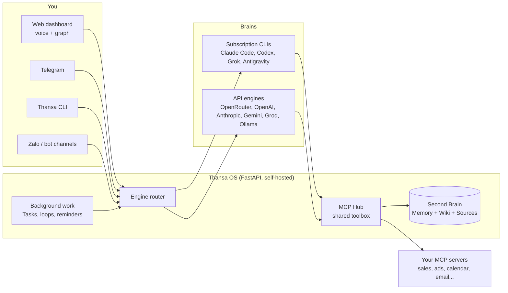

<!-- translated-from: README.md sha256:2e10ad3d2a86 -->
<div align="center">


# Thansa OS

### 自托管的 AI Agent：大脑可以随时更换，Second Brain 每天都在变得更聪明。

在你的笔记本或一台小型 VPS 上运行。用语音和它对话。接入 Claude、ChatGPT、Grok、Gemini 或 12 家提供商中的任意一家，切换模型时所有工具都保留，还能在你睡觉时于后台继续工作。

[](https://github.com/xahoapro/thansa-os/stargazers)
[](../../../LICENSE)
[](https://github.com/xahoapro/thansa-os/commits/main)
[](../../../requirements.txt)
[](https://github.com/xahoapro/thansa-os/pkgs/container/javis-os)
[](https://modelcontextprotocol.io)

<!-- flags:start -->
<p align="center">
<b>🌐 提供 12 种语言</b><br><br>
<a href="../../../README.md"></a>
<a href="../vi/README.md"></a>

<a href="../es/README.md"></a>
<a href="../ja/README.md"></a>
<a href="../hi/README.md"></a>
<a href="../pt-BR/README.md"></a>
<a href="../ko/README.md"></a>
<a href="../ru/README.md"></a>
<a href="../de/README.md"></a>
<a href="../fr/README.md"></a>
<a href="../id/README.md"></a>
</p>
<!-- flags:end -->

[🇬🇧 English](../../../README.md) · [🇻🇳 Tiếng Việt](../vi/README.md) · 🇨🇳 **简体中文** · [🇪🇸 Español](../es/README.md) · [🇯🇵 日本語](../ja/README.md) · [🇮🇳 हिन्दी](../hi/README.md) · [🇧🇷 Português](../pt-BR/README.md) · [🇰🇷 한국어](../ko/README.md) · [🇷🇺 Русский](../ru/README.md) · [🇩🇪 Deutsch](../de/README.md) · [🇫🇷 Français](../fr/README.md) · [🇮🇩 Bahasa Indonesia](../id/README.md) · [🌍 帮助翻译](../../../CONTRIBUTING.md#translations)

[快速开始](#-快速开始) · [为什么选择 Thansa](#-为什么选择-thansa) · [大脑](#-12-种大脑一套工具) · [功能](#-功能特性) · [安装](#-安装) · [文档](../../../docs/en/README.md) · [支持](#-支持-thansa-os)

<br>


</div>

> 🌍 本文是英文 README 的自动翻译版本。无论你用哪种语言书写，Thansa 都会用同一种语言回复；界面本身目前提供英文和越南语。完整文档为英文版（[docs/en](../../../docs/en/README.md)）。欢迎提交修正（[CONTRIBUTING](../../../CONTRIBUTING.md#translations)）。

---

## ⚡ 快速开始

**最简单的方式：让你自己的 AI 来安装。** 把这个仓库链接交给你电脑上的 Claude Code 或 Codex，告诉它 *"帮我安装 Thansa OS"*。它只需要运行一条命令：

| 机器 | 一条命令装好一切 |
|---|---|
| **Linux / macOS** | `git clone https://github.com/xahoapro/thansa-os.git && cd thansa-os && chmod +x install.sh && ./install.sh` |
| **Windows** | `git clone https://github.com/xahoapro/thansa-os.git; cd thansa-os; powershell -ExecutionPolicy Bypass -File install.ps1` |
| **Docker** | `curl -fsSLO https://raw.githubusercontent.com/xahoapro/thansa-os/main/docker-compose.yml && docker compose up -d` |

然后打开 **http://localhost:7777**。安装程序会配置好 Python、四个订阅制 CLI 大脑（`claude`、`codex`、`agy`、`grok`）以及 `.env`，随后启动服务器。每个大脑都在**仪表盘的 Models（模型）页面**上登录，无需再敲命令。

> [!NOTE]
> 在 Thansa 已经运行**之后**又安装了新的 CLI？请**重启 Thansa**。正在运行的进程保留的是它启动时的 PATH，因此看不到之后才安装的 CLI。

<p align="center">

</p>

---

## 🤔 为什么选择 Thansa？

Thansa OS **不是**聊天机器人。它是一个运行在你自己的机器或 VPS 上的**自托管 Agent 式 AI**：它能读写文件、通过 MCP 调用工具、运行 Skill、把任务排入后台队列，还能自己安排日程。这一切都集成在一个**可语音控制的仪表盘**之后，并配有一个随时间不断积累知识的 **Second Brain**（记忆 + Wiki）。

### 没人提醒过你的锁定陷阱

挑一个 AI 应用，每天都用，坚持一年。然后看看里面积累了些什么：

- **数百段对话**，记录着你一路上理清的决策和背景。
- **关于你的记忆**：你是谁、你怎么工作、你的生意卖什么。
- **自定义指令、助手和项目**：你花了好几个小时调校出来的经验。
- **自动化和 Agent**，只能在那一个平台上运行。

这一切都存放在厂商的服务器上，用的是厂商的格式。然后，更好的模型在别处发布了。你可以去试，却没法把你的工作带过去：新应用对你一无所知，你的指令无法沿用，你的历史也只能留在原地。即便有导出功能，通常也只是一堆聊天记录，而不是另一个工具能用上的记忆。

于是你留了下来。不是因为旧模型依然最好，而是因为离开就意味着从零开始。而当厂商涨价、收紧额度、下线某个模型或封禁你的账号时，你没有任何 B 计划。

### Thansa 反其道而行：模型是租来的，Brain 归你所有

在 Thansa 里，模型只是一个可以替换的部件。你积累的一切都留在你自己手里，是你能直接打开的文件：

| 你积累的东西 | 存放位置 | 格式 |
|---|---|---|
| **对话** | 你自己机器或 VPS 上的 `conversations.db`，无论哪个大脑回答，都存在同一处 | SQLite，支持全文搜索 |
| **关于你的记忆** | 你 Brain 里的 `memory/`：`MEMORY.md`，外加每条事实一个文件 | Markdown |
| **知识** | 你 Brain 里的 Wiki 和 Sources 文件夹 | Markdown，兼容 Obsidian |
| **Skill** | `skills/<name>/SKILL.md` | Markdown |
| **Agent 和 Workflow** | `agents/*.md`、`workflows/*.md` | 带 front matter 的 Markdown |
| **Loop 和提醒** | `Javis/loops/*.md`、`Javis/reminders.json` | Markdown、JSON |

这为你带来了什么：

- **新模型出来了？在 Models 页面切换，继续往下做。** 它读取同样的记忆，运行同样的 Skill、Agent 和 Workflow，并通过 MCP Hub 调用同样的连接。无需迁移，也无需重建。
- **同时使用多个大脑。** 强模型负责对话，便宜的模型负责后台任务，本地 Ollama 模型处理私密笔记，它们都在同一个 Brain 上工作。
- **离开 Thansa 也能读。** 你的 Brain 就是一个 markdown 文件夹，用 Obsidian 或任意编辑器都能打开。就算 Thansa 明天消失了，你的知识依然以纯文本的形式留在那里。
- **有版本记录，也能随身带走。** 每一轮学习都是一次 git 提交，一键即可撤销；整个 Brain 还能同步到你自己的私有 GitHub 仓库，在笔记本和 VPS 之间共享。
- **数据留在你自己的硬件上。** 中间没有 Thansa 云。请求只会发给你为它选定的模型提供商；如果使用本地 Ollama 模型，数据根本不会离开你的机器。

### Thansa 与普通聊天机器人对比

| | 普通聊天机器人 | **Thansa OS** |
|---|---|---|
| **大脑** | 锁定在一个模型上，每条消息都是一次无状态的 API 调用 | **可更换**：12 家提供商，每一家都拥有完整的工具、MCP、Skill 和会话，包括通过 Ollama 在你自己机器上运行的模型 |
| **记忆** | 每次会话结束就遗忘 | **一个活的 Second Brain**，记住你，并随着每次对话变得更丰富 |
| **数据** | 编造的，或者干脆没有 | 来自你接入的连接（销售、广告、日历、邮件、消息）的**真实数据** |
| **工作** | 回答完就等着 | **后台 Loop、提醒和由 AI 运行的任务队列**，并把结果汇报给你 |
| **界面** | 一个聊天框 | 仪表盘 + 知识图谱 + **免手动语音** + Telegram、Slack、WhatsApp、Zalo + CLI |
| **你的成果** | 留在厂商的服务器上，用的是厂商的格式 | **你机器上的普通文件**：历史、记忆、Skill、Agent 和 Workflow 都能带到任何新模型 |
| **部署** | 别人的云 | **自托管**：Hostinger 一键部署、Docker，或任意 VPS |

> 💡 **设计理念：能力在 Thansa 身上，而不在模型身上。** 每个大脑都通过同一个共享连接中心（MCP Hub）获得同一套工具箱。从 Claude 切换到 Gemini 不会让你失去任何东西，唯一的例外是 shell 访问，只有 CLI 引擎才有。

<p align="center">

</p>

---

## 🧠 12 种大脑，一套工具

在 **Models** 页面选择大脑，随时都可以更换。Thansa 目前支持 **12 家提供商**。

<p align="center">

</p>

| 大脑 | 付费方式 | Shell、网页、子 Agent |
|---|---|---|
| **Claude Code** | 你的 Claude 订阅，或 Anthropic API key | ✅ |
| **ChatGPT**（通过 Codex） | 你的 ChatGPT 订阅 | ✅ |
| **Grok Build** | 你的 SuperGrok 或 X Premium+ 订阅 | ✅ |
| **Antigravity CLI** | 你的 Google 订阅（与 Antigravity IDE 的模型阵容相同，包括 Claude） | Shell ✅ |
| **OpenRouter** | API key（一个 key 背后有数百个模型） | 通过 Thansa 工具 |
| **OpenAI API** · **Anthropic API** · **Google Gemini** · **Groq** | API key | 通过 Thansa 工具 |
| **Ollama Cloud** · **本机 Ollama** | API key，或在你自己的硬件上免费运行 | 通过 Thansa 工具 |
| **任意 OpenAI 兼容端点** | 视该端点的要求而定 | 通过 Thansa 工具 |

每个大脑都可以调用你已连接的 MCP 服务器、读写 Brain、运行 Skill、排入 Kanban 任务，以及创建 Agent、Workflow、Loop 和提醒。CLI 引擎还额外能运行 **shell 命令**、**抓取和搜索网页**，以及**启动并行的子 Agent**。

> [!WARNING]
> **在让订阅账号运行后台任务之前，请先读这一段。** Anthropic 将 Claude Pro/Max 限定为 Claude Code 的**普通个人使用**。持续的后台执行（Loop、提醒、Kanban 任务、聊天机器人）、在 VPS 上运行，或多人共用一个账号，都超出了这个范围，已经有账号因此**被封禁**。Thansa 从不读取你的登录令牌：它运行的是真正的 `claude` 程序，但这并不能让全天候的后台使用变得合规。稳妥起见，请在 Models 页面把 Claude Code 设置为使用 **API key** 运行，或把**后台任务模型**指向其他提供商。同样的注意事项也适用于 xAI 订阅。参见 `server/claude_auth.py`。

---

## ✨ 功能特性

<p align="center">

</p>

<table>
<tr>
<td width="50%" valign="top">

### 🗣️ 和它对话
- **免手动语音**：你说话，Thansa 听完后大声回答（默认使用免费的 Edge TTS，也可选 OpenAI 和 ElevenLabs）。
- **聊天会话**可以保存、重新打开并全文搜索。长会话会被压缩成摘要，而不是被截断。
- **Telegram、Slack、WhatsApp、Zalo、CLI 和网页仪表盘**，连接的都是同一个 Thansa（[Slack 和 WhatsApp 的设置](../../../docs/en/29-slack-whatsapp.md)）。
- **任意语言**：你用什么语言写，Thansa 就用什么语言回复。界面提供英文和越南语。

### 🧠 记住一切
- **Second Brain**：一个 markdown 知识库（兼容 Obsidian），包含长期记忆、Wiki 和原始 Sources。
- 由 `[[wikilink]]` 连接起来的笔记**知识图谱**，绘制在浅色画布上，可离线使用。
- **自我学习**：每次对话后，Thansa 会提炼出记忆、Wiki 知识和 Skill。每一轮学习都是一次 git 提交，因此**一键即可撤销**。
- **备份到 GitHub**：每个 Brain 与私有仓库双向同步，在你的笔记本和 VPS 之间共享。

</td>
<td width="50%" valign="top">

### ⚙️ 在你睡觉时工作
- **任务（Kanban）**：用大白话交代一个目标。AI 会写出规格说明、挑选执行者、在后台运行，只有出现异常时才找你。
- **Loop 和提醒**：按间隔、固定时刻或 cron 表达式运行的后台任务，每个都会自行检查工作成果。
- **Agent 和 Workflow**：拥有各自记忆的专业助手，可以串联成带验证步骤的多步 Workflow。
- **聊天机器人**：把一个 Agent 放到你的客户面前，使用它自己的 Telegram、Slack、WhatsApp 或 Zalo 机器人，并配有一个你可以随时接管的共享收件箱。

### 🔌 连接一切
- **MCP 连接商店**：每个服务可接入多个账号，并有三个由 Thansa **强制执行**的权限级别。
- **Skill 和 Plugin**：放入一个文件夹，就能为所有引擎添加知识（Skill）或原生 Python 工具（Plugin）。
- 使用你已登录的 ChatGPT 订阅**生成图片**。
- **用量统计**：按天、按提供商统计 token 和费用，并区分你手动输入的部分和自动运行的部分。

</td>
</tr>
</table>

<p align="center">

</p>

<div align="center">


</div>

---

## 🏗️ 工作原理



- **后端：** 位于 `server/` 的 Python FastAPI：引擎（`claude_sdk_engine.py`、`claude_cli.py`、`antigravity_cli.py`、`engine.py`、`aux_engine.py`），工具（`mcp_hub.py`、`mcp_store.py`、`plugins_host.py`），后台任务（`tasks.py`、`self_improve.py`、`reminders.py`、`learn.py`），语言与区域设置（`lang.py`、`lang_registry.py`、`localefmt.py`）。
- **前端：** 位于 `dashboard/` 的纯 HTML/CSS/JS。没有框架，也没有构建步骤，因此在小型 VPS 上也很轻量。界面文案位于 `dashboard/i18n/`。
- **Second Brain：** 位于 `brains/<brain name>/` 的 markdown 知识库。

---

## 🚀 安装

> [!IMPORTANT]
> Thansa 运行的 AI 大脑在机器上拥有**完全权限**。当它公开运行时（Docker、VPS、Hostinger），Thansa 会**自动强制登录**：打开应用会先看到创建账号或登录的界面，没有密码的人无法操控它。

<details open>
<summary><b>方式一：Hostinger Docker Manager（域名 + HTTPS，一键部署）</b></summary>

Hostinger VPS → **Docker Manager → Compose → URL** → 粘贴 Hostinger 专用文件，然后点击 **Deploy**：

```
https://raw.githubusercontent.com/xahoapro/thansa-os/main/docker-compose.hostinger.yml
```

**Environment** 框只需要填三个字段：`DOMAIN_NAME`、`JAVIS_ADMIN_USER`、`JAVIS_ADMIN_PASSWORD`，另外还有一个可选的 `JAVIS_AUTO_UPDATE`（设为 `true` 后 Thansa 每天自动更新）。

设置 `DOMAIN_NAME`，让 Hostinger 的 Traefik 签发 HTTPS 证书：
- **免费链接**（无需购买域名）：`DOMAIN_NAME=javis.<vps-hostname>.hstgr.cloud`（主机名可在 hPanel → VPS 中找到，例如 `javis.srv1562015.hstgr.cloud`）。
- **你自己的域名：** `DOMAIN_NAME=example.com`，并把一条 A 记录指向 VPS 的 IP。

等待 1-3 分钟让证书签发完成，然后打开 `https://<DOMAIN_NAME>`。

**三个一次性步骤：**
1. **把 GHCR 镜像设为 Public：** GitHub → 仓库 → **Packages** → `javis-os` → *Package settings* → Visibility = **Public**。
2. **创建管理员账号：** 填写 `JAVIS_ADMIN_USER` + `JAVIS_ADMIN_PASSWORD`（推荐），或者在部署后立即打开应用自行设置。在还没有管理员之前，第一个打开链接的人就可以创建它。然后**开启 2FA**（[安全与账号](../../../docs/en/14-security-and-accounts.md)）。
3. 在 **Models** 页面**登录一个大脑**。

详细说明与故障排查：[DEPLOY.en.md](../../../DEPLOY.en.md)。

</details>

<details>
<summary><b>方式二：在任意 VPS 上使用 Docker（无需克隆仓库）</b></summary>

```bash
# Docker required (don't have it?  curl -fsSL https://get.docker.com | sh)
mkdir thansa && cd thansa
curl -fsSLO https://raw.githubusercontent.com/xahoapro/thansa-os/main/docker-compose.yml

docker compose run --rm javis claude auth login --claudeai   # sign in to Claude once (optional)
docker compose up -d                                          # pull the image and run
```

打开 `http://<vps-ip>:7777`，立即设置管理员用户名和密码（至少 8 个字符），或者在环境变量中预先设置 `JAVIS_ADMIN_USER` + `JAVIS_ADMIN_PASSWORD`。然后开启 2FA。

没有域名时的远程访问：运行 `docker compose --profile tunnel up -d`，然后 `docker compose logs tunnel | grep trycloudflare` 会打印出一个 HTTPS 链接。

</details>

<details>
<summary><b>方式三：Linux 或 macOS，不使用 Docker</b></summary>

```bash
git clone https://github.com/xahoapro/thansa-os.git && cd thansa-os
chmod +x install.sh && ./install.sh
```

该脚本会安装 Python、Node 和各个 CLI 大脑，创建 venv，注册一个开机自启的服务，并打印访问地址。

🍎 **在 macOS 上像应用一样打开：** 双击 `Thansa OS.app`（或 `Start Thansa OS.command`）。登录时自动启动：`./bin/thansa-autostart.sh install`。详情：[bin/README.md](../../../bin/README.md)。

</details>

<details>
<summary><b>方式四：Windows（个人电脑）</b></summary>

```powershell
git clone https://github.com/xahoapro/thansa-os.git; cd thansa-os
powershell -ExecutionPolicy Bypass -File install.ps1
```

`install.ps1` 一次性完成所有工作：Python、venv 和依赖库、四个订阅制 CLI 大脑（`claude`、`codex`、`agy`、`grok`）、`.env`、释放 7777 端口并启动服务器。最后它会显示一张表格，列出哪些大脑已经就绪。如果没有 `winget`，请先手动安装 Python 3.12（勾选 "Add python.exe to PATH"）和 Node.js LTS，然后重新运行。

```
Run with a visible window (live log):  setup.bat
Run silently from then on:             start-thansa.vbs   (log at server\thansa.log)
Stop:                                  stop-thansa.bat
Dashboard:                             http://localhost:7777
```

🪟 **像应用一样打开：** 首次运行之后，双击 **`Thansa OS.bat`**。服务器会在后台启动，仪表盘在**独立窗口**中打开，并拥有自己的任务栏图标。登录时自动启动：`thansa-autostart.bat install`（移除：`uninstall`）。

</details>

<details>
<summary><b>在一台 VPS 上运行多个 Thansa 实例</b></summary>

每个实例的 Brain、设置和账号完全相互隔离。实例之间只有三个值不同：`JAVIS_NAME`、`JAVIS_HOST_PORT`、`DOMAIN_NAME`。

- **Hostinger：** 再次部署 `docker-compose.hostinger.yml` 作为第二个 stack，并填写这三个字段。
- **自行管理的 VPS：** 为整台机器运行一次共享代理 `docker-compose.proxy.yml`，然后用 `docker-compose.multi.yml` 为每个实例分配独立的文件夹。代理会自动发现新实例并申请 SSL 证书。
- **原生安装：** `JAVIS_NAME=thansa-shop JAVIS_PORT=7778 ./install.sh`。

分步说明：[DEPLOY.en.md](../../../DEPLOY.en.md)。

</details>

### 🎬 首次运行

打开 Thansa 后，设置向导会以你浏览器的语言一步步引导你：

1. **管理员账号**：公开运行时必须设置，用来阻止陌生人进入。
2. **选择一个大脑**：用订阅账号登录一次，或粘贴一个 API key。Claude Code 卡片上有一个 **"Runs on"** 开关，可在你已登录的订阅和 Anthropic API key 之间切换。
3. **选择一个模型**：以后切换提供商不会损失任何功能（shell 命令除外，只有 CLI 引擎才有）。
4. **接入连接**（可选）：打开 **Connections（连接）**，选择一个服务，粘贴 key 或扫描二维码。之后 Thansa 就会基于其中的真实数据进行汇报。

---

## 📖 使用 Thansa

左侧导航栏把页面分成 **6 个分组**。每个页面在 [docs/en/](../../../docs/en/README.md) 中都有对应的指南。

| 分组 | 页面 | 指南 |
|---|---|---|
| **Brain** | Graph, Chat, Files, Self-learning | [聊天与语音](../../../docs/en/02-chat-and-voice.md) · [知识图谱](../../../docs/en/03-knowledge-graph.md) · [会话](../../../docs/en/04-sessions.md) · [文件管理器](../../../docs/en/05-file-manager.md) · [自我学习](../../../docs/en/22-self-learning.md) |
| **Code** | Terminal, Coding | [代码终端](../../../docs/en/27-code-terminal.md) |
| **Capabilities** | Partners（Agent 和 Workflow）, Chatbot, Skills, Plugins | [Agent 与 Workflow](../../../docs/en/07-agents-and-workflows.md) · [聊天机器人](../../../docs/en/25-chatbots.md) · [客户对话](../../../docs/en/28-customer-conversations.md) · [Skill](../../../docs/en/06-skills.md) · [Plugin](../../../docs/en/20-plugins.md) |
| **Work** | Tasks, Scheduled | [任务（Kanban）](../../../docs/en/21-kanban-work.md) · [周期任务与提醒](../../../docs/en/08-recurring-jobs.md) |
| **Connections** | Connections, Thansa Store, Channels, Models | [连接与业务数据](../../../docs/en/09-connections-and-business-data.md) · [Telegram](../../../docs/en/11-telegram.md) · [Zalo](../../../docs/en/12-zalo-agent-mcp.md) · [模型与引擎](../../../docs/en/10-models-and-engines.md) |
| **System** | Settings, Share links, Account | [入门](../../../docs/en/01-getting-started.md) · [安全与账号](../../../docs/en/14-security-and-accounts.md) · [用量与费用](../../../docs/en/23-usage-and-cost.md) · [Thansa CLI](../../../docs/en/24-cli.md) |

更多：[Second Brain：记忆、Wiki 和 INGEST](../../../docs/en/13-second-brain.md) · [GitHub 备份](../../../docs/en/18-github-backup.md) · [笔记中的任务与 Dataview](../../../docs/en/19-tasks-and-dataview.md) · [品牌定制与自定义域名](../../../docs/en/15-branding-and-domains.md) · [故障排查](../../../docs/en/17-troubleshooting.md)

### 可以试试这些

- **询问数据：** *"今天的收入和昨天相比怎么样？"* Thansa 会调用对应的连接，用真实数字作答并给出建议。
- **消化知识：** 放入一个文件或一条笔记。Thansa 会总结内容、提炼洞见、写入 Wiki 并提出待办任务。
- **交出后台工作：** **Tasks** → **+ Assign goal** → *"总结本周销售情况，找出滞销库存，起草三条文案来推动销售"*。AI 会写好规格、执行任务并回报结果。
- **安排日程：** *"每个工作日 8:30 提醒我检查广告预算"*，可以在聊天中说，也可以在 **Scheduled** 页面设置。
- **使用语音：** 按下麦克风（或开启免手动模式），开口说话，Thansa 会大声回答。

<div align="center">

<br><sub>在手机上也能用：把它添加到主屏幕，就能像应用一样打开。</sub>
</div>

---

## ⚙️ 配置（`.env`）

每一行都可以留空，Thansa 照样能运行。把 `env.example` 复制为 `.env`，再添加你需要的内容。完整的变量列表及逐项说明见 [docs/en/16-env-configuration.md](../../../docs/en/16-env-configuration.md)。

| 变量 | 含义 | 默认值 |
|---|---|---|
| `JAVIS_HOST` | 监听地址。`127.0.0.1` = 仅本机，`0.0.0.0` = 公开 | `127.0.0.1` |
| `JAVIS_PORT` | 端口 | `7777` |
| `JAVIS_REQUIRE_LOGIN` | `1`/`0` 强制开启或关闭登录（默认：公开绑定时开启） | *（自动）* |
| `JAVIS_ADMIN_USER` / `JAVIS_ADMIN_PASSWORD` | 在部署时创建管理员 | - |
| `JAVIS_ALLOWED_HOSTS` | 额外加入允许列表的主机名（CSRF 和 DNS 重绑定防护） | localhost + 你的域名 |
| `JAVIS_STATE_DIR` | 设置、会话和加密密钥的存放位置 | `server/`（Docker：`/data/state`） |
| `BRAINS_DIR` | 存放所有 Brain 的上级文件夹 | `brains/`（Docker：`/brains`） |
| `JAVIS_ENABLE_USER_PLUGINS` | 设为 `true` 后允许运行你自己的 Plugin（在服务器内运行真正的 Python 代码） | *（关闭）* |
| `TTS_VOICE` / `TTS_RATE` | Edge TTS 的声音和语速 | `en-US-EmmaMultilingualNeural` / `+5%` |

---

## 🔐 安全

- 在公开服务器上，**必须先登录**才能使用任何功能，因为大脑在机器上拥有完全权限。
- **2FA（TOTP）**、登录频率限制、至少 8 个字符的密码、HTTPS 下的 `Secure` cookie，以及 30 天后过期的会话。
- **CSRF 和 DNS 重绑定防护**：任何来自未知来源的写入请求都会被拒绝。
- `settings.json` 中的**密钥均已加密**（API key、OAuth 令牌、机器人令牌），使用每台机器独有的密钥。
- **你自己的 Plugin 默认被阻止**，直到你设置 `JAVIS_ENABLE_USER_PLUGINS=true`。
- **连接权限由 Hub 强制执行**，而不是由模型：只读账号无法被用来发送消息、付款或发布内容。

发现了漏洞？请按照 [SECURITY.md](../../../SECURITY.md) 的说明处理，而不是公开提交 issue。

---

## 🔄 更新

在应用内：**Settings → Updates → Update now**，带有进度条，如果新版本出现问题还有回滚按钮。在 VPS 上：`cd thansa-os && ./update.sh`（拉取新镜像并重启；你在数据卷中的数据会被保留）。

---

## 🩺 故障排查

| 症状 | 处理方法 |
|---|---|
| Models 页面说某个 CLI 没有安装，但实际上已经安装 | **重启 Thansa**：正在运行的进程保留的是它启动时的 PATH。 |
| 7777 端口被占用，新版本无法启动 | 先停止旧进程（`stop-thansa.bat`，或结束对应 PID），然后重新启动。 |
| Hostinger 无法拉取镜像 | 把 GHCR 包设为 **Public**，并等待 GitHub Action 构建完成。 |
| 某个大脑提示尚未登录 | **Models** → 该提供商的卡片 → 登录。 |

更多内容见 [docs/en/17-troubleshooting.md](../../../docs/en/17-troubleshooting.md)。

---

## 📂 仓库结构

```
javis-os/
├── server/          # FastAPI backend: engines, connections, background work, channels, memory
├── dashboard/       # Frontend (plain JS, no build step)
│   └── i18n/        # Interface strings, one JSON file per language
├── brains/          # Every Second Brain (default: brains/Brain Default)
├── system/          # Ships with the app: bundled plugins, system skills, connection catalogue
├── docs/            # User guides (docs/en/ in English) and translations (docs/i18n/)
├── tests/           # Python + JS test suite (python tests/run.py)
├── install.sh · install.ps1 · update.sh
├── Dockerfile · docker-compose*.yml
└── CLAUDE.md        # The system prompt Thansa runs on
```

---

## 🌍 语言

| 内容 | 目前支持的语言 |
|---|---|
| **Thansa 的回复** | 任意语言：你用什么语言写，它就用什么语言回答，也可以在 Settings 中固定一种语言 |
| **仪表盘和服务器消息** | 🇬🇧 English · 🇻🇳 Tiếng Việt，按设备区分：在你选定语言之前，每个浏览器使用各自的语言 |
| **连接商店、Plugin、新 Brain 的初始文件** | 🇬🇧 English · 🇻🇳 Tiếng Việt |
| **README 和快速开始** | 🇬🇧 English · 🇻🇳 Tiếng Việt · 🇨🇳 简体中文 · 🇪🇸 Español · 🇯🇵 日本語 · 🇮🇳 हिन्दी · 🇧🇷 Português · 🇰🇷 한국어 · 🇷🇺 Русский · 🇩🇪 Deutsch · 🇫🇷 Français · 🇮🇩 Bahasa Indonesia |
| **完整文档** | 🇬🇧 English · 🇻🇳 Tiếng Việt |

新增一种语言只需改动数据，而不必改代码：在 `server/lang_registry.py` 中添加一个条目，再加一个 `dashboard/i18n/<code>.json`，可选再加 `system/mcp-catalog.<code>.json`。尚未翻译的内容会以英文显示。如果你愿意帮忙，请参阅 [CONTRIBUTING.md](../../../CONTRIBUTING.md#translations)。

---

## 🤝 参与贡献

欢迎提交 bug 报告、想法、翻译和 pull request，英文或越南语均可。

| 从这里开始 | 你能得到什么 |
|---|---|
| [CONTRIBUTING.md](../../../CONTRIBUTING.md) | 环境搭建、运行测试（`python tests/run.py`）、代码规范 |
| [ARCHITECTURE.md](../../../ARCHITECTURE.md) | 各部分如何协同工作，以及服务器模块地图 |
| [docs/dev/GLOSSARY.md](../../../docs/dev/GLOSSARY.md) | 代码库是用越南语编写的：这里解释诸如 `nhac_hen`（提醒）之类的名称 |
| [docs/dev/adding-a-language.md](../../../docs/dev/adding-a-language.md) | 一步步把 Thansa 翻译成你的语言 |
| [Issue 模板](https://github.com/xahoapro/thansa-os/issues/new/choose) | Bug 报告、功能请求、翻译意向 |

请遵守[行为准则](../../../CODE_OF_CONDUCT.md)，并按照 [SECURITY.md](../../../SECURITY.md) 中的说明私下报告安全问题。

如果 Thansa 对你有用，在仓库上点一个 ⭐ 能帮助更多人发现它。

[](https://star-history.com/#xahoapro/thansa-os&Date)

---

## 🙏 致谢

- **大脑：** [Claude Code](https://claude.com/claude-code) 和 [Claude Agent SDK](https://docs.claude.com/en/api/agent-sdk/overview)（Anthropic）、[Codex CLI](https://developers.openai.com/codex/cli)（OpenAI）、[Grok Build](https://x.ai)（xAI）、[Antigravity](https://antigravity.google)（Google），以及 [OpenRouter](https://openrouter.ai)、OpenAI、[Google Gemini](https://ai.google.dev)、Anthropic、[Groq](https://groq.com) 和 [Ollama](https://ollama.com) 的 API。
- **工具标准：** [Model Context Protocol](https://modelcontextprotocol.io)。整个 Thansa 连接商店都建立在它之上。
- Second Brain 和数字子弹笔记（Bullet Journal）的方法。

## 📄 许可证

基于 **MIT License** 开源：可自由使用、修改和分发，只需保留版权声明。参见 [LICENSE](../../../LICENSE)。

---

## ☕ 支持 Thansa OS

Thansa OS 免费且开源，目前仍是一个人在写代码、支付测试服务器的费用。如果 Thansa 对你的工作或生活有帮助，一笔小小的捐助就能换来更多修复 bug 和开发新功能的时间。

- 🌍 **PayPal**：[paypal.me/quy01](https://paypal.me/quy01)
- 🏦 **MB Bank**（越南）：`6636966369`
- 📱 **MoMo 钱包**（越南）：`0372752740`

无法捐助？使用 Thansa、发送反馈或提交 pull request，同样是对它的支持。

<div align="center">
<br>
由 <b><a href="https://tradingauto.org">Duy Quang</a></b> 在越南用 ☕ 制作
</div>
