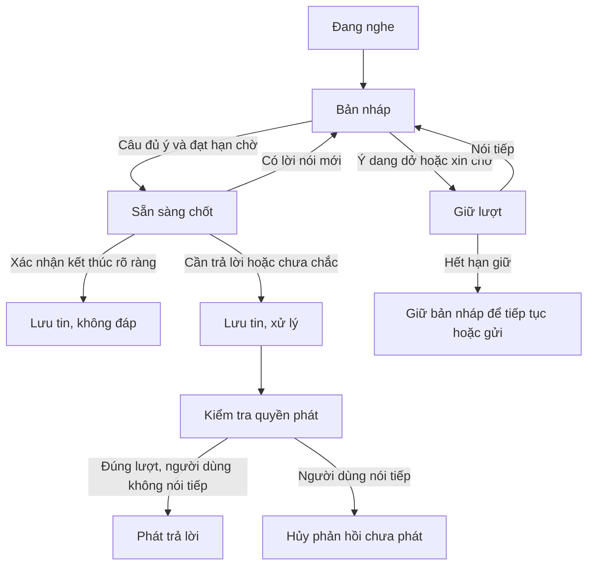

# Spec: Javis tự điều chỉnh lượt nói và thời điểm trả lời

- Ngày: 24/09/2026.
- Trạng thái: đề xuất thiết kế để anh duyệt; chưa triển khai tính năng.
- Nền đối chiếu: Javis OS 0.64.32, commit `3221047163005c32adde2058985cc897b5b1275e`.
- Đối tượng: hội thoại tiếng Việt ở chế độ Chuẩn/Nhanh, đặc biệt tablet Android.
- Ràng buộc đã chốt: giữ đường nghe miễn phí, chấp nhận giới hạn trình duyệt; giữ chế độ tập trung gọi “Javis” sau lúc chờ; Emma là giọng mặc định của bản cài mới.

## 1. Kết quả người dùng cần

Anh nói một ý có nhiều lần ngập ngừng, Javis giữ lượt để anh nói hết. Câu hỏi/lệnh rõ ràng được xử lý sớm. Những lời xác nhận không cần đáp có thể kết thúc bằng im lặng. Khi anh nói tiếp, phản hồi chưa phát phải được thu hồi kịp thời.

Javis được chọn thời điểm trả lời trong giới hạn có thể giải thích và kiểm thử. Không dùng việc “AI quyết định” để che giấu mất lời nói, treo phiên hay lỗi phát âm thanh.

### Tình huống mục tiêu

Anh: “Ý là…” → Javis tiếp tục nghe.

Anh: “Khi anh nói và em phản hồi lại…” → vẫn cùng bản nháp.

Anh: “…thì em tự quyết định phản hồi nhanh hay chậm, đúng không?” → chốt một lượt, trả lời một lần.

Anh: “Vâng, anh hiểu rồi.” sau lời giải thích, không còn câu hỏi hoặc xác nhận hành động đang chờ → ghi nhận tin của anh, không cần phát thêm câu đệm.

## 2. Hiện trạng và vấn đề

| Thành phần | Hiện trạng ở 0.64.32 | Điểm cần cải thiện |
|---|---|---|
| `dashboard/voice-turn.js` | Hai mốc min/max; phân loại chủ yếu theo từ cuối | Không nhìn đủ cả câu và ngữ cảnh; “em” bị xem như một câu đã xong |
| `dashboard/app.js` | Mặc định minDelay 1.200 ms; maxDelay của controller là 2.200 ms | Chưa tự thích nghi với cách ngắt nghỉ của từng phiên |
| `dashboard/voice.js` | Đặt lại đồng hồ khi nhận sự kiện kết quả; trần lượt 30 giây | Không có chữ mới chưa chắc không có tiếng nói; trần có thể cắt ngang lời giải thích dài |
| Capture/transcript | Khóa phần đã hiện tại Stop, giữ tin đã chốt qua STT phụ và AI | Thiết kế mới phải giữ nguyên bảo đảm này |
| Ngắt lời | Có phát hiện chen ngang, dừng tiếng, hủy lượt xử lý và chờ gửi câu mới | Cần đóng các khoảng đua từ lúc chốt đến lúc âm thanh đầu tiên phát |
| Attention | Gọi tên sau khoảng chờ; có thời hạn giữ lượt đang nhận | Cần quy định rõ tương tác với chờ nghĩ và câu dang dở |
| Câu tiến độ | Có filler sau 2.500 ms, hoặc 1.200 ms khi đang gọi tool | Không được phát khi người dùng còn giữ lượt hoặc khi quyết định im lặng |

Các mốc hiện tại là giá trị trong mã mặc định, không phải phép đo trên tablet của anh. Cài đặt đã lưu có thể khác.

## 3. Phương án được chọn

| Phương án | Lợi ích | Đánh đổi | Quyết định |
|---|---|---|---|
| Tăng/giảm một khoảng chờ chung | Đơn giản | Tăng thì câu ngắn chậm, giảm thì dễ cắt lời | Chỉ giữ làm cách quay lui |
| Bộ điều khiển thích nghi chạy trên máy | Không thêm API, phản hồi nhanh, kiểm thử được | Hiểu ngữ nghĩa có giới hạn | Bản đầu tiên |
| Nhờ AI phân loại mọi mẩu chữ | Hiểu ngữ cảnh rộng hơn | Tăng lượt gọi, độ trễ, hạn mức và kết quả đến muộn | Không dùng trong bản đầu; mở rộng có kiểm soát ở mục 11 |

Bản đầu không gọi thêm model để xét thời điểm nói. Bộ não hiện có chỉ nhận lượt đã được quyết định cần trả lời. Đây là tính năng điều phối hội thoại, không thay bộ nhận dạng hay cam kết chất lượng ngang ChatGPT Voice.

## 4. Phạm vi

### Có trong bản đầu

1. Phân loại câu hoàn chỉnh, câu còn dang dở, lời giữ lượt và lời xác nhận kết thúc.
2. Tính hạn chờ linh hoạt, thích nghi thận trọng trong từng phiên.
3. Giữ bản nháp qua các lần recognition tự kết thúc/khởi động lại.
4. Chốt văn bản một lần; có nhánh ghi nhận mà không sinh câu trả lời.
5. Hủy phản hồi chưa phát khi người dùng tiếp tục; bảo vệ khỏi callback cũ.
6. Trạng thái giao diện rõ ràng, gửi chủ động, hủy bản nháp, quay lui cài đặt.
7. Đo hành vi bằng metadata và kiểm thử phát lại chuỗi sự kiện.

### Giới hạn

- Chỉ áp dụng Chuẩn/Nhanh. Live realtime tiếp tục theo điều khiển lượt của nhà cung cấp, cài đặt mới không giả vờ điều khiển được Live.
- Không nhận diện người nói, không dùng nội dung chữ để kết luận tiếng TV/tạp âm, không tự xóa câu đã nhận.
- Không mở thêm luồng micro trên Android chỉ để đo âm lượng. Không bắt buộc model VAD/WASM, dịch vụ STT mới hay API trả phí.
- Không đoán “vâng” thành tên Vân, không đổi giọng theo từ nghe được.
- Không chạy tác vụ/công cụ dự đoán trước khi chốt lượt.

## 5. Những bảo đảm bắt buộc

**I1. Quyền ưu tiên người nói:** Có bằng chứng lời nói mới thì hủy hạn chờ cũ; không phát câu đệm để giành lượt.

**I2. Văn bản nhất quán:** Trước commit là bản nháp và có thể được recognizer cập nhật. Sau commit, text của lượt đó bất biến. Chỉ thao tác sửa rõ ràng của người dùng mới tạo một bản sửa theo cơ chế riêng.

**I3. Không mất lời vì im lặng:** `ack_only` vẫn lưu tin người dùng và báo đã ghi nhận. Không tạo lời assistant giả để lấp chỗ trống.

**I4. Không đoán xác nhận:** Có câu hỏi, đề nghị, lựa chọn hoặc yêu cầu xác nhận đang chờ thì lời “vâng/ừ/được” phải chuyển vào luồng xử lý bình thường. Không đủ ngữ cảnh cũng xử lý bình thường.

**I5. Không hành động từ bản nháp:** Không gửi tool/UI action, tạo việc nền hoặc phát TTS trong trạng thái đang giữ lượt.

**I6. Cô lập lượt:** Mọi kết quả bất đồng bộ phải khớp session, epoch, utterance và revision. Đổi chat/tắt mic/đổi chế độ vô hiệu hóa kết quả cũ.

**I7. Im lặng có chủ đích khác lỗi:** Hết giờ, mất kết nối, lỗi model/TTS không được đánh dấu `ack_only`; phải báo đúng lỗi hoặc cho thử lại.

**I8. Không chờ vô hạn:** Mỗi trạng thái chờ có thời hạn; hết hạn giữ nguyên bản nháp để người dùng tiếp tục, gửi hoặc bỏ.

## 6. Mô hình trạng thái

Tách ba phần để không trộn “đang nghe”, “đang xử lý” và “đang có quyền nhận lời”.

- Attention: `ACTIVE` / `WAITING_WAKE` / `OFF`, kế thừa bộ tập trung.
- Lượt nhập: `EMPTY` / `DRAFT` / `HOLD` / `READY` / `SAVED_DRAFT` / `COMMITTED`.
- Phản hồi: `NONE` / `PROCESSING` / `QUEUED` / `SPEAKING` / `CANCELED` / `ACK_ONLY` / `FAILED`.

Recognition tự đóng phiên không đồng nghĩa người dùng đã kết thúc ý. Adapter được mở lại recognition khi còn quyền nghe và nối phần bản nháp theo quy tắc chống lặp hiện có. Phân biệt capture_stop_reason = submit | rollover | cancel: rollover chỉ khép một phân đoạn kỹ thuật, không tự commit hoặc phát lời; submit khóa snapshot; cancel bỏ quyền gửi.

## 7. Chính sách quyết định

### 7.1 Thứ tự ưu tiên

Xét từ trên xuống; gặp một quy tắc có hiệu lực thì không dùng quy tắc thấp hơn để đảo quyết định.

| Ưu tiên | Điều kiện | Kết quả |
|---|---|---|
| 1 | Người dùng hủy/tắt mic/đổi chat | Hủy capture, timer, kết quả cũ; không tự gửi |
| 2 | Người dùng bấm Gửi hoặc thả Space để gửi | Chốt một lần; không kéo dài bởi chế độ thích nghi |
| 3 | Chưa qua attention gate | Không xử lý nội dung thành hội thoại |
| 4 | Lệnh “dừng/thôi” đúng ngữ cảnh điều khiển | Dừng phản hồi/tác vụ theo cơ chế hiện có |
| 5 | Cụm xin chờ rõ ràng | HOLD có thời hạn |
| 6 | Đang có lời nói mới | Tiếp tục DRAFT; thu hồi READY |
| 7 | Câu dang dở | Chờ dài hơn; chưa gọi bộ não |
| 8 | Câu đủ ý | Đặt hạn chờ thích nghi rồi READY |
| 9 | Lời xác nhận kết thúc đáp ứng đủ điều kiện | Commit với `ack_only` |
| 10 | Không phân loại chắc chắn | Chờ mức bình thường rồi gửi; không tự bỏ câu |

Ưu tiên 2 không cho gửi âm thanh nền khi chỉ bấm nút “Tiếp tục nghe” ở WAITING_WAKE. Nút đó mở quyền nhận lời mới và bỏ capture nền cũ theo hành vi hiện tại.

### 7.2 Câu dang dở

Dùng cụm từ, cấu trúc cả câu và ngữ cảnh vừa nói, không chỉ từ cuối. Các mẫu kiểm thử gồm “ý là”, “anh muốn em”, “có phải là”, “khi anh nói thì”, “để anh”, “em” đứng riêng chưa có câu hỏi gọi tên rõ ràng.

- Từ “không” đứng riêng có thể là câu trả lời hoàn chỉnh cho câu hỏi trước; không tự coi mọi câu ngắn là dang dở.
- “Có đúng không?” sau một lời giải thích thường là câu hỏi hoàn chỉnh, nhưng không được chốt chỉ vì có dấu hỏi do STT tự chèn.
- Cụm xin chờ phải khớp toàn ý điều khiển. “Đừng chờ nữa, mở chat đi” không bị giữ vì có chữ “chờ”.
- Danh sách ban đầu phải có test âm tính; tránh các quy tắc như dưới N từ thì bỏ/chờ vô hạn.

### 7.3 Thời gian chờ ban đầu

Các con số là tham số đề xuất cần đo, không phải kết quả chất lượng đã đạt.

| Nhóm | Khoảng chờ khởi đầu | Giới hạn |
|---|---|---|
| Lệnh rõ, ngắn, đủ ý | 900 ms | 800–1.400 ms |
| Câu thường hoặc chưa rõ phân loại | 1.200 ms | 1.000–2.200 ms |
| Câu đang dang dở | 2.800 ms | 2.200–4.000 ms |
| Gọi “Javis” riêng | 2.200 ms | Nếu không nói tiếp, đáp gọi tên tối đa một lần |
| Xin chờ rõ ràng | Không tự trả lời | Giữ tối đa 90 giây |
| Chưa đủ ý sau hạn 4 giây | Chuyển HOLD | Tối đa 10 giây từ tín hiệu nội dung cuối, sau đó SAVED_DRAFT |

Mốc tính giờ dựa trên `performance.now()`/đồng hồ đơn điệu. Không dùng giờ hệ thống có thể bị chỉnh lùi.

Chỉ một thành phần sở hữu deadline. Không cộng thêm timer 1.200 ms của voice.js vào timer của controller. Nếu thiết kế có cửa sổ kiểm tra READY 200 ms thì cửa sổ đó nằm trong ngân sách ở bảng, không cộng thêm ngoài bảng.

### 7.4 Bằng chứng im lặng và thay đổi bản chép

Adapter chuẩn hóa `speech_activity = active | inactive | unknown` kèm nguồn và thời điểm.

- Nếu trình duyệt cung cấp sự kiện speechstart/speechend ổn định trong phiên: có thể dùng làm tín hiệu phụ. Kết quả chữ mới phải ghi đè tín hiệu “đã im” cũ.
- Kết quả chữ giống hệt bản trước không làm kéo dài deadline vô hạn. Sửa thực sự, thêm từ hoặc thay phần đuôi chưa chốt tạo revision mới.
- Không có sự kiện âm thanh tin cậy: dùng thời điểm thay đổi bản chép và mức chờ bảo thủ. Không ghi log rằng đã đo im lặng thật.
- Tín hiệu active bị kẹt quá hạn giữ lượt chuyển sang SAVED_DRAFT, không tự gửi hoặc suy ra đó là người đang nói mãi.
- Nền web không cung cấp đủ tín hiệu để bảo đảm tuyệt đối không phát chồng. Phải đo riêng trên Android, iOS và desktop.

### 7.5 Thích nghi theo phiên

Bắt đầu từ bảng trên. Chỉ học các khoảng nghỉ mà người dùng thực sự nói tiếp trong cùng bản nháp, và các lần vừa trả lời đã bị người dùng tiếp tục ý cũ.

Sau ít nhất 5 mẫu hợp lệ, đặt mục tiêu nhóm = clamp(max(mốc khởi đầu của nhóm, percentile 75 của tối đa 20 khoảng nghỉ gần nhất + 250 ms), giới hạn dưới, giới hạn trên). Dịch mốc đang dùng về mục tiêu mỗi lần tối đa 150 ms; không học từ một mẫu đơn lẻ. Phân loại câu dang dở vẫn có ưu tiên riêng.

Loại mẫu từ thời gian tab ở nền, mất mạng, nhận dạng lỗi, TTS đang phát, attention đóng hoặc sự kiện không rõ thứ tự. Không gán mọi lần ngắt lời thành bằng chứng cần chờ lâu hơn.

Mẫu nhịp chỉ giữ trong RAM của phiên; không ghi đặc điểm giọng/audio vào kho người dùng. Có nút đặt lại nhịp chờ. Khi không đủ bằng chứng thì trở về mức mặc định, không đoán cá tính người nói.

### 7.6 Khi được im lặng

Bản đầu chỉ tự chọn `ack_only` khi đồng thời:

1. Lượt assistant trước đã xong và được đánh dấu là lời giải thích/kết thúc, không chờ trả lời hoặc hành động.
2. Câu mới nằm trong nhóm xác nhận kết thúc rõ ràng, ví dụ “vâng anh hiểu rồi”, “cảm ơn”, “được rồi cảm ơn”.
3. Không có mệnh lệnh, câu hỏi, phủ định, điều kiện, yêu cầu mới hoặc nội dung bổ sung.
4. Không có tool/confirmation đang chờ. Thiếu metadata đáng tin cậy thì không dùng `ack_only`.

“Vâng”, “ừ”, “được”, “không” đứng riêng mặc định vẫn gửi xử lý nếu chưa chứng minh đủ bốn điều kiện. Không dựa duy nhất vào dấu hỏi để suy ra assistant đang chờ xác nhận.

UI hiện tin người dùng và trạng thái nhỏ “Đã ghi nhận”, không tạo bong bóng assistant rỗng, không phát filler. Người dùng có thể bấm “Yêu cầu trả lời” trên tin này; server tiếp tục từ chính tin đã lưu, không tạo tin user trùng.

## 8. Chốt, lưu và thu hồi phản hồi

### Trước commit

- Chỉ có một bản nháp đang hiển thị cho một utterance. Kết quả giữa các phiên recognition nối theo logic chống lặp.
- READY có thể bị thu hồi bởi revision/speech activity mới. Chưa gửi model, tool hoặc TTS ở giai đoạn này.
- Sau quyết định commit, khóa đúng bản đang hiển thị. Final đến muộn không sửa snapshot; nếu chưa có chữ nào trước Stop, vẫn nhận final đầu tiên như bảo đảm ở 0.64.32.

### Sau commit, trước tiếng đầu tiên

- Người dùng nói tiếp tạo utterance mới, gắn `continuation_of` vào lượt trước. Tin cũ không bị viết lại.
- Hủy response cũ bằng response_id/epoch; loại cả audio đã preload, queue filler, kết quả stream/model tới muộn.
- Lưu đầy đủ lời người dùng mới. Ngữ cảnh trả lời mới có thể đọc hai tin liên tiếp như một ý, nhưng lịch sử vẫn thể hiện đúng hai lần commit.
- Hủy là best effort đối với tác vụ đã khởi chạy. Không khẳng định đã hoàn tác tool. Nếu hành động đã xảy ra, ghi trạng thái thật và cung cấp vào lượt tiếp theo.
- Khi server xác nhận hủy chậm, giữ câu mới ở hàng đợi theo session; không đẩy trùng lượt hay để callback cũ xóa câu mới.

### Khi đang phát

Giữ cơ chế ngắt lời hiện có. Không coi một tiếng ho hay tiếng đệm ngắn là bằng chứng chắc chắn phải hủy tác vụ. Lệnh dừng rõ ràng có ưu tiên; speech được xác nhận thì ngắt và chuyển quyền nói cho người dùng. Ghi phần assistant đã thực sự phát theo cơ chế hiện có, không coi toàn bộ câu đã được nghe.

### Giới hạn bản nháp

Trần 30 giây hiện tại chuyển thành ranh giới quản lý phiên capture, không ép tạo phản hồi giữa một ý dài. Khi bắt buộc restart capture, giữ bản nháp và báo trạng thái nghe thực tế.

Giữ tối đa 120 giây kể từ bắt đầu một bản nháp hoặc 4.000 ký tự, tùy giới hạn nào tới trước. Tới giới hạn: dừng capture, giữ bản nháp trong RAM, hiện “Gửi phần đã nói” / “Tiếp tục” / “Bỏ”. Tiếp tục mở một phân đoạn mới nhưng giữ phần đã nghe trong tổng draft; nếu đã đạt giới hạn ký tự thì cần gửi hoặc bỏ trước. Không cắt bớt chữ âm thầm.

## 9. Hợp đồng thành phần và giao tiếp

### Thành phần

- `voice.js`: adapter capture/TTS; phát tín hiệu có timestamp; không tự quyết định cần trả lời.
- Module mới dự kiến `voice-turn-policy.js`: phân loại và tính deadline thuần, không truy cập DOM, mạng, audio hoặc storage.
- `voice-turn.js`: sở hữu trạng thái/deadline, giữ luật ngắt lời, xuất hành động.
- `voice-attention.js`: sở hữu quyền nhận lượt; không suy đoán nội dung.
- `app.js`: nối sự kiện, vẽ draft/trạng thái và gửi giao thức chat. Không thêm một bộ timer độc lập khác.
- `server/main.py` hoặc helper chuyên trách: commit idempotent, lưu `ack_only`, hủy response và điều phối hàng đợi.
- `voice_brain.py`: trả lời theo câu gốc; không có quyền sửa transcript hay tự ý xóa tin.

Đây là ranh giới thiết kế; kế hoạch triển khai sẽ chốt vị trí helper theo mã mới nhất, không refactor toàn bộ app/main chỉ để làm tính năng này.

### Input cho policy

`session_id`, `epoch`, `utterance_id`, `revision`, `draft_text`, `last_text_change_at`, `speech_activity`, `activity_source`, `activity_at`, `previous_assistant_intent`, `pending_action`, `attention`, `manual_submit`, `timing_profile`, `now`.

`previous_assistant_intent`: `answer_complete | expects_reply | expects_confirmation | unknown`. `unknown` là mặc định; tuyệt đối không suy đoán xác nhận tác vụ chỉ từ nhãn do model tự khai.

### Output cho controller

`decision = listen | hold | ready | respond | ack_only | save_draft | cancel`, `deadline_at`, `reason_code`, `source_revision`.

Các reason_code tối thiểu: `unfinished_clause`, `explicit_wait`, `complete_request`, `ambiguous`, `closing_ack`, `pending_confirmation`, `activity_resumed`, `capture_unknown`, `manual_submit`, `hold_expired`, `stale_result`.

### Hợp đồng lưu/WS đề xuất

- Client gửi `utterance_id`, `voice_turn_id`, `response_policy = auto | ack_only`, và `continuation_of` nếu có, cùng message bất biến.
- Server xác nhận commit bằng ID ổn định. Retry cùng utterance_id không append thêm message hay thực thi lại hành động.
- Server kiểm tra điều kiện ack_only bằng trạng thái thực tế của session; client không được tự vượt qua câu hỏi xác nhận. Khi không đủ điều kiện, downgrade sang auto và báo policy có hiệu lực.
- `ack_only` lưu message cùng metadata `response_policy`, kết thúc turn mà không gọi brain/tool/TTS. Không làm giả một response nội dung rỗng.
- “Yêu cầu trả lời” tham chiếu message_id đã commit, idempotent. Nếu đã có lượt khác chạy, tuân theo hàng đợi/hủy hiện có, không chạy song song ngoài ý muốn.
- Client cũ/server cũ: dùng capability negotiation. Chưa hỗ trợ giao thức mới thì dùng policy auto và endpoint cũ; không tự hiển thị “Đã ghi nhận” khi server vẫn đang sinh câu trả lời.
- Chuyển schema nếu cần phải có migration và đường đọc dữ liệu cũ; không ghi metadata bằng cách chèn lời hệ thống vào text người dùng.

## 10. Giao diện và cách quay lui

Theo yêu cầu làm gọn cài đặt, không đưa mọi tham số timing ra giao diện chính.

| Phần chính | Phần Nâng cao |
|---|---|
| Giọng đọc, tốc độ, nghe thử | Nhà cung cấp/API key |
| Chế độ trò chuyện và chế độ tập trung | Bộ não/model riêng, bộ nghe phụ, từ gợi ý |
| Sau khi tính năng mới được nghiệm thu: một ô “Nhịp phản hồi” | Ngôn ngữ nghe, ngắt lời, khoảng chờ cố định và đặt lại nhịp |

Một ô Nhịp phản hồi có ba lựa chọn Nhanh/Cân bằng/Kiên nhẫn, mặc định Cân bằng theo mục 7. Nhanh giảm mục tiêu 200 ms trong giới hạn; Kiên nhẫn tăng 400 ms trong giới hạn. Trong giai đoạn thử nghiệm, công tắc bật nhịp thích nghi nằm trong Nâng cao; chưa bật thì vẫn chạy khoảng chờ cố định hiện có. Không hiển thị ô Nhịp phản hồi như một tính năng đã hoạt động khi mã chưa triển khai.

Cài đặt kỹ thuật thu mặc định khi cấu hình đã đầy đủ. Tự mở phần cần sửa nếu thiếu bộ não cho làn nhanh hoặc có lỗi. Cấu hình Live chỉ hiện khi chọn Live; khoảng chờ và ngắt lời của đường browser được ẩn. Ngôn ngữ nghe vẫn truy cập được vì bộ nghe gọi tên trong chế độ Live còn sử dụng lựa chọn này. Không xóa giá trị cũ khi thu/ẩn nhóm.

Làm gọn giao diện là thay đổi độc lập có thể phát hành trước bộ điều khiển mới: giữ nguyên ID/node micro và handler, không thay thuật toán nghe/nói, không đổi cấu hình khi chỉ mở trang. Các mục lưu theo thiết bị phải ghi rõ áp dụng ngay; nút Lưu nhà cung cấp chỉ lưu cấu hình server. Native details/summary hỗ trợ bàn phím và thiết bị cảm ứng.

Trạng thái cần thấy: “Đang nghe”, “Đang chờ bạn nói tiếp”, “Đang chuẩn bị trả lời”, “Đã ghi nhận”, “Bản nháp đang chờ gửi”. Giao diện dùng cách xưng hô theo i18n của sản phẩm; phản hồi thoại theo cách xưng hô đã cấu hình.

Không có câu “em vẫn nghe” định kỳ khi anh đang nói. Filler chỉ được phép khi phản hồi thật đang PROCESSING, chưa có tiếng, không có speech/draft/HOLD mới và chưa phát filler của lượt đó.

Explicit HOLD được giữ quyền attention tối đa 90 giây; không buộc gọi tên giữa thời gian anh đã xin chờ. Hết HOLD chuyển SAVED_DRAFT và WAITING_WAKE; gọi tên hoặc nút Tiếp tục mở lại draft còn trong phiên. Tắt mic/đổi chat hủy mọi hành động tự gửi; UI cho giữ/bỏ draft theo cơ chế nháp của phiên nếu có, không gửi sang chat mới.

## 11. Mở rộng AI, tách khỏi bản đầu

Chỉ xem xét sau khi đo bản đầu và xác định các trường hợp luật không xử lý tốt.

- Tối đa một lần phân loại cho một revision ổn định còn mơ hồ; không gọi theo từng token/mẩu interim.
- Dùng bộ não đã cấu hình nếu có khả năng xử lý riêng mà không chiếm phiên hội thoại chính. Nếu không có khả năng này thì bỏ qua; không giả định backend CLI hỗ trợ yêu cầu song song.
- Output có schema giới hạn: `continue | respond | closing_ack`, confidence và reason. Không tool, không TTS, không quyền sửa text.
- Ngân sách bổ sung tối đa 300 ms kể từ lúc lẽ ra phải quyết định theo luật; quá hạn hoặc lỗi/schema sai thì dùng luật ngay. Nếu backend không đáp ứng được ngân sách này, tắt hỗ trợ AI ở backend đó.
- Candidate gắn epoch/utterance/revision; kết quả tới muộn bỏ. Có lời nói mới thì hủy.
- AI không được vượt qua lệnh thủ công, pending confirmation hoặc điều kiện ack_only bắt buộc. Không được gán tiếng TV/tạp âm từ nội dung chữ.
- Thông báo rõ việc dùng hạn mức bộ não hiện có; mặc định tắt, không tự mua hoặc thêm API.

## 12. Đo lường và riêng tư

Mặc định lưu trong vòng đệm RAM tối đa 200 sự kiện: timestamp tương đối, ID lượt ngẫu nhiên của phiên, revision, state, reason_code, nguồn tín hiệu, deadline, commit, cancel, thời điểm audio thực sự bắt đầu. Không lưu text, audio, key hoặc URL chứa câu đọc.

Chỉ xuất dữ liệu khi người dùng chủ động bấm tải chẩn đoán. Chế độ thử có bản chép/audio phải bật riêng và cho biết rõ nội dung được lưu; không bật ngầm trên máy của anh.

Chỉ số:

1. Tỷ lệ trả lời khi người dùng chưa hết ý, được người thử đánh dấu.
2. Số lượt bị tách trên mỗi ý, phân biệt trước và sau commit.
3. Thời gian từ kết thúc ý thực tế đến commit và đến tiếng đầu tiên; tách thời gian policy, STT, model, TTS.
4. Số lần im lặng sai, đặc biệt xác nhận hành động bị bỏ qua.
5. Số callback cũ gây phát/gửi nhầm; số message trùng do reconnect.
6. Tỷ lệ speech_activity unknown theo thiết bị; không đổi tên chỉ số này thành “độ im lặng”.

Kết thúc ý thực tế trong bài thử do người đánh giá đánh dấu, không lấy chính deadline của hệ thống làm đáp án chuẩn. Báo cáo p50/p95 riêng từng thiết bị; không gộp để che Android kém hơn.

## 13. Ma trận kiểm thử bắt buộc

| Ca | Kết quả cần đạt |
|---|---|
| Đoạn hội thoại anh gửi, ngắt giữa “ý là”, “em”, “có phải là” | Một draft tiếp tục; không phát “ừ/vâng” mỗi lần ngắt |
| “Mở khung chat giúp anh” | Chốt theo nhóm lệnh rõ; đúng một hành động |
| “Không” trả lời câu hỏi trước | Nhận là câu trả lời hợp lệ, không mất vì ngắn |
| “Vâng” sau yêu cầu xác nhận hành động | Chuyển vào luồng xác nhận, không ack_only |
| “Vâng anh hiểu rồi” sau giải thích đã xong | Lưu một user message, không gọi model/TTS khi đủ metadata |
| “Vâng, nhưng kiểm tra lại giúp anh” | Trả lời/xử lý, không im lặng |
| “Đừng chờ nữa, mở chat đi” | Không kẹt HOLD vì chứa chữ chờ |
| “Khoan để anh nghĩ”, rồi im 20 giây | Giữ lượt, không bắt gọi tên lại, không filler |
| Xin chờ quá 90 giây | Giữ bản nháp, đóng quyền nghe theo tập trung, có cách tiếp tục |
| STT lặp cùng interim 100 lần | Không tăng deadline vô hạn, không nhân đôi text |
| Final sửa “vâng” thành “Vân” sau Stop | Giữ bản đã hiện lúc chốt |
| Stop trước kết quả đầu | Nhận final đầu tiên, không mất câu |
| Recognition tự kết thúc giữa ý trên iOS/Android | Giữ draft; lỗi restart có trạng thái và cách gửi phần đã nghe |
| Anh nói tiếp trước commit | Thu hồi READY và giữ trong cùng draft |
| Anh nói tiếp sau commit nhưng trước tiếng đầu | Hủy response cũ, lưu lời bổ sung riêng và trả lời theo đủ ngữ cảnh |
| Tool đã chạy khi anh chen vào | Báo trạng thái thật; không tuyên bố hoàn tác sai |
| onended/play reject/classifier tới sau cancel | Không phát, sửa hoặc gửi vào lượt mới |
| Retry WS cùng utterance_id | Không trùng tin hoặc trùng tool |
| Mất mạng giữa commit và ACK | Khôi phục bằng ID, không mất chữ hoặc tự gửi hai lần |
| Tab nền, quay lại sau nhiều phút | Không tự phát/gửi draft hết hạn |
| Tạp âm/TV khi WAITING_WAKE | Không vượt attention gate; policy không tự nhận diện người nói |
| Live được chọn | Không chạy hai bộ điều khiển; nói rõ phạm vi cài đặt |
| Server cũ không hỗ trợ ack_only | Quay về auto, UI không báo im lặng giả |
| TTS lỗi khi đã chọn Emma | Báo lỗi, không đổi sang giọng khác |

## 14. Tiêu chí nghiệm thu và triển khai

### Cổng bắt buộc trước phát hành

- 100% ca xác định ở mục 13 qua kiểm thử tự động phù hợp; ca âm học không thể giả lập phải có biên bản thử thiết bị.
- Không mất/đổi/trùng text đã commit; không bỏ qua xác nhận hành động; không side effect từ draft; không callback cũ phát/gửi nhầm.
- Bộ test voice hiện có tiếp tục xanh. Kiểm thử policy bằng fake clock, không dùng sleep thật làm bài test chập chờn.
- Mỗi đường mới phải có kiểm thử hành vi thất bại trước sửa, bao gồm WS idempotency và lưu ack_only.

### Bài thử trải nghiệm

Chuẩn bị 30 kịch bản: 10 câu hoàn chỉnh, 10 ý ngắt nghỉ, 5 xác nhận/điều khiển, 5 ngắt lời/khôi phục. Mỗi kịch bản chạy 2 lần trên tablet Android, desktop Chrome/Edge và iPhone/iPad nếu hỗ trợ, tổng 180 lượt cho mỗi cấu hình. So sánh bản hiện tại với bản mới trong cùng điều kiện mạng/giọng/provider; ghi riêng tình huống nhiễu.

Mục tiêu để mở mặc định: giảm ít nhất 50% số lần trả lời sớm trên tập ý ngắt nghỉ so với baseline; p95 từ hết ý đến commit của câu hoàn chỉnh không tăng quá 300 ms; không có ca im lặng sai trong nhóm xác nhận. Nếu baseline đã không có lỗi, yêu cầu không phát sinh lỗi thay cho tỷ lệ giảm. Các mục tiêu là ngưỡng chấp nhận cho bài thử, không phải lời hứa thống kê trên mọi người dùng.

Phát hành theo ba bước:

1. Thêm thu thập quyết định ở chế độ quan sát trong bài thử có chủ động bật; không đổi hành vi người dùng.
2. Cho bật Tự nhiên để thử, giữ Chờ cố định làm quay lui, hoàn tất bản đầu không gọi AI.
3. Chỉ mở Tự nhiên mặc định cho cấu hình đủ bằng chứng thiết bị; AI là giai đoạn riêng theo mục 11.

Khi triển khai mã: đặt số phiên bản trống mới theo `docs/quy-uoc-dev.md` trước sửa sản phẩm; cập nhật CHANGELOG, PR/CI, merge main, kiểm tra CI và ảnh đúng SHA, đẩy tag và GitHub Release như chủ repo đã yêu cầu. Spec này không tự chốt một số phiên bản tương lai.

## 15. Quyết định cần giữ khi lập kế hoạch

- Bản đầu: miễn phí, luật cục bộ + thích nghi trong phiên; không có AI classifier.
- Im lặng chỉ cho lời kết thúc rõ ràng với đủ ngữ cảnh, vẫn lưu tin và có nút yêu cầu trả lời.
- Kết quả đến muộn không được đổi chữ đã chốt hay phát câu cũ.
- Tách đo thời điểm hết ý khỏi thời gian model/TTS để sửa đúng nguyên nhân.
- Chỉ chuyển sang triển khai sau khi anh duyệt spec; đầu ra hiện tại là tài liệu thiết kế.

## Tham chiếu

- Mã nền: `dashboard/voice.js`, `dashboard/voice-turn.js`, `dashboard/voice-attention.js`, `dashboard/app.js`, `server/main.py`, `server/voice_brain.py` tại commit nêu đầu tài liệu.
- Bảo đảm transcript: `docs/dev/2026-09-voice-transcript-consistency.md`.
- [Web Speech: kết quả tạm có thể được thay thế](https://developer.mozilla.org/en-US/docs/Web/API/SpeechRecognitionEvent/results).
- [OpenAI: VAD và semantic turn detection](https://developers.openai.com/api/docs/guides/realtime-vad), tham khảo kiến trúc; không phải phụ thuộc của bản đầu và không suy ra cấu hình nội bộ ChatGPT Voice.
